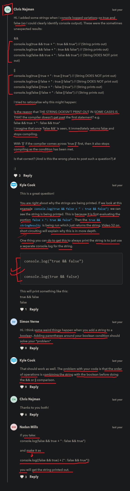

# boolean datatype

    - boolean means true or false as a value 
    - true or false 
        means ON or OFF
        means right or wrong
        means yes or no 
    - true means 1 and false means 0 

    - true and false are keyword which is used as a value

## example - of boolean datatype

    eg : 
        let a = true 
        let b = false

        console.log(a) 
        console.log(b) 
        console.log(typeof a) 
        console.log(typeof b)

        // output : true 
                    false
                    boolean 
                    boolean 

        NOTE : 
            - give a space b/w typeof operator and a variable name
                otherwise typeof operator won't work

    eg : giving true and false keywords as a value inside double quotes

        let a = "true"
        let b = "false"

        console.log(typeof a)
        console.log(typeof b)       
        
        // output : string
                    string

        NOTE :
            - now these true and false keywords as a values inside double quotes
                means these are string type not boolean type 

            - so true and false are keywords 
                don't put them inside double quotes

    eg : of boolean with && (AND) and || (OR) logical operators 

        let a = true
        let b = false

        eg : of boolean with && (double ampersand) AND logical operator ✅

            console.log(a && b)
            // output : false

            console.log(true && true)
            // output : true

            NOTE : 
                - in && (double ampersand) logical operator , 
                    both conditions should be true then we'll get true as a output
                    otherwise false

        eg : of boolean with || (pipe symbol) OR logical operator ✅

            console.log(a || b)
            // output : true

            console.log(true || false)
            // output : true

            NOTE : 
                - in || (pipe symbol) logical operator , 
                    if anyone condition is true then we'll get true as a output
                    otherwise if both condition are false then we'll get false

        
        - we have order of operation here also in boolean just like we have 
            in BODMAS related calculation

        eg : of boolean with checking order of operation ✅

            console.log(false && false || true)
            // OR 
            console.log((false && false) || true)

            // output : true

            - order of operation goes left to right 
            - so firstly , false && false will be executed
                then whatever result we got will be compared with || true

            - so false && false -> means false then
                false || true -> means true

            console.log(false && (false || true))
            // output : false

            - here first parenthesis code will be execute i.e 
                false || true means true and then 
                false && true means false
            - so finally we got false

    - generally we use && and || logical operator with boolean

## challenge time - timestamp 4:32

    ques - create two variables
            first variable name will be -> happy
              and then set that equal to true 
            second variable called -> fun 
              and then set that equal to true
            then use && and || logical operator 

    Ans - 
        1 :     let happy = true 
                let fun = true
                console.log(happy && fun)
                // output : true 

        2 :     let happy = true 
                let fun = false
                console.log(happy && fun)
                // output : false 

                console.log(happy || fun)
                // output : true

## example - of inverting a boolean value ✅

    - important 🔥

    - we use exclamation mark -> !  
        to invert a boolean from false to true 
        or from true to false

    eg : inverting into false if a boolean is true 

        let happy = true

        console.log(!happy)
        // output : false

    eg : inverting into true if a boolean is false 

        let happy = false

        console.log(!happy)
        // output : true

    eg : using double exclamation mark to invert twice with boolean 

        console.log(!!false)

        // output : false

        - here first time false will convert into true 
            and then true will be converted into false
            due to double exclamation mark

    eg : random example of inverting boolean 

        console.log(!false)

        // output : true

    NOTE : 
        - using these exclamation mark is really useful while dealing with boolean 
            when we want to check the opposite value of that variable 💡

## ----------------- Extra notes of boolean -----------------

- https://blog.webdevsimplified.com/2022-04/stop-using-bang-operator/

## discussion section

