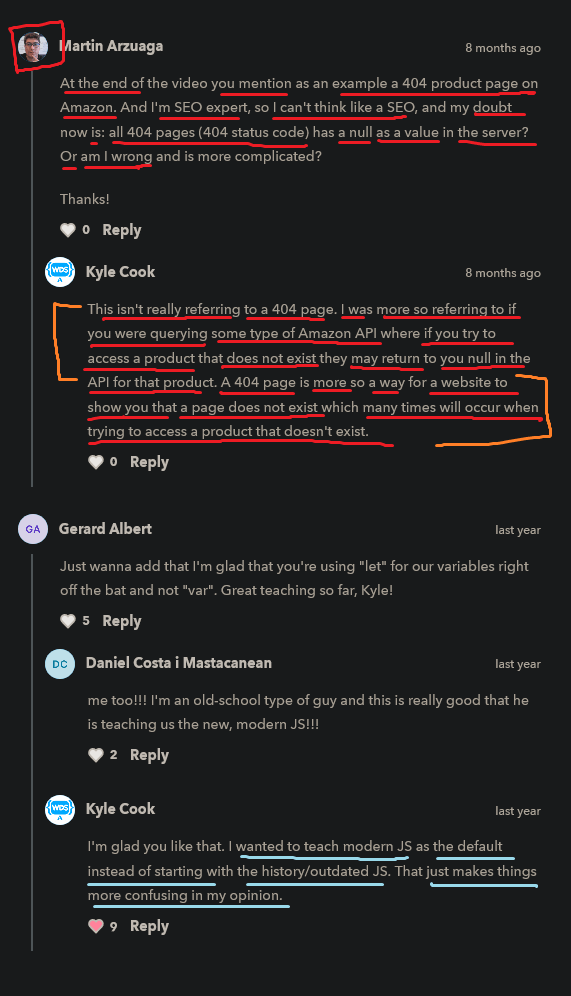

# null and undefined datatype

    - both used to show when we don't have anything
        or means used when we don't have a value for a variable 
    - both means nothing 
    - 0(zero) and null , undefined , 
        - all three have different meaning 
        - and these three are not same each other

## Example - of undefined

    eg : 
        let a = undefined

        - here means we didn't define a value yet in a variable

        console.log(a)
        console.log(typeof a)
        // output : undefined
                    undefined

## Example - of null

    - we use null as a value when we're dealing with string 

    eg :         
        let a = null

        console.log(a)
        // output : null
        console.log(typeof a)
        // output : object

        - here we can see that we got object type of null
            because null represented as object
        - but this is not important to know 
        - just assume that null has own datatype is null

## difference b/w null and undefined

    -> undefined ✅

        eg : 
            let name ;
            console.log(name)
            // output : undefined

            NOTE : 
                - here we didn't define/give undefined as a value inside "name" variable
                - but still we got undefined as a value of "name" variable
                    this is because we've created a variable i.e name
                    but we haven't actually defined a value for a yet 💡

            - so "undefined" means you have something 
                but you haven't given a defined value to that variable

    -> null

        eg : 
            let name = null ;
            console.log(name)
            // output : null

            NOTE : 
                - here we specifically set the value as null to "name" variable
                    means we have specifically/explicitly said that hey "name" variable
                    is equal to null 💡
                - that's why we got null as a output instead of undefined

                - and we've given that "name" variable a value as null
                    but this null as a value means nothing
                    means we're saying that "name" variable has no value 

    NOTE : important 🔥

        - in undefined case , if we don't give anything in a variable then 
            we'll get undefined as a output

        - but in null case , we have to give/define null as a value 
            forcefully or explicitly

## NOTE : for null and undefined

    - the difference b/w undefined and null 
      - and when to use which over the other 
        is not important

    - generally , if we're going to use null or undefined
        - they're quite interchangeable and 
            we can use either one to represent nothing

    - usually people use null 
        when they're setting a value 
        just because null kindof defines an empty value , 
        means a value doesn't exist 
        and we as a programmer saying/defining null explicitly as a value for that variable 💡

## Note : scenario of null ✅

    - this scenario is important 🔥 

    ques - why we'll use null , 
            means we always want to set a value to my variable 
            why would you set it to no value ?

    reason is  
    ---------    
        - imagine we're wrote down some code that's talking to Amazon
            and we're asking from Amazon
            if they have a product by a specific name and 
            we as a user type in the name 
        - and what if amazon doesn't have that product

        - well then obviously they need to return to the user to tell him/her
            that i don't have that product
        - so they're going to return to you null
            saying there is nothing with that name
        - so they give user the value of null in return
            means 404 page
        - to say that they don't have that product

        - this is very common place where we'll see null 
            because we're expecting a response
        - but they don't have any response to give you
        - so they give user null instead as the value 
            for user variable of that product from Amazon

## discussion page

