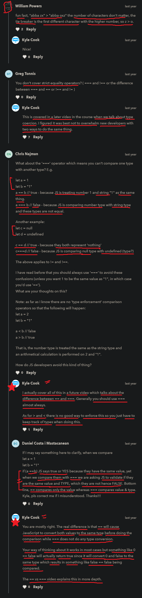

# variable comparison

- here we compare variables with each other
    to determine/know if they're the same , larger , smaller , etc
    by using comparison operator

 - these operators are comparison operators
    & these used to compares its operands and returns true or false
    based on whether the condition is true or not 🔥

    - equal operator (==)
    - not equal to (!=)
    - Strict equal to (===)
    - Strict not equal to (!==)
    - Greater than (>)
    - Greater than or equal to (>=)
    - less than (<)
    - less than or equal to (<=)

## examples - of comparison operators

    eg : of (==) double equalto operator

        let a = 1 ;
        let b = 2 ;
        console.log(a == b)
        // output : false

        let a = 1 
        let a = b
        console.log(a == b)
        // output : true

    eg : of (!=) not equalto operator

        let a = 1 ; 
        let b = 1 ;
        console.log(a != b)
        // output : false 

    eg : string comparison using -> == operator

        let a = "a"
        let b = "a"
        console.log(a == b)
        // output : true

        let a = "a"
        let b = "b"
        console.log(a == b)
        // output : false

    eg : string comparison using -> != operator

        let a = "a"
        let b = "b"
        console.log(a != b)
        // output : true

    eg : string comparison using -> < operator

        let a = "a"
        let b = "b"
        console.log(a < b)
        // output : true

        - because JS sorts alphabet letters alphabetically 
        - so "a" begin the first letter of the alphabet
            means is a like the lowest while "z" letter is the highest value 💡

    eg : string comparison using -> > operator

        let a = "a"
        let b = "b"
        console.log(a > b)
        // output : false

        NOTE : 
          - because "a" letter comes before "b" letter in the alphabet
          - so that's why "a" letter is not greater than "b" letter
              and because of their ASCII values also 💡

    eg : boolean with == comparison operator

        let a = false
        let b = false
        console.log(a == b)
        // output : true

    eg : null and undefined with == comparison operator ✅

        - this example is important 🔥 

        let a = null
        let b = undefined
        console.log(a == b)
        // output : true

        NOTE : 
            - because null and undefined kindof represent 
                the exact same thing 
            - both means nothing
            - means they both represent lack of a value 
                means a variable doesn't have any value 💡

    eg : null and undefined with != comparison operator ✅

        - this example is important 🔥 

        let a = null
        let b = undefined
        console.log(a != b)
        // output : false

        - because null and undefined both kind of have the same value of 
            not begin anything 
        - but null and undefined both are technically different 💡

## ----------------------- extra stuff -----------------------------

for more other categories of operators then go to this link

- https://github.com/Vipin-PCode/learn-Javascript/blob/main/learn-js-course-thapa-technical/topics/4-expressions-and-operators/note.md 

## discussion page

