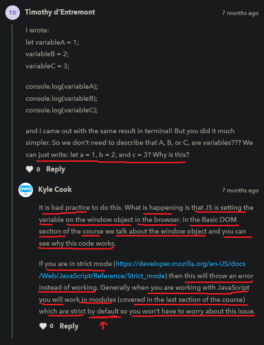

# variables

    - means is like a box that we can contain the type of information

    - we need to tell the JS that we're creating a variable
        so in order to create a variable we use let and const keyword

    - we use assignment operator to assign a value to the variable like this 👉 =

## types of cases use in programming languages ✅

    -> camelCase = myName
        - here first letter of first word will be small and after that whatever the word
            come then first letter of those word will be capital
        - use for naming variables and function
        - and generally we use camelCase most of the time
    -> kebabcase = my-name
        - use for file , folder name
    -> PascalCase = MyName
        - here first letter of each word is in capital
        - use for class name in OOPS
    -> snake_case = my_name
        - in python we use snake case most of the time instead of camelCase
          - use for variables only and less for function 

    NOTE : 
        - don't use snake_case somewhere and camelCase somewhere in code
        - always keep code stay consistent with camelCase 💡💡💡
            & even most of the time camelCase used in very programming languages

## rules to create variables

    - start first letter of your variable name
    either with letter or underscore (_) or an dollar ($)

    - don't start with number as the first character

    - don't use space between a variable
        eg : var my age = "teen ; ❌

    - variables names are case sensitive

    - you can give variable name long but don't make it too long

    - don't use js predefine keywords + special character as a variable name

## let and const keyword

    - let and const keyword will be in all small letter
    - we use one of these keyword before a variable name

    -> let keyword ✅

        eg : of let keyword 

            let favoriteNumber = 3 

            NOTE : 
                - if we want to put 3,000 then don't put like this
                    3,000 -> this is wrong ❌
                    - don't put comma 
                    3000 -> this is right ✅

            console.log(favoriteNumber)
            console.log(3)

            - both will give exact same output
                but the nice thing is that we have that one single container
                with that variable name i.e favoriteNumber
                that we can use everywhere in our code

            - that's why we see variables all the time 

        eg : updating/changing the value of that variable

            let favoriteNumber = 3

            favoriteNumber = 4 // updating the value

            console.log(favoriteNumber)

            // output - 4

            NOTE : 
                - here we update the value into 4 of that variable
                - so for updating/changing the value of a variable 
                    we don't need to use let keyword again an again

                - if we use let keyword again like this 
                    then means we're creating a new variable or a new box again in the memory
                    which is a bad practice 💡💡💡

                    let favoriteNumber = 3 
                    let favoriteNumber = 4 ❌

                    console.log(favoriteNumber)
                    // output : 4

                    - but we already have the "favoriteNumber" variable
                    - so we don't need the "let" keyword again to update the value of that variable 
                        we can simply write like this 💡💡💡

                    let favoriteNumber = 3 
                    favoriteNumber = 3 

                    console.log(favoriteNumber)

            NOTE : 
                - programs run from top to bottom
                    line by line and each line will be executed 

                eg : 
                    let favoriteNumber = 3  
                    console.log(favoriteNumber)
                    favoriteNumber = 4
                    console.log(favoriteNumber)

                    // output : 3 and then 4 
        
        Note : why let -> keyword was introduced

            - if we declare same variable 2 times via var -> keyword like this
                var first = 2 
                var first = 3
                - then we'll not get any error , but error should be shown
            - but if we do this via let -> keyword 
                let first = 2 
                let first = 3
                - then we'll get error that first -> variable is already been declared
            - that's why let -> keyword was introduced

## Note for let keyword only

    - whenever we define a new variable then 
        always define "let" keyword before that variable name

    - and when we want to update/change the value of a existing variable name
        to new value then don't use/declare "let" keyword

    - with const keyword , there is will a different case

## challenge time - timeline 6:16

    ques - create three different variables a , b , c and put values
        1 , 2 , 3 in those each variables

    Ans - 
            let a = 1 
            let b = 2 
            let c = 3

            console.log(a);
            console.log(b);
            console.log(c);

            // output : 1
                        2
                        3

        - now after those all console.log() 
            change/update the value of "a" variable to 3

            let a = 1 
            let b = 2 
            let c = 3

            console.log(a);
            console.log(b);
            console.log(c);

            a = 3 

            console.log(a)

            // output : 1 
                        2
                        3
                        3

        eg : putting a variables as a value inside another variable ✅

            - this example is important 🔥

            let a = 1 
            let b = 2 
            let c = 3

            updating the value of "a" variable
            a = 3 

            // creating a variable and putting a variable as a value inside this new variable
            let d = 1
            // or 
            let d = a 

            - both means same

            console.log(a)
            console.log(d)

            // output : 1
                        1

## discussion section

                        
    - this discussion means 

        that if we use strict mode of JS like this 

        eg : strict mode of JS

            "use strict"
            let a = 1 ; 
            b = 2 ;
            c = 3 ; 

            console.log(a);
            console.log(b);
            console.log(c);

            // output - error will come due to -> strict mode

        NOTE : 
            - then we'll get error because we didn't define b and c variable
                by using let or const or var keywords 💡
            - and this is bad practice 💡

            - but if we don't use strict mode , then we'll got the output

