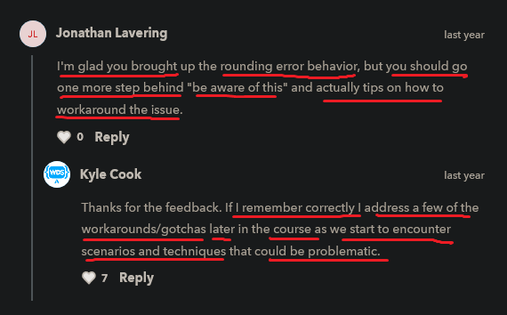

# number datatype

    - in JS , if a variable has value as floating number or integer number
        both will be treated as number datatype

## typeof operator/function 

    - typeof -> should be all in small letter
    - use it to check the datatype of a variable 
        means which kind of data has inside a variable
        according to that typeof operator -> tells datatype

    - it can be used as operator or a function form
        depends on situation
        but mostly we use it as operator

## Eg : of number type with typeof operator

    eg : 
        let a = 1 
        let b = 2.2
        console.log(typeof a)
        console.log(typeof b)

        // output : number
                    number

        - in other programming languages except JS , 
            treat whole number as integer type and decimal number as float or double type

    eg : doing arithmetic operations

        eg : of addition
            let a = 2 
            let b = 2.3

            console.log(a + b)

            // output : 4.3

        eg : of subtract
            let a = 2 
            let b = 2.3

            console.log(1 - a)

            // output : -1

        eg : of multiplication

            let a = 2 
            let b = 2

            console.log(a * b)

            // output : 4

        eg : of divide

            let a = 2 

            console.log(1 / a)

            // output : 0.5

        eg : of changing the precedence order

            console.log(1 + 2 * 3)

            - JS works top to bottom and left to right , 
                JS follows the normal order of operations when it comes to math
            - so due to BODMAS rule , multiply will occur first and then addition
            - and for good practice put multiplication inside parenthesis
                like this 
                console.log(1 + 2 * 3) -> bad practice ❌
                console.log(1 + (2 * 3)) -> good practice ✅

            - but if we want to do addition first then use parenthesis
                like this
                console.log((1 + 2) * 3) // output : 9

## challenge time - timeline 4:29

    ques - create the three separate variables
            and put 1 , 2 , 3 values to each of the variables
            then while printing results a and b variables should be added first
            and then divide by c variable

    Ans - 
            let a = 1 
            let b = 2 
            let c = 3

            console.log((a + b) / c) 

            // output : 1

            - so we use the parenthesis to do addition first and then divide
                due to BODMAS rule 
            - but if we don't use the parenthesis then JS will divide first and then do addition
                which is right according to BODMAS rule also
            - but here we said that we want to do addition first that's why 

## Note - for decimal numbers

    - in JS , the decimal numbers treated differently 
            then when we do normal math 

    eg : 
        let a = 1.2 
        let b = 2.2

        console.log(a + b)

        // output : 3.4000000000000004

        - we expect the result i.e 3.4
        - but JS engine/compiler aren't very accurate
          when they add together numbers with decimals 
        - and sometimes , not always , but sometimes
            we get these kind of weird rounding errors
            because we can see the output that it's almost 3.4
            and then 0 for 12 zeroes and then 4
        - so this is rounding errors

        - but same thing if we do in other programming languages 
            then we'll get perfect 3.4 as a output
            because like in c++ , we store these decimal values in float datatype that's why
        - but why this is happening in JS only , because 
            JS contain both integer numbers or float numbers as number/integer datatype only

    eg : doing multiplication with decimal number ✅🔥

        let a = 1.2 
        let b = 2.2

        console.log(a * b)  

        // output : 2.64

        - if we do multiplication then we'll get perfect output

    eg : doing all arithmetic operation with decimal number ✅

        let a = 1.2 
        let b = 2.2

        console.log(a / b)
        console.log(a + b)
        console.log(a - b)
        console.log(a * b)
        console.log(a % b)  

        // output : 0.5454545454545454
                    3.4000000000000004
                    -1.0000000000000002
                    2.64
                    1.2

        - here we can see that weird rounding error problem is coming 
            with add , subtract , divide 
        - and multiply and modulus operator giving prefect right answers 

        NOTE : 
            - this weird rounding errors sometimes happens and sometimes not
                depends on situation
            - so whenever we're dealing with floating point numbers 
                and we're trying to do math operation on these decimal numbers   
            - usually it won't happen but it is something we need to know
                that sometimes answer will be slightly higher or slightly lower
                due to these weird rounding issues when we're dealing with decimal number

    - for more check this video : https://www.youtube.com/watch?v=s9F8pu5KfyM&ab_channel=Fireship

## discussion section

