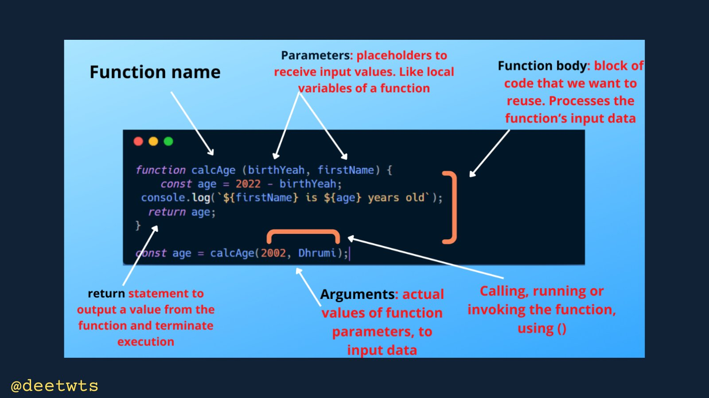

# Normal function

    - here we'll talk about functions and scoping
        so we can learn not only how to store variables & data
        for later , but by using a function how to store logic to be 
        used later in your code

    - functions allow us to encapsulate the logic 
        which we can reuse later in our code 

## NOTE - Reason to use functions 🔥

    eg : 
        let's say

        console.log("Hi")
        code.......         ---------
        code.......                 |
        code.......                 |----> assume that these are bunch of code 
        code.......                 |
        code.......         ---------
        console.log("Hi")

        - and then here we wrote the same code twice
        - so here concept comes in programming i.e DRY 💡
            D - don't 
            R - repeat
            Y - yourself

        - and if we want to update this message into "hello"
            then we need to update this message in both the console.log()
        - that's why here concept of functions comes
        - means we wrote the logic inside our function 
            which contain the repeated task & then we can call that function 
            to print that logic
        - & for update we don't have to update twice or multiple places
            we need to update only one place i.e inside the function body i.e 
            & we can see the changes everywhere

## how to create a function 

                         +---> give a space (NOTE : otherwise our function will not work)
                         |
        is a keyword     |   +--------> give any name to a function we want but name should be readable 
                   |     |   |           according to the work
                   |     |   |   _________________ 
                   |     |   |  |                 |
         +---->  function sayHi( ) {              |
     +---|            console.log("hello")        | 
     |   +---->  }                                |
     |                                            |                    
     |                                            V
     |                           - inside this parenthesis contain all the information that 
     |                               we pass/give to our function 
     |                               means we give parameters inside this parenthesis of a function
     |                           - right now we're leaving blank because we don't have/want to give 
     |                               parameter because we don't have/want to give any argument 
     |                               when we call sayHi() function 
     |     
     |
     +---> now this is just a function body or definition or logic of function 
            we made and whatever logic we wrote inside this function will not run/not give output
            because this is just a piece of logic 💡
        - means we just wrote the logic
        - to get the output or run the function 
            we have to call the function like this

        sayHi( )
              | 
              +------> we don't pass/give anything inside while calling a function 
                        because our function doesn't take information right now
                    - putting parenthesis while calling a function is important 💡
                        because it means we're calling a function
                    - while calling a function , inside parenthesis 💡
                        we give/define arguments for parameters which we define while creating a function

    eg : 

        function sayHi() {
            console.log("hello")
        }

        sayHi()
        code........      -----+
        code........           |
        code........           |---> assume that here we wrote bunch of code
        code........           |
        code........      -----+
        sayHi()

        // output : hello
                    hello

        - now here we call that sayHi() function twice
            to print the same logic twice
        - so we print the same logic as many times as we want 
            just calling that sayHi() function

        NOTE : 
            - here assume that function as a variable just like 
                we do with variable that we define let or const keyword 💡
            - function keyword is used to create a function

        - Now let's say we want to print "Hi"
            so we just only need to do that change the in one place 
            & then we'll get the output "Hi" twice times
            
        - so the piece of logic that we wrote inside a function
            we can use that logic over & over as many times as we want 
            by calling that function 💡

    -> common mistakes ✅

        - sometimes people forgot parenthesis after defining the function name
            or while calling a function
            - and you can see the errors in vs code terminal problem tab
                and easily fix/navigate around errors

        - forgetting curly braces which is a block of code
            where inside of it we define our logic/code

    
## challenge time - timeline 7:18

    ques - create a function that takes no arguments and prints your name

    Ans - 
            function printName() {
                console.log("Teen")
            } 

            - just only creating a function does't mean that will run
                we just created a logic so that we can use it later
            - so we need to call printName() function 

            printName()

            // output : Teen

## giving  parameters & arguments in a function

    - in function , each parameters are separated by comma  
        same with arguments

    NOTE :                  +-------------> this parenthesis to define parameters
                            |
          function funcName( ) {
                           
          }

          funcName( )
                   |
                   +----------> this parenthesis to define arguments

        - here inside parenthesis we define parameters of while creating a function , 💡
        - and parenthesis of while calling calling a function we define arguments 💡 

    eg : 

        function sum(a , b) {
            console.log(a + b)
        }

        sum(1 , 2)

        // output : 3

        - inside parenthesis of while creating a function 
            whatever we define are called parameters
            - parameters used to store/save information 💡
        - but sometimes we say arguments also but actually
            parameters & arguments are different

        - here we define two parameters are only usable 
            inside that sum function only not outside or any other function
        - we'll understand if we know about local and global scope
            or local and global variables 💡

        - we can assume that a and b parameters as a variables
        - 1 & 2 are arguments that we gave while calling that function for each parameters
          - 1 is a first argument for first parameter i.e a  
          - 2 is a second argument for second parameter i.e b

    eg : variation of above example

        function sum(a , b) {
            console.log(a + b)
        }

        let x = 2 
        let y = 3

        sum(x , y)

        - here we passed/gave x and y variables as arguments
            inside while calling sum function
        - and even further lecture we'll learn how to pass a function
            as a argument inside a function while calling a function
            i.e callback function

## challenge time - timeline 11:07

    ques - create a function that takes one argument (a person's name)
            & prints that out as

    Ans - 
            function printUser(name) {
                console.log(name)
            }

            printUser("Jerry")

            // output : Jerry

        
    NOTE : important ✅

        function printName(name) {
            console.log(name)
        }

        printName() 

        - now here we didn't gave any argument for name parameter
            so guess what will happen
            error will come or something else 

        - so output will be -> undefined

        - because if we don't give any argument for name or any parameter
            in that particular function except in predefined functions or methods
            then bydefault we'll get undefined 💡

        - so if we write like this 
            printName(undefined)
            // OR 
            printName()
        - both will give undefined as a output
        - if we don't want to give undefined as a argument explicitly
            then just call that function only
            because bydefault we'll get undefined 
            if we don't give arguments for those parameters 💡

    eg : giving two parameters while creating a function + not giving arguments while calling a function ✅
        
        function printName(name , age) {
            console.log(name)
            console.log(age)
        }

        printName()

        // output : undefined
                    undefined

        - so bydefault we'll get undefined

        - if we give a argument for only -> name parameter like this 💡
            printName("Teen") 

            // output : Teen
                        undefined

    eg : giving one or more arguments while calling a function + not giving parameters while creating it

        function print() {
            console.log("hello")
        }

        print("asdasd" , "fjsdjklfhs" , 123 , "as")

        // output : undefined

        - still we didn't got error
            because each arguments will be ignored
            because print() function doesn't have parameters to store each arguments
            & that's the good thing about JS

    NOTE : ✅
    
        - if we have multiple parameters in a function
            and while calling a function if we don't give arguments to any one of them parameters
            then bydefault will be stored undefined to that parameter 💡💡💡
            & vice versa with the case of arguments also

## using return keyword to return something from a function 

    - right now , every function we've created has done something
        but it hasn't actually given us any return value
        so that value we can use with other line of code

    eg : function with nothing returning 

        function sum(a , b) {
            console.log(a + b)
        } 

        sum(1 , 2)

        // output : 3 

        - here what happens if we want to do the sum of a and b parameters 
            but actually we want to use that value i.e 3 for something else 
        - right now we're just logging it to the screen
        - we can't use that value -> 3

        - so that's why we use ->  return keyword
            to return that value from that function and use that value 
            for other purpose like subtraction , etc

    eg : function with return keyword ✅

        function sum(a , b) {
            return a + b
        }

        - here return -> is a keyword
        - then give a space then 
        - then specify the value that we want to return

        sum(2 , 4)

        // output : nothing will come

        NOTE : 
            - because now this sum() function is returning a value for us 
                that we can use
            - so if we create a variable and pass/give that calling sum() function 
                as a value & then we'll use that variable
            - like this

        let result = sum(2 , 4)

        - now this result variable contain as a value 
            that whatever sum() function going to return 
        - right now sum() function is returning a value i.e 6
            not a function as a value
        - so that 6 value will be stored inside result variable
        - now do console.log() like this

            console.log(result)
            // output : 6

    eg : 
            function sum(a , b) {
                return a + b
            }

            let sum1 = sum(2 , 2)
            let sum2 = sum(2 , sum1)

            console.log(sum2)
            // output : 6

            - here we reuse that sum1 variable as a argument 
                inside sum() function while calling 

            - that's why we use -> return keyword 
                means whatever the value that function is returning 
                we can reuse that value with other codes

            - like here -> return keyword 
                is returning the result of the equation i.e a+b
                which is 6 

    NOTE : 
        function sum(a , b) {
            return a + b
        }

        let sum1 = sum(2 , 3)

        console.log(sum1)
        // output : sum1

        - so here the thing is these 2 and 3 arguments 
            goes to there own parameter & then 
        - inside block of code addition or calculation done
            & then it become -> 5
        - & then 5 will be returned by sum() function
            & that returned value i.e 5 will be stored as a value again
            inside sum1 variable & sum1 gets logged out
        - so here we can see that we reuse that returned value i.e 5
            for other purpose

## challenge time - timeline 16:13

    ques - create a function one argument (name) and 
        that function will return that name and then added to the end of the string "hello"
        means it should say "hello" & then the person's name & 
        return that from the function

    condition - don't log that out inside the function 
                we want to return it from the function & then 
                log it out afterwards

    Ans - 
            function sayHi(name) {
                return "Hello" + name
            }

            let result = sayHi("Teen")
            // OR 
            console.log(sayHi("Teen"))
            console.log(result)

            // output : Hello Teen

            - both ways are right 
                we can choose any one according to situation 💡

## Note : for return keyword ✅

    eg :    
            function sayHi(name) {
                return "hello" + name 
                console.log("This will never printed")
            }

            let result = sayHi("Teen")
            console.log(result)

        - here after return keyword nothing will be printed out
        - because return keyword says that take that value 
            which is returned from the function 
            & stop executing everything inside block of code or curly braces of a function 💡
        - return keyword means to stop executing 
            so whatever the code we wrote after return keyword
            that will not executed
        
        - if we want to print that console.log() message
            then put before -> return keyword

    NOTE : for console.log()

        - here log() is a method 
        - and using these parenthesis means we're calling a function or a method

## Note 

    - always make a function for one purpose 
        like making a function for only printing the message that's it
        and this is good practice 💡💡
