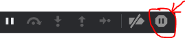
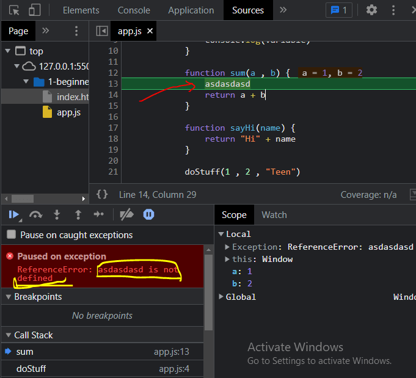
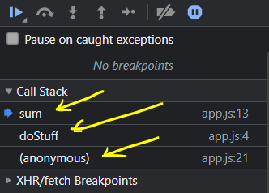
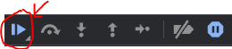
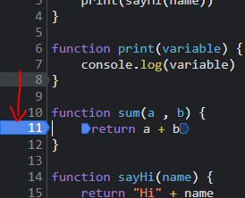
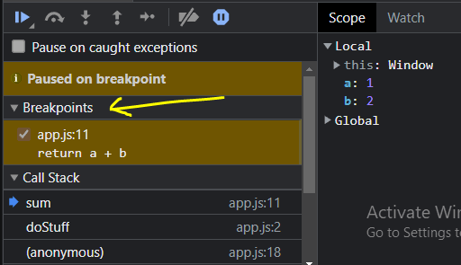
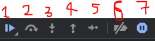
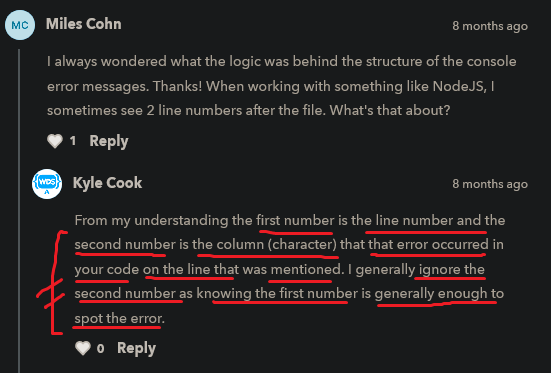

# stack trace and call stack

    - these both are really great tools
        in order to debug our code & to find errors ✅

    - here we'll use some debugging technique to find errors
        which is specifically related to calling function
        i.e usually say -> call stack and stack trace ✅

## stack trace in debugging

    eg : 
        function doStuff(a , b , name) {
            print(sum(a , b))
            print(sayHi(name))
        }

        function print(variable) {
            console.log(variable)
        }

        function sum(a , b) {
            return a + b
        }

        function sayHi(name) {
            return "Hi" + name
        }

        doStuff(1 , 2 , "Teen")

        // output : 3
                    Hi Teen

        NOTE : imp 💡💡
            - here we only use print function to print things
            - so this is good practice that make always a function for only one purpose
                like here only print function used to print things

        - so let's say we made a an error inside sum function 

            eg : 
                function sum(a , b) {
                    code........
                    code........
                    code........
                    return a + b
                }
            
            - so here we wrote something wrong code before return keyword
            - now go to console tab of inspect tool of chrome devtools
            - then we'll see errors like these 
 
            +----> at sum(script.js : 11)
        +---|      at doStuff(script.js : 2)
        |   +----> at script.js : 19
        |
        +--> these errors are stack trace 

        - so stack trace tells us that in what order all the function were called
            in to get to know exactly where we are 💡💡

        - so 
            +-----------------------------+
            |  at sum(script.js : 11)     |
            |  at doStuff(script.js : 2)  |
            |  at script.js : 19          |
            +-----------------------------+  
        - these the very first thing in our stack strace 
            i.e most recent function is called i.e -> at sum(script.js : 11)

        - so this is the first line -> at sum(script.js : 11)
            where error occurred 💡
        - and then we jumped backwards out of the sum function to the previous function 
            i.e doStuff function on line no. 2
            i.e where we called the sum function 💡
        - and then on line no. 19 where we called doStuff function 💡
        - here we said that we jumped backwards means
            because code run from top to bottom
            means execution will run from the inside to the outside 💡💡
        - so the first definition of our stack trace that's the most inside function 
            the one where error occurred 💡
            i.e at sum(script.js : 11)
            and the outermost function of where we started this whole rabbit hole
            to getting where we are right now i.e -> at script.js : 19 💡

        - so 
                at sum(script.js : 11)
                at doStuff(script.js : 2)
                at script.js : 19
            - these errors are shown/going from forward to backward in this situation 💡
            - if we see the errors then sum function comes after this function 
                means here errors stored in stack from bottom to top 💡
                but code will execute from top to bottom if code is not asynchronous 
            - so inside stack trace , we're going inside to outside
                means forward to backward 

        - so when we click to the first stack trace then it will take us to 
            where we made mistakes , so if we didn't see any error there 
            then check the next stack trace and still we didn't get any error 
            then check the next stack trace and if still we didn't get any error
          - then we need to this on and one to find the error on which line 
            till our last stack trace 💡💡
        - & sometimes "uncaught reference" 
            will not show the stack trace when we click on it

## call stack in debugging

    - this debugging tool is like interactive tool
    - in order to see call stack then 
        STEP 1 - go to sources tab of chrome dev tools
        STEP 2 - & then click to this icon
 
        
        STEP 3 - so that icon is stop button 
                    so after clicking on it then it becomes blue color
                - this stop button will stop when there is any error insid the code
        STEP 4 - and then reload that tab or page where we open the html file
                and then the debugger will get ON
 
         
            - then we can see that error inside the code 
                which is highlighted with the green line
            - and see that "paused on exception" section
                where error is shown 💡
            - right now our our is paused on line no. 13 
                where we made a mistake 💡
                and we'll not see any output inside console tab also
            - we can see the "call stack" section on left side
                - so call stack -> is just like our stack trace
                - but call stack shows us the function where we are and 
                    we don't need any error to use "call stack" debugger 💡
 

            - so we can check our code more clearly using "call stack" debugger
                by just clicking on any of those functions which are inside "call stack" section  
                and we'll get info on -> "scope" section about that functions on right side 💡
                    we'll see "local" and "global" section inside "scope" section

    -> using breakpoint in call stack ✅

        - so let's say we wrote the code properly 
            and there is no error like this 
                
            function doStuff(a , b , name) {
                print(sum(a , b))
                print(sayHi(name))
            }

            function print(variable) {
                console.log(variable)
            }

            function sum(a , b) {
                return a + b
            }

            function sayHi(name) {
                return "Hi" + name
            }

            doStuff(1 , 2 , "Teen")

        STEP 1 - & then click to that "resume" button
 

              - now we'll get our output inside console tab
              - now we can't see anything inside "call stack" section
                  because there is no error in our code
              - so what we can do is 
        STEP 2 - go to source tab
                - and open the .js file in source tab itself
                - and then click to any line numbers let's say we clicked on line no. 11
                - then that line no. 11 will become a breakpoint
 

        STEP 3 - refresh the page of html file
                then our code will get paused

            - now we can see what's happening inside that sum function
            - so we can see "breakpoints" section just above the "call stack" section 
 

        - so we can use the "call stack" 
            to see our code deeply through breakpoints 💡💡

## icons/buttons of debugging ✅

 

    third button -> used to check code line by line 💡
    second button -> used to step over the next function call 💡
    fourth button -> used to step out of current function
                  -> use this button when we want to execute those things 
                        which are inside "call stack" section 💡

    eg : of fourth button

        => sum ..... 11
          doStuff .... 12
          anonymous .... 14

        - so right now we're in sum function 
            and if we want to go to doStuff function
            then we click to fourth button
        - and so on ...

        - so here we learned debugging specially for call function

## Note - for stack trace and call stack chrome debugger tools ✅

    - important 🔥

    - firstly use the "stack trace" debugger
        and if we got error then that's good 💡
    - & if we won't be able to find error using "stack trace" debugger 
        then use "call stack" & "breakpoints" debugger to check the code deeply 💡

    - so "stack trace" debugger is to find small error
        but if we want to analyze the code deeply then 
        use "call stack" debugger 

## discussion page 

