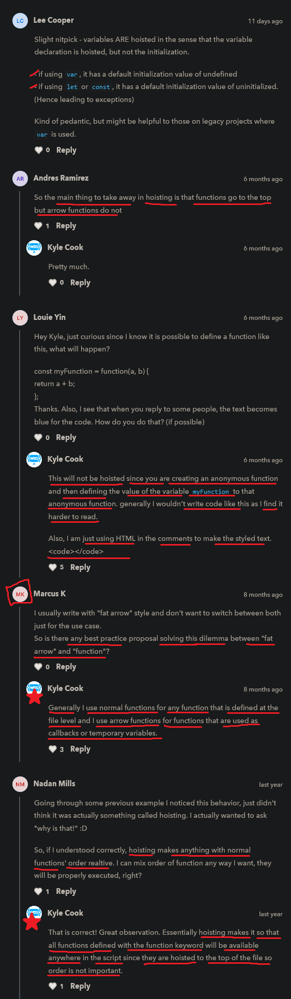

# Hoisting

    - most important topic 🔥

## Note - of hoisting 🔥

    - hoisting will work with only normal function 
  
    - it doesn't work with function expression
        whether it's a arrow function or anonymous function 

    - it also doesn't work with normal variables 
        which are define by using let or const keyword

## example 

    eg : 
            function sum(a , b) {
                return a + b
            }

            console.log(sum(1 , 2))

            // output : 3

    - so we know that execution done from top to bottom
        but if we do this 

    eg : accessing a variable before initialize ✅

        function sum(a , b) {
            return a + b
        } 
        
        console.log(sum(a , 2))

        let a = 1

        // output : error will come i.e cannot access "a" before initialization 

        - because we're trying to access variable -> a
            before initialization 
            means we're accessing variable -> a 
            and after that we initialized

## Hoisting with normal function ✅

    eg :    
            console.log(sum(1 , 2))
        
            function sum(a , b) {
                return a + b
            } 

        // output : 3

        - so here we got the output even if we 
            accessed/call the sum function first 
            and then we initialize the sum() function 

        - means we are accessing/calling the sum() function 
            before declaring/declaring/initializing/ the sum function 💡

        NOTE : important 🔥

            - Reason is that , 
                in hoisting , before JS actually runs your code from top to bottom 💡
            - JS does a interesting step behind the scene , 
                JS takes that sum function and put it before calling/accessing that sum function
                this behaviour is called hoisting 💡

            - so hoisting does that hoisting takes all the normal function 
                if we declared/define that normal function after calling that normal function
                so here hositing move that normal function or scope 
                at the very top of the code 💡
            - so that we can use/call that normal function 
                before defining or after defining anywhere else in the file we want

## Hositing with function expression (arrow and anonymous function) 🔥

    - very important 🔥

    - hoisting doesn't work with the function expression
        whether it's a arrow function or anonymous function 💡💡

    eg : defining the arrow and anonymous function first & then called them ✅

        eg 1 : arrow function 

                let sumArrow = (a , b) => {
                    return a + b
                }

                console.log(sumArrow(1 , 2))

                // output : 3

        eg 2 : anonymous function 

                let sum = function(a , b) {
                    return a + b
                }

                console.log(sum(1 , 2))

                // output : 3

        - both are working fine 

        - but if we define/initialize arrow function & anonymous function 
            after accessing/calling

    eg : trying hoisting with arrow function & anonymous function ✅

        eg : hoisting with arrow function 

            console.log(sumArrow(1 , 2))

            const sumArrow = (a , b) => {
                return a + b
            }

        eg : hoisting with anonymous function 

            console.log(sumArrow(1 , 2))

            let sumArrow = function(a , b) {
                return a + b
            }

        // output : error come from both the code

        NOTE : important 🔥

            - reason is slightly difference in both arrow function and anonymous function 
                from normal function 💡
            - i.e arrow and anonymous function are define as a variable
                as we can see let or const keyword 💡
            - and both let and const keywords are used to create variables
                that's why let and const keywords are not hosted 💡

            - and hoisting doesn't work with normal variables 
                which are created by using let or const keyword 💡

            - so since we defined arrow function and anonymous function 
                as a variable after accessing/calling them 
            - so they will not get move in top of the code 💡
            - and behind the scene 
                arrow function and anonymous function stays at the bottom only
              - and same with variables which are define by using let and const keywords
                so these variables also not go at the top of the code
                if we define/initialize them before accessing/calling them 💡

## hoisting with variables by using let , const , var keywords ✅

    - important 💡💡

    eg : hoisting with let and const keyword variables

        console.log(a , b)

        let a = 2
        let b = 3

        // output : error will come i.e -> a is not defined

    eg : hoisting with var keyword variable

        console.log(c)

        var c = 4

        // output : undefined

        NOTE : 
            - and then if we run this same code again then we'll get 4 as a output
                - because initially while memory allocation we'll get undefined
                - but after memory allocation we'll get 4 as a value 💡💡 like this 
                Eg : means behind the scene this will happen when doing hoisting with var keyword variable 

                        var c = undefined
                        console.log(c)
                        c = 4
                        // output : undefined

            - but this will happen with var keyword variables only not with let or const keyword
            - because JS run just like other programming languages
                that JS will give memory to this c variable same with let or const keyword 💡
            - in var , const lecture will see about var , let and const keyword 
                that why this is happening with var keyword not with let or const keyword

    NOTE : important 🔥 

        - actually these questions can be asked interview 
        - but we didn't use hoisting with variables 
            we only use hoisting with normal function 

## Note - for hoisting 🔥

    - so whenever we define a function at the bottom 
        after accessing/calling
    - then use normal function with function keyword only 
        because hoisting will work with only normal function 

    - and hoisting doesn't work with arrow and anonymous function 

## when to use hoisting with normal function and when not 🔥

    - important 💡💡

    - use arrow and anonymous function at the top 
        before accessing/calling them which are important code 💡
        because hoisting doesn't work with arrow & anonymous function 

    - & which are not important code then 
        define normal function or use hoisting way after accessing/calling that normal function 💡

    -> suggestion by kyle ✅

        eg : 
                const sumArrow = (a , b) => {
                    return a + b
                }

                console.log(sumArrow(1 , 2))
                code...........................
                code...........................
                helper()
                code...........................
                code...........................
                code...........................
                
                function helper() {
                    code..........
                }   

        - so here sumArrow is important code that's why 
            we use/define/initialize the arrow or anonymous function
            at the top of the code and then we access/call them 💡
        - and as we know hoisting will not work with arrow and anonymous function 

        - on the other side , we used helper function which is a normal function 
            so here helper function is not important code that's why we use hoisting 💡

## Extra Notes

- https://www.youtube.com/watch?v=EvfRXyKa_GI&ab_channel=WebDevSimplified

## discussion page 

             