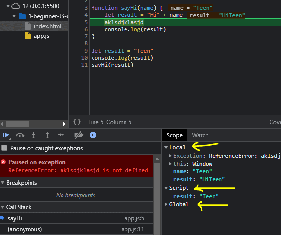
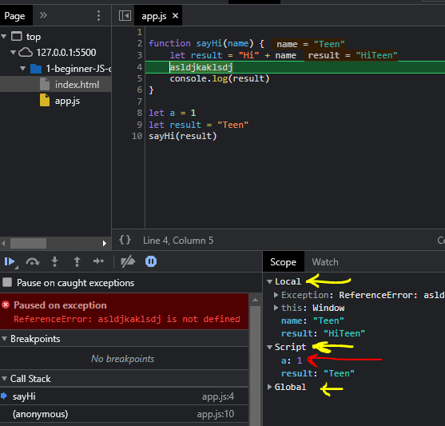
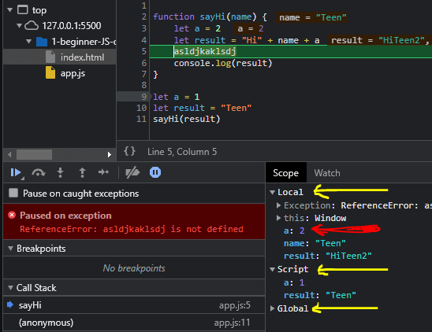
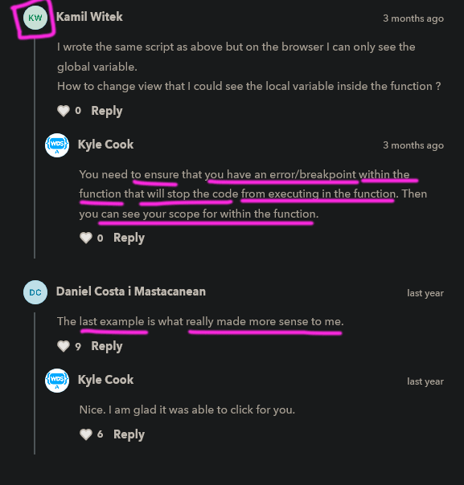

# Scoping

    - most important 🔥
    - is related to 
        global/outer/outside scope , local/inner/inside scope or block scope or function scope 
        of variables/function/code

## example - of scoping

    eg :    
            function sayHi(name) {
                let result = "Hi" + name
                console.log(result)
            }

            sayHi("Teen")

            // output : Hi Teen

        if we do one more step further

            function sayHi(name) {
                let result = "Hi" + name
                console.log(result)
            }

            let name = "Teen"
            sayHi(name)

            // output : Hi Teen

        - so no error comes 
            remember in previous lecture we said that 
            we can't make two variables of same name that will be error 💡

        - but here we can see 
            we have two variables of same name i.e name variable
                - first name variable is outside the sayHi function 
                - and another name variable is inside the sayHi function
            - and both variables are different then each other 

        NOTE : 
            - the reason is scoping
              - so the way scope works is that 
                every single time when we have a set of curly braces means block of code
                like this -> { }
            - then whatever are inside the curly braces or block of code
                like variables or functions inside that curly braces then
                these variables or functions will work inside there own scope
            - and every function has it's own scope 💡💡

    -> global/outer scope ✅

        eg : of global scope

                +----------------------------------+
                |   function sayHi(name) {         |
                |       let result = "Hi" + name   |
        +------>|       console.log(result)        |
        |       |   }                              |
        |       |                                  |
        |       |   let result = "Teen"            |
        |       |    sayHi(result)                 |
        |       +----------------------------------+
        |
        +---> this is our global scope means 
                whatever code we wrote inside the js file
                that whole code is global scope means globally accessible
                like sayHi function , result variable comes inside the global scope 💡💡
            - and inside global scope , smaller scope comes i.e local scope 💡💡

    -> local/inner scope ✅

        eg : of local scope

                +----------------------------------+
                |   function sayHi(name) {         |
                |       let result = "Hi" + name   |
        +------>|       console.log(result)        |
        |       |   }                              |
        |       +----------------------------------+
        |
        +--> this is smaller scope means 
                whatever inside the sayHi function 
                will be locally accessible
            - while our global scope contains all of these code 
                that we wrote in a js file

            - & even we can see global & local scope through inspect tool 💡

    -> watching global & local scope through inspect tool ✅

        eg : 
                function sayHi(name) {
                    let result = "Hi" + name
        +----->     aklsdjklasjd
        |           console.log(result)
        |        }
        |
        |       let result = "Teen"
        |       sayHi(result)
        |    
        +--> here we wrote random stuff to create an error
                so that we can see global & local scope

            - so go to source tab of chrome dev tool after inspect
            - then then click on that button to make it blue in color
 

            - then reload the page of html to start debugger
            - then we'll see in right hand side 
                i.e "scope" section
                
            - so types of scope are inside "scope" section 🔥
                - local scope
                - script scope
                - global scope

                -> local scope ✅
                    - it tells where we're currently locally 
                        like here currently we're locally inside the sayHi function   

                -> script scope ✅
                    - it tells in which script file currently we're in i.e our app.js file 
                    - so whatever things are defined globally then 
                        those will come in this script scope also

                -> global scope ✅
                    - means whatever we wrote the code globally in our file 
                        those all code comes in global scope
                    - eg : all variables we created globally , etc
                        including DOM also
 

            - so we can see that in local scope
                - we have -> name parameter as a variable and result variable of sayHi() function 💡
            - and inside script scope
                - we have the variable i.e result which is created globally in our JS file 💡

            - so local/inner & global/outer scope
                can have the variables of exact same name
                & and they're not going to conflict
                because both are in different scope from each other

    -> using global variable inside the local scope directly ✅

        eg : 
                function sayHi(name) {
                    let result = "Hi" + name 
                    asldjkaklsdj  --------------> here we made an error deliberately
                    console.log(result)
                }

                let a = 1 
                let result = "Teen"
                sayHi(result)

        - now again start your debugger in source tab of chrome dev tool  

        - now here we can see that inside the script scope
            we have a variable -> a and result variable also 
            which both are globally defined 💡
        - so we can use/access that variable -> a
            directly inside locally means inside the block of code of sayHi function 💡
            like this 

                function sayHi(name) {
                    let result = "Hi" + name + a
    +----------->   asldjkaklsdj
    |                 console.log(result)
    |            }
    |
    |            let a = 1 
    |            let result = "Teen"
    |            sayHi(result)
    |
    |    - here we used the variable -> a directly
    |        inside the sayHi() function 
    |
    +----> we made a error deliberately to see the scope section of source tab of chrome dev tool
            otherwise without error inside the code 
            we can't see the scope section of source tab

        Note : 💡

                function sayHi(name) {
                    let result = "Hi" + name + a
                    asldjkaklsdj
                    console.log(result)
                }
    
                let a = 1 
                let result = "Teen"
                sayHi(result)

            - so this code JS will execute like this
            - first JS look inside local scope i.e sayHi() function 
                because i.e the first code we wrote in JS file 
            - so if there is a variable -> a
                & JS looked our current scope so JS will say
                do we have any variable name -> a
            - so there is no variable named -> a
            - then JS will move to next scope
                i.e -> whole code of that JS file
                    here mean outer scope
            - then JS will say here we have variable of named -> a
            - & then JS will transfer -> a variable 
                from global scope to local scope of sayHi() function 
            - & here code will start or JS will read code 
                from local scope i.e sayHi() function to global scope i.e whole code of a file

    -> eg : of using local scope variable instead of global scope variable ✅

                function sayHi(name) {
                    let a = 2 
                    let result = "Hi" + name + a
                    asldjkaklsdj -----------------> gibberish code to create an error 
                    console.log(result)
                }
    
                let a = 1 
                let result = "Teen"
                sayHi(result)

        - now open source tab & then see scope section of source tab of chrome dev tool

        - here previously value of a is 1
            but now value 2 of a is coming 

        NOTE : important 🔥
            - so we already said that js will check 
                there any variable named -> a inside local scope first or not
                according to code 💡
            - so here variable -> a exist in local scope of sayHi() function 
                that's why JS took a = 2 instead of taking a = 1 (which is defined in global scope) 💡
            - so if variable "a" -> doesn't not exist in local scope then js will take a = 1
                which is defined in outer/global scope 💡 

## Note - of local and global scope 

    - important 🔥

    - for global scope , 
        - if we defined variables , functions , objects , etc globally or in global scope
            then we can access them inside any local scope or block of code 
    - for local scope , 
        - if we defined variables , functions , objects , etc locally or inside local scope
            then we can't access them in global scope 

    eg : accessing local variables , etc in global scope ✅

        function sayHi() {
            let a = 2 ; 
            let result = "Hi" + name + a
            console.log(result)
        }

        let a = 1
        sayHi("Teen")
        console.log(result)

        // output : error come i.e result variable is not defined

        - because result variable is defined inside the inner/local scope 
            not in global scope
        - that's why we don't have access of local scope 

    Note : for demonstration purpose

            { <----+
                   | <----> here we have curly braces which are local scope
            } <----+

            { <----+
                   | <----> here another we have curly braces which are local scope                
            } <----+

        - so these curly braces are called block of code
        - in real life we don't define scope like this but in CSS we do 

## example - of local & global variable

    eg : local & global scope ✅
            {   
                let num = 1 
                console.log(a)
            }

            {
                let num = 2 
                console.log(a)
            }

            let num = 0 
            console.log(a)

        - here all num variable are different each other because 
            each of them are in different scope 💡💡
        - so here program will run from top to bottom

        // output : 1 
                    2 
                    0

    eg : nested scope inside of other scope ✅💡

        let c = 3 
        
        {
            let a = 1 

            {
                let b = 2
                console.log(a)
                console.log(b)
                console.log(c)
            }
        }

        // output : 1
                    2
                    3

        - but if we access the b variable in that scope 
            where we define the "a" variable like this 

            let c = 3 
            
            {
                let a = 1 
                console.log(b)
                
                {
                    let b = 2
                    console.log(a)
                    console.log(b)
                    console.log(c)
                }
            }

            // output : error i.e b is not defined

## discussion page 

