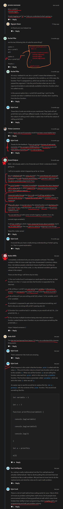

# closures

    - most important 🔥

    - is very similar like scoping if we use closure concept
        then scoping also come 💡

## example 

    eg : 
            let a = 1

            function print() { 
                console.log(a)
            }

            print()

            // output : 1

        - this is not an actual example of closure 
            but this example will tell about closure 
        - so the reason it's a closure 
            because we have inner/local scope 
            and we're accessing the variable -> a
            which is define in the outer/global scope

        - now let's update the value of variable -> a

    eg : 
            let a = 1

            function print() {
                console.log(a)
            } 

            a = 2
            print()

            // output : 2

        - so even this code is technically closure
            but not exactly 💡💡 
        - because closure will not written normally like this code 💡💡 

## How closure is defined usually 

    eg : of closure ✅

        function print(variable) {

            return function func(variable2) {
                
                console.log(variable)
                console.log(variable2)
            }
        }
        //OR
        function print(variable) {

            function func(variable2) {
                
                console.log(variable)
                console.log(variable2)
            }

            return func
        }

        let a = print(1)
        
        a(2)

    - so here we created a function i.e print function 
        which takes one parameter i.e variable
    - and that print function will return a brand new definition/body of func function 💡💡

    - so here 
        let a = print(1)
        a(2)

        - we're calling that print() function 
        - and that print() function is returning a definition/body of func function
        - so variable "a" becomes a function expression because 
          - variable "a" store the  definition/body of that func function as a value
            that's why variable "a" becomes a function expression
        - and due to this we called the variable "a" as a function by using parenthesis

        // output : 1
                    2

    eg : actual example of closure ✅

        function print(variable) {
            let c = 3 

            return function func(variable2) {
                console.log(variable)
                console.log(variable2)
                console.log(c)
            }
        }

        let a = print(1)
        a(2)

        // output : 1
                    2
                    3

    - so here we did console.log()
        the "variable" parameter & "c" variable
        inside the func function 

    - so here closure is that inner function i.e func function 
        so that inner function will keep 
        the track/know/save the variables and parameters of outer/parent function i.e print function
        even if print function is no longer called 
        means even if execution context of print function was removed from execution stack 💡💡
    
    - so now the idea of closure is not probably
        something that we're gonna run into too often
        when we write our own code 💡💡
      - but lot of times we'll get this kind of code of closure in interview 
            where they're gonna give a code just like this 
            & they're gonna ask us & what is this code going to print 
      - if we understand how scoping & closure work 💡💡

## debugging the closure code

    eg : 
        
        function print(variable) {
            let c = 3 

            return function func(variable2) {
                console.log(variable)
                console.log(variable2)
                console.log(c)
            }
        }

        let a = print(1)
        a(2)

    - when we debug this code using chrome dev tools
        then when that func function returned 
        and that func function will stored as a value inside the variable "a"
    - so during that time only value of "variable" parameter and "c" variable of print function 
        will be stored/saved inside the func function already 
    - so now func function has access to see/use of both 
        value of "c" variable and variable parameter of print function 
    - now variable "a" is now function expression

## definition of closure 🔥

    - is related to parent's scope & own scope i.e child scope

    - closure is a function which bind together with it's lexical scope/environment 💡💡
    //OR
    - closure is a function along with it's lexical scope
        which forms a closure that's known as closure

    - at the top of the scope chain is the global scope i.e window object in the browser 💡

    - lexical scoping or lexical environment 
        means a scope created inside the parent function & it's child functions 
        so that all the child functions have a access or can access 
        parameters , variables of their parent function 
        and all the global variables and functions also 💡💡

## Note - of closure

    - important 🔥

    - closure means there is only a parent/outer function
        - and inside that parent/outer function 
            we define one or many child/inner/nested functions 💡💡
        - now those one or many child/inner/nested functions have a power
            that they can access the variables and parameters 
            of their own parent/outer function due to lexical scope
            and as well as they can access 
            all the global variables & global functions also , etc  💡💡 

    - so closures are child functions inside the parent functions 💡💡
        and closures functions are returned using return keyword from parent functions
        so that we can use them for other purpose 💡💡

    - but parent/outer function can't access 
        the variables and parameters of their child/inner/nested functions 💡

## more examples of closure

    eg : not actual example of closure ✅

        const outerFun = (a) => {
            let b = 10

            const innerFun = () => {
                let sum = a + b
                console.log(sum)
            }

            innerFun()
        }

        outerFun(s)

        - here outerFun function is a parent function
            and innerFun function is a child function of parent function 💡💡

        - so JS has something i.e lexical scope
        - so when we execute this code 
            then when innerFun function try to run 
        - so then innerFun function try to find "a" & "b" variable
            first inside it's own scope 
            & if innerFun function doesn't find then
        - innerFun function goes to it's lexical scope means lexical parent
            i.e outerFun function
        - so after when the innerFun function gets values of "a" & "b" variable
            from outerFun function then innerFun function will be executed

    eg : actual & complete example of closure ✅

        const outerFun = (a) => {
            let b = 10 ;

            const innerFun = () => {
                let sum = a + b
                console.log(sum)
            }

            return innerFun
        }  

        let inner = outerFun(5)
        console.log(inner)

        inner()

        - this is actual example of closure 
            because here we use return keyword also
            to return the inner/child/closure function 💡

        - so that we can use that returned function 💡💡
            for other purpose

## ------------------- extra notes on closure -------------------

### for more check these videos

- https://www.youtube.com/watch?v=Ys9VxrJjAyU&ab_channel=JamesQQuick
- https://www.youtube.com/watch?v=tlUoKHCnUtQ&ab_channel=WebDevSimplified

## discussion page

    eg 1 : What does the double parentheses mean while calling a function ✅

        - important example 🔥

        - we use double parentheses when 
            we have a child function inside the parent function 

        function total(num){

            return function(num2){
                console.log(num * num2) ;
            }
        }

        total(5)(10);
        
        - here "total" function takes an argument i.e 5
            and then second parenthesis means calls that another function i.e anonymous function
            which also takes a number as an argument and then print the output 💡💡
        - we use double parenthesis while calling a function 
            when we have returning closure function inside a function 💡💡

        NOTE : for using double parenthesis ✅ 
            - if we don't return that closure function by using return keyword from a function 
                then we can't use double parenthesis

