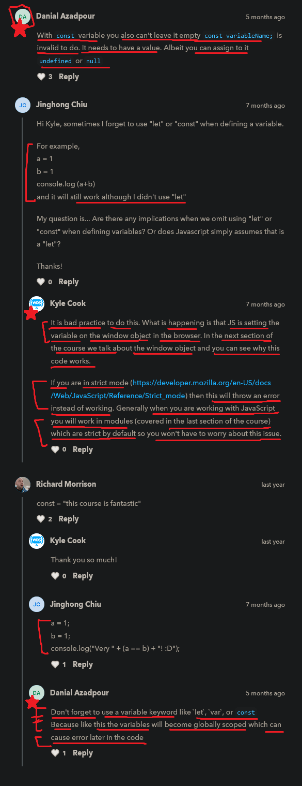

# const keyword

    - is a keyword which is used to define/declare a variable

    - used to keep that value/thing as same throughout the program 
        which means we can't change/update that value/thing

## example - of const keyword ✅

    eg : defining normal variables 
        const a = 1 
        console.log(a)

        // output : 1

        - now we if change/update the value of variable "a"
            then we can't do because of const keyword

    eg : updating the value of const keyword variable

            const a = 1
            a = 2
            console.log(a)

        // output : error will come

    eg : defining one variable as array or object

        const a = ["one" , "two"]
        a[1] = "Done"
        console.log(a)

        - now here we'll get the updated array 
            because we didn't change the value of variable "a" 💡💡💡
        - means we changed the value of that index of the array (which is a value of "a" variable) 💡💡💡
        - same with an object value    

## Note - for const keyword ✅

    - important 🔥

    - here we got error because 
        "a" variable is a constant/unchanging variable
        means we can't change the value of "a" variable

    - so we use const keyword 
        when we don't want to change the value of that variable

    - with const keyword variable we can't leave that variable empty 💡💡
        like this 
            const variableName ; 
            // output : error will come
        - const keyword variable must have a value i.e undefined or null
            either undefined or null should be defined as a value inside const keyword variable 💡💡     

## example - for let keyword ✅

    eg : updating the value of that variable

            let a = 1
            a = 2
            console.log(a)

            // output : 2

        - so here if we defined "a" variable with let keyword 
        - then we changed/updated the value of that variable
            without any error

## Note - for const & let keywords 🔥

    why would we want to use const keyword when we have let keyword
    
    suggestion by kyle
    ------------------

    - kyle use almost always use const keyword 
        - when that value of a variable
            will never going to change 
        - & he use let keyword when he want to change 
            the value of that variable

    - it's up to us
        - we can use let keyword almost all the time
            & const keyword less

    - but most of time we'll see const keyword used a lot
        and let keyword used less 💡

    - but use both together that would be best practice 

## Note - declaring/defining the variables without let or const or var keywords ✅

    eg : 
        a = 1 
        b = 2
        console.log(a + b)

        - this code still work without variable keywords (let or const or var keywords)
        - here JS is setting the both variables on the window object in the browser
            and the next section we'll talk about 
            the window object and we can see why this code works
        - means these variables will become globally scoped which
            can cause error later in the code
            so that's why always use let or const keyword 💡💡

        - this is bad practice

## discussion page

