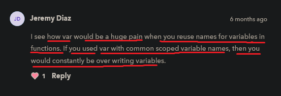

# var keyword

    - keywords used to define/declare a variable and function expression only
        - var 
        - let 
        - const 

    - let & const keywords -> are block scope 💡💡
    - var keyword -> is global or function scope 💡💡

## Note - for let , const & var keywords 🔥

    - almost we shouldn't never use -> var keyword to create variables
        because earlier there is only was to create variables 
        i.e with var keyword

    - & after when let & const keyword came in JS 
        then we use let and const keyword all the time 
        to create variables instead of using var keyword

    ques - why JS community made let & const keywords 
            to create variables when we have var keyword 💡💡

    Ans 
        - because var keyword works very strangely
        - and working of var keyword is different than both let & const keywords work
        
        - if we know previous about scoping 
            and how let & const keyword variables 
            only available in their own scope only 💡💡
        - but var keyword is different because 
            it's available outside of it's scope 💡💡
        

        eg : of let & const keywords ✅

            {
                let num1 = 1
                console.log(num1)
            }

            {
                let num2 = 2
                console.log(num2)
            }

            // output : 1
                        2

        eg : of var keyword ✅

            {
                let num1 = 1
            }

            console.log(num1)

            - here we're accessing the variable -> num1
                outside it's scope

            // output : error i.e num1 is not defined

            - because we defined the num1 variable inside the local scope
                and num1 is not defined in global scope
                and here we're trying to access the num1 variable 
                in global scope 💡
            - that's why we can't globally 
                access the num1 variable which is defined in local scope 💡

            - so same thing happen with const keyword 💡

## Note - difference b/w let & const keywords and var keyword 🔥

    - let & const keyword create scope 
        whenever we define a variable by using let or const keyword or both 💡💡

    - but var keyword doesn't care about scope 
        and as soon as when we define variables using var keyword
        then that variable is available or we can access
        inside in any scope like 
            - if variable is define with var keyword inside the local scope
                then we can access/use that variable in global scope    
            - and vice versa  💡💡
    
    eg : of var keyword ✅

        {
            var num1 = 1
        }

        console.log(num1)

        // output : 1

        - so in let keyword example 
            we were getting the error
        - but in var keyword example
            we're getting the output without any error 

    NOTE : important 🔥

        -> var keyword ✅ 
            - it destroy or doesn't care about scope
                or break all the scoping rule
            - it has hoisting power

        -> let & const keywords ✅
            - maintain/follow the scoping rule
                or give the scope
            - they don't do hoisting

    suggestion by kyle 
    ------------------
    
        - he doesn't usually like to use -> var keyword
            because why would we want to break 
            all the scoping rules
        - & have something that doesn't work 
            like everything were working previously

        - var keyword just go against everything 
            that make sense of it 

    - even -> var keyword do hoisting also

## hoisting concept with var keyword only ✅

    eg : 
            console.log(num)
            var num = 1
            console.log(num)
            
        // output : undefined
                    1

        - so due to hoisting behind the scene
            that num variable which is defined/initialized with var keyword
            will go to the top of the file 💡💡

        - but hoisting doesn't work with let & const keyword 💡💡

    ques - why undefined comes at first not 1 as a first output 📝

    Ans 
        console.log(num)
        var num = 1
        console.log(num)

        - because here we're accessing the num variable first
            and then we defined num variable 
        - so behind the code JS will do is
            while give memory allocation to num variable , 
            so num variable move to the top of the file due to hoisting because of var keyword
        - and undefined will be stored in num variable 
        - and after memory allocation value of num variable will be 1
            like this 

        var num = undefined
            & then 
        console.log(num)
            & then
        num = 1
            & then
        console.log(num)

    NOTE : important 🔥

        -> for var keyword ✅
            - if we define "num" variable two times with var keyword 
                then still we're get output

            eg : 
                    var num = undefined 
                    console.log(num)
                    var num = 1
                    console.log(num)

                // output : undefined 
                            1
                        
            - but if we do same thing with let & const keyword

        -> for let & const keywords ✅
            - if we define "num" variable two times with let or const keyword
                then we'll get an error 
            - we can't define same variable name two or multiple times 
                because this is a rule 

            eg : 
                    let num = undefined 
                    console.log(num)
                    num = 1
                    console.log(num)

                // output : error i.e identifier 'a' has already been declared

## suggestion by kyle ✅

    - never ever use -> var keyword to define a variable 
        - because it breaks all the rule of scope , etc
        - because it is older way of defining/writing JS 
        - & var keyword goes against pretty 
            much everything (which are related to modern JS) 💡💡

    - always use let & const keyword together
        according to situation 💡💡

## discussion page

