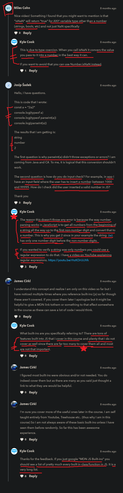

# NaN 

    - means not a number
    
    - here we'll talk about 
        side affect of type conversion
        when doing/dealing with numbers

    - here NaN -> is a keyword

## normal example

    eg : 
        const a = "1"

        console.log(parseInt(a))
        console.log(typeof parseInt(a))

        // output : 1
                    number

        - but what if we have "aklsdj" inside a string 
            like this 

    eg : 
        const a = "asdklj"

        console.log(parseInt(as))
        // output : NaN

        - so we got NaN
        - because we can't convert this string value "asdklj"
            into integer type (which doesn't a number inside the string)
        // OR
        - so JS can't convert that into integer type
            because "asdklj" is not a actual number

        - that's why we got NaN 

    eg : 
        function sum(a , b) {
            console.log(a)
            console.log(b)
            console.log(a + b)
        }
        
        sum()

        // output : undefined
                    undefined   
                    NaN
            
        - we got NaN because 
            because we can't do any calculation b/w undefined & undefined

## Note - of NaN ✅

    - here NaN -> both "N" letter should be capital not small 💡💡 
                -> because NaN is a keyword

    eg : 
        const a = "klahjsfas"

        console.log(parseInt(a))
        // output : NaN

        and when we compare NaN == NaN like this 

        console.log(parseInt(a) == NaN)
        // output : false

        // OR

        const a = parseInt("klahjsfas")
        console.log(a == NaN)
        // output : false

    NOTE : important 🔥
        - so why we got false -> as a output
            even we're getting NaN output -> from this -> console.log(parseInt(a)) 💡💡
        - and even we use === (triple equalto operator) 
            then still we'll get false -> as a output  💡💡

        - because 
            NaN == NaN  ---+
                           |--> always be output -> false 💡💡
            NaN === NaN ---+
        
    - so here we're getting false as a output again & again 
        so we need to use built in function of JS
        i.e isNaN() function 

## isNaN() function 

    - important 🔥

    - isNaN() 
        - is a function not a method 💡💡
        - isNaN -> should be written in camelCase 💡💡
        - used to check that a value is NaN or not  💡💡
            - if value is NaN -> return true
            - if value is actually/integer -> return false 💡💡

    eg : which is not a number/integer with isNaN() function ✅

        const a = "asdasd"
        // OR 
        const a = parseInt("asdasd")

        console.log(isNaN(a))
        // output : true

        - because we're saying that this string -> "asdasd" 
            is not a number

    eg : which is a number/integer datatype with isNaN() function ✅ 

        const b = 1
        
        console.log(isNaN(b))
        // output : false

        NOTE : 
            - here we got output -> false
            - and even if we put value 1 -> inside the double quotes
                then also we'll get output -> false
                because JS do implicit type conversion

## suggestion by kyle

    - important 🔥

    - always use special function of NaN i.e isNaN()
        to check that whether that variable is a NaN or not  💡💡

    - otherwise whatever we compare with NaN 
        like this 
        console.log(true == NaN)
        // false
    - so anything like true boolean , string , etc ..
        we compare with NaN 
        then always output will be -> false 💡💡
    - so we have to use that special function 
        to check that whether that variable is a NaN or not 💡💡

## discussion page

