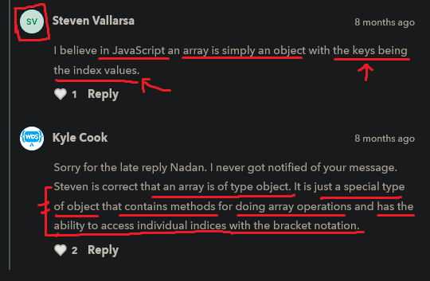

# array

    - very important 🔥
        because when deal with APIs data

    - is a continuous memory block 

    - is a special datatype of object (we can see by using typeof → operator) 💡
    - used to create a list of multiple values in a single variable like a list in python
    - each elements/items separated through comma
    - we use square brackets or square notation to create an array
    - in array , always 
        - indexing starts from 0(zero)
        - length of an array starts from 1 (one) 

    - to use properties or methods of an array
        then we use dot operator

## example - of array 

    eg : 
        const a = [1 , 2 , 3 , 4 , 5 , 6 , 7 , 8 , 9 , 10]

        console.log(a)

        output : (10) [1 , 2 , 3 , 4 , 5 , 6 , 7 , 8 , 9 , 10]
                   | 
        - it means we have total 10 items in a list 

## access an element/item from an array

    - we use square brackets and define index number inside that square brackets 
        of that element which we want to access  

    eg : 
        const a = [1 , 2 , 3 , 4 , 5 , 6 , 7 , 8 , 9 , 10]
        console.log(a[9])

        // output : 10

        NOTE : giving comma after the last element in an array or object or JSON ✅

            - don't give a space b/w variable "a" & square bracket
                while accessing any element 💡 
            - but if we do then we'll still got output 
                but for best practice and readability don't give

            - don't give comma after that last element or last key in object
                or writing JSON for best practices and readability 💡
                like this 

                eg : 
                    const a = [1 , 2 , 3 , 4 , 5 , ]   

                    - here we gave comma after the last element of an array
                    - and we'll still get output
                    - but don't give comma after the last element of an array
                        if we don't have any element or we don't want to give  
                        until if we have an element or we want to give
                    - and same thing goes with object and JSON

## how to add a new element/item in an array ✅

    - to add one or more elements/items in an array we use two method 
        -> unshift() method 
        -> push() method

    -> push() method 💡
        - is a method 
        - used to add items/elements at the end of an array
        //OR
        - used to add items/elements at the end after the last element of an array
        - push() method return total length of an array after adding that element 💡

        eg : of push() method

            const a = [1 , 2 , 3 , 4]

            a.push(5)

            console.log(a)

            // output : (5) [1, 2, 3, 4, 5]
        
        eg : push() method return total length of an array after adding an element ✅

            const a = [1 , 2 , 3]

            console.log(a.length) 
            // right now length is total -> 3
            console.log(a.push(4)) 
            // output : 4
            // now length is -> 4 after adding an element at the end of an array

    NOTE : 
        - like push() method we have many methods
            that we can google we'll not discuss here

## Nested array ✅

    - important 🔥

    - how we can put/add an array inside an array

    eg 1 : of nested array 
        const a = [1, 2, 3, 4, 5]

        a.push(6) // adding an element at the end of an array i.e variable "a"

        a.push(["hi" , "bye"]) // adding an array at the end of an array

        console.log(a)

        // output : [ 1, 2, 3, 4, 5, 6, ["hi" , "bye"] ]

        - here ["hi" , "bye"] --> this array added at the end 
            which is on 6th position of "a" variable array

        - now we want 1st element of 6th index i.e "Hi"
            we use double square bracket notation

    eg 2 : accessing 1st element of 6th index (nested array) ✅

        - important example 🔥

        const a = [1, 2, 3, 4, 5]
        a.push(6) // adding an element at the end of an array i.e variable "a"
        a.push(["hi" , "bye"]) // adding an array at the end of an array
        console.log(a)

        console.log(a[6][0])
        // output : "hi"

        - here this -> a[6][0]
        - means first we accessed the 6th position (which is nested array) of "a" array variable 
            then we accessed the 0(zero) index element of that nested array

        NOTE : 
            -  a[6][0]
            -  don't give a space b/w square notations or any other like this a[6] [0]
                if we give then we still get output 
                but readability gets break 💡

    eg 3 : of nested array

        const a = [
            ["hi" , "byee"] , 
            [1 , 2]
        ]
        //OR
        const arr1 = ["hi" , "byee"]
        const a [
            arr1 , 
            [1 , 2]
        ]

        console.log(a[0][0])

    eg 4 : of nested array

        const a = [
            [1 , 2 , 3 , 4 , 5] ,
            [1 , 2 , 3 , 4 , 5] ,
            [1 , 2 , 3 , 4 , 5] 
        ]

        console.log(a[0][3])
        // output : 4
        console.log(a[1][2])
        // output : 8
        console.log(a[2][0])
        // output : 11

## length of an array 

    - how to get length of an array or how to check length of an array

    -> length property ✅
        - is a property
        - used to check the total length/size of an array or a string 💡
    - so use property -> length 
        to get total length/size of an array

    eg : 
        const a = [1 , 2 , 3 , 4 , 5 , 6]

        console.log(a.length)
        // output : 6

## array methods & properties

    - array methods 
        - unshift()
        - push()
        - shift()
        - pop()
        - delete - operator 
            - it used to delete/remove only any object property (not method) & any array element based on index 
            - it mutate the original object or array 

        - concat()
        - join()

        - reverse()
        - slice()
        - splice()
        - sort()

        - forEach()
        - map()
        - filter()
        - some()
        - every()
        - includes()

        - reduce()
        - reduceRight()
        - flat
        - flatMap()

        - keys()

        - entries()
          - next() method  
          - value property

        - copyWithin()

        - from()
        - of()
        - indexOf()
        - find()
        - findIndex()
        - at()
        - fill()

        - isArray()
        
        - valueOf()

    - array properties
        - length

## discussion page

