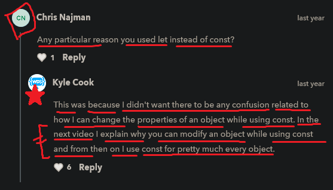

# Object

    - very important 🔥

    - objects in JS , is like a bread & butter type

    - objects 
        - used most of the time
        - is a collections of the information 
            and that collections are related to each other 
            which tells about that particular information 💡

    - a object is created by using curly braces as a value
        and inside that curly braces we store data in the form of key & it's value 💡💡
        just like in css , property & it's value
    - and we use colon sign to store data inside the a key 💡💡
    - and each key & it's value are separated by comma sign 💡💡

## Note - for array & object

    - we can create 
      - object inside object 
      - array inside array
      - or array inside object
      - or object inside array 
      - or we can do all of them at the same time
    - when we deal with JSON data

## Note - why to use object

    eg : of normal thing ✅
        +-----------------------------+
        |  let name = "Teen"          |
        |  const age = 25             |
        |  const favouriteNumber = 3  |
        +-----------------------------+

        - so this is a collections of a information about a person
            but all of the 3 each information are separated variables 
        - & these all 3 variables are not related to each other
            then here comes concept of object 💡💡

        - so to relate these information each other 
            through a particular thing then we need to use object 💡💡

## example - of object

    eg 1 : of object ✅

        let person = { } // empty object

        console.log(person)
        // output : { }
        
        - here we got an empty object as a output 
        - right now this is empty object just like 
            let list = [] // empty array

    eg 2 : of object ✅

        let person = {
            name : "Teen" ,
            age : 12 , 
            favoriteNumber : 3 , 
        }

        console.log(person)
        // output : Object { name: "Teen", age: 12, favoriteNumber: 3 }

        - we use colon to assign a value to a particular key 💡💡
        - & each key value pairs are separate from each other by comma 💡💡

        NOTE : 
            - we can put comma at the end after that last key & it's value in a object
                and still we'll get output
            - but for best practice don't give comma after the last key & it's value
                in a object until if we don't have any key or if we don't want to add a key
                & due to readability also 💡💡

        - so in this example we can see that each information are related 
            to each other with single thing i.e person object 💡

## accessing the value/function of a particular key/property of a object

    - we use dot operator to access 
        the value or a function of a particular key/property of a object 💡💡

    eg : accessing a value of a key of an object ✅

        let person = {
            name : "Teen" ,
            age : 12 , 
            favoriteNumber : 3 , 
        }

        console.log(person.name)
        //OR
        console.log(person["name"])
        // output : Teen

        - we used object name then dot operator then key name
            that we want to access 💡
        - so we use dot operator also and square bracket notation also
            to access a key

        NOTE : why to use dot operator to access or update a key of an object ✅
            - always use dot operator 
                to access or to update a value of a key of an object 💡💡
                due to readability 
            - don't use square bracket notation
                but this depends on situation also 💡💡

## Note - how object and methods are related to each other ✅

    eg : 
        console.log(console)
        // output : console {debug: ƒ, error: ƒ, info: ƒ, log: ƒ, warn: ƒ, …}

    - here we used console object and it's log() method to print
        and through this we will able to know that
    - behind the scene log --> is a property/key inside the console object
        and log -> property/key contain it's own function definition as a value 💡💡

    - and console object have great methods , so google it 📝

    - in JS , functions are stored just like fancy variables as normal variables 💡💡

## difference b/w function & method 
    
    -> about function 
        - function is a individual 💡💡
        - function can be created by programmer also
        - and we have predefined/built-in functions in JS 
        eg : sum function that we created 

    -> about method 
        - method is related to object 💡💡
        - and these are not individual
        - methods are predefined also
        - & as a programmer we can make method also by making an object
        eg : log() method of console object
            which is predefined method and related to object

        eg : 
            let person = {
                name : "Teen" ,
                age : 12 ,
                favoriteNumber : 3 ,
                sayHi : function() {
                    console.log("Hi")
                }
            }

            person.sayHi() 

            - here sayHi() is a method of person object
                which is created by programmer not predefined
                but sayHi() method is related to object 💡💡

## creating a function inside a object ✅

    eg : 
        let person = {
            name : "Teen" , 
            age : 12 , 
            sayHi : function() { ------> this is the way we define anonymous function inside a object
                console.log()
            } ,

            sayHi : () => {   ---------> this is the way we define arrow function inside a object
                console.log()
            }
        }

    - here now we don't need to use colon sign & function keyword
        to define/declare a function inside an object 💡💡

    eg : defining a normal function inside an object without colon sign & function keyword ✅

        - important example 🔥

        let person = {
            name : "Teen" , 
            age : 12 , 
            sayHi() {   ----------> this is normal function inside a object
                console.log()
            }
        }

        - this approach used by many people 💡💡
        - & if we define normal function outside the object
            then we have to give function keyword 
        - but if we define normal function inside the object
            then we don't need to give colon sign & function keyword 💡💡

## access keys/properties of an object inside a function of an object 

    - important example 🔥

    - how we can access keys/properties of an object
        inside a function that we created is an object itself 💡

    eg : directly accessing keys inside a function of an object ✅

        let bioData = {
            myName : "Teen" , 
            myAge : 12 , 
            getData() {
                console.log(`My name is : ${myName} and age is : ${myAge}`)
            }
        }

        bioData.getData()
        // output : error

        - here we got error as a output 
            because both keys i.e myName & myAge are not defined
            inside that getData function of an object
        - so we have to use these keys with reference of the object itself
            inside that function of an object 💡💡
            like this 

    eg : access keys with the reference of an object inside a function of an object ✅ 

        - important example 🔥

        let bioData = {
            myName : "Teen" , 
            myAge : 12 , 
            getData : function() {
                console.log(`My name is : ${bioData.myName} and age is : ${bioData.myAge}`)
            }
        }

        bioData.getData()
        // output : My name is : Teen and age is : 12

        NOTE : 
            - we have this -> keyword
                through this -> keyword we can access keys of an object
                inside a function of an object 💡
            - instead of using bioData as a object name
            - which we'll see in new & this keywords lecture

## 2 ways to access a key/property of an object

    -> 2 ways to access a key from an object 
        first - use dot operator
        second - use square brackets like in array

    eg :
        let car = {
            make : "Teen" ,
            model : "370Z" , 
            isUsed : true ,
            makeNoise() {
                console.log("Vroom")
            }
        } 

        console.log(car.make) // used dot operator
        console.log(car["make"]) // used square bracket notation

    NOTE : when to use square bracket notation to access a key of an object ✅

        - when we have a variable which contain a key of that object
            then we can't access that variable as a key through dot operator 💡💡
            otherwise error come if we access that variable as a key through do operator
        - so use square bracket
            like this 

        let car = {
            make : "Teen" ,
            model : "370Z" , 
            isUsed : true ,
            makeNoise() {
                console.log("Vroom")
            }
        } 

        const property = "make"

        console.log(car.[property]) // output : "Teen"
        console.log(car.property) 
        // output : error come
        - because inside car object there is no key which has name -> property 💡💡
    
    - but 99% times always use dot operator
        because of readability to access a key from an object 💡💡
        and don't use square bracket notation due to difficult to read

## Nested object ✅

    - very important 🔥

    - object inside an object 

    eg : 
        let person = {
            name : "Teen" , 
            address : {
                street : "12345 main road" , 
                city : "somewhere"
            } , 
            hobbies : ["Gaming" , "Music"]       
        }

        console.log(person.hobbies[0])
        console.log(person.address.city)

        - here person.address.city
            means we can understand like parent-child relation just like HTML & CSS

        NOTE : 
            - if we do this
                console.log(person.ages)
                // output : undefined
            - here we got undefined 
                because ages -> key doesn't exist inside person object

## update value of a key/property of an object ✅

    - important 🔥

    eg :    
        let book = {
            title : "The way of shadows" , 
            author : {
                name : "Brent wedks" ,
                age : 12
            }
        }

        - now updating the value of "name" key of book object

        book.author.name = "Teen"
        console.log(book.author.name)

    NOTE : how to update a value/element/item inside an array ✅

        - we use square bracket to update an element inside an array 💡💡

        eg : 
            let hobbies = [1 , 2]
        
            hobbies[0] = 3
            console.log(hobbies)
            // output : [3 , 2]

## Note - for object

    - when we define a key/property inside an object
        then never use let or const keyword 💡💡

## said by kyle

    - most of the time in JS , we'll see objects in upcoming lectures 
    - & we used objects & arrays in projects also
    
    - so object & array are most important 🔥🔥

## object methods & properties 

    -> object methods
        Object.keys()
        Object.values()
        Object.entries()
        Object.fromEntries() 

    -> object properties

- important object methods : 
    - https://medium.com/youstart-labs/javascript-object-methods-every-developer-should-know-c68c132a658
    - https://www.digitalocean.com/community/tutorials/how-to-use-object-methods-in-javascript

## Extra notes

- Stop Using Javascript Objects : https://www.youtube.com/watch?v=hRSwSAr-gok&ab_channel=Theo-ping%E2%80%A4gg

## discussion page

