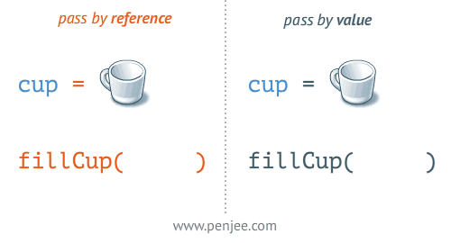

# reference VS value

    - very important topic 🔥

    - reference of address only happens with arrays & objects 💡💡
    - referencing doesn't happen with normal variables types 
        like boolean , string , number , etc 💡💡 

# NOTE ✅

    - in previous lecture , we talked about arrays & objects
        and kyle mentioned that
    - how both arrays & objects behaviour differently than
        primitive variables datatypes 
        like boolean , string , number , etc

    - because both arrays & objects deals with reference of address
        instead of values that we gave 💡💡

## example - of normal variables types of values ✅

    eg : 
        let a = 10 
        let b = "Hi"

        let c = a 

        - now here let c = a
            means whatever the value has "a" variable
            assign that value inside "c" variable also 
        - means we're copying the value of "a" variable in "c" variable
        - then output will be 

        - now if we increment value of "c" variable by 1 like this

        c = c + 1

        - now tell us that if we increment value of "c" variable by 1
            then is value of "a" variable also increment by 1 or not 💡 
            because we made c = a , so tell us

        - so here value value of "c" variable will become 11
            and value of "a" variable will remain 10 
            because we have hard value 💡💡
            and normal variables types of values doesn't do referencing 💡💡
        - means we're not referencing anything
            & here we have exact value i.e 
            a = 10 and c = 11 that's it 💡💡

        NOTE : ✅

            - normal hard coded datatypes/types of values 
                like boolean , string , number , etc
                doesn't do referencing 💡💡
            - they remain as it is
                even if we're copying any variable inside a variable 💡💡

        - so value of "a" variable is 10 & value of "c" variable is 11
            even though we did
            let c = a 
        - here "c" variable is equal to "a" variable
            means we set c = a

## example - of referencing type of values (array or objects) 

    - important 🔥

    eg : 
        let a = 10
        let b = "Hi"
        let c = [1 , 2]

        - here now "c" variable store array kindof values
        - now tell us that what will be the value of "c" variable has 
            you'll think that value of "c" variable is -> [1 , 2] 💡💡
        - but this is not behind the scene
            because both array & object are referencing datatype 💡💡
            & both array & object work exactly same
        - so behind the scene what JS will do that 
            JS will allocate some memory
        - & then the address/location of that memory on our computer
            will be set as the value inside "c" variable behind the scene 💡💡
        - so that address/location holds that value i.e [1 , 2] 💡💡
            like this 

        - in this picture , we assume that address/location of the memory ✔

        - that <0x01> 
            means it's just a location/address or identifier/variable of that location
            where our actual value is stored 💡💡💡
    
    eg : of assigning "c" variable as a value inside  "d" variable ✅

        let a = 10
        let b = "Hi"
        let c = [1 , 2] // 0x01

        now 

        let d = c // 0x01

        - so here behind the scene
            both "c" & "d" variables has/contain same memory address/location
        - and that address/location holds/has actual value i.e [1 , 2] 💡💡
        - so both "c" & "d" variables are referencing towards  💡💡
            exact same address/memory 💡💡

        - now we do any changes in "c" variable then 
            that changes will also happen in "d" variable or vice versa 💡💡
            like this

        d.push(3) // updating the value of "d" variable by adding a value/element inside an array 

        - means now we're adding 3 as a value/element at the end of the array
            then that 3 as a value/element will add inside value of "c" variable also 💡💡
            like this 

        - means after adding/updating the value of "d" variable 
            that update will be happen in value of "c" variable 
        - because behind the scene 
            both "c" & "d" variables are referencing the exact same memory address 💡💡
        - & that memory address has the actual value
            so this idea of reference to a same location/address
            in computer memory called referencing  
            or means sharing reference 💡💡

        console.log(d)
        console.log(c)
        // output : will be same in both the variables

    NOTE : ✅

        eg : 
            let a = 10
            let b = "Hi"
            let c = [1 , 2] // 0x01

            let d = c // 0x01
                
            c = [1 , 2 ,3] // reassigned the value
        
            console.log(d)
            // output : [1 , 2]

        - here we can see that after updating the value of "c" variable
            we didn't got the updated value in "d" variable 💡💡
        - because we're not updating the value of "c" variable
            actually reassigned the value to "c" variable
            that's why we didn't got the updated value of "d" variable 💡💡

## Note - for referencing ✅

    eg : 
        let a = 10 
        let b = "Hi"
        let c = [1 , 2]
        let d = c

        - then we reassigned/recreated the value of "d" variable
          means we created a new memory address 💡💡💡
            d = [3 , 4 , 5]

        - now tell us that after reassigning the value of "d" variable
            then is value of "c" variable changed or not 💡💡

        - so output will be look like this 

        - so here we recreated/reassigned the value of "d" variable
            which is a brand new array value of "d" variable 💡💡       
        - then due that behind the scene 
            "d" variable will get a new memory address/location as a value in the computer memory
        - where that address/location store that actual value of "d" variable 💡💡

        - so here "d" variable is referencing the different address/location
            in the computer memory
        - & "c" variable is referencing the different address/location 💡💡 
        - so if we modify "c" or "d" variable or both
            then it's not affect each other

## example - of hard coded values ✅

    eg : 
        let a = 10 
        let b = "Hi"
        let c = a 

        console.log(a)
        console.log(b)
        console.log(c)

        // output : 10 
                    Hi
                    10

        - here "a" & "c" variable has same value
        - but after updating the value of "c" variable
            like this

    eg : updating the value of "c" variable

        let a = 10 
        let b = "Hi"
        let c = a 
        c = c + 1 // updating the value not reassigning/recreating the value of "c" variable 💡💡

        console.log(a)
        console.log(b)
        console.log(c)

        // output : 10
                    "Hi"
                    11

        - here value of "c" variable has been changed 
            but value of "a" variable stays the same
            because of hard coded value 💡💡

## example - of referencing value ✅

    eg : 
        let a = 10 
        let b = "Hi"
        let c = [1 , 2]

        console.log("a = " + a)
        console.log("b = " + b)
        console.log("c = " + c)

        // output : a = 10
                    b = hi
                    c = 1 , 2 --> why here square brackets doesn't come because of 
                                    because of implicit type conversion
                                    means array is converted into string type  💡💡
        
        - now if we put "c" variable as a value inside "d" variable
            like this 

    eg : putting "c" variable as a value inside "d" variable

        let a = 10 
        let b = "Hi"
        let c = [1 , 2] 
        let d = c

        console.log("a = " + a)
        console.log("b = " + b)
        console.log("c = " + c)
        console.log("d = " + d)

        // output : a = 10
                    b = hi
                    c = 1 , 2
                    d = 1 , 2

        - so now both "c" & "d" variables have same value
        - now we update any one of them either "c" or "d" variable  
            like this

    eg : updating value of "d" variable 

        let a = 10 
        let b = "Hi"
        let c = [1 , 2] 
        let d = c // setting "c" variable as a value inside "d" variable 
        
        d.push(3) // updating the value of "d" variable

        - now here behind the scene 
            both "c" & "d" variables store that memory address as a value
            instead of their actual value 💡💡💡
        - means both are referencing the same address/location 
            where our actual value stored 💡💡

        - so after updating/modifying the value of "d" variable
            then value of "c" variable also gets updated 💡💡 

        - so output is 
            a = 10
            b = Hi
            c = 1 , 2 , 3
            d = 1 , 2 , 3

        NOTE : 
            - whenever we create an array with square bracket notation
                then it means we're creating a new memory address/location 💡💡

## example - of objects referencing ✅

    - important example 🔥

    eg : 
        let a = 10 
        let b = "Hi"
        let c = {name : "Teen"} // 0x01 address
        let d = c 

        d.name = "Joe"

        console.log("a = " + a)
        console.log("b = " + b)
        console.log("c = " + c)

        // output : a = 10
                    b = Hi
                    c = [object object]
                    d = [object object]

        - here we didn't got output of "c" & "d" variable
            because the string and object value gets concatenated  
        - so to get the output 
            we need to convert that object into string type
            by using JSON.stringify()
            like this

        console.log("c = " + JSON.stringify(c))
        console.log("d = " + JSON.stringify(d))

        // output : 
                c = {"name" : "joe"}
                d = {"name" : "joe"}
        - these output of "c" & "d" variables become object type into string type ✔ 

## Note - of JSON object ✅

    -> JSON 
        - is a object 
        - put JSON object name all in capital letters 
        - it's very useful when we work with APIs

    -> 2 methods of JSON object 
        - stringify() 
            - used to convert object or array into string type/notation 
            - this method takes a object or array as an argument 
                to convert into string notation
        - parse() 
            - used to convert string notation into object or array type
            - this method takes a string notation data as an argument 
                to convert into object or array type 

    eg : of stringify() method of JSON object   

        let a = {
            name : "Teen" ,
            age : 12 
        }

        let b = [1 , 2]

        console.log("a = " + a)
        console.log("b = " + b)

        // output : a = [object Object]
                    b = 1,2

        - here object & array is converted into string 
            but we didn't got the array square notation & 
            we didn't got key value pairs of object 💡
        - so here we need JSON.stringify() 💡
        
        console.log("a = " + JSON.stringify(a))
        console.log("b = " + JSON.stringify(b))

        // output : 
            a = {"name":"Teen","age":12}
            b = [1,2]

        - here we got the right output 
            and these output in string notation 

    eg : of parse() method of JSON object   

        let a = '{ "name" : "Teen" , "age" : 12 }'

        let b = "[1 , 2]"

        - here object & array are in string type
            so to convert them into object or array type 💡
        - then we parse() method of JSON object 💡
            like this

        console.log(JSON.parse(a))
        console.log(JSON.parse(b))

        // output : { name: 'Teen', age: 12 }
                    [ 1, 2 ]

        NOTE : for only converting string type object into actual object ✅

            - whenever we're converting string type object into actual object
                then always remember this 
            0 - whole object should be single quotes
                and put key value pairs in one line
                like this let a = '{ "name" : "Teen" , "age" : 12 }'
                - don't put object inside string like this
                    '{ "name" : "Teen" , 
                        "age" : 12 
                    }' --> here error comes because things are not aligned properly 💡
            1 - key & value pair should be in double quotes
                except those values which are number
                like this 
                '{ "name" : "Teen" , "age" : 12 }' ✅
                '{ "name" : "Teen" , "age" : "12" }' ❌

## Note - using == & === with reference values ✅

    - important example 🔥

    eg : 
        let a = [1 , 2]
        let b = [1 , 2]

        - if we use == or === with referencing values 
            like this
        console.log(a == b)
        // OR
        console.log(a === b)

        - now tell us what will be the output -> true or false

        // output : false

        - here we got false -> value as a output 
            because as we know that 
        - whenever we create square brackets in array & creating curly braces in object
            then means we're creating a new memory address/location 💡💡

        - so both "a" & "b" variables has different value 
            in the form of memory address/location 💡💡
        - so here behind the scene we're comparing those different memory address 
            of both variables as a value 💡💡
        - even both variables are array type but
            because of different memory address 💡💡
            we got output -> false 

## example - of const keyword with reference value 

    - most important example 🔥

    eg : updating the referencing values with const keyword ✅
        const a = [1 , 2]
        const b = [1 , 2]

        - now we'll update value of "a" variable ✔

        a.push(3)

        console.log(a)
        console.log(b)

        - here we used const keyword with referencing values
            now tell us that value of "a" variable will update or not 💡💡

        // output : [1 , 2 , 3]
                    [1 , 2]
        - so here const keyword with referencing values also gets updated 💡💡
        
        NOTE : ✅

            - if we use const keyword with referencing values 
                then we can't change the memory address by redefining/reassigning the new value 
            - we can only update that value referencing values 💡💡

            - if we use const keyword with hard coded values
                then we can't update/modify the hard coded values
                because hard coded values doesn't do referencing 💡💡

    eg : redefining/recreating the reference value with const keyword ✅

        const a = [1 , 2]
        const b = [1 , 2]

        a = [1 , 2 , 3]

        console.log(a)
        console.log(b)

        - now tell use that what will be the output 

        // output : now error come

        - because here we didn't modify/update the reference value 
            we redefine/reassign/recreated the value of "a" variable
            due to this previous memory address gets changed into a new memory address 
            of "a" variable 💡💡
        - and same thing happen with object referencing values

    eg : updating the value of const keyword with object referencing value ✅

        const a = {name : "Teen"} // 0x01

        a.age = 25 // updating the referencing value 

        console.log(a)

        // output : {name : "Teen" , age : 25}

## example - of function with referencing values & hard coded values

    eg : function with referencing values ✅

        const a = [1 , 2]
        const elementToAdd = 3

        add(a , elementToAdd)

        console.log(a)

        function add(arr , element) {
            arr.push(element)
            console.log(arr)
        }

        // output : [1 , 2 , 3]

        - so we got updated value
        - here "arr" parameter of add() function & "a" variable 
            both are referencing the same memory address 
            where our actual value is stored 💡💡
        - that's why values of both gets updated 💡💡

    eg : updating hard coded values of function with referencing values ✅

        const a = [1 , 2]
        const elementToAdd = 3

        add(a , elementToAdd)

        console.log(a)
        console.log(elementToAdd)

        function add(arr , element) {
            element = element + 1
            arr.push(element)
            console.log(arr)
        }

        // output : [ 1, 2, 4 ]
                    [ 1, 2, 4 ]
                    3

        - here we got updated values
        - so as we know that function has it's own scope
            & global variables have global scope
        - that's why "element" parameter which has hard coded value
            can be updated because behind the scene that parameter 
            defined by using let keyword not const keyword 💡💡
        - due to this we can redefine/recreate/reassign the value of "element" parameter 💡💡
            and "elementToAdd" global variable remain as it is

## Note - of referencing values & hard coded values ✅

    - referencing happens with only array & object 
    - but referencing doesn't happen with hard coded values
        which are define by using let or const keyword
        like string value , boolean value , number value
        and these hard code values remain as it is itself
    
    -> referencing values

        - when we deal with array or object
            then they do referencing of memory address
        - then means that variable has/contain that memory address as a value
            and that memory address contain our actual value of that variable
        - so when we modify/update the array or object values whether that variable 
            is defined by const or let keyword
            then actual value will be updated/modified not memory address  
            but when we redefine/recreate/reassigned referencing value to that variable
            then memory address will get changed

        - whenever we set a variable equal to a currently existing object or array
            then means we're using that reference
            so that both variables can share the same reference/location/memory address 💡💡
        - while hard coded values 
            they never have a reference to anything 
            but we can copy the value of a variable to another variable 💡💡

    -> hard coded values
        - when we deal with hard coded values
        - then we can update or redefine/reassign the value 
            to that variable which is define by let keyword
            but we can't do this with const keyword 💡💡
            

    