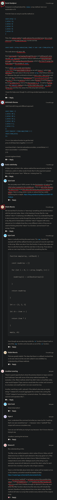

# array methods

    - most important methods 🔥

    - these methods we'll see a lot in reactjs also
        so that's why these methods are really important 
    
    - these methods are applied on the array 
        in order to do a bunch of different things with the array

## difference b/w function & method 

    - function & method both are same but little difference

    eg : of function ✅

        function callMe() {

        }

        - this callMe() function will be called as function 
            because it's stand along function 💡💡
            means on it's on
        - it's not related to any object

    eg : of method ✅

        const myObj = {

            abcd() {
                
            }
        }

        - this abcd() function will be called as method 
            because it's inside of an object & it's related to object also 💡💡

## methods of array 

    - most important 🔥

    -> methods of array 
        - forEach() method 
        - map() method
        - filter() method
        - find() method
        - some() method 
        - every() method
        - reduce() method
        - includes() method

        NOTE : ✅
            - these all methods return a brand new array
                and doesn't do any changes in original array 💡💡
                except forEach() method

## forEach() method 

    - it's just like a normal for loop
        means forEach() method used for iteration 
    - it just used for printing each items of an array 
        & we can do manipulation also with each element 
        but 99.5% times we use forEach() method for printing 💡💡 

    - it takes a callback function as a argument
        & that callback function gets run once 
        for each of the elements which are inside of an array 💡💡

    - and that callback function takes 4 arguments in sequence/order wise 💡💡💡
        - current value/element/item of an array
        - index
        - current array
        - this keyword 
        NOTE : 
            - mostly we use current value as a argument 💡💡
            - and sometimes we need index argument 
                to find index of each element inside an array

    - means forEach() method call a callback function for each element in the array
    - it doesn't understand return keyword + break keyword + continue keyword 
        that's why it doesn't return anything 

    eg : looping through each element of an array by using forEach() method ✅

        const a = [1 , 2 , 3 , 4 , 5]

        a.forEach(number => {
            console.log(number)
        })

    eg : get each current item + current index of each items of an array by using forEach() method ✅ 

        const a = [1 , 2 , 3 , 4 , 5] 

        a.forEach((number , currIndex) => {
            console.log(number + " " + currIndex)
        })

        // output : 1 0
                    2 1
                    3 2
                    4 3
                    5 4

    NOTE : ✅
        - forEach() method , for loop , for in loop , for of loop , while loop & do while loop
            these all doesn't know the return keyword
        - that's why don't use return keyword
            use console.log() with them for printing 💡💡

    eg : modifying/manipulating each item of an array ✅

        const a = [1 , 2 , 3 , 4 , 5] 

        a.forEach(number => {
            console.log(number + 1)
        })

        // output : 2 
                    3
                    4

## map() method 

    - is similar like forEach() method but little bit different

    - it takes a callback function as an argument
        and that callback function will loop through or run once
        for each items of an array 💡💡
    - it knows the return keyword 
        which means we can return the output by using return keyword 💡💡

    - it used to manipulate or to do modification with values/items of an original array
        like performing some type of operation eg : addition , multiply , etc
        and then return a brand new array as a output with that modification/changes 💡💡
    - but map() method doesn't modify or doesn't do any changes in current/original array 💡💡
        

    eg : returning a brand new array with modification by using map() method ✅

        const a = [1 , 2 , 3 , 4 , 5]

        const newA = a.map(number => {
            return number * 2
        }) 

        console.log(a)  // output : [1 , 2 , 3 , 4 , 5]
        console.log(numA) // output : [2 , 4 , 6 , 8 , 10]

    NOTE : checking whether map() method modify our original/current array or not 💡

        eg : 
            const a = [1 , 2 , 3 , 4 , 5]

            a.map(number => {
                return number * 2
            })

            console.log(a)  
            // output : [1 , 2 , 3 , 4 , 5]

        - so here we can see 
            that map() method return a brand new array 💡💡
        - and it doesn't modify the original/current array

## filter() method

    - takes a callback function as an argument 💡💡

    - filter() method used with only condition 💡💡
        if we use without condition then doesn't make any sense

    - return a brand new array if condition is true
        if condition is false then return an empty array 💡💡

    - doen't modify the current/original array 💡💡

    - means it allow us to loop through all each elements
        & filter those elements from an array 
        according to condition 💡💡
    - & if condition is true then put those elements inside a brand new array
        & if condition is false then return -> empty array -> [] 💡💡
        which means falsy value

    eg : returning true from callback function ✅

        const a = [1 , 2 , 3 , 4 , 5]

        const newA = a.filter(number => {
            return true
        })

        console.log(newA)
        // output : [1 , 2 , 3 , 4 , 5]

        - here we directly said that condition is true
            so that's why we got all the element of an array

    eg : returning false from callback function ✅

        const a = [1 , 2 , 3 , 4 , 5]

        const newA = a.filter(number => {
            return true
        })

        console.log(newA)
        // output : []

        - here we directly said that condition is false
            so that's why we got an empty array -> []
            which is a falsy value 💡💡

    eg : using condition inside a callback function of filter() method ✅

        const a = [1 , 2 , 3 , 4 , 5]

        const newA = a.filter(number => {
            return number <=2
        })

        console.log(newA)
        // output : [1 , 2]

        - here we'll get those elements from an array 
            which are true according to condition
        - otherwise we'll get empty array -> []
            if there is no number which are less than and equalto 2

## find() method

    - is like a filter() method
    - but find() method doesn't return a brand new array 💡
        because it return only very first one element not all which are also true  
        according to condition 💡💡
    - if condition is false then return -> undefined (which means falsy value) 💡💡  

    - it takes a callback function as an argument 💡💡
    
    - find() method used with only condition 💡💡
        if we use without condition then doesn't make any sense

    - doesn't modify the current/original array

    eg : of find() method ✅

        const a = [1 , 2 , 3 , 4 , 5]

        const result = a.find(number => {
            return number > 2
        })

        console.log(result)
        // output : 3 

        - here we got 3 -> as a output

        NOTE : why we got just 3 if 4 & 5 value also true ✅

            - because filter() gives all the element
                which are true according to the condition
            - but find() method return only first one element
                which satisfy the condition first out of other element
                
            - means 
                1 > 2 -> that's false then take another element from an array
                2 > 2 -> that's false than go tgo next element
                3 > 2 -> Ok that's true
                
                so return 3 & just stops executing
            - and find() method doesn't matter about element i.e 4 , 5
                which are also greater than 2

            - so find() method just go from start to end
                & return the first one that matches the condition
                and skipped those elements which are also true according to condition
                and stops executing 💡💡💡

    NOTE : when to use find() method & filter() method ✅

        - find() method will return only very first individual/single element 
            from an array if condition is true 💡💡

        - but filter() method will return all those elements in the form of an array
            from that array which are true according to condition 💡💡

        - so find() method is great if we want to
            find only very first individual element from an array according to condition
        - instead of getting all the elements which are true
            according to condition 💡💡💡

## some() method

    - takes a callback function as an argument 

    - works with condition 💡💡
        and return true or false boolean according to condition 💡💡
    - some() method means if even a single element of an array
        matches the condition then return true 💡💡
    - & if there is no element which matches the condition 
        then return false 

    NOTE : ✅
        - some() method doesn't check the other elements
            to satisfy the condition and return true
        - it need only one single element from an array
            to return a true 💡💡💡

    eg : of some() method ✅
        const a = [1 , 2 , 3 , 4 , 5]

        const isTrue = a.some(number => {
            return number > 2
        }) 

        console.log(isTrue)
        // output : true

    eg : of some() method ✅
        const a = [1 , 2 , 3 , 4 , 5]

        const isTrue = a.some(number => {
            return number > 8
        }) 

        console.log(isTrue)
        // output : false

        - here we got false because 
            in array , there is not even a single element
            which can satisfy the condition 💡💡

## every() method

    - it's opposite of some() method 💡💡
    - means every() method needs all the elements should 
        satisfy the condition then output will be -> true 💡💡

    NOTE : ✅ 
        - and even if a single element which doesn't true
            according to condition then output will be -> false 💡💡

    - takes a callback function as an argument
    
    - works with condition

    eg : of every() method ✅

        const a = [1 , 2 , 3 , 4 , 5]

        const isTrue = a.every(number => {
            return number  > 2
        })

        console.log(isTrue)
        // output : false

        - here we got output -> false
        - because only some elements of an array are true according to the condition
            but there is only one element i.e 1
            which is not true according to the condition 💡💡
        - that's why we got false 

    eg : of every() method ✅

        const a = [1 , 2 , 3 , 4 , 5]

        const isTrue = a.every(number => {
            return number  > 0
        })

        console.log(isTrue)
        // output : true

        - output is true
        - because all the elements of an array
            are true according to the condition 💡💡

## reduce() method

    - takes a callback function as an argument

    - that callback function takes atleast 2 argument 💡💡
        which is necessary to define otherwise error comes 
        first - accumulator 
                - which define previous value of an array
                - generally we call first argument as accumulator means collect
                    but we can give any name
        second - currentvalue

    - first argument of callback function of reduce() method 
        means previous value 
    - & second argument means current value 💡💡

    - used to flatten an array 
        means to convert the 3rd or 2nd array into a single value 💡💡 

    - it return a new single value 
        but not inside square bracket notation of an array 💡💡

    NOTE : 
        - we have better methods than reduce() method to flatten an array ✔

    eg : of reduce() method ✅

        const a = [1 , 2 , 3 , 4 , 5]

        const totalSum = a.reduce((sum , number) => {
            return sum + number
        })

        console.log(totalSum)

        // output : 15

        - this code just like we need to find total sum of all elements of an array

    eg : giving a initial/default value to accumulator argument of callback function ✅

        - important example 🔥

        const a = [1 , 2 , 3 , 4 , 5]

        const totalSum = a.reduce((sum , number) => {
            return sum + number
        } , 2)

        console.log(totalSum)

        // output : 17

        - here sum + number means like this
            sum = sum + number 💡💡
        - so previous value will be stored inside sum argument only 💡💡

        - so here we gave 2 -> as a initial/default value to accumulator argument i.e sum 💡💡
        - so before loop through all the elements of an array 💡💡
        - firstly that 2 -> will be stored inside "sum" argument
            then that callback function will loop through once 
            to each elements of an array 💡💡

        - giving a initial/default value to accumulator argument 
            of a callback function of reduce() method
        - will be good choice when we missed to define/give value inside an array 💡💡 

        NOTE : of both accumulator & currentValue arguments ✅ 

            - first argument of callback function of reduce() method i.e accumulator
                has responsibility that take value from second argument
                & add values with next a value & stored inside itself by overwriting
                just like this eg : 
                    sum = sum + currValue 💡💡

            - here "number" 2nd argument of callback function of reduce() method
                has responsibility to take an element 
                from an array again & again till last element 💡💡

    eg : giving 0(zero) as a initial/default value to accumulator argument of callback function ✅

        - important 🔥

        const a = [1 , 2 , 3 , 4 , 5]

        const totalSum = a.reduce((sum , number) => {
            return sum + number
        } , 0)

        console.log(totalSum)

        // output : 15

        - here we gave 0(zero) as a initial/default value to accumulator argument 
            of callback function of reduce() method 💡💡
        - but if we don't give then bydefault will be 0(zero) only
            as a initial/default value to accumulator argument 💡💡

## challenge time 

    ques -> 
        const items = [
            {price : 10} , 
            {price : 20} , 
            {price : 33} , 
            {price : 40} , 
            {price : 42} , 
        ]

    - now find the total sum of these prices

    Ans - 
        
        const totalSum = items.reduce((accumulator , currValue) => {
            return accumulator + currValue.price
        } , 0)

        console.log(totalSum)

    NOTE : don't give a initial/default value to accumulator ✅   

        - if we don't give a initial/default value to accumulator 
            then output will be -> [object Object]20334042
        
        - because the return value of currValue is in object that's why
        - so that's why we need to give a initial/default value to accumulator 

    - reduce() method is good 
        because it is doing both taking & giving total 💡💡
    - otherwise we have to make different function for add
        & then taking values or we need to for loop

## includes() method

    - doesn't take a callback function as an argument 💡

    - takes only one argument which is element of an array
        and checks whether that element exist in that array or not 💡💡

    - if that element exist inside an array then return -> true
        & if not exist then return -> false 💡💡

    eg : of includes() method ✅

        const a = [1 , 2 , 3]

        const isTrue = a.includes(2)

        console.log(result) 
        // output : true

## discussion page

