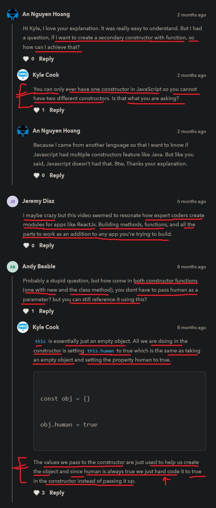

# new & this keywords

    - very important 🔥

    - new & this keywords are mostly used in OOPS 💡

    - we'll learn how they're associated with objects in JS
        to create special types of objects

## creating function which act as an object 

    - if we want to repeatedly create an object that follows 
        a similar format then this example is fine

    eg : 
        function createUser(name , age) {
            return {
                    name : name , 
                    age : age , 
                    human : true
                }
        }

        const user = createUser("Teen" , 12)
        console.log(user)

        // output : {name: 'Teen', age: 12 , human: true}

    - createUser function act as an object
        which takes always a name & a age
        & then return a object -> that has all of these different properties/keys 

    - so every time when we want to create info about User
        over & over again then we can make an object this way using function 💡💡 like above example
    - & that's work 100% fine

    - but we don't make a object like in this way in real world 💡💡

## new keyword 🔥

    -> new 
        - is a keyword 
        - new keyword is used to create an new object/instance of a particular class 
            so that we can access methods & properties of that class 
            through object that we made 💡💡 

    eg : of creating object of a particular class using new keyword ✅ 

        const date = new Date()

        console.log(date)
        // output : Thu Dec 16 2021 15:01:21 GMT+0530 (India Standard Time)

        NOTE : what is Date class and why we called Date() class by using parentheses ✅

            - here Date - is a class 
                & calling Date() class with parentheses means 
                we're calling the constructor function which is defined inside the Date() class
            - so that we can access/use all the methods & properties of Date class  
                + we can also give/pass our own information/arguments 
                inside that parentheses of Date() class if we want to give 💡💡 
            - if we don't call the class by using parentheses then we won't able to 
                call the constructor which is defined in that class + we won't to use 
                methods & properties of that class 💡💡

        NOTE : why we need to use new -> keyword while creating an object of a class ✅
        
            - then we used new -> keyword because we're create a object i.e date of Date() class  
            - and if we don't use new -> keyword
                then we won't able to make a object of a particular class 
                & we also not able to access/use the methods & properties 
                of that class through that object 💡💡
            - new -> keyword is used whenever we want to create a new object of that class 💡💡

            - whenever we create an object using new -> keyword
                then means behind the scene we're calling the constructor function of Date() class
                which is defined inside the Date() class 💡💡
            - & calling Date() class by using parentheses means
                we can pass/give our own information/arguments inside the parentheses of Date() class
                when we want to give + that's also means we're calling the constructor
                of Date() class 💡💡
            
        - now date -> object of Date() class created
            which can access all the methods & properties of Date() class like this 

    eg : accessing properties & methods of Date() class through an object ✅

        const date = new Date()

        console.log(date.getUTCDate())
        console.log(date.getDay())
        console.log(date.getMonth())

        - now there are tons of different methods & properties in Date() class
            that we can access through that date -> object that we created

        - so here date -> is a variable 
            but actually is a object & works like an object 💡💡

        NOTE : best practice (using pascal case while defining class name) ✅

            - giving name to class
                then first letter of a class name should be in capital always 
            - because it's a best practice 
            - so always use pascal casing for giving class name 

## creating a custom constructor function outside the class to use the new -> keyword 🔥

    - here we're creating a constructor function without/outside the class 💡

    STEP 1 : defining a constructor function without/outside the class ✅

        function User() {

        }

    NOTE : first letter of the constructor function without a class should be in capital (best practice) ✅

        - important note 🔥

        - whenever we define/create a constructor outside the class
            then we need to give function -> keyword 💡💡
        - and first letter of name of the constructor function should be in capital letter
            because it's a constructor means it's act as a class 💡💡
            & it's a best practice also 💡💡

    STEP 2 : giving parameters to the constructor function ✅

        function User(name , age) {
            
        }

        - here name , age are the two parameters of the constructor function 
            outside/without the class 

        - here User -> is a constructor function 
            means it constructs/create a new object of a specified type 
            
        NOTE : defining the constructor function inside & outside/without the class ✅

            - important note 🔥

            - whenever we define a constructor function inside the class 📝
                - then inside the class we have to define only one constructor 
                  means one class has only one constructor always 
                  we shouldn't never create multiple constructor function inside the class 💡💡

                - we never give function keyword + constructor name 
                    when we create a constructor function inside the class
                    we only give constructor -> word as a name all in capital letters 
                    of the constructor function 💡💡

            - whenever we define a constructor function outside/without the class 📝
                - then we have to give function keyword + constructor function name also
                    but first letter of the constructor function name should in capital
                    because of best practices + it will act as a class in this situation 💡💡

        - you may think that we'll do this in next STEP like this  

            function User(name , age) {
                return {
                    name : name , 
                    age : age , 
                    human : true
                }
            }

            const user = new User("Teen" , 12) // here new -> keyword used 
            // OR
            const user = User("Teen" , 12) // here new -> keyword not used

            console.log(user)
            // output { name : name , age : age , human : true }

            - now technically this is will work

            NOTE : ✅
                - here we also didn't use new -> keyword then we'll get output 
                    because here we didn't use this -> keyword 
                    which needs reference of the object that we created 💡💡

                - but behind the scene when we create a constructor inside the class
                    then that constructor needs the reference of the object that we'll create
                    then there we must need new -> keyword
                - otherwise we'll get error & not able to use methods & properties of that class
                    because inside a constructor of the class
                    properties & methods define with this keyword 💡💡

        - but this is not we generally we return things from the constructor
            whether it's define inside the class or outside/without the class 💡
        - so here comes this -> keyword concept 

## this -> keyword 🔥

    - this -> keyword references to the current object 💡💡

    NOTE : when to use this -> keyword ✅ 

        - important note 🔥

        - whether a constructor is created/define inside the class or outside/without the class
            when we're inside the constructor function
            then to access properties & methods then we use this -> keyword
            & this -> keyword refer to that current object 💡💡

        - and when we create our own object 
            then we created a function inside that object
            and if we want to access those key/properties & methods 
            inside the object only then we use this -> keyword 💡💡

        - but to access those methods & properties of a class
            which are defined inside the constructor 
            then we use that object 💡💡

    STEP 3 : using this -> keyword inside the constructor function ✅

        function User(name , age) {
            this = {}
            return this 
        }

        - here we set the this -> keyword as a variable 
            & it's value -> empty object
        - & after that we return the this -> keyword

        - & b/w this = {} & return this 
            we'll our code & accessing properties & methods 
            through this -> keyword 💡💡💡

    STEP 4 : using this -> keyword inside the constructor class ✅

        function User(name , age) {
            this = {}
            this.name = name 
            this.age = age 
            this.human = true
            return this
        }

        const user = new User("Teen" , 12)

        console.log(user)
        // output : User {name: 'Teen', age: 12, human: true}

        NOTE : ✅ 

            - in previous example we're using & not using new -> keyword 
                but still getting output 
            - but here we used new -> keyword
                because if we don't use the new -> keyword 
                then that this -> keyword will not able relate that 
                which object i need to referencing & due to this we'll get error 💡💡
            - that's why new -> keyword is important define
                when we're creating a new object of a particular class 💡💡

        NOTE : 
            - here this = {} & return this 
                these both lines we don't need to write
                because behind the scene those two lines 
                will be written bydefault/automatically 💡💡

    STEP 5 : complete example - of the constructor class function outside/without the class ✅

        function User(name , age) {
            this.name = name 
            this.age = age 
            this.human = true
        }

        const user = new User("Teen" , 12)

        console.log(user)
        // output : User {name: 'Teen', age: 12, human: true}

        - this is the actual way we define the constructor class function 
            outside/without the class
            
## Note - difference b/w normal function as a constructor & constructor class function with this & new keywords  

    - here we'll see that difference b/w 
        normal function which act as a constructor
                        and
        actual constructor class function with this & new keywords 

    NOTE : ✔

        - here we're saying constructor class function
            because when we create constructor outside/without a class
            then first letter of the constructor name will be capital
            & also first of the class name in capital letter 
        - and why function said because that constructor is created outside the class    
            that's why 

    eg : normal function as a constructor ✅

        function createUser(name , age) {
            return {name : name , age : age , human : true}
        }

        const userFunc = createUser("Teen" , 12)

        console.log(userFunc)

        - here we created the object of createUser constructor class function 
            without new keyword also 💡

    eg : actual constructor class function with this & new -> keywords ✅

        function User(name , age) {
            this.name = name 
            this.age = age 
            this.human = true
        }

        const user = new User("Teen" , 12)

        console.log(user)  

        - here we used new -> keyword to create a object of that 
            User constructor class function 💡

    - both will give output almost same & work exactly same

        1 - // output : {name: 'Teen', age: 12, human: true} 
        2 - // output : User {name: 'Teen', age: 12, human: true}

        - the only difference is in output
            means both give different output

        - in first output 
            - we're not able to understand that output object
                whom belongs to which object

        - in second output 
            - that showing that output object is related to User class or constructor class function
            - and easy to read also 

## class 

    - now in JS , has class concept
        that we'll not go in deep
    - because this topic is not very important 
        & we almost never going to use in our project also

    - but it's kind of vital to know

    - Now we can also write a constructor inside a class also 💡💡
    - so when we use a class then things become clear to work
        especially when we're dealing with functions

    NOTE : ✅

        - a class has only one constructor only not multiple
            yeah we can make multiple functions inside the class 💡💡💡 

    said by kyle
    ------------
        - he didn't find himself writing out constructor function 
            very much at all 💡

## example - of class 

    STEP 1 : creating a class ✅

        class User {

        } 

        - here class -> is a keyword 
            & User -> is a class name 

        NOTE : best practices ✅
            - always first letter of class name must be capital
                because of best practices 💡

            - inside curly braces we write all the code
                but firstly we define the constructor function 
                due to best practices 💡

    STEP 2 : creating a constructor inside the class ✅

        class User {

            constructor(name , age) {
                this.name = name
                this.age = age
                this.human = true
            }
        }

        NOTE : defining a constructor outside & inside the class ✅
        
            - here when we define constructor function inside the class
                then we define it without function keyword + 
                constructor function name will be constructor only 
                otherwise if we give other name then error come 💡💡

            - but if we define construction function outside/without the class
                then we have to define the function keyword + we can give any name
                but first letter of it should be capital because then 
                it'll act as a class only 💡💡

        - here that constructor which is defined inside the class is same 
            as when we define constructor outside the class like this  
            but only difference is of syntax

            function User(name , age) {
                this.name = name
                this.age = age
                this.human = true
            }

        
        const user = new User("Teen" , 12)

        console.log(user)
        // output : User {name : "Teen" , age : 12 , human : true}

        - so we can use constructor either 
            - by creating a constructor inside the class 
            - or by creating a constructor class function outside/without the class 
                with new & this keyword 💡💡
        - both will give the same output with class name ✔

        - but don't define function which act as a constructor
            which used without new & this keyword 💡💡
            because that's not a general way we create constructor 

## example - of creating a function inside the class 

    eg : 
        
        class User {

            constructor(name , age) {
                this.name = name
                this.age = age
                this.human = true
            }

            printName() {
                console.log(this.name)
            }
        }

        const user = new User("Teen" , 12) // first object
        const user2 = new User("Golang" , 12) // second object
        user.printName()
        // output : Teen

        - here this -> keyword refer to current object means
            objects that we created i.e user & user2 💡

        NOTE : ✅

            - after update in JS , 
                we don't need to define function keyword inside the object 
                & inside the class also
            
            - inside object & class also
                whenever we want to access the keys/properties & methods 
                then use this -> keyword 
            - but outside the class & object also
                if we want to access the keys/properties & methods
                then use object name

## said by kyle ✅

    - this is not we're going to write very much 
        & kyl also don't find himself doing this very much at all

    - most of the time & in general 
        we're gonna use new -> keyword 
        to create an object like this 
        const date = new Date()
    - & we use this -> keyword inside when we create our object 💡💡

## ------------ Extra notes ------------

    - this -> keyword is kindof like a pointer in c , c++ but not completely 💡💡💡 
    - https://blog.tusharcodes.tech/5-rules-to-master-this-in-javascript

## discussion page

