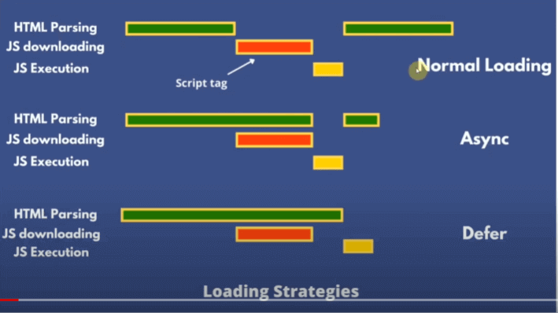

# async & defer

    - these async & defer are attributes of script tag 💡
    - these two are loading strategies 💡

    - we'll talk about two new different ways to load JS scripts on the browser

# three ways to load the JS scripts i.e ✅

    - first is - normal loading 
    - second is - async (means asynchronously) 
    - third is - defer (means delayed or keep on hold or in waiting)

## about async & defer ✅

    - in order to understand these two ways 
        & different b/w these two & how these two loadings work 💡
    - we first need to understand 
        how the HTML page is parsed in normal loading
        when we load HTML page on a web browser 💡💡

## How is html parsed in normal loading without JS scripts ✅

```html
<!DOCTYPE html>
<html lang="en">
<head>
    <meta charset="UTF-8">
    <meta http-equiv="X-UA-Compatible" content="IE=edge">
    <meta name="viewport" content="width=device-width, initial-scale=1.0">
    <title>Document</title>
</head>
<body>
    
    <h1>Title</h1>
    <p>Lorem ipsum dolor sit amet consectetur adipisicing elit.</p>
</body>
</html>
```

    - so when we open up a webpage on our web browser
    - then the parser will start downloading the html page
    - & once the HTML is downloaded then 
        parser starts parsing the html page
        from top till the bottom
    - means the parser will start parsing the HTML
        from html start tag till html end tag  
    
    - so HTML parsing will started from html start tag
        so during this process when the parser reach at the point 
        where it saw that img tag 💡💡
    - then image will download/load in the background
        but here the parser will continue with parsing of HTML
        till very end of the html end tag 💡💡
    - & the movement when the HTML parsing is completely parsed & 
        when that image complete with it's downloading
        then that image will be popping/coming in the browser 💡💡

    - parsing -> means here HTML is converted into/in DOM form 💡💡

    - but with JS script tag files , 
        the parser doing parsing the HTML bit differently 
        in normal loading

## HTML parsing with - normal loading with script tag 🔥

    - in normal loading with script tag , 
        the parser do parsing the HTML is little bit different 
        than doing parsing HTML when we don't have any script tag 💡
    
    eg : putting two script tag inside head tag ✅

  ```html
  <!DOCTYPE html>
  <html lang="en">
  <head>
      <meta charset="UTF-8">
      <meta http-equiv="X-UA-Compatible" content="IE=edge">
      <meta name="viewport" content="width=device-width, initial-scale=1.0">
      <title>Document</title>
      <script src="./app1.js"></script>
      <script src="./app2.js"></script>
  </head>
  <body>
      
      <h1>Title</h1>
      <p>Lorem ipsum dolor sit amet consectetur adipisicing elit.</p>
  </body>
  </html>
  ```

    - so here parsing will start from html start tag
        then the movement when the parser saw script tag inside the head tag
        or before end of the body tag
        then the parser will stop the HTML parsing  💡💡
    - and then the first script tag will start downloading/loading & then executed
        & then the parser will go to the next script tag
    - and that second script tag also will be download & then executed 💡💡

    NOTE : what happen when parsing stopped at the script tag ✅
        - the parser will not move to the second script tag
            until first script didn't downloaded & executed completely 💡💡

    - & then the parser will start continue/resume the HTML parsing again
        & the movement parser saw a img element
    - then parser will not stop the HTML parsing 
        but that image will be downloaded in the background 💡💡
    - & after HTML parsing gets completed till the end
        then that image will be executed/popping/shown on the browser

    NOTE : when the parser stop the HTML parsing & when not - in normal loading ✅

        - the parser loads up the HTML document on the browser completely
            then images will start popping/coming randomly in the HTML document
            after finishing downloading of the images in the background 💡💡

        -> parsing scenario with images ✅ 

            - images will not shown until the parser didn't finish 
                it's HTML parsing completely 💡💡

        -> parsing scenario with the script tag ✅

            - but when parser saw the script tag inside the head tag
                then parser will stop the HTML parsing at that point only
            - & that script tag will start downloading & executed 💡💡
                then parser will start continue/resume the HTML parsing 💡💡

            - but the parser will not start resume/continue the HTML parsing 
                until that script tag didn't complete downloading & complete executed 💡💡 

    NOTE : of normal loading ✅

        - but in normal loading , 
            those scripts tag run immediately in the order , in the way we define them 💡💡

    - here in normal loading , 
        we have a problem i.e blocking nature of normal loading 💡
        so here comes async & await 💡  

## HTML parsing with - async loading with async attribute of script tag 🔥

  ```html
  <!DOCTYPE html>
  <html lang="en">
  <head>
      <meta charset="UTF-8">
      <meta http-equiv="X-UA-Compatible" content="IE=edge">
      <meta name="viewport" content="width=device-width, initial-scale=1.0">
      <title>Document</title>
      <script src="./app1.js" async></script>
  </head>
  <body>
      
      <h1>Title</h1>
      <p>Lorem ipsum dolor sit amet consectetur adipisicing elit.</p>
  </body>
  </html>
  ```

    - now here we added async attribute in the first script tag

    - so here the parser will start HTML parsing 
        & then the parser going to hit a point where it gets 
            that script tag with async attribute 💡💡
    - but here our parsing will not stop
        & that async script tag will be downloaded in the background 💡💡

        NOTE : difference b/w image & async scrip tag scenario ✅
            
            - this async script tag will be downloaded in the background 
                just like happen with image 
            - but still here is a difference
                because images are popping/shown on the HTML page
                after when parsing completely done & before that image will not be shown 💡💡

            - & let's see the difference of async script tag 

    - & the parse is still parsing the HTML while
        that async script tag is begin downloaded
    - but as soon as that async script tag is downloaded 
        then the parser will stop the HTML parsing 💡💡💡
        & that async script tag will be executed 
    - & after that the parser will continue/resume the HTML parsing

        NOTE : for script tag with async attribute ✅

            - here async script tag can be executed/run at anytime
                means there is no guarantee of async script tag 💡💡
                that when it will run because that async script tag
                is asynchronously executed 💡💡
            - async script tag can run in any order 
                means as soon as async script tag done downloading
                it can run before any normal script tag or after any normal script also 💡💡
                than normal script tag without async or defer attribute 💡💡

## HTML parsing with - defer loading with defer attribute of script tag 🔥

  ```html
  <!DOCTYPE html>
  <html lang="en">
  <head>
      <meta charset="UTF-8">
      <meta http-equiv="X-UA-Compatible" content="IE=edge">
      <meta name="viewport" content="width=device-width, initial-scale=1.0">
      <title>Document</title>
      <script src="./app1.js" defer></script>
  </head>
  <body>
      
      <h1>Title</h1>
      <p>Lorem ipsum dolor sit amet consectetur adipisicing elit.</p>
  </body>
  </html>
  ```

    - when we use defer attribute inside the script tag

    - so then the parse will start the HTML parsing 
        & the movement the parser reach to the defer script tag inside head tag 💡💡
    - then the parser will not stop the parsing
        but that defer script tag will be downloaded in the background 💡💡💡

    - so right now parser doing it's parsing 
        & as soon as the defer script tag downloaded 💡💡
    - then defer script tag will not executed immediately like async script tag do
    - but that defer script will wait until
        the parser finishes the HTML document parsing completely 💡💡💡

    - so when the parser done it's parsing completely 
        then that defer script tag will be executed 💡💡💡

    NOTE : async Vs defer attributes of script tag ✅

        -> async attribute
            - if script tag has async attribute 
                then that async script tag will be downloaded
                in the background asynchronously
            - & then that async script tag will be executed/run
                any time as soon as it's downloaded completely 💡💡💡

        -> defer attribute
            - if script tag has defer attribute 
                then that defer script tag will be downloaded in the background 
            - & then that defer script tag only will be executed/run
                when the HTML parsing done completely 💡💡💡
                means at the end of the parsing HTML document
            - but during HTML parsing ,
                if that defer script tag done with downloading
                then it'll wait for it's execution till HTML parsing is done 💡💡💡

    NOTE : advantage with defer attribute on the script file inside the head tag ✅ 

        - important note 🔥

        - if all the script tag files have defer attribute
            then those all defer script files will be executed in order wise
            in the way we defined them 💡💡💡

        - but if we define the normal script file without async or defer attribute
            before the ending body tag
        - then that normal script file will download when parsing comes to end
          & then that normal script file will executed

        - but if we define a script file with defer attribute inside head tag
            then that defer script file will download in the background
            & after downloading done then it'll wait
        - to for the parsing is finished then that defer script file will executed 
        - so here our time gets saved + defer script file start downloading in the background 💡💡💡
            
## diagram of normal loading VS async loading VS defer loading ✅


```
- inside first diagram : we putted script tag file inside <head> tag without using async or defer attribute
```


## example - of normal loading (putting scripts tag inside the head tag) ✅


    - here we can see that in normal loading , 
        all scripts are executed in order wise
        in the way we defined them


    - & here the when we move/wrote that defer.js script 
        before async.js file then still all of those scripts 
        are executed in order wise only
    
    - so in normal loading , all the scripts 
        are executed one by one in the way we defined them 💡💡💡

    - the parser will stop the HTML document parsing 
        at the point where we define the normal script tag
    - & first script tag will be downloaded not in background
        & it's executed
    - & then parser move to the next script 
        so that script tag also downloaded & executed
    - & same thing will happen with all the scripts
    - after all the scripts executed 
        then the parser will start the HTML document parsing 💡💡💡 

    - that's why all the scripts are executed in the order wise

## example - of async loading (putting scripts tag inside the head tag) ✅

    - here we'll put the async attribute on async.js script file
        & move that async.js script before the defer.js script file 💡💡
        like this 


    - here async attribute of script tag 
        means that script file i.e async.js 
        will executed asynchronously 💡💡

    - here we can see that async.js script file with async attribute 
        executed after the defer.js file without defer attribute 
    - because async.js script file is asynchronous

    - & the we refresh the html page couple times
        then result will be different than previous one
        of async script file
    - like go "no throttling" tab of the network tab of chrome dev tools
        & choose the "fast 3G" option
        & then refresh the html page

    - now all the script files including async script file
        takes more time to load like this

 

    - & when we refresh the html page 
        couple of times 💡💡
    - then async script file will be executed
        maybe before other script files or maybe after all the script files
        or maybe in the middle of all the script files
    - because async script file is executed asynchronously
        means it can be run anytime as soon as async script file is done with downloading 💡💡💡


    - now if we change to online/no throttling option of network tab
        then refresh the html page
        then output is 

 

    - then we'll see that defer.js script file is executed
        executed before async attribute script file 💡

    NOTE : why defer.js file is executed before the async.js script file with async attribute ✅

        - important note 🔥
        
        - because async.js script file with async attribute 
            will download asynchronously in the background
            but parsing will not stop 💡💡
        - so the parser move to the next script file i.e defer.js which is without defer attribute
            & the defer.js script file also downloaded 💡💡
        - & then movement the HTML document parsing gets completed 
            then that defer.js was executed 
            before async script file complete it's downloading 💡💡

        - that's why defer.js executed/ran first 
            & than async.js file with async attribute gets executed

        - & then normal.js script file is downloaded & executed

    - so here we can see inconsistency of executing all the script files
        due to async script file 💡💡💡
    - & due to inconsistency of async script file with async attribute
        is actually when it's actually going to run 💡💡💡 

    said by kyle
    ------------

        - generally he don't use the async attribute inside the script tag
            
        - because we don't know if that async script file with async attribute
            with other script files which are normal as well as defer script file with defer attribute
        - then we don't able to know that async script fille will execute first 
            or defer script file will execute first 
            or vice versa
        - & things get even more complex when we put multiple script files
        - so async script file with async attribute will execute
            based on internet download speed 💡💡💡💡

        - so that async script file with async attribute 
            will be executed anytime/randomly as soon as it's finish it's downloading 💡💡💡

        - that's why most of time 
            we use defer attribute on our each script tag 💡💡💡
                - because when the parse reach at the defer script file with defer attribute 
                    that defer script file will download in the background
                    but the HTML document parsing will not stop
                - & during parsing , as soon as defer script file finished it's downloading
                    then that defer script file will not be executed in the middle of parsing process 
                - because that defer script file will wait
                    till after HTML parsing is done
                - so when the HTML document parsing is done
                    then that defer script file is executed 💡💡💡  
                // OR 
            we use defer attribute one our a script tag
                then that defer script file will be downloaded in the background
                but that defer script file won't run 
                until after everything is parsed of HTML document 💡💡

## example - of defer loading (putting scripts tag inside the head tag) ✅

    - when we put/use defer attribute on defer.js script tag
        & async attribute on async.js script tag 💡
        like this


    
    - here we can see that
        normal.js script file is executed first 
        because normal.js is downloaded before the async.js script file with async attribute 💡💡
    - & then async.js script file is executed 
        because async script file is downloaded in the background
        & when the parsing is finished then async.js file is executed 💡💡
    - & finally defer.js script file is executed
        after when parsing is finished 💡💡

    NOTE : defer script file with defer attribute ✅

        - when we refresh the page couple of times
            then still always defer script file 
            will going to be executed at the last only 💡💡

    - inside normal.js script file if we write this 
        console.log(document.body) 💡💡💡 
        then refresh the page 
        then output will be -> null


    
    - here we got output -> null

    NOTE : why we got output -> null ✅

        - because when the parser came to normal.js script file 
            then the parser will stop the HTML parsing 
            & normal.js started downloading
        - & in normal.js we're trying to access the body element
            but parser didn't parsed the body tag yet
        - that's why in DOM we don't have any body tag 
    
    - but when we define this line
        console.log(document.body)
        inside the defer.js script file 💡💡💡
    - then we'll get output without any error like this 


    NOTE : access the body element inside defer.js script file with defer attribute ✅

        - here we got output without any error when we access the body element
            inside defer.js script file with defer attribute

        - because when the parser saw the defer.js script file with defer attribute
            then that defer script file will download in the background
        - & the parser will not stop the parsing
        - & during the parsing as soon as the defer script file done with downloading
            then it'll not execute suddenly 
            means it'll wait until the parsing of the HTML done
        - so when then parsing of the HTML done
            then the defer script file will be executed 💡💡

        
    - if we want to access/refer the body element 
        if we define inside the normal.js then
        put script tag of normal.js file 
        before closing the body tag 💡💡
        like this 


    NOTE : one disadvantage of putting script tag before closing the body tag ✅

        - important note 🔥

        - the one disadvantage of putting script tag before closing the body tag
            is that script file will download after everything is parsed
        - & then that script file will be executed

        - but when we define script tag with defer attribute inside the head tag 
            during parsing , that defer script tag will be downloaded in the background
        - & when parsing is finished then the defer script tag will start executing 💡💡💡
        - due to time gets saved 

        - that's why always use defer attribute with script tag 
            & define script tag with defer attribute inside the head tag 💡💡💡
        - in terms of loading the scripts

    NOTE : advantage of using defer attribute with the script file inside the head tag ✅ 

        - important note 🔥

        - if all the script tag files have defer attribute
            then those all defer script files will be executed in order wise
            in the way we defined them 💡💡💡
            like this 


        - here we can see that all the defer script files 
            executed in the order wise
            as we're getting in normal loading 💡💡

## said by kyle 🔥

    - always recommended use defer attribute on script tag file inside head tag 🔥
        when we're loading the script file 💡💡
    - don't put those defer script files before body element ends 
        put inside the head tag only 💡💡
    - due to this we'll get quickest download speed 💡💡

    NOTE : do's & don'ts ✅

        - also make sure that those defer script files shouldn't be executed too early
        - those defer script files should be executed in the order 💡💡
            that we're trying get output 

        - probably don't ever use async attribute on script file inside head tag 💡💡
            & try to avoid normal loading 💡💡💡

## code of kyle files ✅

    - these code will give the output with milliseconds time 
        that we're getting 💡

code of index.html file
```html
<!DOCTYPE html>
<html lang="en">
<head>
    <script src="logging.js"></script>
    <title>Document</title>
    <script src="./async.js" defer></script>
    <script src="./normal.js" defer></script>
    <script src="./defer.js" defer></script>
</head>
<body>
    
</body>
</html> 
```
code of logging.js file
```javascript
const startTime = new Date() 

logWithTime("start html parse")

window.addEventListener('load' , () => {
    logWithTime("Document Rendered")
})

function logWithTime(message) {
    console.log(`${new Date() - startTime} ms - ${message}`)
}
```

code of async.js file
```javascript
logWithTime("async executing")
```
code of defer.js file
```javascript
logWithTime("defer executing")
```
code of normal.js file
```javascript
logWithTime("document Rendered")
```
## ----------------- Extra notes from YT videos -------------------

## Extra Notes - of async VS defer 

- these notes took from these YT videos
  - https://www.youtube.com/watch?v=2kENBAMsVxs&ab_channel=CodeWithKashi 👍
  - https://www.youtube.com/watch?v=GoEBQCp2Nzg&ab_channel=DevDreamer


## Notes - of async & defer (first YT video)

### example 1 - normal loading 🔥

    STEP 1 : 

html code
```html
<!DOCTYPE html>
<html lang="en">
<head>
    <title>async VS defer attributes of scrip tag</title>
    <script src="./normal1.js"></script>
    <script src="./normal2.js"></script>
</head>
<body>
    <h1>Normal loading</h1>
    <p>Lorem ipsum dolor sit amet consectetur adipisicing elit.</p>
</body>
```
js code of normal.js script file
```javascript
let element = document.querySelector("head")
console.log("first JS file loaded")
console.log(element)
```
js code of normal2.js script file
```javascript
console.log("second JS file loaded")
console.log(element)
```

    - here we're accessing the "element" variable inside 2nd JS file
        which is initialized/defined inside 1st JS file 
        not initialized inside 2nd JS file 💡💡

    - so here that head tag will be printed as a output in normal loading 
        even if we're accessing the head tag inside normal2.js
        without selecting/initializing the head tag inside normal2.js

    - because in normal loading , in head tag 
        we defined two script files
    - so always HTML parsing start from top to till very bottom 💡💡
        so when parsing starts from html tag then came inside head tag 
        then the parser saw first script tag then 
    - the parser will stop the HTML document parsing 
        & that first script file will start to download (not in background) & then executed 💡💡
    - here if first script file doesn't download & executed 
        then the parser will move to second script file will not start to download/load 💡💡
        if first script file complete it's downloading & executed 
        then second script file will start to download/load & executed otherwise not 💡💡

    - so when first script file gets downloaded/loaded & executed
        means whatever we code wrote will be executed 
        //OR 
        means we got our "element" variable will be initialized & executed with other code also
        of first script file 💡💡
    - then second script file will be downloaded/loaded & executed
        means that "element" variable will be printed 💡💡
    - then the parser will resume it's HTML parsing & 
        & body will parsed & so on till the end of the HTML document 💡

    NOTE : blocking nature problem in normal loading ✅

        - so the problem with normal loading is blocking nature 💡💡
        - means HTML parsing starts from html tag till title tag
            then when parsing saw script tag then 
        - parsing will stop till both the script tag loaded/downloaded & executed 💡💡
        - so when both script tag download/loaded & executed step by step
            then html parsing will start 💡💡

    - so to overcome this blocking nature of normal loading 
        we have two attribute of script tag i.e 
        async & defer 💡💡
    
## difference b/w normal loading VS async VS defer 🔥



    -> Normal loading ✅

        - so in normal loading , HTML document parsing started
            and the parser saw a script tag file inside head tag
        - so here at this point parser will stop
            until that script tag file doesn't finish it's downloading & executed 💡💡
        - so red box -> shows that each script files is downloaded 💡💡
            & yellow box -> shows that each script files executed 💡💡
        - then our parser started parsing the HTML document

        NOTE : for the parser ✅
            - here the parser will stop & doesn't start parsing 
                until those all the script files 
                didn't downloaded/loaded & executed themselves completely 💡💡

        NOTE : two problem with normal loading 🔥

            -> blocking nature comes if we define our script files inside head element ✅

                - here normal loading created a problem for the parser 
                    i.e it's blocking nature when we define script files inside head element 💡💡💡
                - because in normal loading case , 
                    if we define our script files inside head element
                    then what if we're access/referencing that element inside our script file
                    which is not parsed/rendered yet by the parser 💡💡💡
                - then we'll get null -> as a output 💡💡

                - so we have classic/traditional fix is putting 
                    those scripts before body element ends  

            -> defining script file before editing body element ✅

                - in normal loading , if we define script files 
                    before ending of the body element , then
                    due to this we can refer/use that element inside the script file
                - & as a output -> we'll get that element
                    because whole the HTML document is parsed
                    
                - but here doing this way also give a problem 
                    that script file will not be blocked by the parser
                    until after our html is fully loaded 💡💡
                - & our times will be wasted because whole html document is parsed 
                    then that script file will start download & then executed 💡💡  

            - so here we have a problem on both the side in normal loading 
                whether we're putting that script file inside the head element
                or before body element ends 💡💡

            - so here comes async & defer attribute to solve this problem 💡

        eg : of normal loading 🔥

            - so if HTML parser is doing paring , then if we want a particular element 
                inside the JS file like 
            - we need head element inside that script file
                then we can easily access/refer without any error 
                because head tag is already parsed

            - but what if we want footer element then 
                we can't access the footer element 
            - & if we try to access/refer footer element inside the script file
                then we'll get an error or null 💡💡💡

            - because right now footer element is at the end of html document
                means the HTML parser doesn't reach at the footer element
                means footer element is not available right now

    -> async loading ✅

        - in this async loading , the html parsing is going on 
            & when the parser saw the script file
        - then that script file will download/load parallelly in the background
            but parsing will not stop ,
        - means async script file download asynchronously in the background parallelly
            with the parser but parser will not stop the parsing 💡💡

        - but the movement that async script file is completely downloaded/loaded   
            then the parser will stop the html parsing 
            & that async script file will start executed 💡💡
        - here that async script file doesn't care about 
            where the parser itself stopped the HTML parsing 

        - & when the execution of the async script file over/done completely
            then the parser will start continue/resume parsing  
            from where the parser was stopped 💡💡

        - here async script file can be load in anytime & in random order 💡💡💡
            doesn't matter which script file we defined first or second or last , etc ..

        NOTE : when to use async attribute on script file inside head element ✅

            - important note 🔥

            - use async attribute on script file inside head element
                when two or more script file didn't referencing/rely on each other to work
                because async attribute doesn't care about the order of all script files 💡💡💡
            - good use case of async attribute is -> analysis tool 💡
                eg : google analytics , etc ..

        eg : of async loading 🔥

            - in async loading , 
                maybe we'll get that footer element & maybe not
                because of asynchronous execution of that async script file

            - means in the async loading , 
                might we'll get that thing or might be not 
            - if we don't get then we'll get a error as a output

            - so we can't take guarantee that we'll get that thing or not
                in async loading

    -> defer loading ✅

        - defer loading is similar like async loading little bit  
            but the difference is this 

        - in defer loading , 
            the execution of the script tag will start at the end
            so that html parsing is completed parsed 💡💡

        - means html parsing starts & 
            then the movement the parser saw the script tag file inside head tag 
        - then the parser will not stop the HTML parsing  
            but that defer script file will start downloading/loading in the background 
            parllelly with the parser 💡💡

        - but the when the movement that defer script file complete it's downloading 
            then it'll not execute
            means that defer script file will execute then the html parsing will over 💡💡

        - all the defer script files executed in the order wise 
            in the way we define the defer script file 💡💡💡
     
        eg : of defer loading 🔥 

            - in defer loading , we can take guarantee of when that defer script file will execute
                because our html parsing is completed first then that script file will be executed 💡💡

            - so whether that footer element comes anywhere , we'll get that footer element 💡💡
                because that defer script file will be executed 
                after when the parser parse the HTML Document completely 100% 💡💡

## example - of normal script (normal loading) ✅

    html code
    ----------
    <!DOCTYPE html>
    <html lang="en">
    <head>
        <title>async VS defer attributes of scrip tag</title>
        <script src="./normal1.js"></script>
        <script src="./normal2.js"></script>
    </head>
    <body>
        <h1>Normal loading</h1>
        <p>Lorem ipsum dolor sit amet consectetur adipisicing elit.</p>
    </body>


    js code of normal.js script file
    --------------------------------
    let element = document.querySelector("head")
    console.log("first JS file loaded")
    console.log(element)

    js code of normal2.js script file
    ---------------------------------
    console.log("second JS file loaded")
    console.log(element)

    // output --+
                | 
                V


    - so here we all the normal script files 
        are defined inside the head element
    - & all the normal script files are executed 
        in the order wise in normal loading

    - so in normal loading we have a problem of blocking nature for the parser

## example - of async script (async loading) ✅

    html code
    ----------
    <!DOCTYPE html>
    <html lang="en">
    <head>
        <title>async VS defer attributes of scrip tag</title>
        <script src="./normal1.js" async></script>
        <script src="./normal2.js"></script>
    </head>
    <body>
        <h1>Normal loading</h1>
        <p>Lorem ipsum dolor sit amet consectetur adipisicing elit.</p>
    </body>


    js code of normal.js script file
    --------------------------------
    let element = document.querySelector("head")
    console.log("first JS file loaded")
    console.log(element)

    js code of normal2.js script file
    ---------------------------------
    console.log("second JS file loaded")
    console.log(element)

    NOTE : of async script file 🔥

        - here we put async attribute on only first script file
            & second script file will be loaded normally 
            means second script file might be execute first than first script file 💡💡
        - & due to this we'll get error because we're accessing the head element 
            before selecting/defining/initializing the head element inside the second script file 💡
        - so we can't take guarantee of async script file
            because it might be executed first or last or in the middle
            or maybe we'll get an error or null 💡💡💡

    // output --+
                | 
                V


    - but if we refresh the html page couple of times
        then any point we'll get an error like this 💡


    
    - so here second normal script file is executed first 
        than first async script file

    - & in second normal script file we try to access/refer the head element
        we got error that -> element variable is not defined 💡💡
    - because "element" variable is defined in the first async script file
    - so this is the disadvantage of async attribute on script file


## example - of defer script (defer loading) ✅

    html code
    ----------
    <!DOCTYPE html>
    <html lang="en">
    <head>
        <title>async VS defer attributes of scrip tag</title>
        <script src="./normal1.js" defer></script>
        <script src="./normal2.js"></script>
    </head>
    <body>
        <h1>Normal loading</h1>
        <p>Lorem ipsum dolor sit amet consectetur adipisicing elit.</p>
    </body>


    js code of normal.js script file
    --------------------------------
    let element = document.querySelector("head")
    console.log("first JS file loaded")
    console.log(element)

    js code of normal2.js script file
    ---------------------------------
    console.log("second JS file loaded")
    console.log(element)

    NOTE : of defer script file 🔥

        - here we put defer attribute on only first script file
            & second script file will be loaded normally 
        - means first defer script file will be executed only 
            when the HTML document parsing is completed 💡💡
            but second script file will be executed first than first defer script file 💡💡
        - & due to this we'll get error because we're accessing the head element 
            before selecting/defining/initializing the head element inside the second script file 💡
        - so we can't take guarantee of async script file
            because it might be executed first or last or in the middle
            or maybe we'll get an error or null 💡💡💡
    
    // output --+
                | 
                V


    - here we'll get error definitely in second normal script file
    - because first defer script file is executed 
        after when the html parsing is completed 💡💡

    NOTE : of defer attribute on each script files ✅

        - now if we put defer attribute on both script files inside head element
            then we'll get output without any error 
        - because both the defer script files will be download in the background 
            but those both defer script files will be executed   
            after when the html parsing is completed 💡💡

        - & in defer attribute there is no blocking nature
            due to this the html parsing is done easily 💡💡

## discussion page


