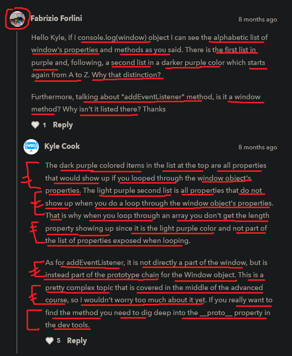

# window 

    - important 🔥

    - is the main container
    - it's a global object
        means it's global object for the entire browser 💡💡
    - it's have many properties & methods 

    - it's a BOM (browser object model)
    
    - if any operations related to entire browser window
        can be a part of window object
    - all the things like objects , methods , properties , etc..
        if we use them in code & if they are the part of window object 
        then we don't refer the window object before using them 💡💡💡

## example - of window (global object) 

    eg : printing window -> object 

        console.log(window)

        // output : Window {window: Window, self: Window, 
                    document: document, name: '', location: Location,…}

    eg : access console property of window object using (with or without window object)

        window.console.log("Hi")
        //OR
        console.log("Hi")

        NOTE : access properties or methods of window object (using with or without window object) ✅

            - here console -> is also a object & property also
            - so console -> is a property for window global object

            - so if behind the scene if we access console -> property 
                without window or through window object + dot operator 
                then we both will give the output 

            - but anytime if we access/use properties or methods of window object  
                then we don't need window object * dot operator 
                before those properties & methods of window object 💡💡💡
            - means behind the scene , JS automatically will apply
                window object + dot operator before those properties & methods 
                when JS see that we're using properties & methods of window object 💡💡💡
            - so we don't need/have to write/define manually -> window object
                while accessing properties & methods of the window global object 💡💡💡

    eg : accessing a method of window object using (with & without window object) ✅

        alert("Hi")
        //OR
        window.alert("Hi")

        - here both will give same output

        - so here alert() is a function 
            but behind the scene is a method of window global object

        - & JS know that we're using alert() function 
            which is a method of window global object
        - so JS will automatically apply the window object + dot operator 
            before the alert() function 
        - because here alert() function behind the scene 
            is a method of window global object 💡💡 

    NOTE : when not to use window object 🔥

        - when we want to play with event listeners of window object , navigator ,
            screen , location , frames , history , etc
            which are not a part of document object 💡💡💡
        - In simple meaning all the Window operations which comes under BOM 
            then we need/have to use window object 💡💡💡

        - but if any direct properties or direct methods comes inside the window object 
            then we don't need to use window object before using 💡💡💡

## which situation we need to use window object ✅

    - important 🔥

    - so pretty much the only time we would need window global object 
        when if we already had a variable called -> alert 💡💡
        like this 

    eg : variable defined with named -> alert ✅

        const alert = "message" 

        window.alert(alert)

        - now here we need to use alert function with window global object
            otherwise we'll get error 💡💡
        - because here alert is not a function 
            but we use alert as a function to print 💡💡
        - that's why in this situation we need/have to define 
            the window global object before using the alert() function

    NOTE : ✅

        - so when we're actually using a variable of the same name
            locally inside the JS file 
        - as a property or a function of window object has name
            then use window object before that property or method of window object 💡
        - otherwise don't use window object before window object methods & properties 
        
        - but a lot of times this situation won't happen 💡

## said by kyle 🔥

    - really the only time that he ever used the window global object + dot operator
        when he need to add event listeners or anything on window object 💡💡💡
        like this 

        window.addEventListener()

    - then in this situation use we need/have to use window object in order to work 💡💡

## example - of event listeners based on screen operation 🔥

    eg : 
        window.addEventListener('resize' , () => {
            console.log("resized")
        })

        // output : 176 resized

        - here whenever we squeeze & stretch our browser width or height
            then that callback function will be called of resize event listener 💡💡

        - so here resize event listener is related to screen of the window
            which comes under BOM 💡💡💡
        - so that's here we used window object

    NOTE : not using window object if we're performing BOM operation ✅

        - if we don't want to give the window object here 
            then our resize event listener still work 
            like this 

        eg : 
            addEventListener('resize' , () => {
                console.log("resized")
            })
        
        - but here this code is little bit harder to read
            & we're not sure that what's it's going on here 

        - here we don't need to worry
            just know that if we ever see the window global object on something
            then we can just remove the window object
        - & after that still code will work

    - so whenever we deal operations which comes under BOM 
        which are not a part of document object 
        then we need to use the window object
        this is the situation we use the window global object 💡💡💡
        
    - & if those properties & methods are directly comes inside the window object 
        then we don't need to use the window object before them 💡💡💡

## ---------------------- extra stuff -----------------------

    -> global functions

        - decodeURL()
        - decodeURLComponent() 
        - encodeURL()
        - encodeURLComponent()
        - eval()
        - isFinite() 

## discussion page

