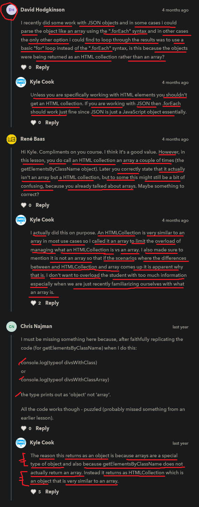

# id & class selectors

    - important 🔥

    - here we'll talk about how to select elements 
        using their (elements) ids name or classes name or both  

## two methods of document object used to select elements based on id & classes 💡💡

    first - getElementById() method
    second - getElementsByClassName() method
    
    NOTE : 
        - don't forget to put "s" letter after Element word 
            in getElementsByClassName() method
        - because id always be unique 
            & class name can same in different elements and s letter means plural 💡

    NOTE : selecting elements not just based on document object 🔥

        - we can select a element through these methods based on document object
            like this const btn = document.getElementById("#btn")

        - & we can also select element through these methods based on element
            not through document object like this 
            const btn = form.getElementById("#btn")
        - here because we don't want to select all the button which are present on document
            we to select only that button which is inside the form element
            that's why we selected that button element based on form element 

## getElementById() method of document object ✅

    - used to select only one element based on id 💡💡
        because each id name always be unique in the HTML page

    - takes one argument i.e id name inside double/single quotes of that element has

    - getElementById() method doesn't return a output in the form an array
        because each id name always be unique each other 💡💡💡

    NOTE : of getElementById() & getElementsByClassName() methods ✅

        - don't use/give hashtag sign before id name inside double quotes like this 
            document.getElementById("#box-1") ❌
        - & don't use dot sign before class name inside double quotes like this 
            document.getElementsByClassName(".box") ❌

        - these are wrong way because we can't select id name or classes name of a element 
            in the form of selector as we do in CSS

        - use id name like this 
            document.getElementById("box-1") ✅
        - & use classes name like this 
            document.getElementsByClassName("box") ✅

    - if we select element with id name 
        which is not define/exist in html page then we'll get output -> null 💡💡💡

    eg : 
        html code
        ----------
        <body>
            
This is an id element

            
This is a class element

        </body>

        JS code
        -------
        console.log(document.getElementById("div-id"))

        // output : 
This is an id element

        - & when we hover on this output then that element will be highlighted

    eg : change the color of text ✅

        - to change the color of the text or anything which is related to CSS stuff
            then use style -> property on that element

        -> style property/object  
            - is a both property & object also 💡💡
            - it's have all CSS properties + methods also 💡💡
            - if we want to Return style properties of a element 
                syntax -> element.style.property
            - if we want to Set style properties
                syntax -> element.style.property = value

        const divWithId = document.getElementById("div-id")

        divWithId.style.color = "red"

        // output : text will be converted into red color of div which has id name i.e div-id

        - style object gives ability to modify the css directly

## getElementsByClassName() of document object ✅

    - used to select multiple or single elements based on class name   
        because multiple elements can have same class name 
        or maybe one element has that class name 💡💡
    - but 100% times , we use getElementsByClassName() method 
        when we want to select multiple elements based on class name

    - getElementsByClassName() method return a output 
        in the form of an HTML collection array 💡💡💡
    - so if either multiple different elements have same class name 
        or only single element has that class name
        - in both the situation will get a output 
            in the form of an HTML collection array 💡💡💡
    
    - if we select multiple elements based on a existing class name
        then getElementsByClassName() will return output 
        in the form of an HTML collection array 💡💡💡
        - & inside that HTML collection array contain our individual elements 
    - if we select elements based on that class name 
        which doesn't exists in the html page
        then getElementsByClassName() will return output -> empty array 
        i.e the html collection empty array 💡💡💡

    eg 1 :
        html code
        ----------
        <body>
            
This is an id element

            
This is a class element

        </body>

        JS code
        -------
        console.log(document.getElementsByClassName("div-class"))

        // output : 

        - here we got output in the html collection array 

    eg 2 : 
        html code
        ----------
        <body>
            
This is an id element

            
This is a class element

            
This is a class element

            
This is a class element

        </body>

        JS code
        -------
        const divsWithClass = document.getElementsByClassName("div-class")

        console.log(divsWithClass)

        - here we'll select elements based on class name i.e div-class
            due to this all the elements will be selected those who 
            have class name i.e div-class
    
        // output : 

    STEP 1 - eg 3 : giving color to the text by select elements based on class name ✅

        - important example 🔥

        const divsWithClass = document.getElementsByClassName("div-class")
        console.log(divsWithClass)

        // here we're giving color to elements those have class name i.e div-class
        divsWithClass.style.color = "red"

        // output : error will come

        - because divsWithClass variable contain those elements 
            in the form of HTML collection array
        - due to this divsWithClass variable doesn't have a style property
            so that's why we can't use color property also
            & we can't access all of those elements 
            which has same class name & change all their color at once 💡💡💡
        
        - if we want to apply color only on single element then use this way
            divsWithClass.style.color = "red"  💡💡💡

        - so that's why we can't apply color directly

        NOTE : of HTML collection array when we use getElementsByClassName() method ✅

            - important note 🔥

            - even if we loop through each elements by using forEach() method 
                or traditional for loop or for of loop like this 
                const divsWithClass = document.getElementsByClassName("div-class")
                divsWithClass.forEach(box => {
                    box.style.color = "red"
                })
            - then still we'll get error
                
            - because html collection array output returned by getElementsByClassName() method
                is not an actual array 💡💡💡
            - so HTML collection array is slightly different from an actual array
                that's why we can't use forEach() & other methods of array
                means we can't use any methods of array on HTML collection array directly 💡💡💡
            - so we need to convert that HTML collection array into an actual array 
                by using Array.from() method 💡💡💡

        -> Array.from() method ✅

            - used to convert HTML collection array into an actual array 
                so that we can perform any array method even forEach() method also 💡💡💡
        
            - here Array -> is a class but it's name also in Array (where "A" letter is capital)
                from() -> is a method of Array object 💡💡💡

    STEP 2 - eg 3 : converting HTML collection array into an actual array by using Array.from() method ✅

        const divsWithClass = document.getElementByClassName("divs-class")
        const classArray = Array.from(divsWithClass)
        // OR
        const divsWithClass = Array.from(document.getElementByClassName("divs-class"))
        
        - now we can access/use forEach() method 
            because now divsWithClass is converted from HTML collection array into an actual array 💡💡💡
            like this 

        divsWithClass.forEach(box => {
            box.style.color = "red"
        }) 

        // output : now text of each elements who have class name i.e div-class
                    are in red color

    STEP 3 - eg 3 : giving color to particular class name element ✅

        - if selected multiple elements based on class name
            by using getElementsClassName()
        - & if we want to give a color to only one element out of them

        const divsWithClass = document.getElementsClassName("div-class")

        - right now divsWithClass variable is in HTML collection array

        // giving color to a particular element i.e who is in 0(zero) index 
        divsWithClassArray[0].style.color = "red"

        // output : blue color will be applied on 0(zero) class name element

## difference b/w getElementById() & getElementsByClassName() methods of document object 🔥

    - both method used to select elements 

    -> getElementById() method of document object ✅

        - used to select only one element based on id name
            because each id on different elements are unique 
            & this method is based on only id name 
        
        - it doesn't give output in the form an array 💡💡💡

        - if we select that element with id name which is not define/exist 
            in html page then we'll get output -> null 💡💡

    -> getElementsByClassName() method of document object ✅

        - used to select multiple elements based on class name
            because class name can be same in different elements
            & this method is based on only class name 

        - it return output as a HTML collection array which is not an actual array
            & if we want to loop through by using forEach() method
            or if we want to use any methods of array on that HTML collection array
            or if we want to apply same color to those multiple elements which have a same class name
            then we can't use/do directly 
        - because HTML collection array doesn't have any array methods or properties or methods
            or HTML collection array doesn't know the array methods 💡💡💡
        - that's why we need/have to convert that HTML collection array into an actual array
            by using Array.from() method 
        - so that we can use all array methods including forEach() method 💡💡💡

        - but if we want to apply a color to any one of them element
            then use square bracket notation
            & we don't need to convert that HTML collection array into a actual array 💡💡💡
        
        - if we access multiple elements based on class name
            which doesn't exists then output will be -> [] -> empty array 💡💡

    NOTE : 
        
        - use both getElementById() & getElementsByClassName() methods
            according to situation 💡💡💡

## discussion page

