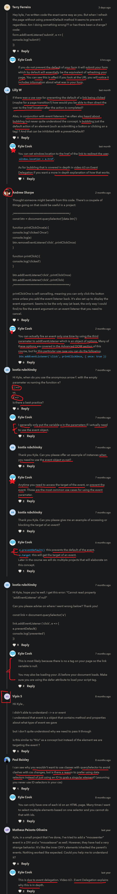

# event listeners

    - most important 🔥

    - event listeners used to make our HTML page interacted ✔️
    
    - an html event can be something that the browser does, or a user does.
        eg : when user click on a button then something happen on a document

    - there are two ways to use/define event listeners
        first - inline way
        second - external way

    -> inline event listeners 

        - two ways to use inline event listeners
            first - directly using functions like alert() inside inline event 
            second - calling a function inside inline event

        - don't use first way of using inline event listeners
        - use second way i.e calling a function inside inline event
            but don't use second way always ✔️
            use external event listeners most of the time 

        in html file
        -------------
        <button onclick="myFunction()">Hello</button>
        
        in JS file
        ----------
        function myFunction() {
            console.log("hello world")
        }

        // output : when we click on that button then click event will be fired/executed
                    then we'll got our error 

    -> external event listeners ✅

        - we'll see defining event listeners externally 
            means directly inside the JS file
            which is also used most of the time ✔️

        - avoid defining inline event listeners
            use it in when we don't have time or in emergency 
            or for very simple stuff ✔️

    - in event listener , event propagation/delegation also come ✔️ 
        that we'll see in later lectures

## how to add event listeners on a html element 🔥

    STEP 1 - eg 1 : select any html element like button ✅

        html code
        ---------
        <button data-btn>Click me</button>

        JS code
        -------
        const btn = document.querySelector("[data-btn]")

    STEP 2 - eg 1 : adding event listener on button ✅

        -> addEventListener() ✅
            - is a method 
            - takes two arguments
                first argument 
                  - is the name of the event that we want to listen inside double/single quotes
                second argument 
                  - a callback function 

            NOTE : 

                - whatever we wrote inside a callback function which is a second argument 
                    of addEventListener() method
                    will be called/fired/executed

        btn.addEventListener('click', () => {
            console.log("clicked")
        }) 

        // output : 
 

        - here we got output 
            & whenever we clicked on the button every single time
            then that 9 number will be increment
        - just like we do "double tap" on instagram posts or etc 💡💡💡 

        - means we set the click event listener on the button
            so whenever we click on the button every single time
            then that callback function will be executed/fired/run 💡💡💡

## example - of using two event listener on single button ✅

    eg : 

        const btn = document.querySelector("[data-btn]")

        btn.addEventListener('click' , () => {
            console.log("clicked")
        })

        btn.addEventListener('click' , () => {
            console.log("clicked 2")
        })

        // output : clicked
                    clicked 2

    - so when we clicked on the button
        then first event listener executed/fired/run
        then second event listener will be executed 💡💡
    - means every single time when we clicked on that button
        then both event listener will be executed at the same time
        in order wise 💡💡💡

    - so both of these event listener are going to run at the same time 💡

    NOTE : ✅
        - so through this example we're able to understand that
        - if we already have some form of click event on a button
            & if we add another click event 
        - then those all click event will fired/executed/run at the same time
            & new click event which is added that will not overwrite the previous one 💡💡💡

## how to remove the event listener from a button 🔥

    - when we want to remove the existing event listener then use
        removeEventListener() method ✅

    -> removeEventListener() method 
        - takes two argument 💡💡
            first - name of the event that we want to remove which is added
            second - callback function

    NOTE : about removeEventListener() method ✅

        - important note 🔥

        - if we give that callback function as second argument inside removeEventListener() method
            which is defined as second argument inside addEventListener() method    
            like this 

            const btn = document.querySelector("[data-btn]")

            btn.addEventListener('click' , () => {
                console.log("clicked")
            })

            btn.removeEventListener('click' , () => {
                console.log("clicked")
            })
        
        - then removeEventListener() won't remove the click event which is added 
            & due to this removeEventListener() method won't work 💡💡💡

        - because both removeEventListener() & addEventListener() 
            have different callback function as a second argument 
            & both callback functions are different each other
            & even their local scope also different

        - so we need to create overall one global function 
            for both removeEventListener() & addEventListener() methods
        - so that one global function can be referred/used in both methods
            & due to this , when we give that one global function 
            as a second argument which is a callback function in both
            removeEventListener() & addEventListener() methods
        - then that callback function will be related to each other 💡💡💡


    const btn = document.querySelector("[data-btn]")

    function printClick() {
        console.log("clicked")
    }

    btn.addEventListener('click' , printClick)

    // output : clicked

    - now if we remove the click event like this 

    // now removeEventListener() method will work
    btn.removeEventListener('click' , printClick)

    // output : when we click on the button then nothing will be printed 💡💡

    - here No output we got after clicking on button
        because we added the click event 
        & immediately we removed that click event

    - now we have event object also with event listeners

## event or e object 🔥

    - event or e is a main object
        which contain all the information about each different types of events 💡💡💡

    - eg : here click -> is a type/name of the event 
        & e or event object is a main object which has the information
        about click event name in the form object 💡💡

    - e or event object has many properties & methods 
        of that event name/type which is occurred/called 💡💡💡 

    - there are tons of different types/names of events 
        that we can use according to situation ✔️

    - through event or e object we can do a ton of different stuff

    - event means clicking an element or submitting a form 
        or scrolling page or hovering an element 💡

    - event object contains many tons of different event objects/class 💡💡💡 like
        - MouseEvent
        - KeyboardEvent
        - InputEvent 
        - Event & etc...
        for more check this -> https://www.w3schools.com/jsref/obj_event.asp
                            -> https://flaviocopes.com/javascript-events/

        - here Event means window global object
            so there are many event types related to window global object also 💡

    - & these each event class/object has many useful properties & methods 💡💡
        & there are many tons of event types/name according to html element that're using
    - like MouseEvent class/object has many different types/names of event 💡💡
        & same with others


    NOTE : when we need to use event object ✅

        - if we want to access the target property of the event
            or prevent the event or if we want to access other properties & methods 
        - these are the most common use cases for using the event object as argument 💡💡💡

        - otherwise don't give/pass event object as a argument 
            inside a callback function of event listener

        -  event object has a ability to manipulate the event which is defined ✔️


## how to use event or e object 🔥

    - we gave e or event object as a argument inside callback function 
        of addEventListener() method 💡

    eg : of using e or event object inside callback function of addEventListener() method ✅

        const btn = document.querySelector("[data-btn]")

        btn.addEventListener('click' , (e) => {
            console.log(e)
        })
        //OR
        btn.addEventListener('click' , (event) => {
            console.log(event)
        })

        NOTE : best practice of using e or event object 📝

            - we can use e letter simply or complete event object as a word 
                but most of the time we'll see -> e letter as event object 💡💡

        // output : 
 

        - after clicking on button  
            then we'll get output i.e PointerEvent object 💡

        - if we use 'mouseover' event like this 
        btn.addEventListener('mouseover' , (event) => {
            console.log(event)
        })
        // output : we'll get MouseEvent object 💡

        NOTE : about MouseEvent & PointerEvent classes/objects ✅

            - here MouseEvent , PointerEvent , etc..
                are both class as well as object also

            - and both contain properties & methods 💡💡

        NOTE : ✅🔥

            - whatever the event type/name we use then according to the event type/name 
                event object will refer to the particular event class 
            - means if we use 'click' event type or any other event type on button
                then event object will refer to the PointerEvent class/object 
            - event class/object also depends on which HTML element we're using
                if we use mouse then we have different types of events & so on  
                if we use input element then we have different types of events
                    related to input element + then event class/object will be InputEvent 
                & so on... 💡💡💡
            
            - means that event object refer to that event class/object
                which contain that event type that we gave 💡💡💡

        - so here 'click' is of the event name/type
            & 'mouseover' is also of the event name/type 💡💡💡
            
        - & after passing that -> event object in both callback functions as an argument 
            then that first event object -> is referred to the PointerEvent class
            because 'click' is a type/name of the event inside the PointerEvent class
            & there are many others types of events 
            which are related to the PointerEvent class
        - & same with MouseEvent class 💡💡💡

        -> MouseEvent object/class ✅

            - it has tons of information about 
                - what we did with that button
                - about the keys that we clicked
                - the position that we clicked was the mouse
                - whether we're holding down control (ctrl) key or not
                - whether it was left or right click
                
                - it also tells about the -> target
                    means through which HTML element
                    we called/triggered that event 
                - eg : here we triggered the click event through the button
                        - so here button is the target 💡💡💡 
                          even we can see when we expand that MouseEvent object/class
                          then it'll look like this 
 

                NOTE : of target property of event object 🔥

                    - here target is a cool property especially 
                      eg : if we want to check the validation
                      whether if an input by the user is validate/right or wrong 💡💡💡

                    - target is a property & object also 
                        & it has it's own properties & methods 💡

## examples - to see whether input is valid or not 🔥

    STEP 1 - eg 1 : 
        html code
        ---------
        <input data-input-text type="text">
        <button data-btn>Click</button>

        JS code
        -------
        const input = document.querySelector("[data-input-text]")

        - now we'll setup and event listener
            that's going to check every single time
            when we type a character inside of it 💡💡

        - we have different types of events with input element 💡💡💡
            - change
            - input , etc ..

    STEP 2 - eg 1 : using 'change' event of input element ✅

        - the most common event type of input element i.e 'change' event
        - 'change' event type is very important 🔥 

        -> 'change' event ✅
            - it will only fire/executed
                if we click off from that element
                or we click on somewhere else except that element which has 'change' event 💡💡

        input.addEventListener('change' , () => {
            console.log("changed")
        }) 

        // output - when we click inside that input element
                    & when we write something inside of it 
                    & as soon as we click off of the input element
                    or if we click to body of the browser or any other any element
                    or if we click to somewhere else
                    then change event will be fired/executed 💡💡💡
                - & output will be -> changed
                
    STEP 3 - eg 1 : using input event of input element ✅

        -> 'input' event 
            - if we want to run an event every single time
                when we type/write a character or etc.. inside it
            - for that we use 'input' event 💡💡💡 

            input.addEventListener('input' , () => {
                console.log("liked")
            }) 

    STEP 3 - eg 1 : doing small check/validation with input element ✅

        eg : 
            html code
            ---------
            <input type="text" data-input>

            js code
            -------
            const input = document.querySelector("[data-input]")

            input.addEventListener('input' , (e) => {
                console.log(e.target.value === "")
            }) 

            NOTE : of target property/object ✅ 
                - here event object has many properties & methods
                    & one of the property is target
                - target -> property/object of event object is very important 🔥
                - value -> is a property of target object is also very important 🔥

                - here target property means a html element i.e input element 💡💡

        - here we're checking that if the input element has empty value or not

        - if value of input element is empty then output -> true
            if input element has a value then output -> false

        // output : true -> because right now we're saying as a programmer
                            that value of that input element is empty
                            & ofcourse there is no value inside of it

## validating the form element through submit button by using 'submit' event type 🔥

    STEP 1 - eg 1 : default behaviour of 'submit' event type of form element ✅

        html code
        ---------
        <form data-form>
            <input data-input-text type="text">
            <button type="submit" data-btn>Click me</button>
        </form>

        NOTE : for dealing with form validation ✅

            - whenever we're dealing for form validation
                then value of type attribute of button always be -> "submit" 💡💡💡
            - otherwise form validation won't work

        js code
        -------
        const form = document.querySelector("[data-form]")

        -> 'submit' event type
            - it's a very important event type 🔥
                because it's used for validation in the form 
            
            - it's a event type of form element
            - submit -> means anytime when we submit a form
                    whether that's clicking the submit button
                    or hitting enter through keyboard
                    then 'submit' event will be executed/fired 💡💡💡
            
        form.addEventListener('submit' , () => {
            console.log("submitted form")
        })

        // output : 
            when we write something inside input element
            & then click to submit button then suddenly in console tab
            a flash will come i.e "submitted form" & then suddenly gone 💡💡

        NOTE : for 'submit' event type of form element ✅

            - when we use 'submit' event of form element
                then default action of 'submit' event type 
                is that form page automatically will get refresh 💡💡💡

            - why that automatic refresh happens
                because we didn't specify a location for submitting the details
                that's why form page submitted to the current page that we're on
                which causes our page to essentially refresh with the values 
                from our form

            - so to prevent that default action/behaviour of 'submit' event type of form element
                & to stop that automatic refresh
            - then use preventDefault() method on event object 💡💡💡

            -> preventDefault() method of event object ✅

                - use this method when we want 
                    to prevent/stop the default behaviour of 'submit' event type of form element
                    from automatic refreshing the page while submitting the form 
                    for form validation 💡💡💡
                
                - we use this method for form validation mostly 💡💡

                - we use this method when we want to prevent/stop the default action/behaviour
                    of that html element like form submitting , anchor tag , etc 💡💡💡

                - we use this method on event object 💡
                - very important method of event object 🔥


    STEP 2 - eg 1 : preventing default behaviour of 'submit' event type of form element ✅

        form.addEventListener('submit' , (e) => {
            e.preventDefault()
            console.log("submitted form")
        })

        // output : when we click to submit button then message will be printed

## preventing the default behaviour of anchor tag ✅

    - anchor tag redirects us to another page
        but if we want to prevent that anchor tag 
        from redirecting to the another page 💡💡
    - then same method we use i.e preventDefault() method on event object

    challenge time
    --------------

    ques - add a anchor tag to the HTML page
            & when we clicked on it
            then prevent the default action
            & print something to the console tab

        - & that anchor tag can go anywhere we can give link to google or any site
            & whenever we click on it then make it prevent the default
            that it doesn't actually redirect you

    Ans - 
        html code
        ---------
        <a href="https://google.com">go to google</a>

        js code
        -------
        const link = document.querySelector("a")

        link.addEventListener('click' , e => {
            e.preventDefault()
            console.log("prevented default")
        })

        // output : when we click on this link then 
                    we won't able to go/redirect to google page
                    due to preventDefault() method on event object

        - now this is not obviously we do in real world
            because links meant for to go another site

        - but preventDefault() method is useful & important 
            for form validation/submitting 💡💡💡
            or if we want to prevent default for other things on our page 💡💡💡

## said by kyle

    - that's the majority stuff that we need to know 
        how to 
            - add & remove event listener
            - use event object
            - use different event types
            - prevent default behaviour/action like 'submit' event , etc ..
            - etc..

## -------------------------- Extra stuff -----------------------------

    - important event types 
        & their methods & properties 🔥
    
    - for more events check this out
        https://www.w3schools.com/jsref/dom_obj_event.asp

    -> 8 types of events 

        - user interface events OR UI events
        - focus & blur events
        - mouse events
        - keyboard events
        - form events
        - mutation events & observers
        - html5 events
        - css events

        -> events types related to UI events

            - load     ----------+
            - unload             |
            - error              |--> use these based on window global object
            - resize             |
            - scroll  -----------+

        -> events types related to focus & blur 

            - focus 
            - blur
            - focusin
            - focusout

        -> event types related to mouse/cursor 

            - click     
            - dbclick
            - mousedown
            - mouseup
            - mouseover
            - mouseout
            - mousemove

        -> event types related to keyboard 

            - input
            - keydown
            - keypress -----> this even type has keyCode property 
            - keyup

        -> event types relate to form

            - submit
            - change
            - input
            - blur
            - focus
            - focusin
            - focusout
            - invalid
            - reset
            - search

        -> event types related to Mutation & observers

            these thing contain related to DOM

        -> HTML5 events types

            - DOMContentLoaded
            - hashchange
            - beforeunload

        -> css events types

            - transitionend
            - animationstart
            - animationiteration
            - animationend

        -> important properties of event object 

            - target -> important 🔥
            - type -> important 🔥
            - currentTarget -> important if we know the event delegation/propagation
            - clientX -> useful
            - clientY -> useful
            - pageX -> useful
            - pageY -> useful
            - altKey
            - bubble & cancelBubble
            - ctrlKey
            - eventPhase
            - fromElement

        -> important methods of event object

            - preventDefault() -> important 🔥
            - stopPropagation() -> important 🔥 -> use when we deal with event delegation/propagation

    -> general event types ✅

        - click
        - submit
        - mouseenter
        - mouseleave
        - mouseover
        - focus
        - blur
        - resize

    -> general methods of event object ✅

        - preventDefault()
        - stopPropagation() 

        - these are all the most common event types & methods of event object 
            that we'll use most of the time 💡
            & there are tons of other apart from these 
        - but whatever we used in this lecture 
            we're gonna use/see 99% 

- `Note` : for second argument of event listener i.e callback function 
    - two ways that we can pass callback function as second argument of event listener
    - `first way` : 
        ```js
        btn.addEventListener('click' , () => {
          message() // output : first way
        })

        function message() {
            console.log("first way")
        }
        ```
    - `second way` : 
        ```js
        // here we just pass the function definition of that message function
        btn.addEventListener('click' , message) // output : second way

        function message() {
            console.log("second way")
        }
        ```

## discussion page



