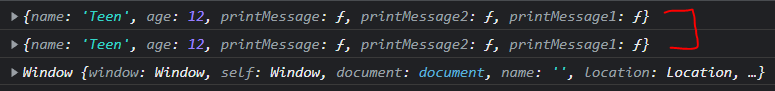
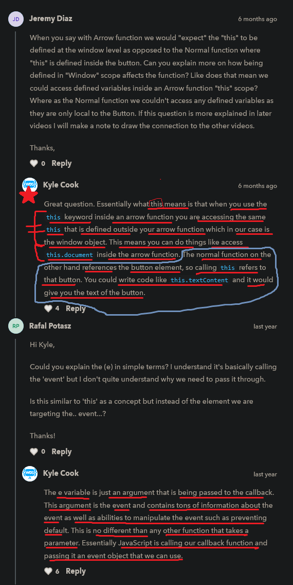

# additional difference b/w arrow & normal functions

    - most important 🔥

    - we'll see the difference b/w arrow & normal function & anonymous function with this -> keyword
        & how both behave differently in terms of scoping
        with addEventListener() method 💡💡💡

    - there is a slight difference b/w arrow & normal function 

## about this -> keyword

    -> this keyword ✅
        - it represent/show/refer to the current scope that we're inside currently 💡💡

    - by default this -> keyword 
        refers to the window global object 💡💡💡

    eg : 
        console.log(this === window)

        // output : true

        - here means this -> keyword always equal to/refer to the window global object
            when we use this -> keyword in global scope 💡💡💡
        - that's why we use alert() function
            without window object like - alert() 

    - so this -> keyword 
        we can use to define the scope that we're currently inside 
    
    - & this -> keyword refer/point towards the different object
        when we use/define arrow & normal function & anonymous function
        as a callback function (2nd argument) inside addEventListener() method 💡💡💡

## using this -> keyword with arrow & normal & anonymous function as a callback function 

    - important 🔥🔥

    eg :
        html code
        ---------
        <button>click me</button>

        js code
        ------- 
        const btn = document.querySelector("button")

        // arrow function as a callback function 
        btn.addEventListener('click' , () => {
            console.log("arrow callback function with this -> keyword")
            console.log(this)
        })

        // anonymous function as a callback function
        btn.addEventListener('click' , function() {
            console.log("anonymous callback function with this -> keyword")
            console.log(this)
        })

        function message() {
            console.log("normal callback function with this -> keyword")
            console.log(this);
        }

        // normal function as a callback function
        btn.addEventListener('click' , message)

        - here we're printing the this -> keyword
            from inside arrow callback function of 1st addEventListener() method
            & from anonymous callback function of 2nd addEventListener() method 
            & normal function as a callback function of 3rd addEventListener() method 💡💡 
        - means we're printing the this -> keyword
            from different scopes 💡💡💡

        // output : after clicking on button
 

        - so here 
            - in arrow callback function , 
                this -> keyword is refer the window global object
            - but in normal callback function + anonymous callback function , 
                this -> keyword is refer to the current object or current html element
                like here this -> keyword is refer to the button object/element 💡💡

        NOTE : why this -> keyword is different in arrow callback & normal or anonymous callback 

            -> in arrow callback function as argument of addEventListener() method , ✅
                
                - when we use this -> keyword 
                    inside the arrow callback function as a argument of addEventListener() method
                    then this -> keyword is refer to the window object
                - because behind the scene
                    that arrow callback function with this -> keyword 
                    called/defined in the global scope 💡💡💡

                - means using this -> keyword 
                    inside arrow callback function (as 2nd argument of addEventListener() method)
                    then the callee of this -> keyword 
                    will be window global object 💡💡💡 

            -> in normal & anonymous callback function as argument of addEventListener() method ✅

                - when we define/use this -> keyword 
                    inside the anonymous or normal callback function 
                    as a argument of addEventListener() method 
                    then this -> keyword will be called/refer 
                    from inside of that current object or current html element 
                    like here i.e button object/element
                - means that anonymous or normal callback function 
                    called from inside that button element itself

                - here that normal & anonymous callback functions didn't called in global scope
                    that's why this -> keyword to that html element i.e like here button
                - means that normal & anonymous callback functions 
                    fired/executed from within the button object/element itself 💡💡💡

                - means using this -> keyword inside normal callback function 
                    or anonymous callback function (as 2nd argument of addEventListener() method)
                    then the callee of this -> keyword 
                    will be that object or html element
                    who called that function 💡💡💡

## said + suggestion by kyle 🔥

    said
    ----
        - he also hate how arrow & normal function handle this -> keyword 
            differently for scoping
        - due to this things become hard + confusing
            & again those normal scoping rules get breaks 💡💡💡
            when we use the arrow callback function & normal or anonymous callback function 
            as a 2nd argument inside the addEventListener() method 

    suggestion
    ----------
        - so that's why almost 99% always 
            use arrow callback function as a 2nd argument inside the addEventListener() method 
            if we want to use this -> keyword 💡💡💡

        - but 99% times , this -> keyword is something that we almost never need to use
            & kyle also recommend really not using this -> keyword 
            unless if we don't have choice other than this -> keyword 
            then at that situation use this -> keyword 💡💡
            
        - this -> keyword is not something that we need to worry
            but we need to know the difference b/w 
            arrow callback & normal or anonymous callback function  
            & how they behave in terms of scoping with this -> keyword 💡

        - when we use this -> keyword 
            inside arrow callback function instead of normal or anonymous callback function
            as a 2nd argument inside the addEventListener() method 
        - then due to that scope will break 💡💡
            because this -> keyword behave differently in terms of scoping 
                inside those different callback function 

## using e.target property instead of this -> keyword in normal or anonymous callback functions 

    - important 🔥🔥

    - if we want current object without any scope problem
        while using normal or anonymous callback function as a 2nd argument
        inside the addEventListener() method 💡💡💡
    - then always use only e.target property of event object instead of this -> keyword 
        inside normal or anonymous callback function 
        as a 2nd argument of addEventListener() method 💡💡💡
    
    - we can use this -> keyword or e.target property
        inside normal or anonymous callback function both will give same output 
    - but don't use this -> keyword inside normal or anonymous callback function
        to avoid the confusion ✔️

    NOTE : which type of callback function we need to use this -> keyword ✅

        - always use this -> keyword 
            only with arrow callback function 
            as a 2nd argument of addEventListener() method 💡💡💡

        - don't use this -> keyword 
            with normal or anonymous callback function 
            as a 2nd argument of addEventListener() method 💡💡💡 

    eg : using e.target property instead of this -> keyword inside normal or anonymous callback function ✅

        html code
        ---------
        <button>click</button>

        js code
        -------
        const btn = document.querySelector("button")

        // using anonymous callback function
        btn.addEventListener('click' , function(e) {
            console.log("anonymous callback function")
            console.log(e.target)
        })

        NOTE :

            - don't use normal function as a 2nd callback function of addEventListener() method 
                with e.target property
            - because then we need to write little more code
                than if we use anonymous callback function 

        // output : <button>click</button>

## Note - using this -> keyword normal , anonymous & arrow function without addEventListener() method 

    - if we use normal , anonymous , arrow functions in global scope 💡💡
        to print this -> keyword

    - then all these will give output -> window global object

## suggestion by kyle 🔥

    - so because of the weird scoping issues
        when we use this -> keyword 
        with normal & anonymous callback function 💡💡

    - so kyle highly recommend always must use
        arrow callback function as 2nd argument of addEventListener() method 
        when we want to use / using this -> keyword 💡💡💡💡
    - but if we want current object & if we're using arrow callback function
        then use e.target property 💡💡💡
        to avoid of confusing -> of using normal or anonymous callback function
    
    - because using this -> keyword inside the arrow callback function 
        then scoping problem will not come
        that we're facing with normal or anonymous callback function
    - so arrow callback function doesn't give wired scoping problem 💡💡💡 

## said by kyle 

    - it's not something that you're really ever going to run into
        but it may be something you'll encounter an older code OR code that uses 
        this -> keyword heavily ✔
    - so it's hard to know the differences because it will lead to bus in the future 
        if we don't know ✔✔

## ---------------------------- Extra stuff ---------------------------------

### Note - using this -> keyword inside an object ✅

    - for more check this link
https://www.youtube.com/watch?v=S2pBGSeUFCk&list=PLTP3E5bPW795Nx9KUPCdHNsh7uuyqe9Mi&index=5&ab_channel=DipeshMalvia

    - if we use this -> keyword with normal function inside an object 

    eg : 
        let myObj = {
            name : "Teen" , 
            age : 12 ,

            printMessage()  {
                console.log(this);
                console.log(`${this.name} ${this.age}`);
            } , 
            
            printMessage2 : function() {
                console.log(this)
            } ,  

            printMessage1 : () => {
                console.log(this)
            }
        }

        myObj.printMessage()
        myObj.printMessage2()
        myObj.printMessage1()

    // output : 
 

    - here only normal function & anonymous function 
        will return current object i.e myObj
        because the callee/current context of this -> keyword 
        is that current object i.e myObj 💡💡
        
    - so always use anonymous function inside an object because of readability & if we want to use normal function then we can use 💡💡💡
        but don't ever use arrow function inside an object 

    - & the current context of this keyword inside the arrow function
        i.e window object 💡💡

    NOTE : ✅

        - without a calling context 
            by default this -> keyword always point to window global object 💡💡💡

        - so this -> keyword always points to the callee of that function
            here callee -> means who is actually calling/referring that function
        - means if an object is calling that function 💡💡💡
            then this -> keyword will refer/point to that object
            & if there is no calling context to that function
            then by default this -> keyword will point to window global object 💡💡💡

        - this -> keyword is not important 
                because it only useful when if we're working 
                with class based components in reactjs ✔️

## discussion page 

