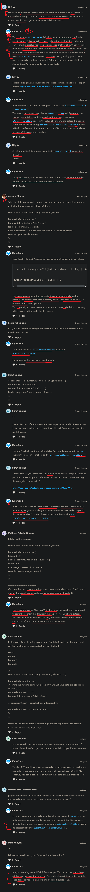

# data attributes

    - most important 🔥

    - we'll learn how to use data attributes 
        in order to add + read + delete + update/modify the information of data attributes 💡💡💡 
        to do some really interesting stuff 
    
    - as we saw that in lecture 36 , 37 , 38 , 39 & 40 we used custom data attributes
    - & using custom data attributes according to situation 
      is a good practice & for readability 💡💡💡
      like this 
0

## how to define custom data-attributes in html ✅

    - to make/create custom data-attributes
        then - first start with data -> word
        then hyphen sign & then we can give any name we want 💡💡💡
    - & we can use combination of words according to work 
        & we can using hyphen sign to make name of that data-attribute little long ✔️

## using custom data-attributes in JS 

    - to select a custom data-attribute or normal attribute
        we use square bracket notation inside double/single quotes ✔

    eg 1 : using custom data attributes in JS ✅ 

        html code
        ---------
        <button data-test="123">1</button>

        js code
        -------
        const test = document.querySelector("[data-test]")

        -> dataset property ✅

            - is related only to custom data-attributes
            - return all the custom data-attributes & it's values of an html element 
                in the form of an JS object 💡💡💡

        console.log(test.dataset)

        // output : 

        - here we can see that we didn't get data-test : "123"
            we got test : "123"
        - because behind the scene our each custom data attributes 
            are stored inside an object without data word 
        - means in html to define/tell that we're making custom data attributes
            to an element so that's why we need to write data -> word first

        - here JS stored all the custom data attributes of an html element 
            in the form of an object
            due to this we can use them in the form key of an object 💡💡💡

        - one or all custom data-attributes stored in the form of an object
            & that object/class has name i.e DOMStringMap 
            & this DOMStringMap object/class store only custom data-attributes 💡💡💡

    eg 2 : using two custom data attribute ✅

        - important example 🔥

        html code
        ---------
        <button data-test="123" data-test-two>1</button>

        js code
        -------
        const test = document.querySelector("[data-test]")

        console.log(test.dataset)

        // output : 

        - here we can see that 
            there is no hyphen sign b/w testTwo word
            but in HTML we gave hyphen b/w test & two -> words + these words are not in camelCase ✔️
        
        - because in JS , 
            we can't make/have a variable with a hyphen sign
            & if we make then error come 
        - so HTML way of doing things are converted 
            into JS way of doing things 
        - that's why that custom data attribute is converted into camelCase in JS 💡💡💡 

    eg 3 : accessing the individual key/data attribute of an element by using dataset property ✅

        - important example 🔥

        const test = document.querySelector("[data-test]")

        console.log(test.dataset.test)
        console.log(test.dataset.testTwo)

        // output : 1234
                    3

    - custom data attribute is useful like making "like" button ✔

    eg 4 : how to give a value or modify/update the existing value of a custom data attribute ✅
        
        - important example 🔥

        const test = document.querySelector("[data-test]")

        test.dataset.test = "7"

        - here if there is no value in that test -> custom data attribute
            then 7 will be inserted as a value
            or 
        - if there was already a value inside test -> custom data attribute
            then that previous value will updated by value -> 7

        // output : 

    eg 5 : adding custom data attribute & it's value inside a element dynamically using dataset property ✅

        html code
        ---------
        <button>click</button>

        js code
        -------
        const btn = document.querySelector("button")

        btn.dataset.click = "0"

    eg 6 : deleting a custom data attribute from a element dynamically using delete keyword ✅

        - to delete a custom data attribute from an element dynamically
            then use delete -> keyword 

        html code
        ---------
        <button data-like-count="2">click</button>

        js code
        -------
        const btn = document.querySelector("button")

        btn.addEventListener('click' , (e) => {
            delete e.target.dataset.likeCount
        })

        // output : when we click on button the likeCount (custom data attribute) will be removed
                    from that button element
          

## challenge by kyle 🔥🔥

    - important challenge 🔥

    ques - create a simple counter application
            that counts how many times we clicked on each of these button individually ✔

        html code
        ---------
            <button data-clicks>1</button>
            <button data-clicks>2</button>
            <button data-clicks>3</button>

    Ans -   

        STEP 1 : select all the buttons based on document object 

            const btns = document.querySelectorAll("button")

            - here we used querySelectorAll() method
                because we want to select all the buttons 
                which are in the HTML document ✔

        STEP 2 : loop through each of the buttons & add click event to each of them ✅

            btns.forEach(btn => {
                btn.addEventListener('click' , () => {
                    
                })
            })

            - here we loop through each of the buttons
                so that we can add event on each of them ✔

        STEP 3 : get the value of that data attribute of each of the button

            btns.forEach(btn => {
                btn.addEventListener('click' , () => {
                    btn.dataset.clicks
                })
            })

        STEP 4 : now covert value of clicks custom data attribute from string type into integer type ✅

            -> parseInt() method or + (plus unary operator) ✅
                - any of them we can use to convert data from string type into integer type

                - but use parseInt() method due to readability 💡💡

            - because when we take data from HTML 
                then that data always most of the time in string type 💡💡
                so that's why we need to convert them from string type into integer type 

            btns.forEach(btn => {
                btn.addEventListener('click' , () => {
                    console.log(parseInt(btn.dataset.clicks))
                })
            })
            
            // output : when we click on any of the button then 
                        NaN -> output will come

            - because each custom data attribute has undefined as a value 💡💡

            - so we need to give default/initial value 
                to each of the custom data attribute in HTML 💡💡

        STEP 5 : giving default/initial value to each of the custom data attribute ✅

            <button data-clicks="0">1</button>
            <button data-clicks="0">2</button>
            <button data-clicks="0">3</button>

            NOTE : why we gave 0 (zero) as default or initial value to each custom data attributes 📝

                - we gave 0 (zero) as default or initial value
                    to each custom data attributes 
                - because by default none of the buttons didn't have any click data

            - instead of giving default value to each custom data attributes in HTML
                we can also give directly in JS also
                like this 

                btns.forEach(btn => {
                    let count = 0 
                    btn.addEventListener('click' , () => {
                        count += 1
                        //OR
                        count = count + 1
                        btn.dataset.clicks = count
                        console.log(parseInt(btn.dataset.clicks))
                    })
                })
                //OR
                btns.forEach(btn => {
                    btn.dataset.clicks = 0
                    btn.addEventListener('click' , () => {
                        const currentCount = btn.dataset.clicks
                        btn.dataset.clicks = currentCount + 1
                        console.log(parseInt(btn.dataset.clicks))
                    })
                })

                    - here this example is closure 💡💡💡

        STEP 6 : make increment each value of each data attributes of each button ✅

            - we'll take value of each data attributes of each button
                then we'll store inside a variable ✔
            - & increment that variable by 1 , every single time ✔
            - save that value of that variable inside of each data attributes ✔ 
                like this 

            const btns = document.querySelectorAll("button")

            btns.forEach(btn => {
                btn.addEventListener('click' , () => {
                    const currentClick = btn.dataset.clicks
                    btn.dataset.clicks = currentClick + 1
                })
            })

        // output : when we click on any button
                    then value of that data attribute will be updated LIVE 💡💡💡
                    of that button which we clicked 

            NOTE : How and why were you able to set the currentClicks variable as a const ✅

                - important note 🔥

                - as in general , when we define a variable with const keyword 
                    then after that we can't update/change the value of that variable 
                - but in STEP 6 
                    how we're able to change the value of currentClick variable 
                    which is define with const keyword 💡💡💡

                - because currentClicks is inside the anonymous function 
                    for the event listener means its scoped only inside that function
                    & as you can see within that function we never reassign that variable 💡💡💡
                - When we call the function another time in the future it is a brand new function 
                    so it has no memory of the previous times we called that function 
                    so it creates a brand new currentClicks variable with no issues 💡💡💡

## said by kyle 

    - custom data attributes are really useful
        because it allows us to store data inside html elements
        without having to store values in variables in JS 💡
        & we can update values LIVE 💡
    - means we can take advantage of using custom data attributes
        such as CSS 💡

    - & Kyle prefer to use custom data attributes
        when selecting elements with JS just because 
        they don't clash with his css classes 💡💡💡

## discussion page

