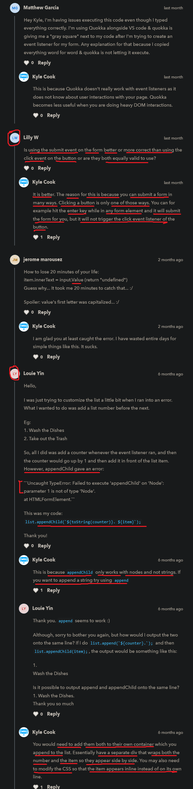

# simple todo list

    - we've learned 
        - a bunch about DOM
        - & different ways that we can interact with it 
            with selecting elements
        - adding event listeners
        - changing things
        - adding new elements & so on 
    - here we'll combine all things together
        to create todo list app

## starter code 

html code
```html 
<!DOCTYPE html>
<html lang="en">
<head>
  <title>Simple List</title>
  <link rel="stylesheet" href="styles.css">
</head>
<body>
  <div id="list">

  </div>
  
  <form id="new-item-form">
    <label for="item-input">New Item</label>
    <input type="text" id="item-input">
    <button type="submit">Add Item</button>
  </form>
</body>
</html>
```

css code
```css
.list-item {
  cursor: pointer;
  width: min-content;
}

.list-item:hover {
  color: red;
  text-decoration: line-through;
}
```

    eg : assume we have a list inside that list id box 
        like this

        <div id="list">
            <div class="list-item">New Item</div>
        </div>
    
    // output : 


    - & when we hover on that todo list then 
        line-through
    
    // output : 


    functionality that we need
    -------------------------- 
        1 - after writing a todo on a input 
            & when we click to "add item" button then
            we want to add that todo in our UI 

        2 - when we click on that todo list then 
            it should be removed/deleted from UI
        
## Steps : of JS code ✅

    TIP
    ---
    - before starting any project , then first make/write todo 
        & break down a big task into smaller chunks 
        & write what kind of steps we'll take to accomplish those smaller tasks
        & combine them all 💡💡💡
    - so always write comments for steps that what we're gonna do 💡💡💡

    Step 1 : creating a script file & open it 

    STEP 2 : 

        // 1 - select all the elements which are required to do work 
        const form = document.querySelector("#new-item-form")
        const form = document.querySelector("#list")
        const input = document.querySelector("#item-input")
        
        - now after accomplishing the first task go to next task

    STEP 3 : 
    
        // 2 - when we submit the form then add a new element
        - here this 2nd task sounds like a event listener
            so we'll use the event listener

        form.addEventListener('submit' , e => {
            e.preventDefault() // because we don't want to through the refresh page 
        })

        - now we'll check whether our code is working fine or not 
            through printing the message like this ✔️
        form.addEventListener('submit' , e => {
            e.preventDefault() 

            console.log(input.value) 
            // we want to see the current value that 
            // input element when we click to "add item" button
        })

        - so now we saw that our code is working fine then we'll move to next step

    STEP 4 : 

        form.addEventListener('submit' , e => {
            e.preventDefault() 

            // 1 - create a new item
            const item = document.createElement('div')
            item.innerText = input.value
            item.classList.add("list-item")

            console.log(item) 
            // 2 - add that item to the list
            // 3 - clear input
            // 4 - setup event listener to delete item when clicked
        })
        
        - we did console.log(item) to check whether so far 
            code is working or not as per our requirement
        - if code is working fine then move to next step

    STEP 4.1 : 

        form.addEventListener('submit' , e => {
            e.preventDefault() 

            // 1 - create a new item
            const item = document.createElement('div')
            item.innerText = input.value
            item.classList.add("list-item")
            // 2 - add that item to the list
            list.appendChild(item)
            // 3 - clear input
            input.value = "" // here we're resetting the value of input element to empty string
            // 4 - setup event listener to delete item when clicked
            item.addEventListener('click' , () => {
                list.removeChild(item)
            })
        })

## my JS code - for simple todo list

```js
    /* 
        TODO: 

        1 - select the form element
        2 - then use the 'submit' event on form element
        3 - then prevent the default action of 'submit' event of form element
            by using preventDefault() method on event object

            3.1 - inside that 'submit' event select the input element through form element 
                    because that input element comes inside it
            3.2 - then create one element dynamically through document object
                    by using method of document object i.e createElement() method 
                3.2.1 - then get the value of that input element 
                        & store that input value inside that element
                3.2.2 - then add a class name to that element i.e list-item

            3.6 - then select the div id element i.e list through document object 
            3.7 - then append/add that element inside div element i.e list id
    */      

   const todoForm = document.querySelector("#new-item-form")
   const todoList = document.querySelector("#list")
   
   todoForm.addEventListener('submit' , (e) => {
       e.preventDefault()
   
       addNote()
   
       deleteNote() 
   })
   
   function addNote() {
       const inputTodo = todoForm.querySelector("#item-input")
       
       const todoNote = document.createElement("h3")
       todoNote.classList.add("list-item")
   
       todoNote.innerText = inputTodo.value
       inputTodo.value = ""
   
       todoList.append(todoNote)
   } 
   
   function deleteNote() {
       const todoNotes = todoList.querySelectorAll(".list-item")
   
       todoNotes.forEach(todo => {
           todo.addEventListener('click' , () => {
               todo.remove()
           })
       })
   }
```

## Note - of remove() & removeChild() method

    -> remove() method
        - used to remove any element
            but apply this method on that element which we want to delete 💡💡💡

        - doesn't return anything 
        - it doesn't take any argument 💡💡

    -> removeChild() method
        - it also used to remove any element
            but it takes parent element/node to delete the child ✔️
        - means we can't delete that child element/node
            directly without the reference of parent element/node ✔️

        - takes argument

        - return that child element/node that we deleted 💡💡

    NOTE : ✅

        - most of the time 99% , use remove() method 💡💡💡

 & removeChild() methods")

    - replaceWith() method from this article when we use remove() method
        https://dev.to/dcodeyt/append-multiple-elements-using-append-302h

## ---------------------- Extra notes ----------------------

    -> methods of classList object 
        - add()
        - remove()
        - toggle()
        - contains()
        - replace()

## discussion page




