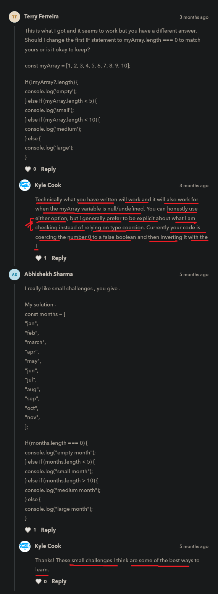

# if 
   
    - previously we wrote our program
        which flow was from top to bottom
    - now in control flow chapter we'll learn about 
        how we can modify the flow of our program
    - & actually how to stop things , do things twice
        or three things , etc
    - so let's see how we can modify the flow of our 
        code which is really useful

    - here if , else -> are keywords 

## Note - about all types of if statement

    - behind the scene
        whatever condition we wrote inside parenthesis 
        of if statement or if else statement or ternary operator or if else if statements 
        or switch statements or inside for loop , while loop , etc ....

    - that condition at the end converted 
        into boolean values either true or false 💡💡💡 

## examples - of if statement & if else statement 

    eg 1 : of if else statement ✅

        const userIsLoggedIn = false

        if (userIsLoggedIn) {
            console.log("user logged in")
        } else {
            console.log("please login")
        }

        // output : please login

    eg 1.1 : of if else statement

        const userIsLoggedIn = true

        if (userIsLoggedIn) {
            console.log("user logged in")
        } else {
            console.log("please login")
        }

        // output : user logged in

        - here if statement gets executed 
            because the condition of if statement is true 
            that's why block of code of if statement gets executed 💡💡

    eg 2 : of using only if statement ✅ 
    
        const userIsLoggedIn = false

        if (userIsLoggedIn) {
            console.log("user logged in")
        }

        // output : nothing will come

        - here we didn't get output because
            the condition of if statement is false 
            that's why block of code of if statement is not executed
        - & even there is no else statement also 💡💡

    eg 2.1 : of using only if statement ✅ 

        if (2 + 2 === 4) {
            console.log("user logged in")
        }

        // output : user logged in 

        - here condition of if statement is 2+2 === 4
        - so here 2+2 will be evaluated into 4 💡💡
            & then 4 === 4 -> means true

    eg 3 : of using only if statement with && (double AND logical operator) ✅

        const userIsLoggedIn = false 
        const isOnDashboard = true 

        if (userIsLoggedIn && isOnDashboard) {
            console.log("user logged in")
        }

        // output : no output 

        - because we used && (and logical operator)
            means if both the condition is true 
            then block of code of if statement will be executed 💡💡💡
        - if only one thing is true inside the condition 
            & others are false then if statement will not be executed 💡💡💡

    eg 3.1 : of using only if statement with && (double AND logical operator) ✅

        const userIsLoggedIn = true
        const isOnDashboard = true

        if (userIsLoggedIn && isOnDashboard) {
            console.log("user logged in")
        }

        // output : user logged in 

        - because inside the condition of if statement is 
            true && true --> return true 💡💡

    NOTE : about else statement ✅

        - else statement -> is optional to use

        - so use else statement with if statement
            when we need/required to use otherwise leave it 💡💡

## truthy & falsy values

    - falsy values 
        -> 0
        -> -0
        -> "" 
        -> false
        -> null
        -> undefined
        -> NaN

    - apart from these falsy values , all are truthy values

## examples - of checking falsy values with if else statement condition 

    eg 1 : 

        if (0) {
            console.log("true")
        } else {
            console.log("false")
        }

        // output : false

    eg 2 :

        if ("") {
            console.log("true")
        } else {
            console.log("false")
        }

        // output : false

    - & so on.. with other falsy values

## examples - putting null or undefined inside the condition of if statement 🔥

    - if we're checking for null or undefined falsy values
        then don't put null or undefined directly inside the conditions 
        like this 

        if (null) {

        }
        //OR
        if (undefined) {

        }
        - both will not give any output ✔ 

    - but if give value to that variable like this
        const totalPrice = 100 

        if (totalPrice) {
            console.log("go inside")
        } else {
            console.log("not allowed")
        }

        // output : go inside
    
    - but if we give 0 (zero) as a value inside that variable ✅
        like this 

        const totalPrice = 0 

        if (totalPrice) {
            console.log("go inside")
        } else {
            console.log("not allowed")
        }

        // output : not allowed

        - here in general where we gave 0 (zero) as value
            & we're expecting that if statement will execute
            but else statement will be executed
        - because as we know that 0 (zero) is a falsy values
            so 0 (zero) is converted behind the scene into false value
            due to type coercion/conversion 💡💡💡

## suggestion by kyle 🔥

    - recommend if we ever checking the condition -> for null or undefined or both
        then always do explicit type conversion/coercion 💡💡💡 

    eg : doing explicit type conversion instead of implicit type conversion ✅

        const totalPrice = 0 

        if (totalPrice != null) {
            console.log("true")
        } else {
            console.log("false")
        }

        // output : true

        - here condition of if statement executed
            even we wrote 0 (zero) which is a falsy value
        - because we're checking that totalPrice is not equalto null 💡💡💡
            due to that , implicit type conversion not done by JS 💡💡

        - if we give null or undefined as value for that variable 
            then if statement will not be executed
            because we're checking that totalPrice is not equalto null
        - but in general , null & undefined falsy values are equalto each other ✔✔
            null == null -> true 💡💡💡
            undefined == null -> true 💡💡💡
            undefined == undefined -> true 💡💡💡
            0 == null -> false
            0 != null -> true

    - & always avoid of using implicit type conversion 💡💡💡
    - because we don't know what will be the output 
        if JS do implicit type conversion 💡💡
        because due to this , things gets confusing

## Note - for null & undefined falsy values ✅

    - if we're checking condition for null & undefined
        then always use explicit type conversion for null or undefined with other thing
        inside the condition 💡💡💡
    - & always avoid/don't use implicit type conversion
        for null & undefined falsy values due to confusion 💡💡

    - for null or undefined falsy values checking inside the condition 💡💡💡
        then always use == and != 
    
    - but for other things or 99.5% times 💡💡💡
        always use === and !==  

## difference b/w if else if statement & if if statements 🔥

    - checking for multiple condition 
        then we use if else if else statements & if if statements 💡💡💡

    -> if else if else statement ✅

        const totalPrice = 5

        if (totalPrice == null) {
            console.log("there is no total price")
        } else if (totalPrice < 10) {
            console.log("there is pretty cheap")
        } else if (totalPrice < 50) {
            console.log("there is too bad")
        } else {
            console.log("there is expensive")
        }

        NOTE : in if else if else statement 📝

            - important note 🔥

            - in if else if else statement , 
                if the condition of anyone statement is true
                then that will be executed 💡💡💡
            - & after that statement (which is true) 
                then all below -> else if statements will be skipped from checking
                even if those below -> else if statements are true in terms of condition 💡💡💡  
     
        // output : this is pretty cheap

        - that's why here we got only one output 
            even though next else if statement is true in terms of condition 💡💡💡

    -> if if statements ✅

        if (totalPrice == null) {
            console.log("there is no total price")
        } if (totalPrice < 10) {
            console.log("there is pretty cheap")
        } if (totalPrice < 50) {
            console.log("there is too bad")
        } else {
            console.log("there is expensive")
        }

        NOTE : in if if statements 📝

            - important note 🔥

            - in if if statements , 
                if anyone statement is true in condition
                then that statement will be executed 💡💡💡
            - but other if statements are true in terms of condition 
                which are below that if statement (which is true) 💡💡💡
            - then those other if statements will executed
                because all the if if statements checked 💡💡💡

        - that's why output is 
        // output : there is pretty cheap
                    there is too bad

    NOTE : important note - about if if statements and if else if statements🔥

        - these flow happens differently in both if else if else statement & if if statement
            because 💡💡

        - in if & if statements , 
            each & every statements are separated/different from each other
            that's why they don't impact on each other 💡💡💡
        
        - in if else if statements , 
            each & every if else if statements 
            are same & related to each other
            that's why they have impact on each other 💡💡💡
        
## suggestion by kyle 🔥

    - if we want to run & do multiple condition checks
        then use if if statements 💡💡💡
        due to this , we have multiple individual if statements
        which are separated from each other 

    -  if we want to run & do single condition check
        then use if else if statement 💡💡💡

## challenge by kyle 

    ques - create a variable that contains an array
            & we can put many elements are we want inside of it ?
            & use an if statement with else if blocks

        - we need to check the length of an array
            & on the basis on the length
            - if array is empty then print -> "empty"
            - if it has less than 5 elements then print -> "small"
            - if it has less than 10 elements then print -> "medium"
            - otherwise print -> large

        -> length property ✅
            - used to find the length/size of array or string 💡💡💡

    Ans - 
    
        const arr = [1, 2, 3, 4, 5, 6, 7, 12]

        if (arr.length === 0) {
            console.log("empty");
        } else if (arr.length < 5) {
            console.log("small");
        } else if (arr.length < 10) {
            console.log("medium");
        } else {
            console.log("large");
        }

        // output : medium

## Note - curly braces for block of code ✅

    - whenever we see these curly braces like this 

        {  -----------+
                      |---they have their own scope 💡💡💡 that we learned in scoping lecture
        }  -----------+
        
    eg : 

        if (arr.length === 0) {
            const aa = 10
            console.log("empty");
        } else if (arr.length < 5) {
            console.log(aa)
            console.log("small");
        } 

        // output : error will come

        - because here aa -> variable is in separate scope
            & we're trying to access that aa -> variable in another scope 💡💡💡

    - Now we'll see these stuff tons of different places 
        when we write the program & pretty much every program is full of logical things ✔️

## discussion page

