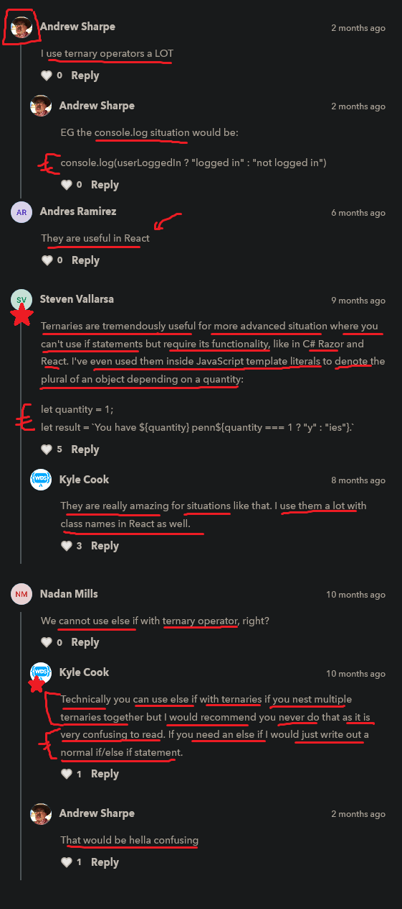

# ternary operator 

    - is also called conditional operator

    - ternary operator is a short way/compact way
        to write if else statement only ✔️

    - use ternary operator when we're using only if else statement 
        + we have only one line of code inside both if & else statement 
        + if we're checking with only for one variable 💡💡💡

## suggestion by kyle ✅

    - recommend not to use ternary operator all the time than if else statement 
        because we don't generally use it 
        due to less readable 💡💡

    - but it's important to understand how it works ✔️ 

## Note - about only if statement

    - if we have only if statement not with else statement 💡💡💡 like this 
        then in this situation we don't need to use curly braces 

        if (true) {
            console.log("user is logged in")
        }
    - so
        if (true)
            console.log("user is logged in")

    - this code also work fine without curly braces ✔️

    - but if we have more than one line of code 
        inside block of code of if statement
        then we have to define 💡💡💡

    said by kyle ✅
    ---------------

        - always give curly braces whether
            we have one or more than one line of code 
            because of readability 💡💡💡

## example - of ternary operator ✅

    eg : of if else statement 

        const isUserLoggedIn = true

        if (isUserLoggedIn) {
            console.log("logged in")
        } else {
            console.log("not logged in")
        }

    eg : of ternary operator

        const isUserLoggedIn = true

        isUserLoggedIn ? console.log("logged in") : console.log("not logged in")
              |                   |                              |
              |                   |                              |
            condition      this is if statement               this is else statement
                        - execute code if condition if true   - execute else statement code
                          & skip the else statement code        if -> if statement condition is false 

        first - question mark comes
        second - colon comes

## only one use case of ternary operator + said by kyle 🔥

    - generally don't use ternary operator
        except for in very specific use cases 💡💡💡

    - & pretty much the only use case for ternary operator i.e 
        recommend using a ternary operator 
    - when we need to set a variable based on true or false as a value 💡💡💡

    eg : of setting a value to a variable based on true or false by using if else statement ✅

        const isUserLoggedIn = false

        let welcomeMessage = ""

        if (isUserLoggedIn) {
            welcomeMessage = "welcome"
        } else {
            welcomeMessage = "Please log in"
        }

        console.log(welcomeMessage)

        // output : Please log in

    - so we're properly sending a welcome message
        based on a specific true or false boolean value 💡💡💡
    - but here we wrote a lot of code 
        & we can't use const keyword for welcomeMessage variable 💡💡💡
        because const means -> we can't update/change the value of that variable  

    - so to make that code much more condensed/small & we can use const -> keyword also  
        then here comes ternary operator 💡💡💡

    eg : of setting a value to a const variable based on true or false by using ternary operator ✅

        - important example + only one use case of ternary operator 🔥

        const isUserLoggedIn = false

        const welcomeMessage = isUserLoggedIn ? "welcome" : "Please log in"
        console.log(welcomeMessage)

        - so this code work like this

        -> if isUserLoggedIn is true ✅
            - so if value of isUserLoggedIn is true
                then we come after the question mark & before the colon sign 
                we get all of that code & run & 
                then return that code 
            - & set that value inside our variable i.e welcomeMessage

        -> if isUserLoggedIn is false ✅
            - so if isUserLoggedIn is false
                then we come after the color sign & run 
                & then return that & set that value inside our variable i.e welcomeMessage

        - so here we can see that by using ternary operator ✔️
            we did three things at the the same line code
            first - we set the variable with const keyword
            second - we checked the condition & return the value based on true or false
            third - we set the value inside that variable which is with const keyword 

    NOTE : about only one use case of ternary operator ✅

        - this is the only one use case of using ternary operator
            because in this situation code becomes more simpler & more readable 💡💡💡

        - any other use cases of using ternary operator 
            are more confusing & makes the code harder to read
            & confuse people that aren't familiar with ternary operator syntax 💡💡

## said by kyle 🔥

    - very important 🔥

    - most of the time & generally
        use if else statement 💡💡💡

    - if we find any situation which is related to 
        that one specific use case of ternary operator
        then use only use ternary operator in that situation 💡💡💡

    - & we can modify code of ternary operator 
        by using string template literals like this 💡💡💡💡 
        eg : 
            let quantity = 1

            const result = `We have ${quantity} penn${quantity === 1 ? "y" : "es"}`

            console.log(result)

    - ternary operator is really amazing 
        for that one specific use case or situation
    - & kyle also use it a lot in this specific use case with 
        class names in React as well ✔️✔️

## discussion page

