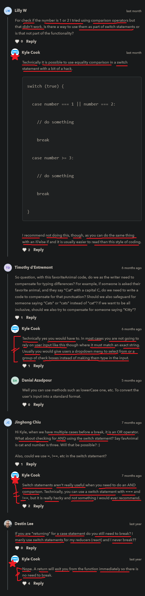

# switch statement

    - this is the final control flow 
        where we can use like if statement logic to modify things ✔️

## use case - of switch statement 🔥

    - use switch statement only
        when we want to compare/check different multiple values 
        with only that one variable 💡💡💡

    - & use switch statement , 
        when we want to do multiple cases statements values check
        with only that one single variable 💡💡💡

## example 1 - of if else if statements

    const favAnimal = "cat"

    if (favAnimal === "cat") {
        console.log("Cats are pretty cool")
    } else if (favAnimal === "dog") {
        console.log("They're kinda loud")
    } else if (favAnimal === "cat") {
        console.log("That's an interesting choice")
    } else if (favAnimal === "cat") {
        console.log("don't have any favorite animal")
    }

    // output : cats are pretty cool

    - this is the standard of if check
        but one thing that we'll notice 
        that we're just repeating that same variable with different values 💡💡💡
        all over the place

## when we need to use switch statement 🔥

    - we can imagine if we had a 100 animals in that list
        then it become difficult
    - to write again & again same stuff 
        favoriteAnimal == something

    - so here switch statement come
        - & switch statement allows to write code 
            in a much more condensed/simple way + more readable

    - only use switch statement , 
        when we want to compare/check different multiple values 
        with that one single variable 💡💡💡

    - in this situation , if we use if else statement 
        then eventually code will get messed up ✔️

## example 1 - of switch statement ✅

    eg : 
        const favAnimal = "cat"

        switch (favAnimal) {
            case "cat" : 
                console.log("cats are pretty cool")
                break ;
            case "dog" : 
                console.log("they are kinda loud")
                break ;
            case "shark" : 
                console.log("that's a great fish")
                break ;
            default : 
                console.log("don't have any favorite animal")
        }

        - here switch is a keyword ✔️
        - case & default are keywords   
            - each case statement are like if else if statements ✔️
            - & default statement is like else statement
                means if any of the cases statement are not true 
                then default statement will execute ✔️
        - break is a keyword to stop/end the each case statement ✔️
        - giving break keyword after default statement is optional

        - so inside parenthesis of switch keyword we define a variable 
            that we want to check/compare with other different multiple values ✔️
        - then inside the block of code of switch 
            we define our case & default statement
        - so after case keyword we give value 
            that we want to check with that one single variable value

        - break keyword means
            will break/stop from checking the other case statements
            & exit from switch statement 💡💡💡

## example 2 - of doing multiple checks using OR operator inside if else if statement 

    eg : using || (OR operator) inside if else if statement ✅

        const favAnimal = "cat"

        if (
            favAnimal === "cat" || 
            favAnimal === "bobcat" || 
            favAnimal === "smartcat"
        ) {
            console.log("cats are pretty good")
        } else if (favAnimal === "dog" || favAnimal === "bulldog") {
            console.log("they're very loud")
        } else {
            console.log("don't have favorite animal")
        }
        //OR
        if (favAnimal === "cat" || favAnimal === "bobcat" || favAnimal === "smartcat") {
            console.log("cats are pretty good")
        } else if (favAnimal === "dog" || favAnimal === "bulldog") {
            console.log("they're very loud")
        } else {
            console.log("don't have favorite animal")
        }

        - here we can see that we used || (OR operator) inside that if & else if statement
            to check with the multiple values with that variable value

    eg : using && (AND operator) inside if else if statement ✅

        const gameForKids = 14

        if (eligibleVoter >= 14 && eligibleVoter <= 30) {
            console.log("they can play")
        } else {
            console.log("we can't play)
        }

    - here we're checking multiple values related to each other
        using || (OR operator) && (AND operator)

    - but we can see that code gets messed up 
        & not readable also especially 
        when we check more multiple values which can be related to each other 💡💡

    - so if we do same thing inside switch statement 💡💡

## example 2 - not using break keyword + want to check multiple cases statement inside switch 🔥

    - important example 🔥
    
    - here we're not using break -> keyword + want to check multiple cases statements values 
        which can be any one inside the switch statement 💡💡💡
        like we did in if else if statement by using || (OR operator) 

    - when we want to check multiple cases statements values with that variable value
        inside switch statement , then we don't use break -> keyword 💡💡💡 
        like this 

    eg : doing checks of multiple case statements without using break keyword ✅

        const favAnimal = "cat"

        switch (favAnimal) {
            case "smartcat" : 
            case "bobcat" : 
            case "cat" : 
                console.log("cats are pretty good")
                break ;
            case "bulldog" : 
            case "dog" : 
                console.log("they are very loud")
                break ;
            default : 
                console.log("don't have favorite animal")
        }

        - here favAnimal value can be "cat" 
            or maybe value can be "bobcat"
            or maybe value can be "smartcat"
        - & same with dog value
            means favoriteAnimale can be "dog" or "bulldog"

        - this is in the way we check multiple values inside the switch statement
            which can be any one without using break -> keyword 💡💡

        - here like if we choose anyone value which either "smartcat" OR "bobcat" OR "cat"
            & there in -> case statement of "bobcat" & "smartcat"
            we didn't wrote any code & not even break keyword 💡💡
        - means in switch statement , if we want to write || (OR operator)
            then that's why way we write 💡💡
        - in if else if statement , syntax of using || (OR operator)
            will be different than using it inside the switch statement 
            but concept will be same 💡💡
        - & give multiple cases statement values before break -> keyword 💡💡

        - here we can see we didn't wrote too much code + code is more readable 💡💡
            than using || (OR operator) inside if else if statement
            for checking multiple values

    NOTE : not using && (AND operator) for checking multiple values inside switch statement ✅

        - don't use && (AND operator) inside a case or multiple case statement
            for multiple values inside switch statement
        - because we don't know how to use && (AND operator) inside switch statement ✔

## challenge by kyle

    ques - 
        const num = 1

        - create a switch statement that checks
            to see the value of the num variable 

        - if the num is 0 then print out -> "it's zero"
        - if the num is 1 or 2 then print out -> "it's small"
        - if the num is 3 or 4 then print out -> "it's medium"
        - if the num is 5 then print out -> "it's large"
        - if the num is none of these , then print out -> "try again"

    Ans -
        const num = 1 

        switch (num) {
            case 0 : 
                console.log("it's zero");
                break ;
            case 1 : 
            case 2 : 
                console.log("it's small")
                break ;
            case 3 : 
            case 4 :     
                console.log("it's medium")
            case 5 : 
                console.log("it's large")
                break ;
            default :
                console.log("try again")
        }

    NOTE : ✅

        - switch statement is not useful when we want to use && (AND logical operator) 💡💡💡

## said by kyle 🔥

    - very important 🔥🔥

    - use switch statement only , 
        when we want to compare/check different multiple values 
        with only that one variable 💡💡💡

    - & use switch statement , 
        when we want to check multiple cases statements with that only one variable value
        just like we use || (OR operator) inside that if else if statements
        for multiple condition checks 💡💡💡

    - use switch statement , 
        in those use cases means when those kind of situations comes 💡💡

    - but generally & most of the times , 
        we use if else if statements 
        for checking difficult condition with || and && -> logical operator 
        & for simple stuff also 💡💡💡

    - if that situation comes where code is getting messed up
        & there we can use switch statement
        then use switch statement than if else if statements 💡💡
    - but generally we don't use switch operator very often

## ----------------------- extra stuff -------------------------

    - for more related to if else if statement VS switch statement
      https://www.youtube.com/watch?v=AVck74j2cpw&ab_channel=EddieJaoude 👍

    - Why we should use a SWITCH statement instead of using IF/ELSE conditional statements
        by - Eddie Jaoude 

    Ans - 

    eg : if else if statement VS switch statement ✅

    eg : multiple condition checks in if else if statements VS switch statement ✅

- inside a switch statement , we can do calculation in `case` statement also
    - like this `case 2+2 :` & `case (8/4) :` 💡💡💡
 
## discussion page

