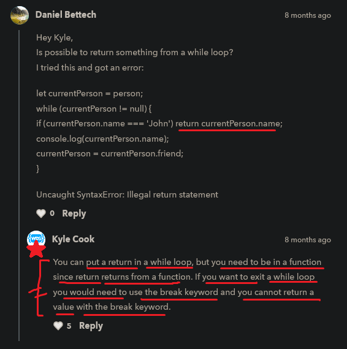

# while loop

    - this is another type of loop

    - it's syntax is different than for loop
        but both works same

## how to define while loop

    - we define starting point for value
        outside the while loop + before defining while loop
    - & then we define condition
        inside parenthesis of while loop
    - & then modification/incrementing/decrementing of value
        we do inside block of code of while loop

    eg : 
        let i = 0 

        while (i < 5) {
            console.log(i)
            i++
        }

    - here while -> is a keyword

    - here using while loop for easier stuff is not good
        we can do this in for loop also

## when we need to use or use case of while loop 🔥

    -> use case of while loop ✅
        - while loop is really useful when
            we don't know how many times we need to run loop/iteration 💡💡💡
    
    eg : using while loop when if we have some form of nested objects ✅

        const person = {
            name : "Teen" , 
            friend : {
                name : "Joe" , 
                friend : {
                    name : "sally"
                }
            }
        }

        - now we want all the different friends name of that person object
            so to do this it's really easy with a while loop 💡💡💡

        const currentPerson = person

        while (currentPerson.friend != null) {
            console.log(currentPerson.name)

            currentPerson = currentPerson.friend
        }

        // output : Teen
                    Joe
                    {name: 'sally'}

        - here we can see that we're not getting the sally as a value
            because we're checking the friend object inside currentPerson object
            but there is no friend object after name : "sally" ✔

        - so we need to check the currentPerson object only like this ✔ 

        while (currentPerson != null) {
            console.log(currentPerson.name)

            currentPerson = currentPerson.friend
        }       

        // output : Teen
                    Joe
                    Sally

    - so here we can see that 
        in this situation while loop is very useful 
        because we don't know how much that object is deeply nested 💡💡💡
    - that's why we used while loop

        NOTE : for what reason we use null -> as a value ✅

            - null -> value represent lack of identification or
                    that a variable points points to no object 💡💡💡

## examples - of break & continue keywords inside while loop 

    const person = {
        name : "Teen" , 
        friend : {
            name : "Joe" , 
            friend : {
                name : "sally"
            }
        }
    }

    eg : using break keyword inside while loop

        const currentPerson = person
        
        while (currentPerson != null) {
            if (currentPerson.name === "Joe") break

            console.log(currentPerson.name)
            currentPerson = currentPerson.friend
        }

    eg : using continue keyword inside while loop

        const currentPerson = person
        
        while (currentPerson != null) {
            if (currentPerson.name === "Joe") continue

            console.log(currentPerson.name)
            currentPerson = currentPerson.friend
        }    

        - here we'll not get any output 
            because this while loop goes in infinite
            means control will go to condition directly 
            & that's why these two lines of code will never execute ✔️
            console.log(currentPerson.name)
            currentPerson = currentPerson.friend

## Note - about loop 🔥

    - if we want to return something from a any type of loop
        then we need to use function also
        because we can't define return keyword directly from inside any loop 💡💡💡

    - if we want to stop/exit from a loop (like for loop , etc..) 
        then use break keyword with condition inside of that loop 💡💡💡

    - we can't return something through using break keyword from inside a loop
        because since break keyword is used to stop/exit from a loop ✔️

## said by kyle 🔥

    - when the situation comes 
        that object is too much nested like 3 level nested or deeper nested
        & we don't know how many times we need to loop through that object
        then we use while loop instead of for loop 💡💡💡

    - but generally that type of nested object scenario/situation won't come very often
        so generally use for loop ✔️

    - but when that nested object scenario comes 
        or where we don't know how much we need to loop through 
        then use while loop 💡💡💡

    - & these are not thing we see very often ✔✔ 

## discussion page

