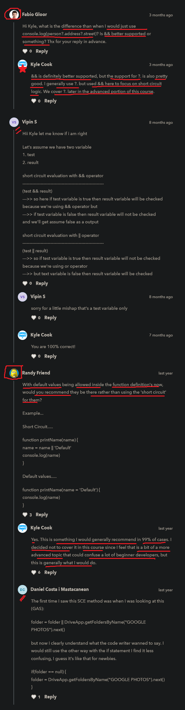

# short circuit evaluation 

    - most important 🔥🔥

    - short circuit evaluation is something 
        that we'll see all the time in JS 💡💡💡
    - so this topic is really important to understand exactly how it works

    - it used to make code short & readable for checking the condition 💡💡💡
        instead of using if or if else statement for checking the condition 

    - previously we were comparing different boolean values ✔️

    - we use if statement to make a condition
        but instead of using if statement
    - we'll use -> short circuit evaluation which is a better way 
        than using if else statement 💡💡💡

    - short circuit evaluation 💡💡💡
        - is also used to give condition in a different way
        - we use || & && logical operator to make condition
            in much simpler way instead of using if statement 

    - only two most used logical operators in short circuit evaluation is 💡💡
        - || -> double pipe symbol (means OR logical operator)
        - && -> double ampersand symbol (means AND logical operator)  
    - and use these two logical operators according to situation 

## prerequisties

    - we should know about before doing this topic
        - || & && logical operator
        - falsy values
        - boolean values 
        - if statement

## Note - of short circuit evaluation ✅

    - in it , an expression with || & && logical operators
        is evaluated/starts by default from left to right 

- for more - check about operator precedence :
https://developer.mozilla.org/en-US/docs/Web/JavaScript/Reference/Operators/Operator_Precedence

## examples - of short circuit evaluation with || & && logical operators ✅

    -> short circuit evaluation with || (OR logical operator) 

        - in || (OR logical operator) , if anyone condition is true 
            then we'll get true as a output

        eg : 
            false || true || false

            // output : true

    -> short circuit evaluation with || (OR logical operator) 

        - in && operator , if anyone condition is false
            then we'll get false as a output
        
        eg : 
            false && true && false
            // output : false

        - but in && operator , if all the condition is true
            then we'll get true as a output 

        eg : 
            true && true && true
            // output : true

    NOTE : about short circuit evaluation ✅

        - short circuit evaluation concept only happen 
            with boolean values 💡💡💡
        - & only two logical operators used in this concept i.e 
            || (OR logical operator) & && (AND logical operator) 💡💡💡

## explanation of short circuit evaluation with && & || logical operators 🔥

    - let's assume we have two variables

    -> short circuit evaluation with || -> OR logical operator ✅

        eg : 
            (a || b)

             a -> first operand 
             b -> second operand   

        case 1 : if first part of the condition i.e "a" variable is true 
                then second part of the condition i.e "b" variable will not be checked/run
                because we're using || (OR logical operator) 💡💡💡
                & due to short circuit also

        case 2 : but if "a" variable is false then "b" variable will be checked 💡💡💡

    -> short circuit evaluation with && -> AND logical operator ✅

        eg : 
            (a && b)

            a -> first operand 
            b -> second operand   

        case 1 : if first part of the condition i.e "a" variable is true 
                then second part of the condition i.e "b" variable will be checked/run by JS
                because we're using && (AND logical operator) 💡💡💡
                & due to short circuit also

        case 2 : but if first part of the condition i.e "a" variable is false 
                then JS will do short circuit 
                & second part of the condition i.e "b" variable will not be checked by JS 
                & we'll get output -> false 💡💡💡

    NOTE : ✅

        - so ultimately short circuit means
            skipping that other parts of the condition from checking/running
            according to whether that first part of the condition is true or false
            while using || & && logical operators 💡💡💡

## explanation + examples - of short-circuit evaluation (JS nuggests YT) 🔥

    for more - check this video : https://www.youtube.com/watch?v=FooxonZQnRc&ab_channel=JSNuggets

    eg 1 : short-circuit evaluation with && operator ✅

        if (4 > 5 && 5 > 6) {
            console.log("Hi")
        } else {
            console.log("No")
        }

        // output : No

        - so if first part of the condition i.e 4 > 5 -> is false 
            then JS will not evaluate/check/run the second part of the condition i.e 5 > 6 💡💡💡
        - but if first part of the condition is true
            then JS will check/evaluate/run the second part of the condition i.e 5 > 6 💡💡💡

        - so here JS is skipping that second part of the
            based on whether first part of the condition is true or not
            that's skipping means JS doing short circuit evaluation 💡💡💡

    - we can actually write that if else statement
        in another way which is better + more readable than if else statement 💡💡💡
        like this 

    eg 1.1 : checking condition without using if else statement ✅

        - important example 🔥

        let test = true

        let isTrue = function() {
            console.log("test is true")
        }

        let isFalse = function() {
            console.log("test is false")
        }

        - Now if we use if else statement 
            if (isTrue) {
                isTrue()
            } else {
                isFalse()
            }
        - here using if else statement to do short circuit
            is not a better way + is a slow way to check condition 💡💡

        - there is the better way to check the condition
            & more readable than if else statement 💡💡💡
        eg : 
            test && isTrue()

        case 1 : so here if first part of the condition i.e test -> is true
            then second part of the condition i.e isTrue() will be checked/evaluated/run 💡💡💡
        case 2 : but if first part of the condition i.e test -> is false
            then second part of the condition i.e isTrue() will not be checked/evaluated/run 💡💡💡

        - so here we converted that only if statement 
            into one line to check the condition without using if -> keyword ✔️ 

    eg 2 : short circuit evaluation with || operator ✅

        let test = false ---> here we changed true -> as a value into false 

        let isTrue = function() {
            console.log("test is true")
        }

        let isFalse = function() {
            console.log("test is false")
        }

        if(!test) {
            isFalse()
        }

        // output : test is false

        - but short circuit way of doing without using if -> keyword 💡💡💡
            like this 
            
            test || isFalse()

            // output : test is false

        case 1 : here if first part of the condition i.e test -> is true
                then second part of the condition i.e isFalse() -> will not run/checked/evaluated
                because we're using || (OR logical operator) 💡💡💡

        case 2 : but if first part of the condition i.e test -> is false
                then second part of the condition i.e isFalse() -> will be checked 💡💡💡

## another example - short circuit can used to set a default value for a function (JS nuggests YT) 🔥

    - important example 🔥

    - this is the another way that short circuit evaluation
        can be used is to set a default value/argument for a parameter of a function 💡

    eg : doing short circuit evaluation with || operator ✅
        function theSameOldFoo(name) {
            name = name || "bar"
            console.log(`my best friend's name is ${name}`)
        }

        theSameOldFoo()
        theSameOldFoo("Teen")

        case 1 : of calling a function without any argument ✅

            - when we called that function without giving any argument
                then value of name parameter is now -> undefined
                & undefined -> is a falsy value
            - so name = undefined || "bar" 
            - here we're using || (OR logical operator)
                so then here first part of the condition is false
                then second part of the condition will run/check/evaluated
            - that's why inside name -> variable , default variable gets stored 💡💡💡 
                i.e name = "bar"
        
        case 2 : of calling a function with a argument ✅

            theSameOldFoo("Teen")

            - here this "Teen" value will be stored like this
                name = name || "bar" 
                name = "Teen" || "bar"
            - now Teen" will be stored inside "name" -> variable 
                & that default value i.e "bar" will not be stored 💡💡💡

            - so here first part of the condition i.e name -> is true
                so second part of the condition i.e "bar" will not be checked/run/evaluated 💡💡💡

    NOTE : about || & && logical operators ✅

        - there are two important things of || & && logical operators in JS     
            1 - they start evaluating by default from left to right
                & this is depends on operator precedence also 💡💡
            2 - they do short-circuit/skip evaluation from checking the condition
                according to whether if first part of the condition is true or false
                to check further part of the conditions 💡💡

# example 2 - short circuit evaluation with || & && operators (JS nuggests YT) 

    eg : checking condition by using short circuit way with || operator ✅
        let x ;
        let y = "Teen" 
        let z = "This will not evaluate"

        const name = x || y || z  --> here we're checking condition without if else statement 💡💡💡

        console.log(name)

        // output : Teen

    NOTE : 

        - so in || operator , 
            here first part of the condition i.e x -> is false because value of x is undefined
            so second part of the condition i.e y -> is true so it will be evaluated/run/executed
            but third part of the condition i.e z -> will not be checked/run
                because second part of the condition is true 💡💡

    eg : checking condition by using short circuit way with && operator ✅

        let age = 12

        function driveCar() {
            return "Driving car"
        }

        let result = age > 18 && driverCar()

        console.log(result) 
        // output : Driving Car

    NOTE :

        - so in && operator , 
            - first part of the condition i.e age > 18 -> is false
            so second part of the condition i.e driverCar() -> will be be executed/run/checked 💡💡

## lecture - of kyle

    eg : of short circuit evaluation using || & && operators ✅

        function printTrue() {
            console.log("yeah true")
            return true
        }

        function printFalse() {
            console.log("no it's false")
            return false
        }

        printTrue() || printFalse() // output : yeah true
        
        printFalse() || printTrue() // output : no it's false
                                                yeah true
        

        printFalse() && printTrue() // output : not it's false

        - because in && operator , 
            if first part of the condition is false
            then second part of the condition will not be checked/run 💡💡💡

        printTrue() && printFalse() // output : yeah true
                                                false

        - because in && operator ,
            if first part of the condition is true
                then second part of the condition will be checked & executed/evaluated 💡💡💡

## Note + examples - about short circuit evaluation (by kyle) 🔥

    - important examples 🔥

    - using if or if else statement for checking the condition
        but short circuit evaluation is more better way to check the condition

    - why is short circuit evaluation is useful 
        because there're two specific scenarios where we will use each of these 💡💡💡
            - short circuit evaluation with || (OR logical operator)
            - short circuit evaluation with && (AND logical operator)

    eg 1 : normal if statement + short circuit evaluation with || (OR logical operator) 

        - let's say we want to give default name to user
            if user doesn't specify his/her name ✔️

        function printName(name) {
            if (name == null) {
                name = "Default"
            }

            console.log(name)
        }

        printName("Teen")
        // output : Teen

        printName()
        // output : default

        - now instead of using if statement , 
            we can use short circuit evaluation way 💡💡💡
            like this 

        function printName(name) {
            name = name || "default name"

            console.log(name)
        }

        printName()
        // output : default name

        printName("Teen")
        // output : Teen

    eg 2 : normal if statement + short circuit evaluation with && (AND logical operator)

        const person = {
            address : {
                street : "main st"
            }
        } 

        // if statement with && operator
        if (person != null && person.address != null) {
            console.log(person.address.street)
        }

        - here we can see that to check the condition we wrote a bulky code ✔️
            so we can use short circuit way

        // short circuit way
        console.log(person && person.address && person.address.street) 💡💡💡

        // output : main st

        eg 2.1 : person variable is undefined  

            const person = undefined
            console.log(person && person.address && person.address.street)

            // output : undefined

        eg 2.2 : person variable has empty object

            const person = {

            }

            console.log(person && person.address && person.address.street)

            // output : undefined
    
    NOTE : important 🔥

        if (person != null && person.address != null) {
            console.log(person.address.street)
        }

        - to check the condition using if statement
            then we need to write extra value to check 
        - like here we used null -> value
            to check against that value

        - but to check the condition using short circuit way
            we don't need to write extra value to check
            we can directly put that value which we want to access 💡💡💡 
            like this 
            console.log(person && person.address && person.address.street)
        - here JS will do automatically short circuit based on falsy values 💡💡💡

## said by kyle 🔥

    - so if we need to deeply access that property
        inside of an object & we don't know if that property exist or not
        then separate them by that && (AND logical operator)
        is a great way to do that

    - short circuit evaluation way used most of the time in JS 💡💡

    - use short circuit evaluation way to check the condition
        instead of checking condition through if else statement 💡💡💡
        because short circuit evaluation way 
        is better way + more readable + less writing code

    - in short circuit evaluation ,
        we'll use && (AND logical operator) most of the time
        & || (OR logical operator) used 20% of the time 💡💡💡
    
## discussion page

