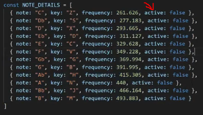

# midi piano

    - we'll make piano using keyboard types of events

    - here we'll use all those topics
        like if statement , switch statement , for loop , while loop , etc

## starter code

html code

```html
<!DOCTYPE html>
<html lang="en">
  <head>
    <title>Midi Piano</title>
    <script src="script.js" defer></script>
    <link rel="stylesheet" href="styles.css" />
  </head>
  <body>
    <div class="piano">
      <div data-note="C" class="key white"></div>
      <div data-note="Db" class="key black"></div>
      <div data-note="D" class="key white"></div>
      <div data-note="Eb" class="key black"></div>
      <div data-note="E" class="key white"></div>
      <div data-note="F" class="key white"></div>
      <div data-note="Gb" class="key black"></div>
      <div data-note="G" class="key white"></div>
      <div data-note="Ab" class="key black"></div>
      <div data-note="A" class="key white"></div>
      <div data-note="Bb" class="key black"></div>
      <div data-note="B" class="key white"></div>
    </div>
  </body>
</html>
```

css code

```css
*,
*::before,
*::after {
  box-sizing: border-box;
}

body {
  background-color: #143f6b;
  margin: 0;
  min-height: 100vh;
  display: flex;
  justify-content: center;
  align-items: center;
}

.piano {
  display: flex;
}

.key {
  height: calc(var(--width) * 4);
  width: var(--width);
}

.white {
  --width: 100px;
  background-color: white;
  border: 1px solid #333;
}

.white.active {
  background-color: #ccc;
}

.black {
  --width: 60px;
  background-color: black;
  margin-left: calc(var(--width) / -2);
  margin-right: calc(var(--width) / -2);
  z-index: 2;
}

.black.active {
  background-color: #333;
}
```

js code

```js
const NOTE_DETAILS = [
  { note: "C", key: "Z", frequency: 261.626 },
  { note: "Db", key: "S", frequency: 277.183 },
  { note: "D", key: "X", frequency: 293.665 },
  { note: "Eb", key: "D", frequency: 311.127 },
  { note: "E", key: "C", frequency: 329.628 },
  { note: "F", key: "V", frequency: 349.228 },
  { note: "Gb", key: "G", frequency: 369.994 },
  { note: "G", key: "B", frequency: 391.995 },
  { note: "Ab", key: "H", frequency: 415.305 },
  { note: "A", key: "N", frequency: 440 },
  { note: "Bb", key: "J", frequency: 466.164 },
  { note: "B", key: "M", frequency: 493.883 },
];
```

    // output :


## Note ✅

    - here we gave that variable name i.e NOTE_DETAILS in all captial letters
      because it's a constant variable
      means the variable this variable doesn't change or remain static
      & this is common convention in JS 💡💡💡

## about starter code

- here we have a many keys like when we click z -> key on keyword
  then note -> will be C
- here each note -> has their own frequency
  so that way we can play frequency through our speakers ✔️

- so what we need to do is that when we click a key on our keyboard
  we want to play that note -> which is associated with that key
- & as we hold that key down that we clicked on our keyboard then
  we want to play that -> note till we're holding
  & only stop that note -> when we release that key ✔️

- so we need to figure it out that when we hit a key on our keyboard
  as well as when we release that key on our keyboard ✔️

- we have many different types of events related to keyboard
  but we'll use only two types of keyboard events i.e keydown & keyup event types

## code

- in JS , we have JSON data which is a array of objects

## explanation of JS code

    STEP 2.1 : checking keydown & keyup events types

      document.addEventListener('keydown' , e => {
        console.log("down")
        console.log(e)
      })

      document.addEventListener("keyup" , e => {
        console.log("up")
        console.log(e)
      })

      // output : when click any key through our keyboard let's say Z key pressed
                  then keydown -> event will run & as soon as we release that Z key
                  then keyup -> event will run 💡💡💡


      - if we see that keyboard event object
          then there are important properties of keyboard event object like
            - code property ✅
                - means give that key which we pressed eg : keyA - means we pressed a -> key
            - key property ✅
                - means it only give that key name without key -> word
            - repeat property ✅
                - means if we don't release that key which we pressed
                  then again & again keydown event will run
                  & that keyboard object will be printed till we hold that key 💡💡💡

    STEP 2.2 : stopping the keyboard event from repeating when we hold any key ✅

      - we don't that keyboard event run again & again
        if we hold any key on keyboard
      - so to stop that keyboard event from recalling again & again ✔️
          we'll just return out from the keydown event by using return keyword
          like this

      document.addEventListener('keydown' , e => {
        if (e.repeat) return

        console.log("down")
        console.log(e)
      })

      - here
        +----------------------+
    +-->| if (e.repeat) return |
    |   +----------------------+
    |
    +-> this generally means a guard clause
          because it protect/guard us from continuing/repeating
          inside of our function
      - & guard clauses are usually written inside the function
        & at the very top of our function
      - it's a great thing to have + makes code much cleaner 💡💡💡

      NOTE :

          document.addEventListener('keydown' , e => {
            if (e.repeat) return

            console.log("down")
            console.log(e)
          })

        - here we could do like this also inside the keydown event
            if (!e.repeat) {
                console.log("down")
                console.log(e)
            }
        - but this code is harder to read
          that's why above code is better to read which is with guard clause ✔️

        - for more about writing Guard clause condition in JS
          https://www.youtube.com/watch?v=JnFh2NoAM4s&ab_channel=WebDevSimplified

      // output : now if we hold let's say D key then if we don't release that D key
                  then still that keyboard event doesn't print again & again except only one time
                  & then after releasing that D key then keyup event will run ✔️


    STEP 3 : getting detail of a particular Note -> based on which key we pressed ✅

        - key & code properties ✅
            - both will give key name which is pressed
            - but key -> property give only a key name in a capital + smaller letter
                  based on capslock is ON or OFF like this
            - & code -> property give a key name in capital letter always
                        doesn't matter capslock is ON or OFF
                        but before that key name , Key -> word will come always
                        like this - KeyA 💡💡💡


        document.addEventListener('keydown' , e => {
          if (e.repeat) return

          const keyboardkey = e.code
          const noteDetail = getNoteDetail(keyboardKey)
        })

        document.addEventListener("keyup" , e => {
          console.log("up")
          console.log(e)
        })

        function getNodeDetail(keyboardKey) {
          return NOTE_DETAILS.find(n => `Key${n.key}` === keyboardKey)
        }

        - here we used find() array method
          & inside of it we gave a condition that
          if a key match from which we pressed & from JSON data then we'll get the object
          of related to that key which we pressed
        - but if that key didn't present in our JSON Data
          means condition gets false then find() method return -> undefined

        - here we also used code -> property of keyboard object

        // output : when we click Z key then


        - so here we got the object of Z key

        // output : what if we click that Key which is not present in our JSON data
                    let's say we pressed A key


        - so we'll get undefined

    STEP 4 : doing premature exit if we don't have noteDetail for that key which doesn't exit + which exist ✅

        document.addEventListener("keydown" , () => {
          if (e.repeat) return

          const keyboardKey = e.code
          const noteDetail = getNoteDetail(keyboardKey)

          if (noteDetail == null) return // doing premature exit

          noteDetail.active = true // tells that the key is pressed that's the active key
          playNotes() // now here we'll play our notes/sounds
        })

        document.addEventListener("keyup" , e => {
          console.log("up")
          console.log(e)
        })

        function getNodeDetail(keyboardKey) {
          return NOTE_DETAILS.find(n => `Key${n.key}` === keyboardKey)
        }

        function playNotes() {
          console.log("play notes")
        }

        - here if we click a key -> which exist inside that JSON data then
          here "play notes" message will be printed
        - but if we press a key which doesn't exists
          then "play notes" message will not be printed ✔️

        - so playNotes() function will run when noteDetail is true
          otherwise playNotes() function will not run & doesn't make any sound

    STEP 5 : stopping the playNotes() when we release the key ✅

        document.addEventListener("keydown" , () => {
          if (e.repeat) return

          const keyboardKey = e.code
          const noteDetail = getNoteDetail(keyboardKey)

          if (noteDetail == null) return // doing premature exit

          noteDetail.active = true // tells that the key is pressed that's the active key
          playNotes() // now here we'll play our notes/sounds
        })

        document.addEventListener("keyup" , e => {
          if (e.repeat) return

          const keyboardKey = e.code
          const noteDetail = getNoteDetail(keyboardKey)

          if (noteDetail == null) return

          noteDetail.active = false
          playNotes()
        })

        function getNodeDetail(keyboardKey) {
          return NOTE_DETAILS.find(n => `Key${n.key}` === keyboardKey)
        }

        function playNotes() {
          console.log("play notes")
        }

        - so we set the note -> start when we hold key
          & stop when we release the key ✔️

        - inside css file , we have a active class that we set
          when we play a note

    STEP 6 : getting all the notes based on data attribute & setting active class which is active note ✅

        function printNotes() {
          NOTE_DETAILS.forEach(n => {
            const keyElement = document.querySelector(`[data-note="${n.note}"]`)
            keyElement.classlist.toggle("active" , n.active)
          })
        }

        - here this line means -> keyElement.classlist.toggle("active" , n.active)
          that we want to toggle the active class based/depending on n -> is true or false

        // output : if we press like Z key then at the same time all the keys will change their
                    background-color also

      - so we need to set the default value for active class
        so there are two ways to do this

        first way - do short circuit evaluation
            function printNotes() {
              NOTE_DETAILS.forEach(n => {
                const keyElement = document.querySelector(`[data-note="${n.note}"]`)
                keyElement.classlist.toggle("active" , n.active || false)
              })
            }

        second way - setting active property + false value to every note of JSON data like this



        - so we'll follow the second way

    STEP 7 : now set the sound to active note ✅

        function printNotes() {
          NOTE_DETAILS.forEach(n => {
            const keyElement = document.querySelector(`[data-note="${n.note}"]`)
            keyElement.classlist.toggle("active" , n.active )
          })

          // STEP 7.1
          const activeNotes = NOTE_DETAILS.filter(n => n.active) // getting active note/notes lists
          activeNotes.forEach(n => { // loop through each active note/notes
            startNote(n) // here we're starting the note/notes
          })
        }

        - here we're making array of active notes because
          user can press multiple or single key at the same that's why

    STEP 8 : setting up AudioContext() for the sound ✅

        const audioContext = new AudioContext()

        - put this line of code above the JSON data
          then we'll use oscillator means to generate sound based on frequency 💡

        - createOscillator() method of AudioContext() class 💡

        function startNote(noteDetail) {
          const oscillator = audioContext.createOscillator() // creating oscillator
          oscillator.frequency = noteDetail.frequency // setting the frequency
          oscillator.type = "sine" // type of sound we want to listen
          oscillator.connect(audioContext.destination) // connecting through our speakers
          oscillator.start() // starting our oscillator
        }

        - now we don't have any way to stop our oscillator
          because we don't have reference of oscillator in global scope
            because it's only available inside local scope 💡💡💡

        - so we need to set the oscillator to noteDetail.oscillator
          like this
        function startNote(noteDetail) {
          const oscillator = audioContext.createOscillator()
          oscillator.frequency = noteDetail.frequency
          oscillator.type = "sine"
          oscillator.connect(audioContext.destination)
          oscillator.start()
          noteDetail.oscillator = oscillator // setting oscillator local variable in global scope
        }

    STEP 9 : stopping oscillator ✅

        function printNotes() {
          NOTE_DETAILS.forEach(n => {
            const keyElement = document.querySelector(`[data-note="${n.note}"]`)
            keyElement.classlist.toggle("active" , n.active )

            if (n.oscillator != null) {
              n.oscillator.stop()
              n.oscillator.disconnect()
            }
          })

          const activeNotes = NOTE_DETAILS.filter(n => n.active)
          activeNotes.forEach(n => {
            startNote(n)
          })
        }

        function startNote(noteDetail) {
          const oscillator = audioContext.createOscillator()
          oscillator.frequency = noteDetail.frequency
          oscillator.type = "sine"
          oscillator.connect(audioContext.destination)
          oscillator.start()
          noteDetail.oscillator = oscillator // important 💡💡💡
        }

        - so here we're setting sound to all the notes which is or are pressed by user
          & then if user release all the active notes step by step or all of the same time
          then we disconnect the oscillator() 💡💡

        - here this line of code is important i.e noteDetail.oscillator = oscillator
          this tells that how we can make that local variable into global variable 💡💡💡

        // output : when we press any one single note then things will work properly
                    but if we press more than one than sound will get louder & louder
                    because these different oscillator are stacking on top of each other
                    & each one has volume 100% ✔️
                - so if we play two notes then volume gets 200% & so on ..

    STEP 10 : decreasing sound based on how many notes are played ✅

        - so if one note is active then volume should be 100%
          but if two notes are active then volume should be 50%
          & so on.. as soon as other notes gets active then we want to decrease half of the volume

        function printNotes() {
          NOTE_DETAILS.forEach(n => {
            const keyElement = document.querySelector(`[data-note="${n.note}"]`)
            keyElement.classlist.toggle("active" , n.active )

            if (n.oscillator != null) {
              n.oscillator.stop()
              n.oscillator.disconnect()
            }
          })

          const activeNotes = NOTE_DETAILS.filter(n => n.active)
          const gain = 1 / activeNotes.length // here decrease the volume based on number of active notes
          activeNotes.forEach(n => {
            startNote(n , gain)
          })
        }

        function startNote(noteDetail , gain) {
          const gainNode = audioContext.createGain() // creating volume percentage
          gainNode.gain.value = gain // setting volume based on active notes
          const oscillator = audioContext.createOscillator()
          oscillator.frequency = noteDetail.frequency
          oscillator.type = "sine"
          // setting sound percentage with speakers
          oscillator.connect(gainNode).connect(audioContext.destination)
          oscillator.start()
          noteDetail.oscillator = oscillator // important 💡💡💡
        }

        - here const gain = 1 / activeNotes.length
          if one note is active then 1 / 1 -> which is 0 means 100%
          if two notes are active then 1 / 2 -> which is .5 means 50%
          & so on...
        - so here we offset the volume sound based on active notes

        // output : now we'll get perfect output
                    but on problem that frequency of each active note will be same

    STEP 11 : setting different sound/frequency based on number of active notes ✅

        function startNote(noteDetail , gain) {
          const gainNode = audioContext.createGain()
          gainNode.gain.value = gain
          const oscillator = audioContext.createOscillator()
          oscillator.frequency.value = noteDetail.frequency
          oscillator.type = "sine"
          oscillator.connect(gainNode).connect(audioContext.destination)
          oscillator.start()
          noteDetail.oscillator = oscillator // important 💡💡💡
        }

NOTE : - keyCode & which -> properties ✅ - both properties gives ASCII value of that key which is pressed - but both are deprecated

## said by kyle 🔥

- here from this project , important this is


- how we used/refer that global object in different places
- how we active class is working
- playNotes() function
- & how we stopped from playing sound
