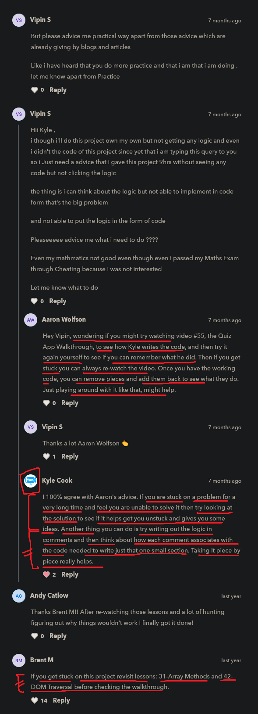

# quiz app intro

    - most important project 🔥

## starter code

html code
```html
<!DOCTYPE html>
<html lang="en">
<head>
  <title>Quiz</title>
  <link rel="stylesheet" href="styles.css">
  <!-- TODO: 1. Link the script tag -->
</head>
<body>
    <div id="alert">
        <div class="alert-title">Congratulations!!</div>
        You got them all right!
    </div>
    <form id="quiz-form">
        <ol>
            <li class="question-item">
                <div>What does this code return? (<code>0 || '' || false || "Hi"</code>)</div>
                <div>
                    <ol>
                        <li class="answer-item">
                            <label>
                                <input class="answer" type="radio" name="answer-1" value="false">
                                <code>0</code>
                            </label>
                        </li>
                        <li class="answer-item">
                            <label>
                                <input class="answer" type="radio" name="answer-1" value="true">
                                <code>"Hi"</code>
                            </label>
                        </li>
                        <li class="answer-item">
                            <label>
                                <input class="answer" type="radio" name="answer-1" value="false">
                                <code>false</code>
                            </label>
                        </li>
                        <li class="answer-item">
                            <label>
                                <input class="answer" type="radio" name="answer-1" value="false">
                                <code>''</code>
                            </label>
                        </li>
                    </ol>
                </div>
            </li>
            <li class="question-item">
                <div>What is it called when a function calls itself?</div>
                <div>
                    <ol>
                        <li class="answer-item">
                            <label>
                                <input class="answer" type="radio" name="answer-2" value="false">
                                Inception
                            </label>
                        </li>
                        <li class="answer-item">
                            <label>
                                <input class="answer" type="radio" name="answer-2" value="false">
                                Self-Referential
                            </label>
                        </li>
                        <li class="answer-item">
                            <label>
                                <input class="answer" type="radio" name="answer-2" value="true">
                                Recursion
                            </label>
                        </li>
                        <li class="answer-item">
                            <label>
                                <input class="answer" type="radio" name="answer-2" value="false">
                                Who Cares
                            </label>
                        </li>
                    </ol>
                </div>
            </li>
            <li class="question-item">
                <div>How do you access the value of the <code>data-count</code> data attribute in JavaScript?</div>
                <div>
                    <ol>
                        <li class="answer-item">
                            <label>
                                <input class="answer" type="radio" name="answer-3" value="true">
                                <code>element.dataset.count</code>
                            </label>
                        </li>
                        <li class="answer-item">
                            <label>
                                <input class="answer" type="radio" name="answer-3" value="false">
                                <code>element.dataAttribute.count</code>
                            </label>
                        </li>
                        <li class="answer-item">
                            <label>
                                <input class="answer" type="radio" name="answer-3" value="false">
                                <code>element.dataset.dataCount</code>
                            </label>
                        </li>
                        <li class="answer-item">
                            <label>
                                <input class="answer" type="radio" name="answer-3" value="false">
                                <code>element.dataCount</code>
                            </label>
                        </li>
                    </ol>
                </div>
            </li>
        </ol>
        <button type="submit">Check</button>
    </form>
</body>
</html>
```

css code
```css
.answer-item {
  list-style: lower-alpha;
}

.question-item {
  margin-bottom: 2rem;
}

.question-item.correct {
  color: green;
}

.question-item.incorrect {
  color: red;
}

.question-item:last-child {
  margin-bottom: 0;
}

.alert-title {
  font-weight: bold;
  margin-bottom: .5rem;
  font-size: 2rem;
}

#alert {
  font-size: 1.25rem;
  position: absolute;
  display: none;
  top: 50%;
  left: 50%;
  transform: translate(-50%, -50%);
  text-align: center;
  padding: 1rem;
  background-color: hsl(100, 80%, 80%);
  border-radius: .5rem;
  color: hsl(100, 80%, 20%);
}

#alert.active {
  display: block;
}
```

js code

```js
/*
  TODO: 2. Select all elements needed
    * The form element (has the id `quiz-form`)
    * The answer inputs (have the class `answer`)
    * BONUS: The questions (have the class `question-item`)
    * BONUS: The alert (has the id `alert`)
*/

// TODO: 3. Create a submit event listener for the form that does the following.
/*     
    1. Prevent the default behaviour
    2. Get all selected answers 
        (use the `checked` property on the input to determine if it is selected or not)
    3. Loop through the selected answer to see if they are correct or not 
        (Check the value of the answer to see if it is the string "true")
    4. For each correct answer add the class `correct` to the parent 
        with the class `question-item` and remove the class `incorrect`.
    5. For each incorrect answer add the class `incorrect` 
        to the parent with the class `question-item` and remove the class `correct`.
    6. BONUS: Make sure unanswered questions show up as incorrect. 
        The easiest way to do this is to add the incorrect class 
        and removing the correct class from all question items before checking the correct answers
    7. BONUS: If all answers are correct show the element with the id `alert` 
        and hide it after one second (look into setTimeout) 
        (use the class active to show the alert and remove the class to hide it) 
*/
```

    // output : 


    // working output 1 : when we choose the options of each question
                        based on whether chosen option is right or wrong then will be the output


    // working output 2 : when we choose the options of each question
                        if all the options of each questions are right then we'll get a message
                        & after few second that message will be removed

        
    // working output 2.2 : if all the options of each questions are right 
                            then message will be removed after few seconds
            
            - & again & again we click to submit after choosing right options 
                then we'll get that message


## Note ✅

    - we notice all the time that 
        kyle first write the main part & after that main part stored inside a variable
        like this 

        STEP 1 : creating a value or code

            document.querySelector("input")

        STEP 2 : storing that code or value inside a variable 

            const inputBox = document.querySelector("input")
    - this helps to build the logic ✔️

## discussion page



