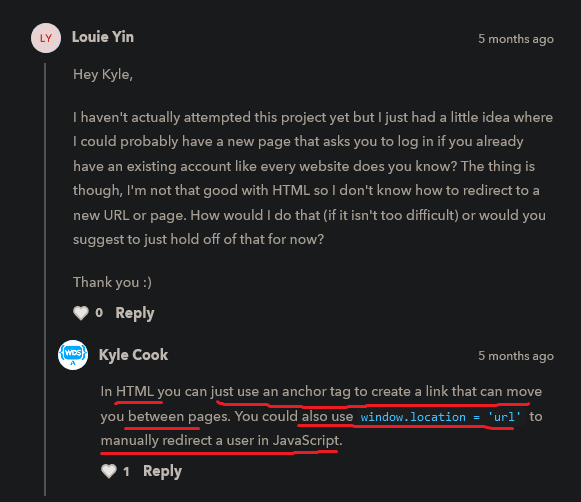

# form validation intro

    - most important project 🔥

## starter code

html code
```html
<!DOCTYPE html>
<html lang="en">
<head>
  <title>Form Validation</title>
  <link rel="stylesheet" href="styles.css">
  <style>
    .errors {
      display: none;
    }

    .errors.show {
      display: block;
    }
  </style>
  <!-- TODO: Add the script tag -->
</head>
<body>
  <form action="thank-you.html" id="form">
    <div class="errors">
      <h3 class="error-title">Error</h3>
      <ul class="errors-list">
      </ul>
    </div>

    <div class="form-group">
      <label for="username">Username</label>
      <input type="text" id="username" name="username">
    </div>

    <div class="form-group">
      <label for="password">Password</label>
      <input type="password" id="password" name="password">
    </div>

    <div class="form-group">
      <label for="password-confirmation">Password Confirmation</label>
      <input type="password" id="password-confirmation" name="password-confirmation">
    </div>

    <div class="form-group">
      <label for="terms">
        <input type="checkbox" id="terms" name="terms">
        Agree To Terms?
      </label>
    </div>

    <button type="submit">Create Account</button>
  </form>
</body>
</html>
```

css code
```css
.errors {
  background-color: hsl(0, 100%, 80%);
  border-radius: .5rem;
  padding: 10px;
  color: hsl(0, 50%, 20%);
  margin-bottom: 1rem;
}

#form {
  margin: 1rem 0;
}

.error-title {
  margin: 0;
  margin-bottom: .5rem;
}

.errors-list {
  margin: 0;
  padding-left: 15px;
}

.form-group {
  margin-bottom: 1rem;
  display: flex;
  flex-direction: column;
  align-items: flex-start;
}
```

js code
```js
// TODO: Select all elements needed
//    Use the HTML to figure out what classes/ids will work best for selecting each element

// TODO: Create an event listener for when the form is submitted and do the following inside of it.
//    TODO: Create an array to store all error messages and clear any old error messages
//    TODO: Define the following validation checks with appropriate error messages
//      1. Ensure the username is at least 6 characters long
//      2. Ensure the password is at least 10 characters long
//      3. Ensure the password and confirmation password match
//      4. Ensure the terms checkbox is checked
//    TODO: If there are any errors then prevent the form from submitting and show the error messages

// TODO: Define this function
function clearErrors() {
  // Loop through all the children of the error-list element and remove them
  // IMPORTANT: This cannot be done with a forEach loop or a normal for loop since as you remove children it will modify the list you are looping over which will not work
  // I recommend using a while loop to accomplish this task
  // This is the trickiest part of this exercise so if you get stuck and are unable to progress you can also set the innerHTML property of the error-list to an empty string and that will also clear the children. I recommend trying to accomplish this with a while loop, though, for practice.
  // Also, make sure you remove the show class to the errors container
}

// TODO: Define this function
function showErrors(errorMessages) {
  // Add each error to the error-list element
  // Make sure to use an li as the element for each error
  // Also, make sure you add the show class to the errors container
}
```

thankyou html code
```html
<!DOCTYPE html>
<html lang="en">
<head>
  <title>Thank You</title>
</head>
<body>
  <h1>Thank you for creating a new account</h1>
  <a href="index.html">Back to sign up page</a>
</body>
</html>
```

    // output : 


    // output : when we directly click to "create account" button
                then directly we move to thank-you.html page
                without any validation

    // working output 1 : without filling any input when we click to create account 
                          then we'll get errors


    // working output 2 : if we check the Agree To Terms ? then 
                          from errors box -> that error will be removed i.e "you must accept the terms"


    // working output 3 : when we give long username then 
                          username error from errorbox will be removed


    // working output 4 : if we give long password 
                          then password error will be removed from errorbox


        - now here on error comes up in errorbox that password are not matching each other
          but if both password gets matched then no error come
          & after clicking the "create account" button then index.html will be move to thank-you.html

## discussion page



