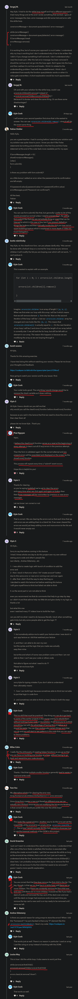

# form validation walkthrough

## js code

```js
// TODO: Select all elements needed
//    Use the HTML to figure out what classes/ids will work best for selecting each element
const form = document.querySelector("#form")
const usernameInput = document.querySelector("#username")
const passwordInput = document.querySelector("#password")
const passwordConfirmInput = document.querySelector("#password-confirmation")
const termsInput = document.querySelector("#terms")
const errorsContainer = document.querySelector(".errors")
const errorsList = document.querySelector(".errors-list")

// TODO: Create an event listener for when the form is submitted and do the following inside of it.
form.addEventListener("submit", e => {
  //    TODO: Create an array to store all error messages and clear any old error messages
  const errorMessages = []
  clearErrors()
  //    TODO: Define the following validation checks with appropriate error messages
  //      1. Ensure the username is at least 6 characters long
  if (usernameInput.value.length < 6) {
    errorMessages.push("Username must be at least 6 characters")
  }
  //      2. Ensure the password is at least 10 characters long
  if (passwordInput.value.length < 10) {
    errorMessages.push("Password must be at least 10 characters")
  }
  //      3. Ensure the password and confirmation password match
  if (passwordConfirmInput.value !== passwordInput.value) {
    errorMessages.push("Passwords must match")
  }
  //      4. Ensure the terms checkbox is checked
  if (!termsInput.checked) {
    errorMessages.push("You must accept the terms")
  }
  //    TODO: If there are any errors then prevent the form from submitting and show the error messages
  if (errorMessages.length > 0) {
    showErrors(errorMessages)
    e.preventDefault()
  }
})

// TODO: Define this function
function clearErrors() {
  // Loop through all the children of the error-list element and remove them
  // IMPORTANT: This cannot be done with a forEach loop or a normal for loop since as you remove children it will modify the list you are looping over which will not work
  // I recommend using a while loop to accomplish this task
  // This is the trickiest part of this exercise so if you get stuck and are unable to progress you can also set the innerHTML property of the error-list to an empty string and that will also clear the children. I recommend trying to accomplish this with a while loop, though, for practice.
  // Also, make sure you remove the show class to the errors container
  while (errorsList.children[0] != null) {
    errorsList.removeChild(errorsList.children[0])
  }
  errorsContainer.classList.remove("show")
}

// TODO: Define this function
function showErrors(errorMessages) {
  // Add each error to the error-list element
  // Make sure to use an li as the element for each error
  // Also, make sure you add the show class to the errors container
  errorMessages.forEach(errorMessage => {
    const li = document.createElement("li")
    li.innerText = errorMessage
    errorsList.appendChild(li)
  })
  errorsContainer.classList.add("show")
}
```

## Steps of code 

    STEP 1 : select all the elements needed

        - selecting the form element + adding submit event to it

        const form = document.querySelector("#form")

        form.addEventListener('submit' , e => {
          // TODO: Create an event listener for when the form is submitted and do the following inside of it.
          // TODO: Create an array to store all error messages and clear any old error messages
          // TODO: Define the following validation checks with appropriate error messages
          //   1. Ensure the username is at least 6 characters long
          //   2. Ensure the password is at least 10 characters long
          //   3. Ensure the password and confirmation password match
          //   4. Ensure the terms checkbox is checked
          // TODO: If there are any errors then prevent the form from submitting and show the error messages
        })

    STEP 2 : selecting other elements for validation

        const form = document.querySelector("#form")
        // selecting usernameInput , passwordInput , passwordConfirmInput & termsInput
        const usernameInput = document.querySelector("#username")
        const passwordInput = document.querySelector("#password")
        const passwordConfirmInput = document.querySelector("#password-confirmation")
        const termsInput = document.querySelector("#terms")

    STEP 3 : creating an empty array to store all the error messages

        form.addEventListener('submit' , e => {
          // TODO: Create an array to store all error messages and clear any old error messages
          const errorMessages = []
          // 
          clearErrors() // clearing old errors
          // TODO: Define the following validation checks with appropriate error messages
          //   1. Ensure the username is at least 6 characters long
          //   2. Ensure the password is at least 10 characters long
          //   3. Ensure the password and confirmation password match
          //   4. Ensure the terms checkbox is checked
          // TODO: If there are any errors then prevent the form from submitting and show the error messages
        })
        
        - right now we're preventing that default action in future 
          we only want to stop our form if user didn't validate the form properly
        - now we'll clearing out our old errors
          by calling clearErrors() function after that empty array variable 
        form.addEventListener('submit' , e => {
          // TODO: Create an array to store all error messages and clear any old error messages
          const errorMessages = []
          e.preventDefault()
          clearErrors() // clearing old errors
        })
        
    STEP 4 : creating condition for username input element to check the validation ✅

        form.addEventListener('submit' , e => {
          e.preventDefault()
          
          const errorMessages = []
          clearErrors()

          // TODO: Define the following validation checks with appropriate error messages
          // 1. Ensure the username is at least 6 characters long
          if (usernameInput.value.length < 6) {
            errorMessages.push("Username must be at least 6 characters")
          }
        })

        // output : when we directly click on "create account" button
                    then we'll get an error i.e "Username must be at least 6 characters"
                    inside that empty array variable


        - now if we type longer username which is contain characters more than 6
          & then if click to create then output will be empty array 💡

    STEP 4.1 : creating conditions for other input elements for validation ✅

        form.addEventListener('submit' , e => {
          e.preventDefault()
          
          const errorMessages = []
          clearErrors()

          // TODO: Define the following validation checks with appropriate error messages
          // 1. Ensure the username is at least 6 characters long
          if (usernameInput.value.length < 6) {
            errorMessages.push("Username must be at least 6 characters")
          }
          // 2. Ensure the password is at least 10 characters long
          if (passwordInput.value.length < 10) {
            errorMessages.push("Password must be at least 10 characters")
          }
          // 3. Ensure the password and confirmation password match
          if (passwordConfirmInput.value !== passwordInput.value) {
            errorMessages.push("Passwords must match")
          }
          // 4. Ensure the terms checkbox is checked
          if (!termsInput.checked) {
            errorMessages.push("You must accept the terms")
          }

          console.log(errorMessages)
        })

        NOTE : important note 🔥

          - here we're using if if statements 
              because all if if statements will be checked + 
              we want to check/validate all the input elements + 
              each if if statements are separate from each other 💡💡💡


        // output : when we directly click to "create account" button then
                    we'll get all the errors which we added inside that empty array variable
                    but we'll not get on error i.e "password must match"


        - if we write password & click to "create account" button
          then we'll get all the errors with that error also i.e "password must match"


        - now all the errors checking done

    STEP 4.2 : preventing the form only if there is any error + show that or those errors ✅

        - we're preventing the form through e.preventDefault() method of event object
          only if there is or are any errors + showing that or those errors ✔️
        
        form.addEventListener('submit' , e => {
          const errorMessages = []
          clearErrors()

          if (usernameInput.value.length < 6) {
            errorMessages.push("Username must be at least 6 characters")
          }
          if (passwordInput.value.length < 10) {
            errorMessages.push("Password must be at least 10 characters")
          }
          if (passwordConfirmInput.value !== passwordInput.value) {
            errorMessages.push("Passwords must match")
          }
          if (!termsInput.checked) {
            errorMessages.push("You must accept the terms")
          }

          // TODO: If there are any errors then prevent the form from submitting and show the error messages
          if (errorMessages.length > 0) {
            showErrors(errorMessages)
            e.preventDefault()
          }

          console.log(errorMessages)
        })   

        - now we don't need to use e.preventDefault() 
          because we already gave this inside that condition i.e errorMessages.length > 0

        NOTE : helper functions ✅

          - now here we can see that using -> helper functions
            means creating each separate functions for individual function
            like we made clearErrors() to clear all the errors + 
              showErrors() to show all the errors 💡💡💡

          - & we just called those function i.e clearErrors() & showErrors() inside submit event of form
            without worrying ourself that what code we'll going to right
            & due to this we just focused on main stuff to implement 💡💡💡 

          - always create individual functions for different work to make code clean + 
            helper functions makes the code much readable 💡💡💡


        // output : now everything works if we fill all the input & click to button
                    but if we directly click on "create account" button
                      after filling half form or not filling at all 
                      then there is not visual indication to show the errors ✔️

    STEP 5 : selecting two elements to show  errors through showErrors() function

        - inside index.html page
          we have div with "errors" class name + ul element with "errors-list" class name ✔️

        const form = document.querySelector("#form")
        const usernameInput = document.querySelector("#username")
        const passwordInput = document.querySelector("#password")
        const passwordConfirmInput = document.querySelector("#password-confirmation")
        const termsInput = document.querySelector("#terms")
        const errorsContainer = document.querySelector(".errors")
        const errorsList = document.querySelector(".errors-list")

        // TODO: Define this function
        function showErrors(errorMessages) {
          // Add each error to the error-list element
          // Make sure to use an li as the element for each error
          // Also, make sure you add the show class to the errors container
          errorMessages.forEach(errorMessage => {

          })
        }

        - now we need to create a new element

    STEP 5.1 : looping through all the errors + code inside showErrors() function
        // TODO: Define this function
        function showErrors(errorMessages) {
          // Add each error to the error-list element
          // Make sure to use an li as the element for each error
          // Also, make sure you add the show class to the errors container
          errorMessages.forEach(errorMessage => {
            const li = document.createElement("li")
            li.innerText = errorMessage
            errorsList.appendChild(li)
          })
          // show the error container
          errorsContainer.classList.add("show")
        }

        // output : now when we click to "create account" button
                    then we'll get all the errors


        - but if we click to that button
          again & again then our all the errors will be repeated over again & again
          inside that error box like this 💡💡💡


        - so we need to clear the errors

    STEP 6 : clearing the errors which are repeating over again & again after clicking on "create account" button 🔥

        - we'll clear out all the old errors in two ways

        first way 
        --------
          function clearErrors() {
            errorsList.innerHTML = ""
          }

          // output : when we directly click to "create account" button 
                      then our old errors will not repeat 
                    - means instead of repeating all the old errors
                      we overwrite all the errors through new errors 💡💡💡
                      as we click on "create account" button 


        second way - removing old errors using while loop inside clearErrors() function ✅ 
        ----------
          - here we need to remove the children

          function clearErrors() {
            while (errorsList.children[0] != null) {
              errorsList.removeChild(errorsList.children[0])
            }
          }

          - here we're actually removing children again & again
            until if there is no more children

          - here we used while loop 
            because to understand the concept of it

    STEP 6.1 : removing the error container if there is no error ✅

          function clearErrors() {
            errorsList.innerHTML = ""

            errorsContainer.classList.remove("show")
          }

    NOTE : in this validation first we're clearing old errors
          & then showing the new errors inside the error box ✔️ 

## discussion page



