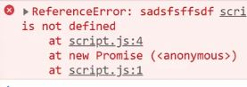
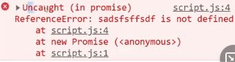
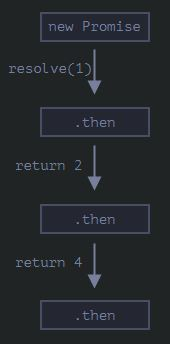
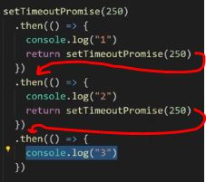
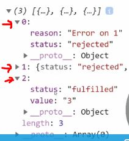
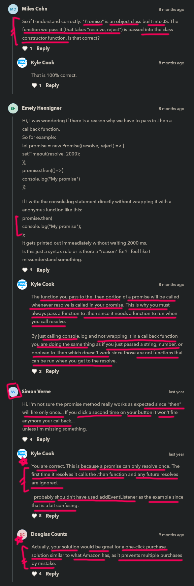

# Promises

    - most important 🔥🔥

    - to save from callback hell that's why promises was introduced
    - Promise is better than callback hell 
        because we can track things easily when we're handling multiple asynchronous operations 💡💡💡
        but to handle multiple asynchronous operations 
        callback is not good & can create callback hell which leads to unmanageable code 

    - promise is a asynchronous code ✔

## what is Promise ✅

    - it's the same thing as a promise in real life
    - means when we're promising to do something 
        & we either do it & succeed
        or we don't do it & we failed 💡💡
    - that's how a promise concept works in JS 

    - Promise is saying that i am going to execute some code
    - if i'm going to execute some code 
        & if i'm successful in executing that code 
        then i'll let you know & give you the result
    - & if i'm unsuccessful in executing that code then
        i'll let you know & just tell you the error 💡💡💡
    
    - 3 states/conditions/stages of promises
        - first is ongoing/pending
        - second is fulfilled/resolve ------+
        //OR                                 |--> depends of condition
        - third is rejected -----------------+

    eg : 
        we'll call you tomorrow at 10am

        -> ongoing/pending state ✅

            - means here that promise is in pending state or just started stage
                right now promise neither fulfilled nor rejected
            // OR
            - initial state, neither fulfilled nor rejected.
            - so if promise is in pending state
                then the result will be undefined 💡

        -> fulfilled state ✅

            - means we got that stuff successfully without any error

        -> rejected state ✅
            
            - means we didn't got that stuff due to error
                like internet error , server error

        - these are three state of promises 
            but fulfilled and rejected we'll listen or see a lot in promises ✔️

    - two ways to use promises ✅
      - first way -> using promise class constructor
      - second way -> using promise by returning it from inside a function  

## first way - using promise as a class constructor 🔥

    NOTE : 📝
        const data = new Promise()

        - whenever we create an object of a Promise() class constructor
            then we need to define a callback function as an argument inside 
            Promise() constructor
        - & that Promise() constructor takes only one callback function 💡💡💡
            and that callback function is known as executor

        - and that callback function takes two arguments 
            - first -> resolve ✅
            - second -> reject ✅
        - and here these two arguments are functions 
            that we're gonna use according to situation
        
        NOTE : ✅
            - while passing those two arguments inside that callback function of a Promise()
                i.e resolve & reject 
            - then pass them in the form of variables 
                don't call them by using parenthesis 💡

        - use resolve() function -> when promise gets fulfilled
        - use reject() function -> when promise gets rejected

        - whenever we create an object of a Promise class then that object has two methods
            - first -> then() method ✅
            - second -> catch() method ✅
        - then() method is related to resolve() function
            and catch() method is related to reject() function
            - so we use then() method to show output of resolve() function 
                means Promise is fulfilled
            - and we use catch() method to show output of reject() function 
                means Promise is rejected due to error

        - means then() method will be called when we call resolve() function
            and catch() method will be called when we call reject() function 💡💡💡

        - after creating Promise means we're producing Promise
            and when we use then() and catch() methods to show output 
            means we're consuming/receiving/getting the Promise

        - then() method takes a callback function as a argument 
            and that callback function takes a parameter 
            for that argument of resolve() function 
            when we pass an argument inside resolve() function
            but if we didn't gave a argument inside resolve() function
            then we don't give a parameter to then() method
        - and same with catch() method and reject() function 💡💡💡

    eg : using Promise as a class constructor with synchronous code ✅

        STEP 1 eg : creating a object of Promise class constructor

            const promise = new Promise()

            - now Promise() class constructor 
                takes only one callback function as an argument

        STEP 2 : passing a callback function as an argument of Promise() constructor 

            const promise = new Promise(() => {})

            NOTE : about a callback function argument of Promise() constructor

                - that callback function we passed as an argument inside of Promise() constructor 
                    will run immediately
                - but when we write code inside that callback function 
                    then those code will take little time to run 
                    like maybe we have a setTimeout() function 
                    or fetching something from a database that takes time ✔️

        STEP 3 eg : passing those two arguments inside that callback function of Promise() constructor

            const promise = new Promise((resolve , reject) => {

            })

            - we can give any name those two arguments 
                but resolve & reject are standard naming conventions

            - now we need to write all the code inside that block of code 
                of that callback function of Promise() constructor 💡

        STEP 4 eg : producing a promise 

            const promise = new Promise((resolve , reject) => {
                const sum = 1 + 1 

                if (sum === 2) {
                    resolve(sum)
                } else {
                    reject("error")
                }
            })

            NOTE : about resolve & reject arguments of that callback function 

                - important note 🔥
                
                - resolve() & reject() variables are functions
                - & these functions run based on true or false 
                    & tells whether that Promise succeeded or failed ✔️
            
                - we can only pass one argument inside resolve() function 
                    & same with reject() 💡💡💡
                - because if we try to give two argument inside resolve() function
                    & if we give two parameter inside then() method 
                    & try to print out those two argument of resolve() function
                    then only first parameter of then() method will be printed 
                    & for second parameter of then() method will give undefined
                - & same with reject() function & catch() method 💡💡💡  

        STEP 4.1 eg : consuming a promise through then() & catch() methods if Promise gets resolve

            const promise = new Promise((resolve , reject) => {
                const sum = 1 + 1 

                if (sum === 2) {
                    resolve("success")
                } else {
                    reject("error")
                }
            })

            // output : success

            - assume that inside of that callback function of Promise() class constructor
                there are some code but those code are not actually asynchronous code 
                & we're doing some querying a database through that line i.e const sum = 1 + 1
                while querying takes 5second to executed
            - just like we do in a setTimeout() function
            - & after querying completed we're checking with condition
                like whether if our "sum" variable is 2 then execute resolve() function
                & if condition is false then execute reject() function 💡💡💡 

        STEP 5 eg : consuming that promise through then() & catch() method if Promise gets reject ✅

            // here we're producing a promise 
            const promise = new Promise((resolve , reject) => {
                const sum = 1 + 2 

                if (sum === 2) {
                    resolve(sum)
                } else {
                    reject("got an error")
                }
            })

            // here we're consuming 
            promise.then(message => {
                console.log(message)
            }).catch(message => {
                console.error(message)
            }) 

            // output : got an error
            
        STEP 6 eg : of having an error inside that callback function of a promise

            const promise = new Promise((resolve , reject) => {
                const sum = 1 + 2

                sadsfsffsdf // here we directly created a variable with let or const keyword 
                
                if (sum === 2) {
                    resolve(sum)
                } else {
                    reject("got an error")
                }
            }) 

            promise.then(message => {
                console.log(message)
            }).catch(message => {
                console.error(message)
            }) 

            // output : we'll get an error i.e 

            - & if we remove that catch() method 
                then we'll get this error i.e 

            - in second error we can see that 
                we got uncaught error
            - because we didn't catch that error by using catch() method
        
        NOTE : about catch() method ✅

            - so it's important to understand when we're dealing with catch() method that 
            - catch() method not only catches when we reject using reject() function
                but it's also catches any form of error
                whether error is an mistyped code or no reference or any error 💡💡💡 
            
            - that's why always catch the error using catch() method 

        NOTE : about resolve() & reject() functions 

            - resolve() function will be executed 
                when the promise was successful
            - & from inside parentheses of resolve() function
                we could return nothing or we could return something 
                but we can only return one argument through resolve() function
            - & same with reject() function

            - to produce a promise we use resolve() & reject() functions 
                & to consume a promise we use then() & catch() methods 💡💡💡 

            - resolve() function is equivalent to then() method 
                & reject() function is equivalent to catch() method 💡💡💡

    - now how we can actually use promises with asynchronous code 
        because whatever code we wrote till uet is not async code 
        & those code runs from top to bottom

    - so let's see second way of using promises i.e returning a promise from a function
        + we'll use only asynchronous code 
                |
                |
                V

## second way -> using promise by returning it from inside a function 🔥

    - now instead of using setTimeout() function directly inside JS file
        we'll use a promise & inside of that promise 
        we'll define that setTimeout() function 💡💡

    eg : using promise by returning it from inside a function with asynchronous code ✅

        STEP 1 eg : using promise by returning it from inside a function

            function setTimeoutPromise() {
                return new Promise((resolve , reject) => {

                })
            }

        STEP 2 eg : writing asynchronous code inside a promise 

            function setTimeoutPromise() {
                return new Promise((resolve , reject) => {
                    setTimeout(() => {
                        console.log("here")
                    } , 250)
                })
            }

            - right now we're producing a promise
                now we need to consume a promise 💡💡💡

        STEP 3 : consuming a promise using then() & catch() methods on that function 

            function setTimeoutPromise(duration) {
                return new Promise((resolve , reject) => {
                    setTimeout(() => {
                        console.log("here")
                    } , duration)
                })
            }

            setTimeoutPromise(250).then(() => {
                console.log("here")
            })
            // OR 
            const promise = setTimeoutPromise(250)
            promise.then(() => {
                console.log("here")
            })

            - here we're not passing callback inside setTimeout() function itself 
            - we can see that we're using then() & catch() methods to print something 
                which are used as the callback 💡💡💡

## difference b/w callback hell & promises ✅

    eg : of callback hell

        setTimeout(() => {
            console.log("1")
            setTimeout(() => {
                console.log("2")
                setTimeout(() => {
                    console.log("3")
                })
            })
        })

        // output : 1
                    2
                    3

        - here each setTimeout() functions are staggered/stack on each other
            so here we have a callback hell problem ✔️
        - but promise solve that callback hell problem

    eg 1 : solving problem of callback hell problem

        function setTimeoutPromise(duration) {
            return new Promise((resolve , reject) => {
                setTimeout(() => {
                    console.log("here")
                } , duration)
            })
        }

        setTimeoutPromise(250).then(() => {
            console.log("1")
            setTimeoutPromise(250).then(() => {
                console.log("2")
            })
        })

        - but here we have same problem i.e callback hell
            due to that , everything is getting deeper & deeper 
            nested inside of each other ✔️

        - that's why here comes Promise chaining concept 💡💡

    eg 1.1 : example of Promise chaining concept ✅

        function setTimeoutPromise(duration) {
            return new Promise((resolve , reject) => {
                setTimeout(() => {
                    console.log("here")
                } , duration)
            })
        }

        setTimeoutPromise(250).then(() => {
            console.log("1")
            return setTimeoutPromise(250)
        }).then(() => {
            console.log("2")
        })

        - in Promise chaining concept , 
            when we return a new promise from inside that starting promise 
            & to consume that new promise we used then() method outside on starting starting promise 

        - means inside first then() method , we're returning a 2nd new promise 
            & to consume that 2nd new promise we used 2nd then() method on 1st then() method
        - but here each then() methods are not nested each other 💡💡💡

        - so here 2nd then() method is corresponds to that 2nd new promise 
            which was returned from inside 1st then() method 💡💡💡

        - now we can do many Promise chaining by using then() method like this 
            // promise chaining 
            setTimeoutPromise(250).then(() => {
                console.log("1")
                return setTimeoutPromise(250)
            }).then(() => {
                console.log("2")
                return setTimeoutPromise(250)
            }).then(() => {
                console.log("3")
                return setTimeoutPromise(250)
            }).then(() => {
                console.log("4")
            })

            ------------ both are same ------------

            // callback hell
            setTimeout(() => {
                console.log("1")
                setTimeout(() => {
                    console.log("2")
                    setTimeout(() => {
                        console.log("3")
                    })
                })
            })

            - here both code are same 
                in callback hell , code is difficult to read
            - but in promise chaining , code is running from top to bottom ✔️ 
        
        - diagram of promise chaining ✅

            - so in second diagram of promise chaining 
                inside 1st then() method we're retuning a 2nd new promise
            - now we're consuming that 2nd new promise 
                we used 2nd then() method on 1st then() method 
            - now again we're returning a 3rd new promise from inside 2nd then() method 
                then we consume that 3rd new promise 
                we used 3rd then() method on 2nd then() method 💡💡💡

            - & we can do many promise chaining we want by using then() method 

## challenge time - timeline - 12:56

    html code 
    ---------
    <button>click me</button>

    js code 
    -------
    const button = document.querySelector("button")

    ques - create a promise for addEventListener

        function addEventListenerPromise(element , method) {
            return new Promise((resolve , reject) => {

            })
        }

        - here element is html element
            & method - means which type of event we want to listen 

        - now we need to finish the rest of the code
            & print out the event object name 

    Ans - 

        function addEventListenerPromise(element , method) {
            return new Promise((resolve , reject) => {
                setTimeout(() => {
                    element.addEventListener(method , e => {
                        resolve(e)
                    })
                } , 250)
            })
        }

        addEventListenerPromise(button , 'click').then(eventType => {
            console.log("clicked")
            console.log(eventType)
            return addEventListenerPromise(button , 'click')
        }).then(eventType => {
            console.log("clicked 2")
            console.log(eventType)
            return addEventListenerPromise(button , 'click')
        }).then(eventType => {
            console.log("clicked 3")
            console.log(eventType)
        })

        - now here we're not using reject() function , 
            because there is nothing scenario creating for failing 

        - but if we're fetching from a URL for 
            eg : fetching during from a database
        - then it could be possible that we failed to connect to database 
            so in that situation we need to use reject() function & catch() method ✔️

    NOTE : about resolve() function & reject() function ✅

        - resolve() function & then() method works corresponding each other 
            & same with reject() function & catch() method 

        - so to get the output of resolve() function 
            then we need to create then() method & vice versa
        - & same with reject() function & catch() method 

## methods of promise 

    - most important 🔥

    - methods of promise are : 
      - all([])
      - any([])
      - race([])
      - allSettled([])
      - finally()

## all([]) method of Promise class ✅

    - all([]) method used to run multiple Promises 
        & to show results of each promises 
        instead of using Promise chaining by then() method again & again 💡💡💡

    - we can show results of multiple promises at a time
        by using all([]) method of Promise class 💡💡💡

    - it return a result of each promises in the form of an array 💡💡💡

    - resolve() function returns a successful promise
        & reject() function returns a failed promise

    NOTE : about all([]) method of Promise class 

        - important note 🔥 

        - Promise.all([]) method will only call/execute each promises successfully 
            when all then() methods of each promises inside of Promise.all([])
            successfully resolved 💡💡💡
        
        - but if any one promise out of all the promises inside of Promise.all([]) method 
            is rejected then that promise will be executed through catch() method 
            & rest of the Promises with resolve() functions will not going to executed 💡💡💡
        - means any one promise is rejected then catch() method will be called 
            & all the promises with resolve() function will not be executed 
            means then() method will not be called 💡💡💡

    eg 1 : of all([]) method of Promise class with synchronous code + every promise resolved

        Promise.all([
            Promise.resolve("1") , 
            Promise.resolve("2") , 
            Promise.resolve("3")  
        ]).then(message => {
            console.log(message)
        })

        - here "P" letter of "Promise" word should be capital 
            because it's a class 💡💡💡

        - here codes are synchronous code 
            so they'll run from top to bottom immediately ✔️

        - here that "message" parameter of callback function of then() method 
            is for each promises which are successfully resolve 💡💡💡

        // output : (3) ["1" , "2" , "3"]

        - here we got all the promises successfully

    eg 1.1 : of all([]) method of Promise class with asynchronous code + every promises resolved

        let p1 = new Promise((resolve , reject) => {
            setTimeout(() => {
                console.log("The first promise has resolved")
                resolve(10)
            } , 1 * 1000)
        })

        let p2 = new Promise((resolve , reject) => {
            setTimeout(() => {
                console.log("The second promise has resolved")
                resolve(20)
            } , 2 * 1000)
        })

        let p3 = new Promise((resolve , reject) => {
            setTimeout(() => {
                console.log("The third promise has resolved")
                resolve(30)
            } , 3 * 1000)
        })

        Promise.all([ p1 , p2 , p3 ]).then(message => {
            console.log(message)
        }).catch(error => {
            console.error(error)
        })

        // output : The first promise has been resolved
                    The second promise has been resolved
                    The third promise has been resolved
                    (3) [10, 20, 30]

        - here we use Promise.all([]) method with asynchronous code 
            so we all the promises resolve successfully 

    eg 2 : of all([]) method of Promise class with synchronous code + using reject() function 

        - important example 🔥

        Promise.all([
            Promise.resolve("1") , 
            Promise.reject("Error on 2") , 
            Promise.resolve("3")  
        ]).then(message => {
            console.log(message)
        }).catch(error => {
            console.error(error)
        })
        
        // output : Error on 2

        - here we can see when we use all([]) with Promise class 
            then we only got the output of 2nd reject() function 
            but all the resolve() functions are not executed 
            means then() method doesn't called 💡💡💡

    eg 2.1 : of all([]) method of Promise class with asynchronous code + using reject() function 

        let p1 = new Promise((resolve , reject) => {
            setTimeout(() => {
                console.log("The first promise has been resolved")
                resolve(10)
            } , 1 * 1000)
        })

        let p2 = new Promise((resolve , reject) => {
            setTimeout(() => {
                console.log("The second promise has been failed")
                reject("failed")
            } , 2 * 1000) // 4 * 1000
        })

        let p3 = new Promise((resolve , reject) => {
            setTimeout(() => {
                console.log("The third promise has been resolved")
                resolve(10)
            } , 3 * 1000)
        })

        Promise.all([ p1 , p2 , p3 ]).then(message => {
            console.log(message)
        }).catch(error => {
            console.error(error)
        })

        // output : The first promise has been resolved
                    The second promise has been failed
                    failed
                    The third promise has been resolved

        - here we can see that when we used all([]) method of Promise class 
            with asynchronous code + reject() function 
            then we just only got output of reject() function means catch() method called
        - but all the resolve() functions are not executed means then() method not executed 💡💡💡 

   - extra stuff  
    method") 

## any([]) method of Promise class ✅

    -> any([]) method 
        - used if any -> only first one promise is successfully resolve/executed
            from many promises whether those are rejected or resolve doesn't matter
        - then only that first one promise will be printed/executed 
        - & rest all the promises will not be executed 💡💡💡 

        - it'll not execute only that first one promise which is reject through reject() function
            means any([]) method will execute only that first one promise 
            which is successfully executed 💡💡💡 

        - doesn't not return result in the form of an array 💡
            which type of value result we'll get it depends on result value only 

    eg : 

        Promise.any([
            Promise.reject("Error on 1") , 
            Promise.reject("Error on 2") , 
            Promise.resolve("3") ,   
            Promise.resolve("4")  
        ]).then(message => {
            console.log(message)
        }).catch(error => {
            console.error(error)
        })

        // output : 3 

        - here we got only first one promise which is resolved 
            but rest of the promises didn't executed 
            whether all they are resolve or reject doesn't matter 💡💡

        - here codes which are inside the any([]) method of Promise class or object
            are not asynchronous code that's why those codes run from top to bottom ✔️

## race([]) method of Promise class ✅

    -> race([]) method 
        - it's like any([]) method of Promise class or object

        - it give only that first one promise 
            whether it can be either resolve or reject doesn't matter
        - & rest of all the promises will not be executed 💡💡💡

    eg 1 : 
        
        Promise.race([
            Promise.reject("Error on 1") , 
            Promise.reject("Error on 2") , 
            Promise.resolve("3") ,   
            Promise.resolve("4")  
        ]).then(message => {
            console.log(message)
        }).catch(error => {
            console.error(error)
        })

        // output : Error on 1

    eg 2 : 
        
        Promise.race([
            Promise.resolve("0") ,   
            Promise.reject("Error on 1") , 
            Promise.reject("Error on 2") , 
            Promise.resolve("3") ,   
            Promise.resolve("4")  
        ]).then(message => {
            console.log(message)
        }).catch(error => {
            console.error(error)
        })

        // output : 0

    - here codes which are inside the race([]) method of Promise class or object
        are not asynchronous code that's why those codes run from top to bottom ✔️
    - so we need to understand that in asynchronous code , 
        output will be different 💡💡💡

## allSettled([]) method of Promise class ✅

    -> allSettled([]) method 
        
        - it gives all the promises whether some are resolve & some are reject
            or all promises are resolve or all are reject doesn't matter 💡💡💡

        - & here then() method will be called 
            doesn't matter if all the promises are rejected 
            that's why catch() method doesn't play any role with allSettled([]) method 💡💡💡
        - means allSettled([]) method will waits for every single one to finish

        - return a output in the form -> array of objects 💡💡💡

    eg 1 : of allSettled([]) method + some promises are resolve & some are reject

        Promise.allSettled([   
            Promise.reject("Error on 1") , 
            Promise.reject("Error on 2") , 
            Promise.resolve("3") 
        ]).then(message => {
            console.log(message)
        }).catch(error => {
            console.error(error)
        })

        // output : 

        - here we can see that we got output is in array of objects 
            & each object contains two keys & their own value about each promises 
            i.e reason & status properties  

    eg 2 : of allSettled([]) method + all promises are reject 

        - important example 🔥

        Promise.allSettled([   
            Promise.reject("Error on 1") , 
            Promise.reject("Error on 2") , 
            Promise.reject("Error on 3") ,  
        ]).then(message => {
            console.log(message)
        }).catch(error => {
            console.error(error)
        })

        // output : we'll get all the promises printed out 
                    even if all promises are rejected

        - so here only then() method gets executed
            even if all the promises are rejected
        - that's why catch() method doesn't play any role with allSettled([]) method 💡💡💡

## finally() method of Promise class ✅

    -> finally() method 
        - we used on catch() method 
            means first then() method comes 
            then catch() method will come on that then() method 
            & then finally() method will come on a catch() method ✔️ 

        - doesn't take any parameter

        - finally() method will always be executed  💡💡💡
            doesn't matter whether that promise resolve or reject doesn't matter

    eg 1 : of finally() method with a Promise which resolve 

        const promise = Promise.resolve("here")
        
        promise.then(message => {
            console.log(message)
        }).catch(error => {
            console.error(error)
        }).finally(() => {
            console.log("finally we got the output")
        })

        // output : here
                    finally we got the output

    eg 2 : of finally() method with a Promise which reject

        const promise = Promise.reject("here")
        
        promise.then(message => {
            console.log(message)
        }).catch(error => {
            console.error(error)
        }).finally(() => {
            console.log("finally we got the output")
        })

        // output : error
                    finally we got the output

        NOTE : ✅

            - here we can see that we didn't use the new -> keyword on this line 
                const promise = Promise.reject("here")

            - because If we want to create a brand new promise 
                then we need to use new -> keyword to create the new object of Promise() class 
                Otherwise we don't need to use new -> keyword 
                if we're creating only one object of Promise() class 💡💡💡 

    - finally() method of Promise() class is a great way to clean things up 
        if we want to execute code no matter whether that promise resolve or reject ✔️

## discussion page 

