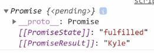
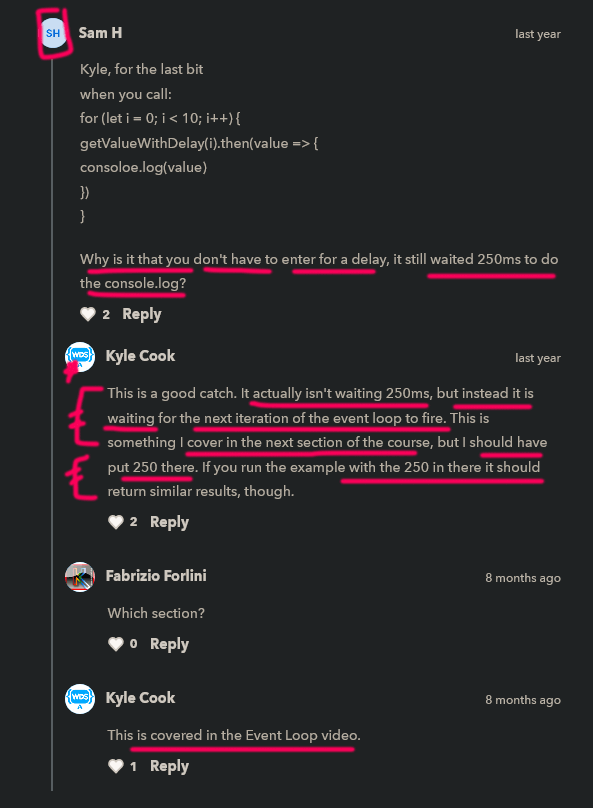

# async await 

    - most important 🔥🔥

    - it's a another way to handle promises + write in clear way ✔️
    
    - async await was introduced because 
        when we're doing Promise chaining by using then() method again & again 
        to get the result of each new promises
        then due to that code gets messed up & not readable ✔️
    - so problem was coming only when we're consuming each new promises 
        by using then() method again & again 
        that's why async await() was introduced
    - so in async await we don't need to use then() method 💡💡

    - is also know as promise async await
    
    - async await works asynchronously that's why
        it returns a promise asynchronously 💡💡💡

## what is async & await keywords 

    -> async keyword - means asynchronous 
    -> await keyword - means wait for the data which is from a Promise 

    - we can use await keyword only when we're working with async function 💡💡💡

## how to use async await 

    - async & await are two different keywords & both work together 💡💡💡

    - to use async await , we need to create a function 
        & use async -> keyword before function -> keyword 💡💡💡
        due to this , that function becomes asynchronous

    - always put async -> keyword before function -> keyword
        otherwise that function won't be asynchronous ✔️

    STEP 1 : making a normal & arrow function asynchronous by using async keyword ✅

        - to use async keyword then put async keyword 
            before at the starting of the function keyword in normal function 

        // asynchronous normal function 
        async function doStuff() {

        }

        doStuff()

        - but if we're using arrow function then put async keyword before the
            parentheses for argument

        // asynchronous arrow function 
        const doStuff = async () => {

        }

        doStuff()

        NOTE : most important about using async keyword 🔥
            - after defining async keyword 
                before a function keyword in normal function or in arrow function 
            - then this means that function always return a promise
            - means the async keyword is added to functions to tell them
                to return a promise rather than directly returning the value

    STEP 2 : make that previous Promise chaining code into async await code 

        function setTimeoutPromise(delay) {
            return new Promise((resolve , reject) => {
                setTimeout(resolve , delay)
            })
        }

        // consuming a promise using promise chaining 
        setTimeoutPromise(250).then(() => {
            console.log(1)
            return setTimeoutPromise(250)
        }).then(() => {
            console.log("2")
        })

        // using async await to consume a new promise again & again without then() method ✅
        async function doStuff() {
            await setTimeoutPromise(250)
        }

        - here -> await setTimeoutPromise(250)
            this line means 
        - await is a keyword & after that we have a new returned promise
        - here await will say to JS that 
            don't execute that line i.e await setTimeoutPromise(250)
            & wait until that promise finishes executing the end results
        - we use await -> keyword on that line i.e await setTimeoutPromise(250)
            because that -> setTimeoutPromise(250) will going to return a new promise
            & promise always work in asynchronous way
        - that's why we need to use await keyword 💡💡💡
        - & then continue executing all the code 
            after that line i.e await setTimeoutPromise(250) 

        - means when JS saw await keyword with that line of code i.e await setTimeoutPromise(250)
            then JS will wait of that line & that line is it's own work on background 
        - but during this time , JS will execute other code 
            & JS will not come back on that line 
            until that line doesn't finish it's work

    STEP 2.1 eg : using async await promise

        function setTimeoutPromise(delay) {
            return new Promise((resolve , reject) => {
                setTimeout(resolve , delay)
            })
        }

        // using async await to consume a new promise again & again without then() method ✅
        async function doStuff() {
            await setTimeoutPromise(250)
            console.log("1")
            await setTimeoutPromise(250)
            console.log("2")
        }

        doStuff()

        - here we pass the definition of resolve() function as first argument 
            of setTimeout() function ✔️

        // output : 1 
                    2

        - wait for 250ms then we'll get output 1 
            & again wait for 250ms & then we'll get output 2

    - here this async await code is running from top to bottom ✔️

    - so using async await code becomes more readable
        than Promise chaining by using then() method again & again 
        & in Promise chaining , code is like kind of normal synchronous code 
    - but when we use async await code 
        then we don't need to use then() method again & again to consume a new promise 💡💡💡

    - the idea of async await is to make our code look like synchronous code 
        but they're actually asynchronous code ✔️ 

    STEP 3 eg : passing argument inside resolve() function ✅ 

        - important example 🔥

        function setTimeoutPromise(delay) {
            return new Promise((resolve , reject) => {
                setTimeout(() => {
                    resolve(`We waited ${delay} milliseconds`)
                } , delay)
            })
        }

        - now to get the argument of resolve() function 
            we have two ways 
                first - by using Promise chaining 
                second - by using async await 💡💡💡

        first way : using promise chaining to get the argument of resolve() function 
        ---------

            setTimeoutPromise(250).then(message => {
                console.log(message)
                console.log("1")
                return setTimeoutPromise(250)
            }).then(message => {
                console.log(message)
                console.log("2")
            })

            // output : we waited 250 milliseconds 
                        1
                        we waited 250 milliseconds 
                        2

        second way : using async await to get the argument of resolve() function
        ---------
            
            async function doStuff() {
                const message = await setTimeoutPromise(250)
                console.log(message)
                console.log("1")

                const message2 = await setTimeoutPromise(250)
                console.log(message2)
                console.log("2")
            }

            doStuff()

            // output : we waited 250 milliseconds 
                        1
                        we waited 250 milliseconds 
                        2

            - here whatever the argument is inside the resolve() function
                that will going to be returned through that new promise 
                & that value stored inside message & message2 variables 💡💡💡
            - so here setTimeoutPromise(250) is returning a new promise asynchronously
                & that new promise returning a data through resolve() function
                & that data stored inside message & message2 variables 💡💡💡

## how to handle errors while using async await 🔥

    - in async await we don't have any way to handle the errors
        means we don't have any catch() method inside async await
        that's why error handling introduced 💡💡💡

    eg : using async await without error handling ✅

        function setTimeoutPromise(delay) {
            return new Promise((resolve , reject) => {
                setTimeout(() => {
                    reject("we got error")
                } , delay)
            })
        }

        async function doStuff() {
            const message = await setTimeoutPromise(250)
            console.log(message)
            console.log("1")
            
            const message2 = await setTimeoutPromise(250)
            console.log(message2)
            console.log("2")
        }

        doStuff()

        - here we used reject() function
            but we don't have catch() method 
            to get the caught/catch the error from reject() function ✔️

        // output : Uncaught (in promise) we got error

        - here we didn't got the error properly 
            because we don't have any catch() method 
            inside of that async await
        - that's why error handling came out

        - so we use try{}catch(){} block to catch/caught the error 💡💡💡

    -> try-catch block - error handling ✅

        - try{} block is for resolve() function 
            & catch(){} block is for reject() function 💡💡💡

        - try block doesn't take any argument 
            & catch() {} takes only one argument to show a error 💡💡💡

        NOTE : about try-catch block 

            - important note 🔥

            - if our promise successfully resolve() 
                then try{} block will run & catch(){} block will not be executed 💡💡💡

            - but if our promise completely reject() means failed
                then catch(){} block will run & try{} block will not be executed 💡💡💡

        eg 1 : using try-catch block with async await

            function setTimeoutPromise(delay) {
                return new Promise((resolve , reject) => {
                    setTimeout(() => {
                        reject("Error!")
                    } , delay)
                })
            }

            //using try-catch block 
            async function doStuff() {
                try {
                    console.log("before error")
                    const message = await setTimeoutPromise(250)
                    console.log("after error")
                    console.log(message)
                    console.log(1)

                    const message2 = await setTimeoutPromise(250)
                    console.log(message2)
                    console.log(1)

                } catch (error) {
                    console.log("here")
                    console.log(error)
                }
            }

            doStuff()

            // output : before error 
                        here 
                        Error !

            - now we got error properly

            - here inside try{} block we put all the code
                & we catch the error through catch() {} block 💡💡💡

            - so after that line i.e const message = await setTimeoutPromise(250)
                we catch the error through catch() {} block 
            - & due to this , rest of all the codes are not executed 
                because that new promise gets failed 💡💡💡

        eg 2 : using try-catch block with async await to catch the error 

                function setTimeoutPromise(delay) {
                    return new Promise((resolve , reject) => {
                        setTimeout(() => {
                            reject("Error!")
                        } , delay)
                    })
                }

                //using try-catch block 
                async function doStuff() {
                    try {
                        abc
                        console.log("before error")
                        const message = await setTimeoutPromise(250)
                        console.log("after error")
                        console.log(message)
                        console.log(1)

                        const message2 = await setTimeoutPromise(250)
                        console.log(message2)
                        console.log(1)

                    } catch (error) {
                        console.log("here")
                        console.log(error)
                    }
                }

                doStuff()

                // output : here 
                            Reference abc is not defined 
                            
            - so catch() {} block can catch any error 
                not just only catch those error which are inside promises 💡💡💡

    -> finally{} block with try-catch block ✅

        - finally {} block doesn't take argument 
            & finally is a keyword just like try & catch are keywords 💡💡💡

        - finally{} block & finally() method of Promise object or class 
            both have same concept ✔

        - after try{}catch() {} block we use finally{} block 💡

        eg : of finally block with try{}catch(){} block

            function setTimeoutPromise(delay) {
                return new Promise((resolve , reject) => {
                    setTimeout(() => {
                        reject("Error!")
                    } , delay)
                })
            }

            async function doStuff() {
                try {
                    console.log("before error")
                    const message = await setTimeoutPromise(250)
                    console.log("after error")
                    console.log(message)
                    console.log(1)

                } catch (error) {
                    console.log("here")
                    console.error(error)
                } finally {
                    console.log("finally done")
                }
            }

            doStuff()

            // output : before error 
                        here 
                        Error!
                        finally done

## challenge time - timeline : 8:08

    ques - 
        function getValueWithDelay(value , delay) {
            return new Promise((resolve , reject) => {
                setTimeout(() => {
                    resolve(value)
                } , delay)
            })
        }

        function getValueWithDelayError(value , delay) {
            return new Promise((resolve , reject) => {
                setTimeout(() => {
                    resolve("error")
                } , delay)
            })
        }

        - now call getValueWithDelay() function twice
            & print out the returned value 
        - & then call getValueWithDelayError() function 
            & make sure that error is properly caught

    Ans 

        eg 1 : resolving a promise by using resolve() function of Promise class 
            
            function getValueWithDelay(value , delay) {
                return new Promise((resolve , reject) => {
                    setTimeout(() => {
                        resolve(value)
                    } , delay)
                })
            }

            async function doStuff() {
                try {
                    const value1 = getValueWithDelay("cat" , 250)
                    console.log(value1)

                } catch (error) {
                    console.log(error);
                }
            }

            doStuff()

            // output : 

            - this means that promise is neither resolve nor reject
                means our promise is in pending state

            - if this error comes then we means we forgot to put the await -> keyword 💡💡💡
              
            - so let's put the await -> keyword 

            async function doStuff() {
                try {
                    const value1 = await getValueWithDelay("cat" , 250)
                    console.log(value1)
                    const value1 = await getValueWithDelay("horse" , 250)
                    console.log(value1)

                } catch (error) {
                    console.log(error);
                }
            }

            // output : cat

        eg 2 :

            function getValueWithDelay(value , delay) {
                return new Promise((resolve , reject) => {
                    setTimeout(() => {
                        resolve(value)
                    } , delay)
                })
            }

            function getValueWithDelayError(value , delay) {
                return new Promise((resolve , reject) => {
                    setTimeout(() => {
                        reject("error")
                    } , delay)
                })
            }

            async function doStuff() {
                try {
                    const value1 = await getValueWithDelay("cat" , 250)
                    console.log(value1)
                    const value2 = await getValueWithDelay("horse" , 250)
                    console.log(value2)
                    const value3 = await getValueWithDelayError("world" , 250)
                    console.log(value3)

                } catch (error) {
                    console.log(error);
                }
            }

            // output : cat
                        horse
                        error

            - so here due to error , value3 -> variable didn't printed out
                & catch() {} block catch/caught the error
            
## said - by kyle 🔥

    - most imp 🔥

    - there is just only one problem i.e about time
        means in which situation async await is good 
        & in which situation promises is good 
    - & which one is taking more time to execute a code ✔️

    eg : of promise ✅

        function getValueWithDelay(value , delay) {
            return new Promise((resolve , reject) => {
                setTimeout(() => {
                    resolve(value)
                } , delay)
            })
        }

        // promise chaining 
        getValueWithDelay("Teen" , 250).then(message => {
            console.log(message)
            return getValueWithDelay("Titans" , 250)
        }).then(message => {
            console.log(message)
            return getValueWithDelay("Just keep going man" , 250)
        }).then(message => {
            console.log(message)
        })

        - here each new promises depend on each other 
            & 3 times we're waiting for 250 milliseconds ✔️
        - so due to that total waiting time is 750ms

        - but what is we want to print all the data at the same time
            which are returned by each new promises without waiting 💡💡
            then we need to call then() method on separate getValueWithDelay() function 
            like this 

        getValueWithDelay("Teen" , 250).then(message => {
            console.log(message)
        })

        getValueWithDelay("Power" , 250).then(message => {
            console.log(message)
        })

        getValueWithDelay("Rangers" , 250).then(message => {
            console.log(message)
        })

        - now these each three promises wait for 250ms 
            & all these run at the same time 
            because all these are not depend on each other 💡💡💡

        - but in async await code 
            when we put all our asynchronous code inside try{} block
            then our time will change + each code is depend on each other 💡💡💡
            like eg : 
    
    eg 1 : of async await with try-catch block ✅

        function getValueWithDelay(value , delay) {
            return new Promise((resolve , reject) => {
                setTimeout(() => {
                    resolve(value)
                } , delay)
            })
        }

        async function doStuff() {
            for (let i = 0 ; i < 10 ; i++) {
                const value = await getValueWithDelay(i)
                console.log(value)
            }
        }

        doStuff()

        // output : iteration will be really slow 
                    & that's we don't want 

        - so we generally want to execute all these number 
            at the exact same time
        - in this situation is where use case of Promises come 
            to make easy instead of using async await 💡💡💡

    eg 1.1 : using promises with same code ✅

        function getValueWithDelay(value) {
            return new Promise((resolve , reject) => {
                setTimeout(() => {
                    resolve(value)
                } , 250)
            })
        }

        for (let i = 0 ; i < 10 ; i++) {
            getValueWithDelay(i).then(value => {
                console.log(value)
            })
        }

        // output : after 250ms , 
                    all the numbers will be printed out at the same time
                    without any delay

        - here all the these values are executed parallelly
            without waiting previous value ✔✔

    NOTE : use case of promise & async await (which one to use when) ✅

        - so depending on the use case 
        
        - if we don't need or need the previous value
            then use promises instead of using async await 
            eg 1 : we used promises inside for loop 
                for (let i = 0 ; i < 10 ; i++) {
                    getValueWithDelay(i).then(value => {
                        console.log(value)
                    })
                }
            eg 2 : we used promises without chaining them 
                    getValueWithDelay("Teen" , 250).then(message => {
                        console.log(message)
                    })

                    getValueWithDelay("Power" , 250).then(message => {
                        console.log(message)
                    })

                    getValueWithDelay("Rangers" , 250).then(message => {
                        console.log(message)
                    })

        - & if we want one by one each data 
            after some delay b/w each one of them then use async await 💡💡💡

        - but if we want to execute multiple things in one go 
            after some time then always use promises instead of async await 💡💡💡

## --------------- Extra notes on async await ---------------

more about on async await check these videos 

  - https://www.youtube.com/watch?v=XFEAMyB85RA&ab_channel=YahooBaba 👍
  - https://www.instagram.com/p/CZU8CIDL7eo/ 👍
  - https://www.youtube.com/watch?v=AyJq1RRaY_k&ab_channel=CodeWithHarry
  - https://www.youtube.com/watch?v=hFLXE5-JCcs&ab_channel=ThapaTechnical
  - https://www.youtube.com/watch?v=bWaucYA1YRI&ab_channel=TechnicalSuneja

- extra stuff
  - https://levelup.gitconnected.com/changing-async-await-to-promises-all-to-speed-up-api-calls-in-node-js-348ea70592fd

### Note - async await (by codewithharry)

    - async function will return a promise 

    eg 1 : 
        async function doStuff() {
            return "done"
        }

        let a = doStuff()
        console.log(a)

        // output : Promise {<fulfilled> : "done"}

    eg 2 : 
        async function doStuff() {
            console.log("Inside doStuff function") 
            const response = await fetch("https://api.github.com/users")
            console.log("before response")
            const users = await response.json()
            
            console.log("users resolved")
            return users
        }

        console.log("Before calling doStuff")
        let a = doStuff()

        console.log("After calling doStuff")
        console.log(a)

        a.then(data => console.log(data))
        console.log("last line of this JS file")

        NOTE : 
            - here json() method will convert that json data 
                from string type into actual object or array type 💡💡💡 

        // output : before calling doStuff
                    Inside doStuff function 
                    after calling doStuff

                    Promise (<pending>)
                    last line of this JS file
                    before response 
                    users Resolved
                    (30) [{...} , {...} , {...} , {...} , ....]

    explanation of example 2
    ------------------------

        - first of all , code always run from top to bottom
            & the movement JS saw await -> keyword 
            on that line i.e const response = await fetch("https://api.github.com/users")
        
        - then JS will say to this line that "i'll come back to you after completing other code/tasks"
            so JS will stop on this line (which has await keyword)
        - now control of code will go back & JS will print -> console.log("After calling doStuff")
            then this line also printed out -> console.log(a) 💡
            so output will be -> Promise (<pending>)
        - so right now our Promise is in pending stage 
            & promise will end when promise gets resolve 

        - after that , this line will come -> a.then(data => console.log(data))
            this line means right now Promise is in pending stage
            so this line will not execute 💡
        - then control will come on this line -> console.log("last line of this JS file") 
            & this line will be executed

        - then control will come again on that previous line of code 
            where JS stopped i.e const response = await fetch("https://api.github.com/users")
        - now JS will say to this await line that 
            "I executed all the codes/tasks , now tell me did you complete yourself or not"
        - so "response" variable will say that "wait ..... & now i completed" 💡
            after that this line will be executed -> console.log("before response")
        
        - & then control will come on this line -> const users = await response.json()
            so JS again saw await -> keyword on this line 
            now JS will say "did you completed yourself" then this line will say that 
            "i didn't completed myself" & again this line will say to JS that 
            "Once again check that is any code/task left or not"
        - now JS will say to this line "I already complete all the codes/tasks" so 
            "convert yourself as JS object by using json() method"
        - so the movement "users" variable converted into JS object
            then this line will be executed -> console.log("users resolved")
            & after that users -> will be returned means async function promise will be resolved
            & this line will be executed -> a.then(data => console.log(data))
            & we got our data i.e (30) [{...} , {...} , {...} , {...} , ....]

    NOTE : about async await ✅

        - whenever we make any function as async
            then that function will return a promise 
        - & inside that async function , 
            whatever lines of code are wait through await -> keyword 
            from that line of await code , control will go back 
            & JS execute other codes 
        
        - & that await line of code will be handle asynchronously
            means that await line of code will be handle in the background

        - & the movement that await line of code complete it's task
            then JS come back on that await line of code & execute it  

        - means JS will execute those codes which are synchronous code 
            & parallely asynchronously code will be handle in the background
        - & then movement that asynchronous code completed
            then that asynchronous code also executed
            & if that asynchronous code did complete it's task
            then JS have to wait for it to complete 💡💡💡  

### Note - async await (by hitesh choudhary)

    - so what happen many times we're gonna make 
        a web request or api request or database request

    - so let's say that database request to us it looks like 
        data come from database quickly

    - but even usually databases are on network like AWS , etc
        so databases takes probably a some time or more time
        to get the connection & then getting data back 
        so that would be better choice to use -> async await way

    - even if we're taking anything from local system or from server
        always write in asynchronous code

    - reject() function say that handle/catch the error properly 
        otherwise i'll crash the program 💡💡

## Note - async await (by Yahoo baba) ✅

    eg 1 : 
        async function test() {
            console.log("2 message")
            await console.log("3 message")
            console.log("4 message")
        }

        console.log("1 message")
        test()
        console.log("5 message")
        
        // output : 1 message
                    2 message
                    3 message
                    4 message
                    5 message

        explanation of eg 1 ✅
        -----------------------
            - here firstly console.log("1 message") will be executed 
            - then test() function called & then control goes inside test() function 
                & then console.log("2 message") will be executed 
            - then JS saw await line of code i.e await console.log("3 message")
                but we'll got the output because we're not fetching any data from database
                but assume that we're fetching data from database
            - then JS will wait on this line -> await console.log("3 message")
                but here whatever the codes are below this line of codes 
                will not be executed until that await line code didn't complete it's task 💡💡💡

            - so control will go back & this line will be executed -> console.log("5 message")
                but the work of await line of code will be handling in background asynchronously
            - then now there is no code/task left to execute
                so control will go back to that await line of code 
            - & JS will check that is await line of code is completed it's task or not
                so the movement that await line of code is completed it's task
                then below code of that await line of code will also be executed 
                i.e console.log("4 message") 💡💡💡

    NOTE : 
        - await -> keyword works inside async function 
            but if we try to use await -> keyword without async function 
            then await won't work

    eg 2 : 

        - important example 🔥

        async function test() {
            console.log("2 message")
            console.log("3 message")
            const response = await fetch("https://api.github.com/users")
            console.log("4 message")
            const userslist = response.json()

            return userList
        }

        console.log("1 message")
        let a = test()

        a.then(value => {
            console.log(value)
        })

        console.log("5 message")

        // output : 1 message
                    2 message
                    3 message
                    5 message
                    4 message
                    (30) [{...} , {...} , {...} , {...} , ......]

## Note 

    - we can use async await & fetch api
        because like if we're fetching data from server or API
        then we don't know how much time it will take to give data
    - & that's why setTimeout() function will not be good choice for certain situation
        so using async await & fetch api will be great option ✔️

    - the main use of async await is 
        when we're fetching data from server ✔️

## Extra Notes 

- Asynchronous JS – Callbacks, Promises, and Async/Await : https://www.freecodecamp.org/news/asynchronous-javascript-explained/
- Async/Await, Promises, and Callbacks (Joy Shaheb YT) : https://www.youtube.com/watch?v=ZYb_ZU8LNxs 🔥
- Callbacks, Promises, and Async-Await in JS : https://www.youtube.com/watch?v=QDsyvBzfiZo&ab_channel=DevTuts

## discussion page

