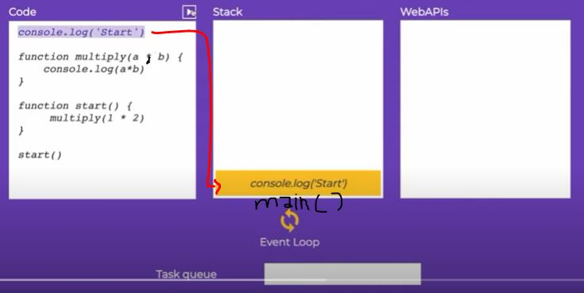

# Event loop 

    - it's a concept that how synchronous + asynchronous code together
        works inside that Event loop ✔️ 

    - after understanding event loop then see closure lecture also 
        for how closure works due to event loop ✔
        
## difference b/w Asynchronous & Synchronous programming

    -> Synchronous programming ✅

        - means if we're doing more than one work simultaneously
            then untill and unless if first work doesn't complete 100%
            then next work will not start & execute
        - even if next work takes less time than first work
            because first work comes first in the queue or task queue compare to other work 💡💡
        - and after AJAX Synchronous programming converted into Asynchronous

        - this way is old one now a days 
            people use Asynchronous programming

        - synchronous means doing work at a time 💡💡

        eg : 

            const fun2 = () => {
                console.log(`Function 2️⃣ is called`);
            }

            const fun1 = () => {
            console.log(`Function 1 is called`);
            fun2();
            console.log(`Function 1 is called Again ✌`);
            }

            fun1()

            // output :
                Function 1 is called
                Function 2️⃣ is called
                Function 1 is called Again ✌

            - here we got output step by step

    -> Asynchronous programming ✅

        - means do all the work parallelly
        // OR 
        - means if we have two work and first work is taking time 10min and 
            second work is taking time 5second then
        - second work will also be executed and first work will run parallelly
            so due to this our code will not stop 💡💡 

        - Asynchronous means doing multiple works at a time 💡💡

        - event listener , setTimeout() , promises , async await , fetch api , etc 
            these are Asynchronous

        eg : of Asynchronous
            - in instagram , when you scroll
                then while scrolling down you're getting data
                on the spot ✔️

            - so same with others like 
                you go to posts , comment down and you click to like , etc
                all these are happen Asynchronously ✔️

        eg : of Asynchronous
            - open any insta post and 
                then play any reel 
            - after that do comment also and like the comment

            - so here video is playing + you're commenting + likes also
                means simultaneously we're doing multiple things ✔️
                
        eg : 

            const fun2 = () => {
                setTimeout(() => {
                    console.log(`Function 2️⃣ is called`);
                } , 1000)
            }

            const fun1 = () => {
                console.log(`Function 1 is called`);
                fun2();
                console.log(`Function 1 is called Again ✌`);
            }

            fun1()

            // output : 
                    Function 1 is called
                    Function 1 is called Again ✌
                    Function 2️⃣ is called

            - here first console.log(`Function 1 is called`) will be printed 
                & then fun2() will be called
                but setTimeout() which is inside fun2() will take 2seconds 
            - so JS will run other codes & setTimeout() will be handle asynchronously in the background
                so due to that , message will be printed 
                `Function 1 is called Again ✌`
                and then message of fun2() will be printed

## examples - of event loop ✅

    eg 1 : of event loop
        function test() {
            console.log("hi 1")
            console.log("hi 2")
            setTimeout(() => console.log("hi 3") , 10)
            setTimeout(() => console.log("hi 4") , 0)
            console.log("hi 5")
        }

        - now tell us what we'll be the output 
            so we'll say h1 1
                         hi 2
                         hi 4
                         hi 5
                         hi 3
    
        - but actual output will be 

        // output : hi 1
                    hi 2
                    hi 5
                    hi 4
                    hi 3

        - here we can see that "hi 4" doesn't printed out 
            before "hi 5" even "hi 4" have 0(zero) time 
        - this is because of event loop ✔️

    eg 2 : of event loop
        function fun2() {
            setTimeout(() => {
                console.log("fun2 is starting")
            } , 3000)
        }

        function fun1() {
            console.log("fun1 is starting")
            fun2()
            console.log("fun1 is ending")
        }

        fun1()

        - so if we're getting data from setTimeout after 3seconds
            then how we're getting that data & where our data gone
            for 3seconds so let's see 💡💡

## explain - components of browser ✅

    - every browser has it's own runtime engine like 
        chrome has -> V8 , firefox has -> spidermonkey & etc ...

    - & these runtime engines are single threaded
        means these runtime engines of each browser
        will do/execute/run a work at a time (means they don't do multiple work at a time) 💡💡💡

    - in event loop concept , there are many components of browser comes
        first - there are two components inside a runtime engine of chrome browser for JS i.e V8   
            1 - heap (where our all the variables & functions , etc gets memory)
            2 - callstack or execution stack or stack
        second - web APIs 
        third - event loop
        forth - message/callback/task queue 💡💡💡
            
    - here callstack , web APIs , event loop & task queue 
        these things play aw important role 

    -> about callstack ✅    

        - callstack is like a array , 
            means as soon as each functions , methods called 
            then each function , methods will be pushed inside the callstack
        - so if that function or method called/executed on that time
            then that function or method will be pushed on top of inside the callstack 
        - & if execution/work of that function or method is done
            then it will be poped out from inside the callstack 💡💡

        -> about single threaded

            - JS is a single threaded programming language
                mean single threaded runtime
            - means it has a single call stack , 
                & it can do one thing at a time 
            - means the program can run one piece of code at a time 

        eg : of how callstack works 

            - important example ⭐

            console.log("start")

            function multiply(a , b) {
                console.log(a * b)
            }

            function start() {
                console.log(1 * 2)
            }

            start()

            - so as soon as these functions called/executed step by step
                according this , these functions comes inside the callstack 
                step by step 
            - & current function which is executed will be on top of inside the callstack

            // output 1 inside callstack : 

        - so here inside the callstack , 
            when that JS file execute then
            first is main() or anonymous function or main thread or global execution context
            will be pushed inside the callstack
        - means it's a main thread i.e javascript file 
            where we wrote all the code inside that JS file 💡💡💡

        STEP 1 - above the main() , 
                this line -> console.log("start") is popped inside the callstack 
                & here console.log() is itself is a function that's why 
                it came inside the callstack not inside the heap 💡💡💡

        STEP 2 - so here this line -> console.log("start") will be over immediately
                    & it will be popped out from inside the callstack

        STEP 3 - now start() function will be called 
                    when we go inside the start() function then
                    start() function will came/pushed above the main() inside the callstack
                - & start() function will not be popped/removed from inside the callstack
                    until it's not finish it's work 💡💡💡

        - now we're calling multiply() function inside the start() function 
            so in next step

        STEP 4 - multiply() function will be pushed inside the callstack
                    & multiply() function will be stacked above the start() function 💡💡💡
                    because multiply() is a current function which is called 

        NOTE : ✅
            - whatever a function called inside that function
                like multiply() function called that start() function 
            - then here multiply() function will be above of start() function 
                inside the callstack  

        STEP 5 - now we're calling console.log(a * b) inside that multiple() function 
                    so this line -> console.log(a * b) will be pushed above multiply() function
                    inside the callstack 

 
        STEP 6 - the movement , work of console.log(a * b) gets over 
                    then it'll be popped/remove from inside the callstack 
                    because console.log(a * b) is a synchronous 
                    so it'll run immediately 
                - & due to this there is no code inside the multiply() function
                    so it's also popped/remove from inside the callstack 💡💡💡

        STEP 7 - multiply() function also popped from inside the callstack
                so control will come inside the start() function

                - now there is no code inside the start() function
                    so it's work also done/over 
                - that's why start() function also popped from inside the callstack 💡💡💡 

        - now there is nothing inside the callstack 
        - so this is the example of callstack that how it works     
            & here we don't need event loop & web APIs 

        - when we run a JS file then that JS file will become
            main() function or anonymous function or main thread or global execution context
            & that JS file pushed inside the callstack
            & whatever functions , methods we wrote inside that JS file 
        - those functions , methods will be added/pushed above that main() inside the callstack 
            step by step on top of each other
        - & as soon as the work of those each functions , methods over 
            then step by step each functions , methods 
            will be popped out from inside the callstack 💡💡

    -> about Web APIs ✅

        - if we talk about single threaded environment
            then the important impact comes 
        - that which operation is taking many times to execute
            & which one is taking less time

        - so those operations which takes many times to execute
            are called blocking operations
        - means execution of runtime will stop 
            until that blocking operations didn't finish their work  

        - so those operations which take more time 
            are moved/handle directly by web APIs 💡💡💡 

        - Web APIs contains operations like
            - ajax call
            - setTimeout , setInterval() , etc..
            - DOM
            - HTTP request methods
            - etc..

        - so these web APIs are extra stuffs that the browser provides 

        NOTE : ✅
            - these all different types of web APIs 
                are not a part of runtime V8 engine 
            - means there web APIs didn't exist inside runtime V8 engine 💡💡💡  

        -> about blocking ✅

            eg : 
                function foo() {
                    return foo()
                }

                foo()

                // output : we called foo() function recursively
                            so at the end we'll get callstack size error ✔

            -> what happens when things are slow & why this is a problem ✅

                - means console.log() -> is not slow
                    but printing 1 to 10 billion numbers through while loop ,
                    doing image processing , network request , scroll animations , etc 
                    these will be slow operations

                - this will be a problem because 
                    let's say we're printing 1 to 10 billion numbers through while loop
                    by using API
                - so during that request , things will be slow
                    & if we try to do another thing like showing alert pop inside that web page 
                    then things or alert pop won't shown instantly
                - because browser is blocked 
                    means request of printing those numbers didn't finished yet 
                    so due to this we can't do anything else inside that web page
                    until that request of printing those numbers hasn't finish itself 💡💡💡

                - & the movement that request finished it's work 
                    then after that , those things will be shown whatever we did inside web page  
                    when that request was going on  

                - so assume that what if fetch() api , promise , etc
                    if these all asynchronous code act as synchronous code 
                    things get really slow
                - & if that first asynchronous code will be synchronous code
                    then we can't do other stuff inside that web page
                    until that synchronous code didn't finish it's work
                - so that's why importance of asynchronous code comes 💡💡💡

                - so we don't want to block our page interaction from user
                    so the solution is asynchronous callbacks 
                eg : async callbacks & the call stack ✅

                    console.log("hi")

                    setTimeout(function () {
                        console.log("there")
                    } , 3000)

                    console.log("the end")

                    // output : hi
                                the end
                                there

                    STEP 1 - first this JS file executed 
                            then main() function will be pushed inside the callstack
                    STEP 2 - & then now code will run from top to bottom
                            so console.log("hi") will be pushed inside the callstack 
                            above the main() function inside the callstack 
                            because console.log() is also a function 
                            & console.log("hi") will not be popped from the callstack
                            until it's work didn't finish
                    STEP 3 - so now setTimeout is a asynchronous code so it's callback function
                            will run after 3sec times so this setTimeout() function
                            will not be pushed inside the callstack 
                            so somehow that setTimeout() function will be disappear 
                            from inside the callstack   
                    STEP 4 - so now console.log("the end") pushed inside the callstack
                            & when after when it's work done then it's also popped out
                    STEP 5 - now callstack is completely clear/empty
                            even there is no main() function means there is no JS file 💡💡💡
                    STEP 6 - now somehow after 3seconds , console.log("there") of setTimeout() function
                            pushed inside the callstack 
                            & then it's work also done & popped out from the callstack  

                    - now how that console.log("there") comes 
                        where setTimeout() function goes for 3seconds 
                    - & now here comes role of "event loop" to play 
                        & due to event loop , concept of web APIS + task queue comes ✔✔✔ 

## Explain - event loop ✅

    - event loop concept only comes 
        when we're using asynchronous + synchronous code inside the JS file 

    -> diagrams
 

    -> about task/message/callback queue ✅

        - after executing that asynchronous code 
            we also need a response as a output of that asynchronous code 
            so either that response will be used with other code 
            or output will be printed

        - if callstack didn't got the output of that asynchronous code 
            then there is no meaning of using that asynchronous code
        - that's why we pass callback function to the asynchronous code
            so that we can get data/output

        - so when we give setTimeout() function with 5seconds then 
            setTimeout() function will not go inside the callstack
        - it'll go inside the web APIs , & when 5 seconds of setTimeout() over 
            then callback of setTimeout() will go inside the "task queue" container
        - so as soon as each asynchronous code completed then their
            callback goes inside the "task queue" 💡💡💡 

    eg : of event loop with setTimeout ✅

        function test() {
            console.log("hello")
            setTimeout(() => console.log("first") , 5000)
            setTimeout(() => console.log("second") , 0)
            console.log("world")
        }

        test()

        console.log("the end")

        // output : hello 
                    world
                    the end
                    second
                    first

        STEP 1 - first main() function will be pushed inside the callstack
                    when this js file loaded
        STEP 2 - & then test() function will be called 
                    then test() function will be pushed inside the callstack
                    & test() will be be removed/popped from inside the callstack
                    until it's work didn't finish   
        STEP 3 - now control will come inside the test() function
                    then console.log("hello") will be pushed inside the callstack
                    & soon console.log("hello") will done then it will be popped from inside the callstack
        STEP 4 - then first setTimeout() will be pushed inside the callstack
                    so setTimeout() is asynchronous + it's not a part of runtime code 
                - so it will be handle/move inside the web APIs
                    & removed/popped from the callstack 💡💡💡
                    so right now 5second timer is going on
        STEP 5 - then second setTimeout() will be pushed inside the callstack
                    so setTimeout() is asynchronous + it's not a part of runtime code
                - so it will be handle/move inside the web APIs
                    & removed/popped from the callstack 💡💡💡
                    so right now 0 (zero)second timer is going on

        STEP 6 - console.log("the end") will be pushed inside the callstack
                & then it's work done then it'll be removed/popped from the callstack
                
        STEP 6.1 - right now first setTimeout() function timer it's not over
                    so it'll remain inside the web APIs unitl it's timer didn't finish 💡💡💡
                    & second setTimeout() function also inside the web APIs
                    now it's gets finished immediately because 0 (zero) timer on it 
                
                - now but second setTimeout() function will not come directly 
                    inside the callstack whether code is running 
                    inside the callstack or callstack is empty with not main() function of JS file
                    so here comes -> task queue
                - so second setTimeout() will come directly inside the task queue from web APIs 💡💡💡 

                NOTE : job of event loop ✅

                    - important note 🔥

                    - now here comes event loop
                        & it has only one job to do 
                    - so job of event loop is 
                        it looks to the callstack & the task queue
                        so if the callstack is empty completely
                        then event loop takes each codes step by step from task queue 
                        & push inside the callstack step by step 💡💡💡
                    - & if callstack is not empty then
                        & execution of code is going on inside the callstack  
                        then event loop can't take a code 
                        from task queue & push inside the callstack 💡💡💡 

                - so right now there is no code left to execute 
                    & event main() function of JS file popped from inside the callstack

        STEP 6.2 - so now callstack is empty , 
                    now there is a task inside the task queue i.e callback of second setTimeout()
                    so event loop can take that callback of second setTimeout() 
                    & pushed inside the callstack
                - & console.log("first") of second setTimeout() will be executed inside the callstack 
                    & we got output i.e "second"      
                - & then console.log("first") -> will be popped from the callstack
                - but still first setTimeout() timer is going on inside web APIs
                    for 5second
        
        STEP 6.3 - now 5second of first setTimeout() timer over 
                    so callback of setTimeout() function will come inside the task queue
                    from web APIs

                - now again callstack is empty 
                - so event loop takes a code i.e callback of setTimeout() from the task queue
                    & pushed inside the event loop
                - & then console.log("first") -> will be executed 
                    & then popped out from the callstack

        NOTE : what is callstack is not empty ✅ 

            - important note 🔥

            - if let's say there is a console.log("world") inside the callstack
                & timer of second setTimeout() is over so 
            - then callback of second setTimeout() 
                will come inside the task queue from web APIs

            - & event loop saw that callstack is not empty
                then event loop will wait to get empty callstack
            - now console.log("world") -> gets executed 
                then it'll be popped/removed +   
                & main() function will be removed of JS file from inside the callstack 

            - now event loop see that callstack is empty
                so it'll take a callback of second setTimeout() & pushed inside the callstack
            - then console.log("second") will be executed & popped from the callstack 

## example - event loop with promise + setTimeout() 🔥

    - in event loop concept , 
        promise works little bit different than setTimeout() 💡💡💡

    eg 1 : of event loop with promise & setTimeout() 

        function test() {
            console.log("hi 1")
            console.log("hi 2")
            new Promise((resolve , reject) => {
                resolve("hi promise")
            }).then(message => {
                console.log(message)
            })
        
            setTimeout(() => console.log("hi 3") , 10)
            setTimeout(() => console.log("hi 4") , 0)
            console.log("hi 5")
        }

        test()
        console.log("hi 6")

        // output : hi 1
                    hi 2
                    hi 5
                    hi 6
                    hi promise
                    hi 4
                    hi 3

        - if we put this line -> setTimeout(() => console.log("hi 4") , 0)
            above the promise
        - to see whether this line of code gets printed or not
            because it has 0 (zero) timer

    eg 2 : of event loop with promise & setTimeout() 

        function test() {
            console.log("hi 1")
            console.log("hi 2")
            setTimeout(() => console.log("hi 4") , 0)
            new Promise((resolve , reject) => {
                resolve("hi promise")
            }).then(message => {
                console.log(message)
            })
        
            setTimeout(() => console.log("hi 3") , 10)
            console.log("hi 5")
        }

        test()
        console.log("hi 6")

        // output : hi 1
                    hi 2
                    hi 5
                    hi 6
                    hi promise
                    hi 4
                    hi 3

    NOTE : ✅

        - here still that promise runs/executed before that setTimeout() function
            because promise is not a part of web APIs 
            but promise is a asynchronous code 
        - & even we're not fetching or sending data through that promise
            that's why that promise executed before that setTimeout() function 💡💡💡

        - but if we're doing through promise or async await 
            which takes more time than setTimeout() 
        - then setTimeout() will be executed first then that promise or async await

        - but we actually don't have right now which is asynchronous code will execute first 💡💡💡

        - setTimeout() , async await , http request methods , DOM , ,etc
            which are related to web APIs will be executed when callstack is empty 
        - but if it's a promise & work of promise as soon as finished then 
            that promise will be executed in the middle of running code 
            doesn't matter is callstack is empty or not 💡💡💡

## said by kyle 

    - when we're writing JS 
        then it's not important to understand how the 
        event loop is working line by line inside the code 
    - but it's important to understand the general idea of event loop
        not to understand 100% about it 

## ----------------------- extra notes of event loop ------------------------

### for more check these videos 

- first -> https://github.com/Vipin-PCode/learn-Javascript/blob/main/learn-js-course-thapa-technical/topics/15.1-asynchronous-JS/note.md 👍
- second -> see video of https://www.youtube.com/watch?v=8aGhZQkoFbQ&ab_channel=JSConf 👍
- third -> https://www.youtube.com/watch?v=rUpxAeoR7PU&ab_channel=UnboxingJavascript 👍
- forth -> see video of https://www.youtube.com/watch?v=X3HzwaqAOIg&ab_channel=TechnicalSuneja 
- five -> see lecture of web dev simplified  
- sixth -> see blog https://dev.to/lydiahallie/javascript-visualized-event-loop-3dif
- seventh -> https://www.youtube.com/watch?v=iUDBskCKhh4&ab_channel=WebDevelopmentwithGaurav ✔️

    -> seventh video : How SetTimeout Work Behind The Scene ? | JavaScript Interview Question | In Hindi

        for (var i = 0 ; i < 3 ; i++) {
            setTimeout(function() { console.log(i) } , 1000 + i)
        }

        - here we're using var -> keyword 
            so we know that var -> keyword comes in global scope + destroy the local scope also ✔✔

        // output : 3
                    3
                    3

### event loop visualizer

- http://latentflip.com/loupe
- https://www.jsv9000.app/

## discussion page

