# event delegation

    - also known as event propagation

    - very important 🔥

    - this topic very important to understand the event listener in detail ✔✔

    - propagate/delegate means giving a job to somebody
        or giving a position for a particular task to do ✔✔

## example - of event propagation (why we need it) ✅

    eg : 
        html code 
        ---------
        <body>
            <div id="container">
                <button id="btn">Click me</button>
            </div>
        </body>

        // output : 
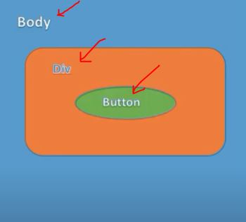

        - now if we see the structure of the html then
            here inside body element we have a div element 
            & inside that div element we have a button element ✔✔

        - now here assume that we putted a 'click' event on each elements
            i.e on body element , on div element & on that button also 💡💡💡

        - now if we click on body element 
            then 'click' event of only body element will gets activated 💡💡💡
        
        - but if we click on that div element 
            then 'click' event of both that div & body element will get activated at the same time 
        - because that div element is inside the body element
            so indirectly we're clicking on the body element also 
        - so here 'click' event of both the div & body element 
            will get fired/activated/executed at the same time 💡💡💡

        - but if click on that button element 
            then 'click' event of button element will be executed 
            & along with 'click' event of button element , 
            'click' event of both elements i.e div & body will also get executed 
        - so here when we're clicking on that button element
            then 'click' event of all three elements gets executed 💡💡💡

    - now question comes that 
        like if we click on that button element 
    - then 'click' event of which element will be executed first
        means 'click' event of which first element will be executed

    - question is - 'click' event of which first element will be executed 💡💡💡

    -> 3 situations of event propagation could be used 

        first - so in a situation , first we want to execute 'click' event of body element
                then of div element & then button element
        second - in another situation , first we want to execute 'click' event of button element
                the of div element & then body element (means opposite of first situation)
        third - & in another situation , we just only want to execute 'click' event of any one element 
                when we click on that element out of those three 💡💡💡

    - due to these situations
        event delegation divided into two types

## types of event delegation ✅

    - two types of event delegation/propagation are 💡💡💡
        first -> event bubbling or bubbling phase 
        second -> event capturing or capturing phase

    - propagation is divided into 3 things
        - target phase
        - capture phase
        - bubble phase

    - by default event propagation is bubbling phase 💡💡💡

## event bubbling 

    - inside event bubbling , 
        an event starts from that element always first which is the most specific element
        then flows go to upward towards the least/less specific element (the document or even window)

    - means an event starts from that element first which is clicked
        & then 'click' event will flows/propagate/delegate/executed of each element 
        which are parents of that element 
    - doesn't matter whether those parent elements of that element 
        are direct or indirect parent 💡💡💡

    - inside event bubbling , we goes from inner most element which is clicked
        till to the outer most element 
        means inside to outside 
    - means inner most element i.e child will be executed first 
        then outer most element i.e parent will be executed last 
    - means inner most child element will be executed first 
        after then step by step flows/propagation goes
        parent by parent will be executed at the same time 💡💡💡

    eg : of event bubbling ✅
        - 'click' event is added to button element , div with the id container , 
            body , html & document element also 
        - & if we click on button element then each 'click' event of each elements 
            will be executed in bubble phase like this
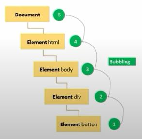

        - so when we clicked on only button element 
            then 'click' event of button element will be executed first 
        - & then automatically second 'click' event of div element will be executed 
            then third of body element 
            then forth of html element
            then fifth of document element  
        - & each 'click' event from inner most element (which is clicked) to outer most element 
            will be executed step by step at the same time 💡💡💡 

        - so we clicked on button element 
            that's why here button element -> is a inner most element or most specific element
        - that's why 'click' event of button element will be executed first 
            then automatically 'click' event will be executed of each elements 
            step by step at the same time like this 
            div element -> & then body element -> & then html -> & then document element 💡💡💡

## event capturing 

    - inside event capturing , 
        if we clicked on any element then that 'click' event will be fired/propagate 
        always start from of that outer most element till of inner most element
    
    - inside event capturing , we goes from outer most element 
        till to the inner most element which was clicked 
        means inside to outside 
    - means outer most element i.e parent will be executed first 
        after then inner most element i.e child will be executed at last 💡💡💡
    - means outer most parent element will be executed first 
        then step by step flows/propagation goes child by child  
        till that child element which was clicked 💡💡💡

    eg : of event capturing ✅

        - let's 'click' event is added on button element , div with the id container , 
            body , html & document element also
        - & now when we clicked on button element , 
            then first 'click' event will be executed of document element 
            then second of html element 
            then third of body 
            then forth of div 
            & then fifth of button element like this 
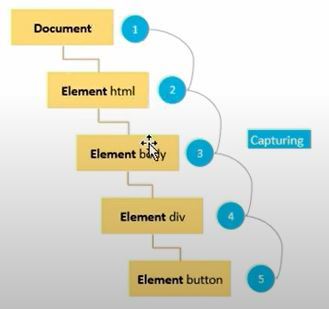

## adding/using/defining event bubbling & event capturing 

    - important 🔥

    - how we can add/define event bubbling or event capturing or both
        inside a event listener

    - if we don't define event bubbling then by default event will be bubbling phase 
        means default value is false 💡💡💡
        (which is a third argument of addEventListener() method)

    - & when the value is set to true , the event used the capturing propagation 💡💡💡   
    
    eg : defining event bubbling ✅

        addEventListener(eventType , callback function , { capture : false})
        // OR
        addEventListener(eventType , callback function )

    eg : defining event capturing ✅

        addEventListener(eventType , callback function , { capture : true }) // more readable ✔
        // OR
        addEventListener(eventType , callback function , true )


## example - of event bubbling 🔥

html code 
```html
<body>
  <div id="container">
    <button id="btn">click me</button>
  </div>
</body>
```
css code
```css
* {
  margin: 0;
  padding: 0;
  box-sizing : border-box ;
}

body {
  background-color: #111;
  min-height : 100vh ;
  display: grid ; 
  place-items : center ;
}

div {
  width: 50% ;
  aspect-ratio : 1 / .6 ;
  background-color: gray;
  display: grid ; 
  place-items : center ;
}

button {
  padding : .6em 2em ;
  font-size : 1rem ;
  border : 0 ;
  border-radius : .25rem ;
  background-color: #326;
  color : white ;
  cursor : pointer ;
}
```
    // output : 
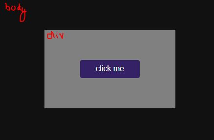

js code 
```js
const divContainer = document.querySelector("#container")
const button = document.querySelector("#btn")

btn.addEventListener('click' , () => {
  console.log("button clicked..") 
})

divContainer.addEventListener('click' , () => {
  console.log("div clicked..") 
})

document.body.addEventListener('click' , () => {
  console.log("body clicked..") 
})
```
    - so right now we didn't define the third argument of addEventListener() method
        so by default value is false as third argument of addEventListener() method 
        means all three elements are in bubble phase
    - so in event bubbling , first inner most child will be executed 
        then step by step flows/propagation goes parent by parent 
        till outer most parent & outer most parent will be executed 💡💡💡

    // output : when we clicked on button element then ✅
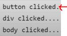

    - so here we can see that 
        when we clicked on button element 
    - then 'click' event executed of button element first 
        which is a inner most child element 
    - & then of div & then of body element 💡💡💡

    // output : when we clicked on div element ✅
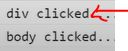

    - here when we clicked on div element 
        then 'click' event executed of div element first 
        which is a inner most child element
    - then of body element 💡💡💡

    NOTE : about event bubbling ✅
        - inner most child element will be base on which element was clicked 💡💡💡 

    // output : when we clicked directly on body element ✅
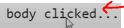

    - so here we just got inner most child element which was clicked 
        i.e body element 
    - but in html , html , document are outer most elements 
        so why they didn't executed because we didn't put any event on them ✔✔✔ 

    - so in event bubbling ,
        first that child element gets executed which was clicked 
    - then parent of that child element gets executed i.e div  
        then parent of that div element gets executed i.e body 💡💡💡

    - now we want to do opposite
        so we'll use event capturing ✔✔

## example - of event capturing 🔥

    eg 1 : putting capturing phase inside only button element ✅

        js code 
        -------
        const divContainer = document.querySelector("#container")
        const button = document.querySelector("#btn")

        btn.addEventListener('click' , () => {
          console.log("button clicked..") 
        } , true)

        divContainer.addEventListener('click' , () => {
          console.log("div clicked..") 
        })

        document.body.addEventListener('click' , () => {
          console.log("body clicked..") 
        })

        - no here we put true -> value as a third argument of addEventListener() method 
            of button element except div & body elements  
        - means capturing phase will be started 💡💡💡
        - means outer most parent will be executed first 
            then step by step flows/propagation goes child by child 
            till that inner most element which was clicked 💡💡💡

    // output : when we clicked on button element then ✅


        - so here we can see that 
            when we clicked on button element 
        - then 'click' event executed of button element first 
            which is a inner most child element 
        - & then of div & then of body element 💡💡💡

    eg 2 : putting capturing phase inside only both button & div elements ✅

        const divContainer = document.querySelector("#container")
        const button = document.querySelector("#btn")

        btn.addEventListener('click' , () => {
          console.log("button clicked..") 
        } , true)

        divContainer.addEventListener('click' , () => {
          console.log("div clicked..") 
        } , true)

        document.body.addEventListener('click' , () => {
          console.log("body clicked..") 
        })

        - here we ON the capturing phase of button & div elements 
            but right now body is still in bubbling phase 💡💡💡

        // output : now when we clicked on button element then ✅
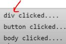

        - so here div element gets executed first 
            then button element because both of them are in capturing phase
        - but body element executed at the last 
            because it's in bubble phase 

    eg 3 : putting capturing phase inside all three button & div & body elements ✅

        const divContainer = document.querySelector("#container")
        const button = document.querySelector("#btn")

        btn.addEventListener('click' , () => {
          console.log("button clicked..") 
        } , true)

        divContainer.addEventListener('click' , () => {
          console.log("div clicked..") 
        } , true)

        document.body.addEventListener('click' , () => {
          console.log("body clicked..") 
        } , true)

        - here we ON the capturing phase of all three elements 
            i.e button , div & body 💡💡💡

        // output : now when we clicked on button element then ✅
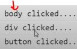

        - so here first body gets executed 
            then div & then button executed

    - now it depends on the situation , 
        that which element we want to print first
    - is we want to print parent element first or child element first 
    - & we an use bubble & capturing phase together at the same time 💡💡💡
  
    eg 4 : putting capturing phase inside of only button & body elements ✅

        const divContainer = document.querySelector("#container")
        const button = document.querySelector("#btn")

        btn.addEventListener('click' , () => {
          console.log("button clicked..") 
        } , true)

        divContainer.addEventListener('click' , () => {
          console.log("div clicked..") 
        })

        document.body.addEventListener('click' , () => {
          console.log("body clicked..") 
        } , true)

        - here we ON the capturing phase of button & body elements 
            but div element is in bubbling phase 💡💡💡

        // output : now when we clicked on button element then ✅
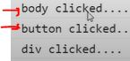

        - so here both body & button elements
            are in capture phase
        - so both of them followed the rule of event capturing
            means first outer most parent will come then inner most child element come 💡💡💡

        - but div element is in bubbling phase
            so div element is following the rule of event bubbling 
            means first inner most child will come then outer most parent element come 💡💡💡

        - if we want to behave them normally 
            then either make all of them true or false ✔✔✔

## example - of stopPropagation() method of event/e object 🔥

    - stopPropagation() is a method of event object 💡💡

    - used if we want to stop going to the further propagation 
        while using bubbling phase or capturing phase or both 💡💡💡
    
    - means if we put stopPropagation() method inside only the button element 
        & we're using bubbling phase then when we click on button element 
        then we want to activate the 'click' event of button element only
        not those other elements 💡💡💡

    eg : using stopPropagation() method of event object only on button element ✅

        const divContainer = document.querySelector("#container")
        const button = document.querySelector("#btn")

        btn.addEventListener('click' , (e) => {
          console.log("button clicked..") 
          e.stopPropagation()
        } )

        divContainer.addEventListener('click' , () => {
          console.log("div clicked..") 
        } )

        document.body.addEventListener('click' , () => {
          console.log("body clicked..") 
        } )

        - here we only define stopPropagation() method of event object 
            only on button element
        - except on div & body elements

        // output : when we clicked on button element then only  
                    button clicked... -> will be printed out
                    except of div & body elements

        - but we didn't use stopPropagation() method on div element 

        // output : when we clicked on div element then ✅


        - so according to rule of bubbling phase , 
            first inner most child will be executed which was clicked 
            & then outer most parent will be executed 💡💡💡

## use case - of event bubbling 

    - most important 🔥🔥
    
html code 
```html
<button>Button1</button>
<button>Button2</button>
<button>Button3</button>
<button>Button4</button>
```
    - we'll takes advantage of default action of event i.e bubbling phase
        applying 'click' event on those/that element which are/is new elements
        to the web page 💡💡💡

    js code 
    -------
    const buttons = document.querySelectorAll("button")

    buttons.forEach(button => {
        button.addEventListener('click' , () => {
            console.log("clicked button")
        })
    })

    const newButton = document.createElement("button")
    newButton.innerText = "Button 5"
    document.body.append(newButton)

    // output : when we click on any button except button 5
                then we'll get output 
            - but if we click on button 5 then we didn't get any output 💡💡💡

    - because we added that new button 5 to the page after all those code 
        means when we're selecting all the buttons through querySelectorAll() method
        then at that time , there is no reference of that new button 5 
        which we added to our web page 💡💡💡
    - & this is very common problem

    - so first option is we can add the 'click' event on that button 5 explicitly
        but this is not we want , 
        so here we'll take advantage of default action of event i.e bubbling phase 💡💡💡

    - so instead putting addEventListener() method on each button element
        we can put on document object 
    - & after that when we click on any thing then addEventListener() method
        always going to executed/fire because we putted on document element 💡💡💡
        like this

    js code 1
    ---------
    const buttons = document.querySelectorAll("button")

    document.addEventListener('click' , (e) => {
        console.log(e.target)
    })

    const newButton = document.createElement("button")
    newButton.innerText = "Button 5"
    document.body.append(newButton)

    - now even we don't need this line of code i.e 
        const buttons = document.querySelectorAll("button")

    NOTE : about target property of event object ✅
        - target is a property as well as a object
        - target property tell on which element we clicked 💡💡💡
            so that element will be target  

    - but we only wants to execute addEventListener() method 
        when we click only on any of the button elements 
    - & if we click on html document then we don't want to execute addEventListener() method 💡💡💡
        so we can use matches() method of target object/property

    NOTE : matches() method of target object ✅

        - important method 🔥

        - matches() method is just like querySelector() , etc
            which takes css selector inside double quotes 💡💡💡

    js code 2
    ---------
    document.addEventListener('click' , (e) => {
        if (e.target.matches("button)) {
            console.log("clicked button")
        }
    })

    const newButton = document.createElement("button")
    newButton.innerText = "Button 5"
    document.body.append(newButton)

    // output : when we click on any of the button element 
                then we'll get output 
            - but if we click on html document which is body element 
                then we'll not get output 

    -> example of matches() method of target object ✅

        html code 
        ---------
            <button>Button1</button>
            <button>Button2</button>
            <button id="coolBtn">Button3</button>
            <button>Button4</button>

        js code 
        -------
            document.addEventListener('click' , (e) => {
                if (e.target.matches("#coolBtn)) {
                    console.log("clicked button")
                }
            })

            const newButton = document.createElement("button")
            newButton.innerText = "Button 5"
            document.body.append(newButton)

        // output : when we click on any of the button except 
                    except that button which has id="coolBtn"
                    then we'll not get output 
                - even if we clicked on document then still not get output      
                - but if we click on that button which has id="coolBtn"
                    then we'll get output 

    - this is the common way when we're dynamically
        adding elements
    - so just make sure those elements works fine 
        by just adding event listener on document object 
        & using matches() method of target object 💡💡💡

    - so default event delegation will be useful
        for when we add elements dynamically to the page 💡💡💡

## ---------------- Extra notes of event delegation ----------------

check these videos 

- https://www.youtube.com/watch?v=cHUpfQGgskw&ab_channel=TechGun 👍
- https://www.youtube.com/watch?v=ndfGreSllqM&ab_channel=TechnicalSuneja
- https://www.youtube.com/watch?v=m0-0kBMmsPk&ab_channel=ThapaTechnical
- https://www.youtube.com/watch?v=_3sWh5WgmFw&ab_channel=GeekyShow
- https://www.youtube.com/watch?v=hdf7p0ahYZ0&ab_channel=DsCode
- https://www.youtube.com/watch?v=mXTEVCg60zM&ab_channel=5-MinuteWebDev

check blogs 

- https://javascript.info/event-delegation
- https://medium.com/@bretdoucette/part-4-what-is-event-delegation-in-javascript-f5c8c0de2983
- https://dev.to/abhishekjain35/introduction-to-event-delegation-in-javascript-3p7p
- https://dev.to/coderarchive/event-delegation-in-js-1aff


## discussion page 

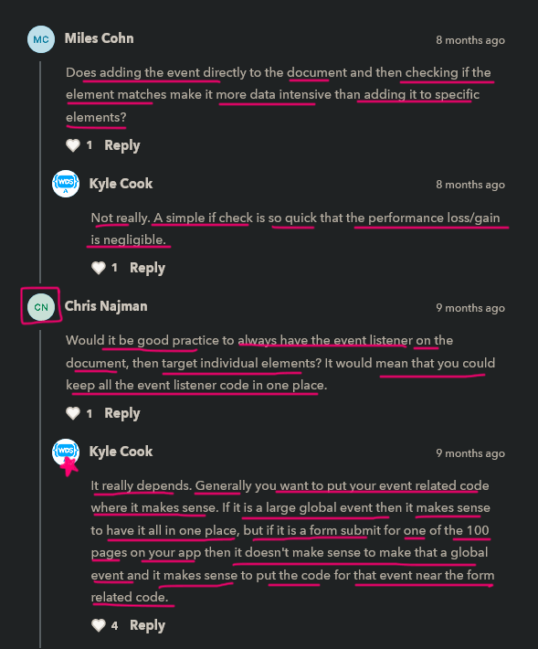

