# browser storage

    - most most important 🔥🔥

    - browse storage used to store data locally inside of a user's browser
        & which is also super useful for tons of different applications ✔✔

## Note ✅

    - that data will be store only in the user's current browser 
        right now we're using chrome 
    - & if we want to store information inside the chrome browser 
        then that data/information is only available
        inside chrome browser not in other browsers 
    - & we can access that information from chrome browser
        but we can access that same data from other browsers 💡💡💡

    - & also if we open chrome browser on our phone 
        then we'll not see any data that we saved inside chrome of our PC
    - because chrome browser in our phone is different than the browser on our PC 💡💡💡

    - if we want to access the same globally
        then we use database not browser storage 
    - & browser storage is different than database 💡💡💡

    NOTE : about browser storage ✅

        - generally we can't use any browser storage to save data
            because when that data/information are super - super important 
            & stored inside the browser storage 
        - then it's easy for people/user
            to clear their browser storage & move to a different devices/browser
            that doesn't have that data 

    - when & when not to use browser storage 
        it's depends on work/situations ✔️

## 3 types of browser storage ✅

    1 - cookies 
    2 - local storage
    3 - session storage 

    - we probably heard cookies all the time , 
    - but in reality , cookies is the least useful version/section of browser storage 💡💡💡

    - local & session storage are used most of the time 
        & these two are most useful & important to know 💡💡💡

## about of each different types browser storage 🔥

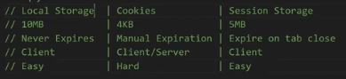

    -> local storage ✅

        storage limit
        -------------
            - storage limit is -> 10MB -> for each item inside of local storage 💡💡💡
                  & don't exceed this storage limit ,
            - if we exceed this 10MB then we probably need to rethink
                how we can store data/information without exceeding it 

        when data expire (important 🔥)
        -------------------------------
            - data never expire even when we reopen that tab/file after closing
                until & unless we don't delete/remove explicitly 💡💡💡

        how we can access data/information 
        ----------------------------------
            - data/information of local storage 
                is only available on the client / that browser of user's 

            - data which is stored inside that tab 
                will be different than that other tabs
            - & each tab has it's own local storage 💡💡💡 

        ease to use or not
        ------------------
            - local storage is easy to use & syntax is great

    -> session storage ✅

        storage limit
        -------------
            - storage limit is -> 5MB 💡💡💡
                & this 5MB is quite large storage 
                so we can session storage for our any of use cases 

        when data expire (important 🔥)
        -------------------------------
            - data expire of session storage
                when the movement we close that tab of that browser 💡💡💡

            - that's why we called session
                because each session that we have i.e each tabs/session of that browser
                & each tab/session contain their own specific data 
            - & when we close any of the tab then data gets removed of that tab
                & if we see on other new tab then we'll not see any data inside session storage section
                of inside that another tab 💡💡💡
            eg : 
                - a log of times shopping carts are stored inside of session storage
                    because when we close a tab of the browser or close our browser
                - then we no longer need that shopping cart anymore 
                - so when we close that shopping cart tab then 
                    all the data will be removed from inside of session storage of that tab 

            - so session storage works based on a tab of that browser
                when the movement we close that tab then 
                session storage will be removed/expired of that tab 💡💡💡

        how we can access data/information 
        ----------------------------------
            - data/information of session storage 
                is only available on the client / that browser of user's 

        ease to use or not
        ------------------
            - session storage is easy to use & syntax is user-friendly

    -> cookies ✅

        storage limit
        -------------
            - storage limit is -> 4KB
                cookies generally & most of the time , 
                used to contain a small amount of information
        
        when data expire (important 🔥)
        -------------------------------
            - data expire manually by the user
                by just telling on which date we want to expire 

        how we can access data/information 
        ----------------------------------
            - we can see/view that data/information
                on the client & the server also 
            - because cookies are sent along with every single request when we make 
                
                eg : use case of cookies ✅ 
                    - whenever we make a fetch request 
                        or whenever we load a new page through like a anchor tag link
                    - then automatically all the cookies send from our browser to the server 
                    - & this is great when we need to do things 
                        such as -> in authentication , 
                            cookies are sent automatically to the server
                        - this is really the only use case of cookies 💡💡💡

                    - so when we want to send data from the client to the server 
                        automatically then cookies are prefect 💡💡💡
        
        ease to use or not
        ------------------
            - cookies is hard to use because syntax is not user friendly

    NOTE : ✅

        - storage limit of local & session storage slightly would be different 
            depending on what browser we're using ✔️
        - but most of the browsers generally have same storage limit 
        - but storage limit is really not an issue 
            that when we're going to use ✔️

        - local & session storage are exactly same but only difference is 💡💡💡
            - storage limit 
            - & local storage -> data never expires 
                session storage -> data expire only when the movement that tab closed of that browser  

## example - of local storage & session storage 🔥

    -> localStorage & sessionStorage
            - both is a object & property of window object
                
            - "S" letter of localStorage & sessionStorage object should be capital

            - both contain our data in the form of key value pair 💡💡💡

            - both have same properties & methods like 

            - methods of localStorage object 
                - setItem()
                - getItem()  
                - removeItem()
                - clear() 
                - key()

    -> setItem() method of localStorage & sessionStorage object ✅

        - setItem() method used to save data inside local storage of user / client's browser 

        - takes two arguments i.e 
            first - key 
            second - value of key 
        - just like we give in a object 💡💡💡
            
        - & if we're defining only one key & it's value then 
            that b/w that key & it's value is separated by comma sign 💡💡💡
        - but if we have multiple keys & it's value 
            then normally we define as object only  

        - always give that key & it's value both should be in double/single quotes
            when we're sending data to server or saving data inside local or session storage 
            then each key & it's values always should be in string type 💡💡💡
        - but if there are many keys & it's values 
            then put them call inside a object & make that object in string type
            by using JSON.stringify() method 💡💡💡 

        eg : save only one key & it's value inside local & session storage ✅

            localStorage.setItem("Name" , "Horse") 
            sessionStorage.setItem("age" , "12")  

            // output : open the application tab of chrome devtools
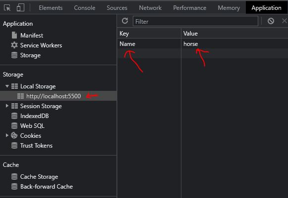
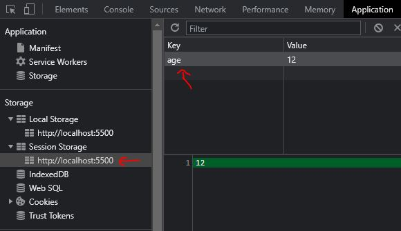

            NOTE : ✅
                - if we open another html file 
                    then we can see the same data of local storage
                - but in that another html file 
                    doesn't contain that session storage data
                    which we define

                - so that data of session storage will be only stored 
                    inside the html file only 💡💡💡

        eg : updating value of that key inside local & session storage ✅

            localStorage.setItem("Name" , "Horse")
            sessionStorage.setItem("age" , "12")  

            localStorage.setItem("Name" , "Cow") // updating the value of "Name" key
            sessionStorage.setItem("age" , "10") // updating the value of "age" key

            // output : open the application tab of chrome devtools
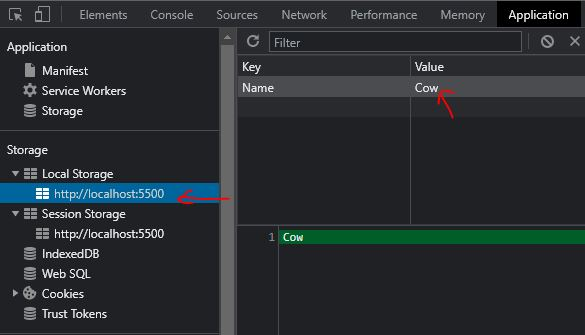
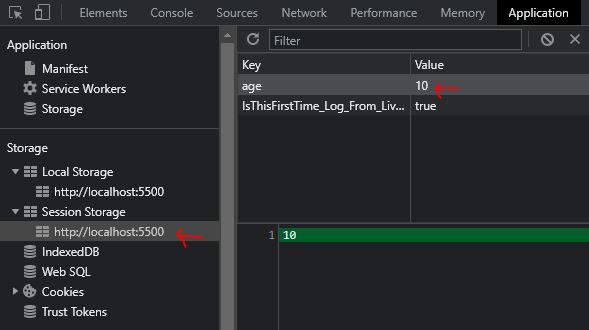

    -> getItem() method of local & session storage ✅

        - used to get the data from local & session storage 

        - takes only one argument i.e that key name inside double quotes 
            to get the value of that key 💡💡💡

        eg : getting the data/value of that key from local & session storage ✅

            localStorage.setItem("Name" , "Horse") // saving data
            sessionStorage.setItem("age" , "12")  // saving data

            console.log(localStorage.setItem("Name")) // getting data
            console.log(sessionStorage.setItem("age")) // getting data

        eg : setting + getting the data/value of that key from local storage ✅

            - important example 🔥

            -> setting data like object or array
                
                localStorage.setItem("data" , {name : "horse" , age : "12"})

                - now whenever we saving data inside local storage or on the server
                    then key & it's value always should be in string type
                - so either use double/single quotes or JSON.stringify() method 💡💡💡
                    like this 

                localStorage.setItem("data" , JSON.stringify({name : "horse" , age : "12"}))

            -> getting data like object or array

                - now whenever we getting data from the local storage , etc
                    & that data is in string type 
                - then convert it into object or array type then use JSON.parse() 💡💡💡

                localStorage.getItem("data" , JSON.stringify({name : "horse" , age : "12"}))

                const userData = JSON.parse(localStorage.getItem("data"))

                console.log(typeof userData)

                // output : object

    -> removeItem() method of local & session storage ✅

        - used to remove whole data or particular data from inside local & session storage ✅

        - takes only one argument i.e that key name inside double quotes 💡💡💡

        eg : removing that key/data from inside of local & session storage ✅

            localStorage.setItem("Name" , "Horse") // saving data
            sessionStorage.setItem("age" , "12")  // saving data

            localStorage.setItem("Name" , "Cow") // updating data
            sessionStorage.setItem("age" , "10") // updating data

            localStorage.removeItem("Name") // removing data
            sessionStorage.removeItem("age") // removing data

## example - of cookie ✅

    - cookie is difficult in terms of syntax than local & session storage 

    -> cookie 
        - is a property & available on document object 
            not on window object 

        - we define cookie in the form of key & it's value 
            but value will be assign by using assignment operator
        - & each key & it's value separated by semi colon 💡💡💡

        eg : getting all the cookie ✅

            console.log(document.cookie) 

        eg : setting only one key & it's value inside cookie ✅

            document.cookie = "name=horse"
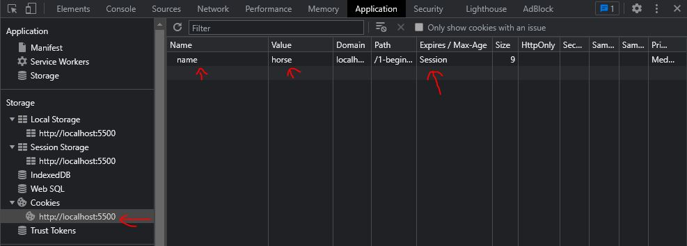

            - here important thing is expire column 💡💡💡
                if we don't define expire date
                then by default expire will be session

            - so generally always good to create an expiration date
                for those cookies 💡💡💡

        eg : setting expire date for those cookies ✅

            - if we want to expire that cookie on that specific date
                then we can give 

            - but if we don't want to ever expire that cookies 
                then we can give that date which never comes 💡💡💡
                to delete that cookie

            STEP 1 : const date = new Date(9999, 0 , 1).toUTCString()

                - Date() class takes 3 arguments 
                    first - year in the form number
                    second - month name in the form number (0 -> means january)
                    third - date in the form number

                - here toUTCString() is a method of Date() class
                    which used to make that date into string type 💡💡💡

            STEP 2 : define that expire date in the form key & value 

                const date = new Date(9999 , 0 , 1).toUTCString()

                document.cookie = `name=horse ; expires=${date}`

                // output :
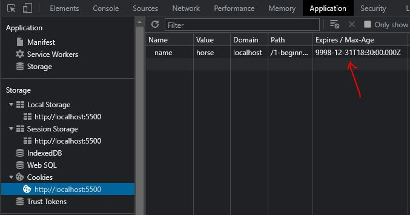

            - but that would be great 
                if we delete that cookie after 1 or 2 hours , etc 💡💡💡 
                not actually way far future date  
                

        eg : setting multiple cookies with expire date ✅
                
            const date = new Date(9999 , 0 , 1).toUTCString()

            document.cookie = `name=horse ; expires=${date}`
            document.cookie = `age=12 ; expires=${date}`

            console.log(document.cookie)

            - expires is a key to delete the cookies at that date + time 💡💡💡
            - we have max-age key also to delete the cookies
                for more check this - https://www.javatpoint.com/javascript-deleting-cookies

            // output : name=hourse ; age=12 -> in console

            - these cookies are in string type 
                & that's why it's really difficult to parse 
                & use it as actual information

            - so that's why generally we don't use cookies 💡💡💡

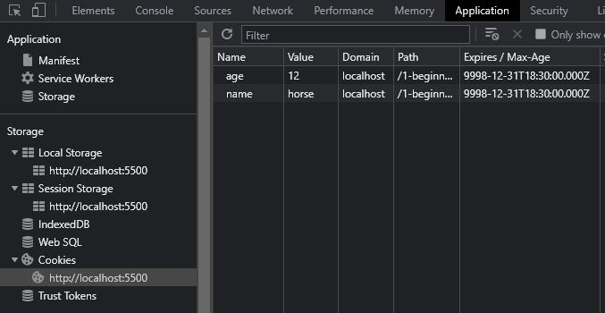

        eg : to delete the cookies ✅

            - deleting cookies is still annoying
                because we don't have any methods to delete the cookies 

            - so to delete that particular cookie 
                then we give don't define value to that key
                & then we define a past expire date

            const date = new Date(9999 , 0 , 1).toUTCString()
            const pastDate = new Date(1999 , 0 , 1).toUTCString()

            document.cookie = `name=horse ; expires=${date}`
            document.cookie = `age=12 ; expires=${date}`

            console.log(document.cookie)
            
            document.cookie= `name= ; expires=${pastDate}`

            // output : age=12
                        we don't see the name key & it's value 

## said by kyle 🔥

    - cookie is difficult to use 
        that's why 
    
    - when we want to store data permanently 
        then always use local storage 💡💡💡
    
    - & if only we want to send the date automatically to the server 
        then use cookie 💡💡💡

    - & if we want that date itself delete automatically
        when we close that tab then use session storage 💡💡💡

    - otherwise always use local storage 
        because it's easy to use & useful for many situations/scenarios 💡💡💡

    - server cannot use local storage 
    until deliberately sent a request via POST or GET

## --------------------- extra notes of browser storage ---------------------

### check videos 

- https://www.youtube.com/watch?v=rxunlf6oEUw&ab_channel=CodeSikho 👍
- https://www.youtube.com/watch?v=xSv-9Yod83Q&ab_channel=CodeWithHarry 👍

### check blogs 

- https://www.w3schools.com/html/html5_webstorage.asp
- https://javascript.info/localstorage
- https://developer.mozilla.org/en-US/docs/Web/API/Window/localStorage

### notes - browser storage (by codeshikho) 🔥

    -> local storage ✅

        - each websites has it's own local storage
            & local storage of each websites will be different each other

        - our data will be stored permanently of that tab/file/website
            even if we close & reopen that tab/file/website on that browser
            still we'll get our data inside local storage 💡💡💡   

        eg : when we login on that website
                & that login details will be saved inside local storage of that browser
                & when we close that browser & reopen that browser with that website
            then that website won't ask login details again 💡💡💡

        - local storage used when we want to store that kind of data 
            when we want to store that data permanently
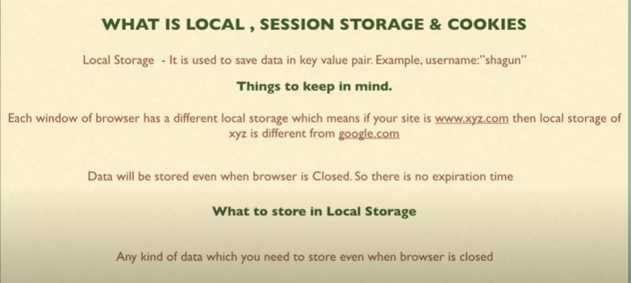

    -> session storage ✅

        - it used like we login on that website 
            & when we close that tab (doesn't matter whether we logout or not)
            then automatically all the data will be removed
        - & when we reopen that website on that browser then 
            again that website will ask for to login again 

        eg : when to use session storage 

            - we use session storage when we want more security
                like payment gateway
            - let's say we login Amazon & we purchased but we didn't logout
                & directly we close the browser
            - & when we see again then the highly chance that 
                data of payment gateway of Amazon inside session storage 
                was removed 💡💡💡    
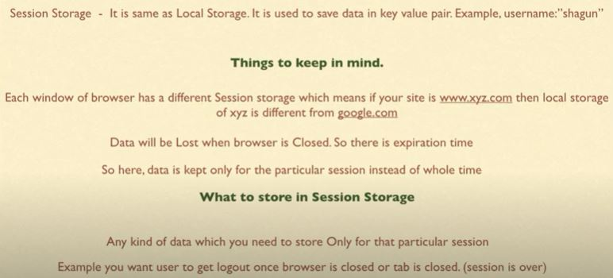

    -> cookies ✅

        - it used in advertisement , marketing
            eg : let's say we visited to a website 
                    & now did something on that website 
                - so now google knows that we visited that website 
                    so google got the cookies about the user that he/she visited on that website

                - now these cookies , google will use to advertisement + marketing other stuff
                    related to that product/website 💡💡💡
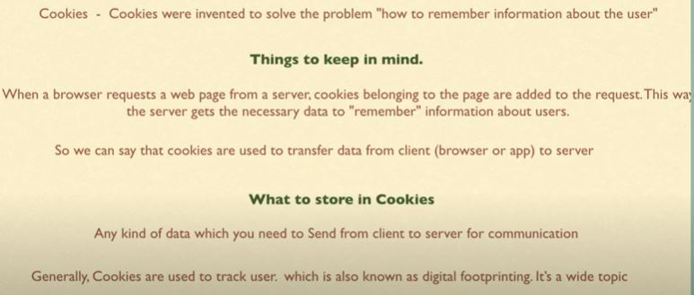
        
## discussion page 

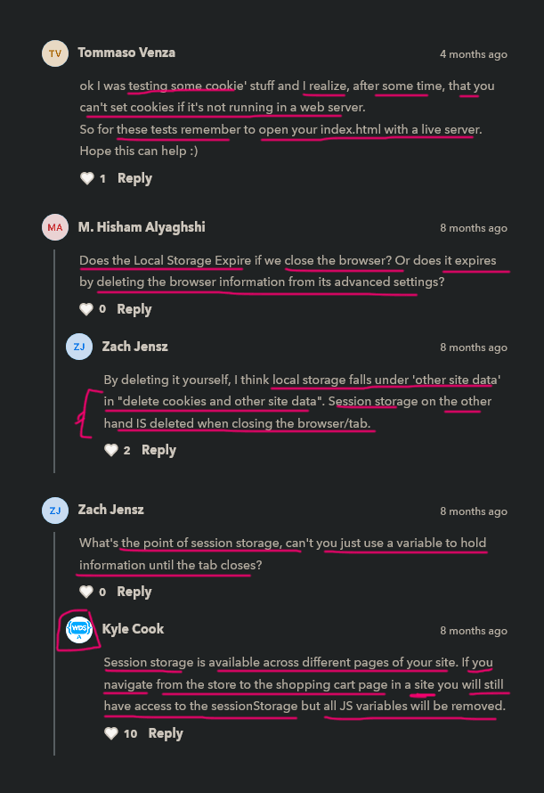

