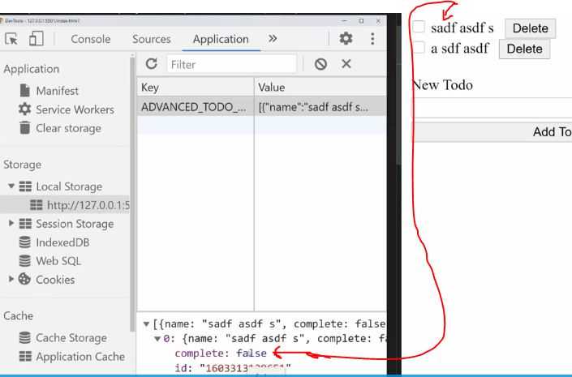

# advanced todo list

    - most most important project 🔥🔥

    - we use CRUD operation + all the stuff that we learned till yet in this project

## starter code 

html code 
```html
<!DOCTYPE html>
<html lang="en">
<head>
  <title>Advanced Todo List</title>
  <link rel="stylesheet" href="styles.css">
</head>
<body>
  <ul id="list">
    
  </ul>
  
  <form id="new-todo-form">
    <label for="todo-input">New Todo</label>
    <input type="text" id="todo-input">
    <button type="submit">Add Todo</button>
  </form>

  <template id="list-item-template">
    <li class="list-item">
      <label class="list-item-label">
        <input type="checkbox" data-list-item-checkbox>
        <span data-list-item-text></span>
      </label>
      <button data-button-delete>Delete</button>
    </li>
  </template>
</body>
</html>
```
css code 
```css
#new-todo-form {
  display: flex;
  flex-direction: column;
}

#new-todo-form > * {
  margin: .15rem;
}

#list {
  padding: 0;
}

.list-item {
  list-style: none;
}

.list-item-label:hover,
[data-list-item-checkbox]:hover {
  cursor: pointer;
}

.list-item-label:hover > [data-list-item-text] {
  color: #333;
  text-decoration: line-through;
}

[data-list-item-checkbox]:checked ~ [data-list-item-text] {
  text-decoration: line-through;
  color: #AAA;
}

[data-button-delete] {
  margin-left: .5rem;
}

button {
  cursor: pointer;
}
```

    NOTE : 
        - when we write html stuff inside <template></template> element
            then all that html stuff will not be render on the page

        - so we can take all the html code from inside template element & clone inside the JS 
            instead of writing that html code inside the JS 

    // output : 


## complete code 

- js code by kyle
    ```js
    const form = document.querySelector("#new-todo-form")
    const todoInput = document.querySelector("#todo-input")
    const list = document.querySelector("#list")
    const template = document.querySelector("#list-item-template")
    const LOCAL_STORAGE_PREFIX = "ADVANCED_TODO_LIST"
    const TODOS_STORAGE_KEY = `${LOCAL_STORAGE_PREFIX}-todos`
    let todos = loadTodos()
    todos.forEach(renderTodo)

    list.addEventListener("change", e => {
      if (!e.target.matches("[data-list-item-checkbox]")) return

      const parent = e.target.closest(".list-item")
      const todoId = parent.dataset.todoId
      const todo = todos.find(t => t.id === todoId)
      todo.complete = e.target.checked
      saveTodos()
    })

    list.addEventListener("click", e => {
      if (!e.target.matches("[data-button-delete]")) return

      const parent = e.target.closest(".list-item")
      const todoId = parent.dataset.todoId
      parent.remove()
      todos = todos.filter(todo => todo.id !== todoId)
      saveTodos()
    })

    form.addEventListener("submit", e => {
      e.preventDefault()

      const todoName = todoInput.value
      if (todoName === "") return
      const newTodo = {
        name: todoName,
        complete: false,
        id: new Date().valueOf().toString()
      }
      todos.push(newTodo)
      renderTodo(newTodo)
      saveTodos()
      todoInput.value = ""
    })

    function renderTodo(todo) {
      const templateClone = template.content.cloneNode(true)
      const listItem = templateClone.querySelector(".list-item")
      listItem.dataset.todoId = todo.id
      const textElement = templateClone.querySelector("[data-list-item-text]")
      textElement.innerText = todo.name
      const checkbox = templateClone.querySelector("[data-list-item-checkbox]")
      checkbox.checked = todo.complete
      list.appendChild(templateClone)
    }

    function loadTodos() {
      const todosString = localStorage.getItem(TODOS_STORAGE_KEY)
      return JSON.parse(todosString) || []
    }

    function saveTodos() {
      localStorage.setItem(TODOS_STORAGE_KEY, JSON.stringify(todos))
    }
    ```

- js code by me 
    ```js
    const form = document.querySelector("#new-todo-form")
    const todoInput = document.querySelector("#todo-input") 
    const listUlEle = document.querySelector("#list") 
    const templateHtmlCode = document.querySelector('#list-item-template')

    // local storage key
    const LOCAL_STORAGE_PREFIX = "ADVANCED_TODO_LIST"
    const TODOS_STORAGE_KEY = `${LOCAL_STORAGE_PREFIX}-todos`

    // pushing new todos 
    let todos = loadTodos()
    todos.forEach(renderTodo)

    form.addEventListener('submit' , e => {
      e.preventDefault()

      const todoName = todoInput.value
      // edge cases
      if (todoName === "") return

      // for complete todo
      const newTodo = {
        name : todoName , 
        complete: false ,
        id : new Date().valueOf().toString()
      }

      // adding todo text
      todos.push(newTodo)
      saveTodos()
      renderTodo(newTodo)
      todoInput.value = ""
    })

    // add/render todos
    function renderTodo(todoName) {
      const templateClone = templateHtmlCode.content.cloneNode(true)
      const listItem = templateClone.querySelector('.list-item')
      listItem.dataset.todoId = todoName.id
      const todoInputCheckbox = listItem.querySelector('[data-list-item-checkbox]')
      todoInputCheckbox.checked = todoName.complete
      const todoContainer = listItem.querySelector('[data-list-item-text]')
      todoContainer.innerText = todoName.name
      
      listUlEle.append(listItem)
    }

    // save local todods
    function saveTodos() {
      localStorage.setItem(TODOS_STORAGE_KEY , JSON.stringify(todos))
    }

    // load local todos
    function loadTodos() {
      const todoItems = localStorage.getItem(TODOS_STORAGE_KEY)
      return JSON.parse(todoItems) || []
    }

    // complete todos
    listUlEle.addEventListener('change' , e => {
      if (!e.target.matches('[data-list-item-checkbox]')) return 

      const parent = e.target.closest('.list-item')
      const todoId = parent.dataset.todoId
      const todoItem = todos.find(t => t.id === todoId)
      todoItem.complete = e.target.checked

      saveTodos()
    })

    // delete todos
    listUlEle.addEventListener('click' , e => {
      if (!e.target.matches('[data-button-delete]')) return 

      const parent = e.target.closest('.list-item')
      const todoId = parent.dataset.todoId
      parent.remove()
      todos = todos.filter(todo => todo.id !== todoId)

      saveTodos()
    })
    ```

## what we need to do 

    STEP 1 : when we write something & click to add button 
            then output should be like this 


    STEP 2 : when we hover on that todo then output will be like this 


    STEP 3 : now two things comes 

        - when we check the checkbox then output will be like this 


        - & when we click to delete button then that todo 
            should be deleted from UI as well as from local storage 

    STEP 4 : when we reload the page then all that todos 
                should be there in UI as well as inside local storage

## explanation of code 🔥

    - Advice of me 🔥 : first implement the add todo functionality
        - then implement save those todo inside local storage 
            then load the todo from local storage 
        - & then these first three gets completed then implement the further CRUD operations 💡💡💡
        - this will complete clear & make the concept understandable 


    - now think about that what user going to do in that UI 💡💡💡
        first - need to add the todo
        second - delete the todo
        third - mark that todo as complete or incomplete

        - these 3 are general stuff that user will do

    - now behind the scene think about what we need to do 
        that create persist to the user i.e saving & loading todos on UI
        four - save todos 
        five - load todos 

    STEP 1 : what user will do to add the todo

        - first user will type a todo & then click to add button .
            & this should then add the todo to the list above
        - so we need to think about that in general what the user does & what user will see
            this will give an idea as a programmer what we need to do

    STEP 1.1 : selecting required elements

        const form = document.querySelector("#new-todo-form")  
        const todoInput = document.querySelector("#todo-input")  

        - here we're selecting form instead of that input element
            because here we're submitting the data
        - so if we don't select form element then adding todo won't work 💡💡💡
        - that's why we need form element to submit the data 
    
    STEP 2 : using 'submit' event on form element 

        form.addEventListener("submit", e => {
            e.preventDefault()
        })

        - & we prevent/stop the default action/behavior of 'submit' event of form element 

        - now we need to select the list , to add the todo inside that list

    STEP 3 : selecting that element which has the id="list" to render the todo

        const form = document.querySelector("#new-todo-form")  
        const todoInput = document.querySelector("#todo-input") 
        const list = document.querySelector("#list") 

        - now we have a reference of list , to add the todo inside that list 
        
        form.addEventListener('click' , e => {
            e.preventDefault()

            const todoName = todoInput.value
            renderTodo(todoName)
        })

        - now we may think that what is doing renderTodo() function
            but it doesn't matter
        - right now we just need to know that renderTodo() function
            will render the todo 
        - & due to this we can focus on main stuff that we need to do 
        - so solve the big problem in small chunks 💡💡💡

        - so will focus on rendering later on 
            so we can put comment on there instead of calling that function
        
        form.addEventListener('click' , e => {
            e.preventDefault()

            const todoName = todoInput.value
            // render todo
        })

    STEP 3.1 : clearing the input after adding the todo through add button

        form.addEventListener('click' , e => {
            e.preventDefault()

            const todoName = todoInput.value
            // render todo
            todoInput.value = "" 
        })

        - now we can call the renderTodo() function

        form.addEventListener('click' , e => {
            e.preventDefault()

            const todoName = todoInput.value
            renderTodo(todoName)
            todoInput.value = "" 
        })

    STEP 3.2 : rendering the todo

        form.addEventListener('click' , e => {
            e.preventDefault()

            const todoName = todoInput.value
            renderTodo(todoName)
            todoInput.value = "" 
        })

        - now we'll use html code which are inside of template element
            so let's access the template element

    STEP 3.2.1 : selecting the template element

        const form = document.querySelector("#new-todo-form")
        const todoInput = document.querySelector("#todo-input")
        const list = document.querySelector("#list")
        const template = document.querySelector("#list-item-template")

        form.addEventListener('click' , e => {
            e.preventDefault()

            const todoName = todoInput.value
            renderTodo(todoName)
            todoInput.value = "" 
        })
        
        - now cloning the html code of template element

        function renderTodo(todoName) {
            const templateClone = template.content.cloneNode(true)
            console.log(templateClone)
        }

        NOTE : about content object + it's method i.e cloneNode() method 🔥

            - content is a property of <template></template> element
                + also a object 💡💡💡

            - cloneNode() is a method of content object
                - takes only one argument either true or false 
                - true argument 
                    - means clone/get all the data/content from inside of template element 💡💡💡 

        // output : we got all the html code which are inside of template element 


        - now we can see that inside of template element
            there is a label + input & span & delete button

        - so select those elements also in order to render them all 

    STEP 3.3 : select the span tag with data-attribute="data-list-item-text"

        - this span element will contain text of the todo

        function renderTodo(todoName) {
            const templateClone = template.content.cloneNode(true)
            const textElement = templateClone.querySelector("[data-list-item-text]")
            textElement.innerText = todoName
            list.appendChild(textElement)
        }

        // output : 


        - here we can see that we didn't got both
            the checkbox & delete button with that todo

        TIP - so whenever we make a bug inside code 
                then check & refactor that section of code 
                that we changed most recently 💡💡💡

        - & even there is no error inside console tab
            so means we wrote something wrong

        - so if we see the code then we append only the span tag
            not all the elements

        - so change this -> list.appendChild(textElement)
            to this list.appendChild(templateClone)

        function renderTodo(todoName) {
            const templateClone = template.content.cloneNode(true)
            const textElement = templateClone.querySelector("[data-list-item-text]")
            textElement.innerText = todoName
            list.appendChild(templateClone)
        }

        // output : 


        - now have checkbox + delete button with that todo

        - but if we refresh that page 
            then that todo will be removed 
        - & there is slight bug that
            even if we don't wrote anything inside input element
            & directly click to "add" button 💡💡💡
        - then we got this output 


        - so after writing out code for certain section till yet
        
        - now think about edge cases , 
            edge cases are those thing which happen uncommonly in your code 💡💡💡
            eg : here we're clicking directly to "add" button without writing in input element
                so we got empty todo with checkbox + "delete" button ✔✔ 
        - so we need to write code for edge cases , 
            so that edge cases handled properly

        - so we need to think that is input element is empty or not 💡💡💡

    STEP 3.4 : checking whether input element is empty or not ✅

        // selecting required elements
        const form = document.querySelector("#new-todo-form")
        const todoInput = document.querySelector("#todo-input")
        const list = document.querySelector("#list")
        const template = document.querySelector("#list-item-template")

        // add todos
        // user will type in todo & click add todo button
        form.addEventListener('click' , e => {
            e.preventDefault()

            const todoName = todoInput.value

            if (todoName === "") return 

            renderTodo(todoName)
            todoInput.value = "" 
        })

        function renderTodo(todoName) {
            const templateClone = template.content.cloneNode(true)
            const textElement = templateClone.querySelector("[data-list-item-text]")
            textElement.innerText = todoName
            list.appendChild(templateClone)
        }

        - so this line of code i.e if (todoName === "") return 
            means if after getting value of input element
            if that value is empty then don't run 'submit' event
            & come out of that addEventListener() method 💡💡💡
        - now doesn't matter how many times we clicked on add button
            nothing will be added as a todo 

    STEP 4 : now let's save the todo ✅

        // selecting required elements
        const form = document.querySelector("#new-todo-form")
        const todoInput = document.querySelector("#todo-input")
        const list = document.querySelector("#list")
        const template = document.querySelector("#list-item-template")

        // add todos
        // user will type in todo & click add todo button
        form.addEventListener('click' , e => {
            e.preventDefault()

            const todoName = todoInput.value

            if (todoName === "") return 

            renderTodo(todoName)
            todoInput.value = "" 
        })

        function renderTodo(todoName) {
            const templateClone = template.content.cloneNode(true)
            const textElement = templateClone.querySelector("[data-list-item-text]")
            textElement.innerText = todoName
            list.appendChild(templateClone)
        }

        // save todo
        function saveTodos() {


        }

        - right now we don't have good way to reference all the todos
            because inside html , all those todos stored in the form html code 
        - but we also want to store all those todos in an array form inside the JS also 💡💡💡

    STEP 4.1 create empty array to store all the html todos inside this array ✅

        // selecting required elements
        const form = document.querySelector("#new-todo-form")
        const todoInput = document.querySelector("#todo-input")
        const list = document.querySelector("#list")
        const template = document.querySelector("#list-item-template")
        const todos = []

        - this emtpy array will contain different todos 

        - now let's add/push all the todos inside that empty array

        // add todos
        // user will type in todo & click add todo button
        form.addEventListener('click' , e => {
            e.preventDefault()

            const todoName = todoInput.value

            if (todoName === "") return 
            todos.push(todoName) // pushing all the todos inside that empty array
            renderTodo(todoName)
            saveTodos() // here calling the saveTodos() function to save each todos
            todoInput.value = "" 
        })

        function renderTodo(todoName) {
            const templateClone = template.content.cloneNode(true)
            const textElement = templateClone.querySelector("[data-list-item-text]")
            textElement.innerText = todoName
            list.appendChild(templateClone)
        }

        // save todo
        function saveTodos() {


        }

        - before use any of browser storage we need to think about 
            which will be the best browser storage in this situation
            to save all the todos
        
        - what reason we need want to use cookie
            so cookie would be great if we want to send each todos to the server
            so we don't have any server + server is used to handle million data not for small data
        - next is session storage , 
            here we don't want to delete the each todos when we close that tab
        - so we want to store all the todos on UI even if come back in future 
            so we want to store these data as long as possible
        - so using local storage make sense 💡💡💡

        // save todo
        function saveTodos() {
            localStorage.setItem()

        }

        - now need to give a key & it's value

        NOTE : said by kyle (best practices) of using browser storage ✅

            - important note 🔥

            - whenever we're working with local or session storage , etc
                which requires a key
            - so highly recommend create a global variable for that key
                like this 
                const LOCAL_STORAGE_PREFIX = "ADVANCED_TODO_LIST"
                const TODOS_STORAGE_KEY = `${LOCAL_STORAGE_PREFIX}-todos`

            - we're doing this because localStorage is site depend
                means if we open that site in multiple different tabs
                then local storage of each tab contain same data
            - & that's create a bug because let's if we have two different application
                & each different application has same local storage key
                then they're going to be conflict each other 💡💡💡
            - so that's why always make a global variable to store a key
                which any of the browser storage need especially 
                if we're dealing with local storage 
            - so that conflict doesn't happen with two different application
                instead of directly defining key name as an argument inside setItem() method of localStorage , etc 💡💡💡
            
            - here we can give value which related to our application

    STEP 4.2 : defining a global variable to store a key of that browser storage ✅

        const form = document.querySelector("#new-todo-form")
        const todoInput = document.querySelector("#todo-input")
        const list = document.querySelector("#list")
        const template = document.querySelector("#list-item-template")
        const todos = []
        const LOCAL_STORAGE_PREFIX = "ADVANCED_TODO_LIST"
        const TODOS_STORAGE_KEY = `${LOCAL_STORAGE_PREFIX}-todos`

        // add todos
        // user will type in todo & click add todo button
        form.addEventListener('click' , e => {
            e.preventDefault()

            const todoName = todoInput.value

            if (todoName === "") return 
            todos.push(todoName) // pushing all the todos inside that empty array
            renderTodo(todoName)
            saveTodos() // here calling the saveTodos() function to save each todos
            todoInput.value = "" 
        })

        function renderTodo(todoName) {
            const templateClone = template.content.cloneNode(true)
            const textElement = templateClone.querySelector("[data-list-item-text]")
            textElement.innerText = todoName
            list.appendChild(templateClone)
        }

        // save todo
        function saveTodos() {
            localStorage.setItem(TODOS_STORAGE_KEY , todos)
        }

        - now here we can't directly set value to that key i.e TODOS_STORAGE_KEY
            because when we add multiple todos inside local storage 
            then value will be stored like this 💡💡💡


        - so here these value didn't stored inside array
            so we need to convert that array into string type
            by using JSON.stringify() method

        // save todo
        function saveTodos() {
            localStorage.setItem(TODOS_STORAGE_KEY , JSON.stringify(todos))
        }

        - means now our each todos will be stored inside array syntax
            which is in string type 💡💡💡
            
        // output : now if we add two or more todos then 
                    all the values will be stored inside array syntax which is in string type 💡💡💡
                    like this  


        - so saving data is done
        - now let's load the data in UI

    STEP 5 : loading todos

        const form = document.querySelector("#new-todo-form")
        const todoInput = document.querySelector("#todo-input")
        const list = document.querySelector("#list")
        const template = document.querySelector("#list-item-template")
        const todos = []
        const LOCAL_STORAGE_PREFIX = "ADVANCED_TODO_LIST"
        const TODOS_STORAGE_KEY = `${LOCAL_STORAGE_PREFIX}-todos`

        // add todos
        // user will type in todo & click add todo button
        form.addEventListener('click' , e => {
            e.preventDefault()

            const todoName = todoInput.value

            if (todoName === "") return 
            todos.push(todoName) // pushing all the todos inside that empty array
            renderTodo(todoName)
            saveTodos() // here calling the saveTodos() function to save each todos
            todoInput.value = "" 
        })

        function renderTodo(todoName) {
            const templateClone = template.content.cloneNode(true)
            const textElement = templateClone.querySelector("[data-list-item-text]")
            textElement.innerText = todoName
            list.appendChild(templateClone)
        }

        // load todo
        function loadTodos() {
            const todosString = localStorage.getItem(TODOS_STORAGE_KEY)
        
            return JSON.parse(todosString)
        }

        function saveTodos() {
            localStorage.setItem(TODOS_STORAGE_KEY , JSON.stringify(todos))
        }

        NOTE : ✅

            - whenever we set data to the browser storage 
                then first we need to set in the form of string type before setting data  💡💡💡
                by using JSON.stringify() method 

            - but when we get the data from the browser storage
                then we got data in string type
            - due to this , we want do any operation on that data
                so we need to convert into actual type by using JSON.parse() 💡💡💡

    STEP 5.1 : calling loadTodos() function on todos variable ✅

        const form = document.querySelector("#new-todo-form")
        const todoInput = document.querySelector("#todo-input")
        const list = document.querySelector("#list")
        const template = document.querySelector("#list-item-template")
        const LOCAL_STORAGE_PREFIX = "ADVANCED_TODO_LIST"
        const TODOS_STORAGE_KEY = `${LOCAL_STORAGE_PREFIX}-todos`
        // calling loadTodos() 
        const todos = loadTodos()

        form.addEventListener('click' , e => {
            e.preventDefault()

            const todoName = todoInput.value

            if (todoName === "") return 
            todos.push(todoName) // pushing all the todos inside that empty array
            renderTodo(todoName)
            saveTodos() // here calling the saveTodos() function to save each todos
            todoInput.value = "" 
        })

        function renderTodo(todoName) {
            const templateClone = template.content.cloneNode(true)
            const textElement = templateClone.querySelector("[data-list-item-text]")
            textElement.innerText = todoName
            list.appendChild(templateClone)
        }

        // load todo
        function loadTodos() {
            const todosString = localStorage.getItem(TODOS_STORAGE_KEY)
            return JSON.parse(todosString)
        }

        function saveTodos() {
            localStorage.setItem(TODOS_STORAGE_KEY , JSON.stringify(todos))
        }

        // output : when we save & reload the page , but still we didn't got those todos
                    
        - because we still have todos stored inside that "todos" variable
            but all those are in array form
        - so we need to loop through each todos to show them all in UI

    STEP 5.2 : loop through each todos to show them all in UI ✅

        const form = document.querySelector("#new-todo-form")
        const todoInput = document.querySelector("#todo-input")
        const list = document.querySelector("#list")
        const template = document.querySelector("#list-item-template")
        const LOCAL_STORAGE_PREFIX = "ADVANCED_TODO_LIST"
        const TODOS_STORAGE_KEY = `${LOCAL_STORAGE_PREFIX}-todos`
        // calling loadTodos() 
        const todos = loadTodos()
        // loop through each todos 
        todos.forEach(todo => renderTodo())
        // OR
        todos.forEach(renderTodo())

        form.addEventListener('click' , e => {
            e.preventDefault()

            const todoName = todoInput.value

            if (todoName === "") return 
            todos.push(todoName) // pushing all the todos inside that empty array
            renderTodo(todoName)
            saveTodos() // here calling the saveTodos() function to save each todos
            todoInput.value = "" 
        })

        function renderTodo(todoName) {
            const templateClone = template.content.cloneNode(true)
            const textElement = templateClone.querySelector("[data-list-item-text]")
            textElement.innerText = todoName
            list.appendChild(templateClone)
        }

        // load todo
        function loadTodos() {
            const todosString = localStorage.getItem(TODOS_STORAGE_KEY)
            return JSON.parse(todosString)
        }

        function saveTodos() {
            localStorage.setItem(TODOS_STORAGE_KEY , JSON.stringify(todos))
        }

        // output : now all the todos will be render in UI 

        - but one problem that what if user come in this page first time
            & that user don't have todos inside local storage 
        - now refresh the page , now we got error inside console tab like this 


        - because we're trying to convert data of local storage 
            which contains by "todosString" variable
        - which doesn't have any todos means undefined or null

        - so let's use short circuiting

    STEP 5.3 - doing short circuiting inside loadTodos() function ✅

        const form = document.querySelector("#new-todo-form")
        const todoInput = document.querySelector("#todo-input")
        const list = document.querySelector("#list")
        const template = document.querySelector("#list-item-template")
        const LOCAL_STORAGE_PREFIX = "ADVANCED_TODO_LIST"
        const TODOS_STORAGE_KEY = `${LOCAL_STORAGE_PREFIX}-todos`
        // calling loadTodos() 
        const todos = loadTodos()
        // loop through each todos 
        todos.forEach(todo => renderTodo())
        // OR
        todos.forEach(renderTodo())

        form.addEventListener('click' , e => {
            e.preventDefault()

            const todoName = todoInput.value

            if (todoName === "") return 
            todos.push(todoName) // pushing all the todos inside that empty array
            renderTodo(todoName)
            saveTodos() // here calling the saveTodos() function to save each todos
            todoInput.value = "" 
        })

        function renderTodo(todoName) {
            const templateClone = template.content.cloneNode(true)
            const textElement = templateClone.querySelector("[data-list-item-text]")
            textElement.innerText = todoName
            list.appendChild(templateClone)
        }

        // load todo
        function loadTodos() {
            const todosString = localStorage.getItem(TODOS_STORAGE_KEY)
            return JSON.parse(todosString) || []
        }

        function saveTodos() {
            localStorage.setItem(TODOS_STORAGE_KEY , JSON.stringify(todos))
        }

        - here this means -> JSON.parse(todosString) || []  
            that return this part -> JSON.parse(todosString) if it's true
            & if this -> JSON.parse(todosString) is undefined or null or false
            then return a empty array

        - now we didn't got any error & 
            by default we set an empty array if we don't have any todos to load 💡💡💡

        NOTE : ✅

            - here we move forward step by step by tackling the situation
                from easy task to harder task

        - now we have a problem that when we click on checkbox which mark as complete
            & then when we refresh the page then whatever we checked the todos previously
            are not checked
        - so we also need to save those todo which are checked
            so we need to check two things together
                first - reference of that todo
                second - checking whether it's checked or not 💡💡💡
        - so best way is we'll use object

    STEP 6 : saving those todo which are checked ✅

        const form = document.querySelector("#new-todo-form")
        const todoInput = document.querySelector("#todo-input")
        const list = document.querySelector("#list")
        const template = document.querySelector("#list-item-template")
        const LOCAL_STORAGE_PREFIX = "ADVANCED_TODO_LIST"
        const TODOS_STORAGE_KEY = `${LOCAL_STORAGE_PREFIX}-todos`
        const todos = loadTodos()
        todos.forEach(renderTodo())

        form.addEventListener('click' , e => {
            e.preventDefault()

            const todoName = todoInput.value
            if (todoName === "") return 
            const newTodo = {
                name : todoName , 
                complete : false 
            }
            
            todos.push(newTodo) // now here we passed newTodo
            renderTodo(newTodo) // now here we passed newTodo
            saveTodos() 
            todoInput.value = "" 
        })

        function renderTodo(todo) {
            const templateClone = template.content.cloneNode(true)
            const textElement = templateClone.querySelector("[data-list-item-text]")
            textElement.innerText = todo.name // now here we pass the value of name of newTodo object
            list.appendChild(templateClone)
        }

        function loadTodos() {
            const todosString = localStorage.getItem(TODOS_STORAGE_KEY)
            return JSON.parse(todosString) || []
        }

        function saveTodos() {
            localStorage.setItem(TODOS_STORAGE_KEY , JSON.stringify(todos))
        }

        - so this means             
            const newTodo = {
                name : todoName , 
                complete : false 
            }
        - that here we put todoName as a value inside name -> key 
            & by default we set that todo is not completed 💡💡💡
        - so here complete -> key will act as flag

        - then we pass newTodo inside of them i.e  
            todos.push(newTodo) 
            renderTodo(newTodo)
        - this is called refactoring/changing
            so refactoring means understand the code while reading
            & made changes that we need to do 💡💡💡

        // output : after saving file we'll get this 


        - so here we got undefined instead of giving those todos
            so first whenever we're working with local storage 
            then clean all the data from local storage 
        - then start again 💡💡💡

        - now we haven't wrote code to save checked todos
            but now we have ability to track it ✔

    STEP 6.1 : setting the event listener on that list instead on the document object ✅

        - we can't select all the todos like this 
            const todosCheckBoxes = document.querySelectorAll() 
        - because we're constantly adding new todos
            so whenever we were adding new element dynamically 
            then we set the 'click' event on document object in order to make button work
        - but here all the todos are inside that list
            so we'll set the 'change' event listener on that list 
            instead on the document object 💡💡💡

        const form = document.querySelector("#new-todo-form")
        const todoInput = document.querySelector("#todo-input")
        const list = document.querySelector("#list")
        const template = document.querySelector("#list-item-template")
        const LOCAL_STORAGE_PREFIX = "ADVANCED_TODO_LIST"
        const TODOS_STORAGE_KEY = `${LOCAL_STORAGE_PREFIX}-todos`
        const todos = loadTodos()
        todos.forEach(renderTodo())

        list.addEventListener("change", e => {
            if (!e.target.matches("[data-list-item-checkbox]")) return

            // get the todo that is checked 
            // toggle the complete property to be equal to the checkbox value 
            // save our update todo
        })

        form.addEventListener('click' , e => {
            e.preventDefault()

            const todoName = todoInput.value
            if (todoName === "") return 
            const newTodo = {
                name : todoName , 
                complete : false 
            }
            
            todos.push(newTodo) // now here we passed newTodo
            renderTodo(newTodo) // now here we passed newTodo
            saveTodos() 
            todoInput.value = "" 
        })

        function renderTodo(todo) {
            const templateClone = template.content.cloneNode(true)
            const textElement = templateClone.querySelector("[data-list-item-text]")
            textElement.innerText = todo.name // now here we pass the value of name of newTodo object
            list.appendChild(templateClone)
        }

        function loadTodos() {
            const todosString = localStorage.getItem(TODOS_STORAGE_KEY)
            return JSON.parse(todosString) || []
        }

        function saveTodos() {
            localStorage.setItem(TODOS_STORAGE_KEY , JSON.stringify(todos))
        }

        - so this line code means 
            list.addEventListener("change", e => {
                if (!e.target.matches("[data-list-item-checkbox]")) return
            })
        - that 'change' is a event type of input or button element 
            which used when we change the input state like checkbox from checked to unchecked 💡💡💡

        - matches() is a method of target object (which is also a property of event object)
            - takes only one argument i.e css selector name inside double quotes 💡💡💡 
                just like querySelector() , etc take

        - so we use guard clause i.e 
            if (!e.target.matches("[data-list-item-checkbox]")) return
        - means if that doesn't match then come out of 'change' event 

    STEP 6.1.1 : getting the todo i.e checked

        - so there are couple ways 
            first way - get the text of that todo which is checked
                        then go to todos array & then find the todo which matches with that text
                        but what happens when we have two todo which has same text
                        then we can't do through first way

            second way - create unique identifier for each todo 
                - because again if we gave two todos with same text 
                - & if we checked one of them & then refresh the page then both also get checked 
                - so that's why , we need unique id for each todo 💡💡💡

        - so we use Math.random() like this 
            const newTodo = {
                name : todoName , 
                complete : false , 
                id : Math.random()
            }
        - so while technically this probably work
            but always there will be a change that Math.random() 
            will return same random number twice so there is no guarantee 💡💡💡

        - so we can use Date().valueOf().toString() ✅
            - valueOf() method of Date() class will return a unique number after every milliseconds 💡💡💡
            - & toString() will convert that unique number in string type 💡💡💡
                & we converted into string because inside of local storage , 
                everything gets converted to a string , so just to make comparison easy later on 💡💡💡 

        - & it's not possible for user to create two todos at the same milliseconds ✔✔

    STEP 6.1.2 : getting unique number through valueOf() method of Date() class ✅

        const form = document.querySelector("#new-todo-form")
        const todoInput = document.querySelector("#todo-input")
        const list = document.querySelector("#list")
        const template = document.querySelector("#list-item-template")
        const LOCAL_STORAGE_PREFIX = "ADVANCED_TODO_LIST"
        const TODOS_STORAGE_KEY = `${LOCAL_STORAGE_PREFIX}-todos`
        const todos = loadTodos()
        todos.forEach(renderTodo())

        list.addEventListener("change", e => {
            if (!e.target.matches("[data-list-item-checkbox]")) return

            // get the todo that is checked 
            // toggle the complete property to be equal to the checkbox value 
            // save our update todo
        })

        form.addEventListener('click' , e => {
            e.preventDefault()

            const todoName = todoInput.value
            if (todoName === "") return 
            const newTodo = {
                name : todoName , 
                complete : false ,
                id = new Date().valueOf().toString() // getting unique number
            }
            
            todos.push(newTodo) // now here we passed newTodo
            renderTodo(newTodo) // now here we passed newTodo
            saveTodos() 
            todoInput.value = "" 
        })

        function renderTodo(todo) {
            const templateClone = template.content.cloneNode(true)
            const textElement = templateClone.querySelector("[data-list-item-text]")
            textElement.innerText = todo.name // now here we pass the value of name of newTodo object
            list.appendChild(templateClone)
        }

        function loadTodos() {
            const todosString = localStorage.getItem(TODOS_STORAGE_KEY)
            return JSON.parse(todosString) || []
        }

        function saveTodos() {
            localStorage.setItem(TODOS_STORAGE_KEY , JSON.stringify(todos))
        }

        - now we need to save that id -> key also
            & so we can reference that
        - means we'll set the unique number of id -> key inside that "list-item"
            & then each "list-item" will have unique number
        - then when we click on checkbox then we can reference the parent element i.e "list-item" 
            & get the id from that "list-item" & due to this we'll get individual todo 💡💡

    STEP 6.2 : save that id -> key for reference 
    
        - so we'll save that id -> key 
            inside that html data like this 

        const form = document.querySelector("#new-todo-form")
        const todoInput = document.querySelector("#todo-input")
        const list = document.querySelector("#list")
        const template = document.querySelector("#list-item-template")
        const LOCAL_STORAGE_PREFIX = "ADVANCED_TODO_LIST"
        const TODOS_STORAGE_KEY = `${LOCAL_STORAGE_PREFIX}-todos`
        const todos = loadTodos()
        todos.forEach(renderTodo())

        list.addEventListener("change", e => {
            if (!e.target.matches("[data-list-item-checkbox]")) return

            // get the todo that is checked 
            // toggle the complete property to be equal to the checkbox value 
            // save our update todo
        })

        form.addEventListener('click' , e => {
            e.preventDefault()

            const todoName = todoInput.value
            if (todoName === "") return 
            const newTodo = {
                name : todoName , 
                complete : false ,
                id = new Date().valueOf().toString() // getting unique number
            }
            
            todos.push(newTodo)
            renderTodo(newTodo) 
            saveTodos() 
            todoInput.value = "" 
        })

        function renderTodo(todo) {
            const templateClone = template.content.cloneNode(true)
            const listItem = templateClone.querySelector(".list-item")
            listItem.dataset.todoId = todo.id // added the unique number to each listItem
            const textElement = templateClone.querySelector("[data-list-item-text]")
            textElement.innerText = todo.name 
            list.appendChild(templateClone)
        }

        function loadTodos() {
            const todosString = localStorage.getItem(TODOS_STORAGE_KEY)
            return JSON.parse(todosString) || []
        }

        function saveTodos() {
            localStorage.setItem(TODOS_STORAGE_KEY , JSON.stringify(todos))
        }

        // output : now when we add new toto then in local storage
                    each list item will have unique number 
                    & each unique number will be different than each other 💡💡💡 


        - so now let's link that unique number to it's checkbox get the todo
            which is checked

        TIP : we can see that we did comment inside 'change' event on list 
                & we stopped working
            - & then we started working on previous code 
                & as soon as we done with old code in order to what we need
            - then we move inside 'change' event on list 💡💡💡

    STEP 6.3 : getting & saving that id

        - we're writing code inside 'change' event on list
            to set that id & save 
        - so that we can get the individual todo that we want 
            by using find() method of array ✔✔✔

        const form = document.querySelector("#new-todo-form")
        const todoInput = document.querySelector("#todo-input")
        const list = document.querySelector("#list")
        const template = document.querySelector("#list-item-template")
        const LOCAL_STORAGE_PREFIX = "ADVANCED_TODO_LIST"
        const TODOS_STORAGE_KEY = `${LOCAL_STORAGE_PREFIX}-todos`
        const todos = loadTodos()
        todos.forEach(renderTodo())

        list.addEventListener("change", e => {
            if (!e.target.matches("[data-list-item-checkbox]")) return

            // get the todo that is checked 
            const parent = e.target.closest(".list-item")
            const todoId = parent.dataset.todoId
            const todo = todos.find(t => t.id === todoId)
            // toggle the complete property to be equal to the checkbox value 
            todo.complete = e.target.checked
            // save our update todo
            saveTodos()
        })

        form.addEventListener('click' , e => {
            e.preventDefault()

            const todoName = todoInput.value
            if (todoName === "") return 
            const newTodo = {
                name : todoName , 
                complete : false ,
                id = new Date().valueOf().toString() // getting unique number
            }
            
            todos.push(newTodo)
            renderTodo(newTodo) 
            saveTodos() 
            todoInput.value = "" 
        })

        function renderTodo(todo) {
            const templateClone = template.content.cloneNode(true)
            const listItem = templateClone.querySelector(".list-item")
            listItem.dataset.todoId = todo.id // added the unique number to each listItem
            const textElement = templateClone.querySelector("[data-list-item-text]")
            textElement.innerText = todo.name 
            list.appendChild(templateClone)
        }

        function loadTodos() {
            const todosString = localStorage.getItem(TODOS_STORAGE_KEY)
            return JSON.parse(todosString) || []
        }

        function saveTodos() {
            localStorage.setItem(TODOS_STORAGE_KEY , JSON.stringify(todos))
        }

        // output : now when we check any of the todo
                    then we'll get true -> value inside complete -> key 
                    with that unique number 


        // output : now when we uncheck that todo
                    then then we'll get false -> value inside complete -> key 
                    with that unique number 

        
        - but when we check a todo & then refresh the page
            then that todo which is checked that will get unchecked   
            but in local storage that todo is true -> means completed ✔✔✔

        - so all those todos are coming from renderTodo() function
            so in functional programming , things gets easier to debug

        - so we're not using complete -> key flag inside renderTodo() function
            
    STEP 6.4 : setting complete -> key inside renderTodo() function ✅

        const form = document.querySelector("#new-todo-form")
        const todoInput = document.querySelector("#todo-input")
        const list = document.querySelector("#list")
        const template = document.querySelector("#list-item-template")
        const LOCAL_STORAGE_PREFIX = "ADVANCED_TODO_LIST"
        const TODOS_STORAGE_KEY = `${LOCAL_STORAGE_PREFIX}-todos`
        const todos = loadTodos()
        todos.forEach(renderTodo())

        list.addEventListener("change", e => {
            if (!e.target.matches("[data-list-item-checkbox]")) return

            const parent = e.target.closest(".list-item")
            const todoId = parent.dataset.todoId
            const todo = todos.find(t => t.id === todoId)
            todo.complete = e.target.checked
            saveTodos()
        })

        form.addEventListener('click' , e => {
            e.preventDefault()

            const todoName = todoInput.value
            if (todoName === "") return 
            const newTodo = {
                name : todoName , 
                complete : false ,
                id = new Date().valueOf().toString() // getting unique number
            }
            
            todos.push(newTodo)
            renderTodo(newTodo) 
            saveTodos() 
            todoInput.value = "" 
        })

        function renderTodo(todo) {
            const templateClone = template.content.cloneNode(true)
            const listItem = templateClone.querySelector(".list-item")
            listItem.dataset.todoId = todo.id // added the unique number to each listItem
            const textElement = templateClone.querySelector("[data-list-item-text]")
            textElement.innerText = todo.name 
            const checkbox = templateClone.querySelector("[data-list-item-checkbox]")
            checkbox.checked = todo.complete // setting the checkbox inside renderTodo() function
            list.appendChild(templateClone)
        }

        function loadTodos() {
            const todosString = localStorage.getItem(TODOS_STORAGE_KEY)
            return JSON.parse(todosString) || []
        }

        function saveTodos() {
            localStorage.setItem(TODOS_STORAGE_KEY , JSON.stringify(todos))
        }

        // output : now when we check any of the todo
                    & refresh the page then that complete todo will be saved
                    inside local storage as well as in UI ✔✔✔

        - so now we're actually persisting our todos
            based on whether it checked or not through complete -> key

        - now let's delete the todo

    STEP 7 : deleting todo when we click on "delete" button ✅

        const form = document.querySelector("#new-todo-form")
        const todoInput = document.querySelector("#todo-input")
        const list = document.querySelector("#list")
        const template = document.querySelector("#list-item-template")
        const LOCAL_STORAGE_PREFIX = "ADVANCED_TODO_LIST"
        const TODOS_STORAGE_KEY = `${LOCAL_STORAGE_PREFIX}-todos`
        const todos = loadTodos()
        todos.forEach(renderTodo())

        list.addEventListener("change", e => {
            if (!e.target.matches("[data-list-item-checkbox]")) return

            const parent = e.target.closest(".list-item")
            const todoId = parent.dataset.todoId
            const todo = todos.find(t => t.id === todoId)
            todo.complete = e.target.checked
            saveTodos()
        })

        list.addEventListener('click' , e => {
            if (!e.target.matches("data-button-delete")) return 

            const parent = e.target.closest(".list-item")
            const todoId = parent.dataset.todoId
            // remove the todo from the UI
            // remove the todo from the list i.e todos array
            // re-save the new todos inside local storage
        })

        form.addEventListener('click' , e => {
            e.preventDefault()

            const todoName = todoInput.value
            if (todoName === "") return 
            const newTodo = {
                name : todoName , 
                complete : false ,
                id = new Date().valueOf().toString() // getting unique number
            }
            
            todos.push(newTodo)
            renderTodo(newTodo) 
            saveTodos() 
            todoInput.value = "" 
        })

        function renderTodo(todo) {
            const templateClone = template.content.cloneNode(true)
            const listItem = templateClone.querySelector(".list-item")
            listItem.dataset.todoId = todo.id // added the unique number to each listItem
            const textElement = templateClone.querySelector("[data-list-item-text]")
            textElement.innerText = todo.name 
            const checkbox = templateClone.querySelector("[data-list-item-checkbox]")
            checkbox.checked = todo.complete // setting the checkbox inside renderTodo() function
            list.appendChild(templateClone)
        }

        function loadTodos() {
            const todosString = localStorage.getItem(TODOS_STORAGE_KEY)
            return JSON.parse(todosString) || []
        }

        function saveTodos() {
            // put code here 
        }
          
    STEP 7.1 : removing the todo from the UI

        list.addEventListener('click' , e => {
            if (!e.target.matches("data-button-delete")) return 

            const parent = e.target.closest(".list-item")
            const todoId = parent.dataset.todoId
            // remove the todo from the UI
            parent.remove()
            // remove the todo from the list i.e todos array
            // re-save the new todos inside local storage
        })

        - so when we delete the todo & refresh the page
            then that todo comes again in UI

        - so we need to delete that todo from local storage also 
            & re-save that new todo list inside local storage

    STEP 7.2 : remove the todo from the list 

        list.addEventListener('click' , e => {
            if (!e.target.matches("data-button-delete")) return 

            const parent = e.target.closest(".list-item")
            const todoId = parent.dataset.todoId
            // remove the todo from the UI
            parent.remove()
            // remove the todo from the list i.e inside local storage
            todos = todos.filter(todo => todo.id !== todoId)
            // re save the new todos
            saveTodos()
        })

        - so here this line of code -> todos.filter(todo => todo.id !== todoId)
            means we want to save that do if that todo is not equal
            but both that todo is equal then remove it from UI & local storage 💡💡💡

        // output : when we delete those todos & refresh the page
                    then we'll get those todos again on UI

        - so best thing is check the console tab for errors
            & we'll get an error i.e "todos" variable is constant variable
            so make const into let
        
    STEP 7.2.1 : removing constant variable error 

        const form = document.querySelector("#new-todo-form")
        const todoInput = document.querySelector("#todo-input")
        const list = document.querySelector("#list")
        const template = document.querySelector("#list-item-template")
        const LOCAL_STORAGE_PREFIX = "ADVANCED_TODO_LIST"
        const TODOS_STORAGE_KEY = `${LOCAL_STORAGE_PREFIX}-todos`
        let todos = loadTodos() // changed const -> keyword to let -> keyword
        todos.forEach(renderTodo())

        - now we can redefine our todos

        // output : now when we delete the todo from UI & refresh the page
                    then that todo will be removed from local storage + from UI also

- here we also saw that we added the data attribute dynamically to the `<li></li>` element i.e list-item class <br>
    instead of defining already inside the `template` element 💡💡💡 

## discussion page


            
            