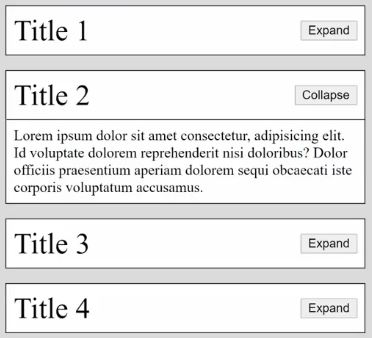

## expand collapse intro 

    - important 💡💡

    - here we need to add 'click' event listener in that way
      so that even if we add new element in future on that page
      then that 'click' event listener should work also on that new element 💡💡💡

## starter code

html code 
```html
<!DOCTYPE html>
<html lang="en">
<head>
  <title>Expand/Collapse</title>
  <link rel="stylesheet" href="styles.css">
</head>
<body>
  <div class="card">
    <div class="card-header">
      <span>Title 1</span>
      <button class="expand-button">Expand</button>
    </div>
    <div class="card-body">
      Lorem ipsum dolor sit amet consectetur, adipisicing elit. Id voluptate dolorem reprehenderit nisi
      doloribus? Dolor officiis praesentium aperiam dolorem sequi obcaecati iste corporis voluptatum 
      accusamus.
    </div>
  </div>
  <div class="card">
    <div class="card-header">
      <span>Title 2</span>
      <button class="expand-button">Collapse</button>
    </div>
    <div class="card-body show">
      Lorem ipsum dolor sit amet consectetur, adipisicing elit. Id voluptate dolorem reprehenderit nisi
      doloribus? Dolor officiis praesentium aperiam dolorem sequi obcaecati iste corporis voluptatum 
      accusamus.
    </div>
  </div>
  <div class="card">
    <div class="card-header">
      <span>Title 3</span>
      <button class="expand-button">Expand</button>
    </div>
    <div class="card-body">
      Lorem ipsum dolor sit amet consectetur, adipisicing elit. Id voluptate dolorem reprehenderit nisi 
      doloribus? Dolor officiis praesentium aperiam dolorem sequi obcaecati iste corporis voluptatum 
      accusamus.
    </div>
  </div>
  <div class="card">
    <div class="card-header">
      <span>Title 4</span>
      <button class="expand-button">Expand</button>
    </div>
    <div class="card-body">
      Lorem ipsum dolor sit amet consectetur, adipisicing elit. Id voluptate dolorem reprehenderit nisi 
      doloribus? Dolor officiis praesentium aperiam dolorem sequi obcaecati iste corporis voluptatum 
      accusamus.
    </div>
  </div>
</body>
</html>
```
css code 
```css
body {
  background-color: #DCDCDC;
  padding: 1rem;
  margin: 0;
}

.card {
  border: 1px solid black;
  margin-bottom: 1rem;
  background-color: white;
}

.card:last-child {
  margin-bottom: 0;
}

.card-header {
  display: flex;
  justify-content: space-between;
  border-bottom: 1px solid black;
  padding: .5rem;
  font-size: 2rem;
  align-items: center;
  margin-bottom: -1px;
}

.card-body {
  padding: 0 .5rem;
  height: 0;
  overflow: hidden;
}

.card-body.show {
  height: auto;
  padding: .5rem;
}

button {
  cursor: pointer;
}
```

    // output : 


## what we need to do

- [ ] when we click to expand button then text of button should be change into "Collapse"
        & we should get that card

- [ ] when we click to Collapse button then text of button should be change into "Expand"
        & then that card should hide

    NOTE : ✅

        - make sure collapse & expand should work with  
            even if we add element dynamically on the page 💡💡💡  

