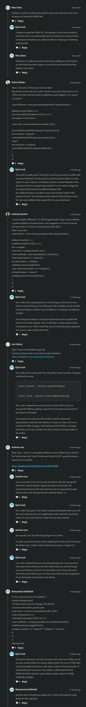

# expand collapse walkthrough 

## Note ✅ 

    - we need to write JS in that way 
        even if in future , if we add any element dynamically , right now we have 4 card 
        but let's say we added new elements dynamically through JS then those cards must work 💡💡💡

    - because if we don't write JS code which doesn't work on that elements which is/are added dynamically 
        then we need to rewrite the html code that's why we need to always think about 
        that JS code work for those elements also which are added dynamically 💡💡💡

## explanation of code ✅

    STEP 1 : 

        - using 'click' event on document object 
            instead of on that button of each card 
        - due to this we don't have to worry about 
            whether that element is dynamically added or not inside the page 💡💡💡

        - generally , when you want make that element should work which is added dynamically 
            then we need to create event listeners on some type of parent element 💡💡💡
            so in this situation , parent element will be -> document global object 💡💡💡 
        - but if we don't want to care about dynamic adding 
            then here we can add the event listener directly on each one of our expand-button classes
            but since we know that , we can dynamically add those new cards in the future 
            then we can add event listener on the document global object
            that way we don't have to worry about whether that element is dynamically added or not 💡💡💡 

        document.addEventListener("click", e => {
            if (!e.target.matches(".expand-button")) return
        })

        - here we're again using guard clause i.e
            if (!e.target.matches(".expand-button")) return
        - means code which are inside 'click' event only will be executed 
            when that button has a class i.e expand-button

    STEP 2 : 

        - so now we already accessed that button has a class i.e expand-button

        - now we need to think about how we can access that class ie. .card-body
            so first think we can use closest() method on that button 
            to access that class i.e .card
        - & then through that class -> .card , we can access that -> .card-body
            & then we can add the class -> .show & remove it from -> .card-body 

        - if things are not making sense then write the pseudo code then implement the code

        document.addEventListener("click", e => {
            if (!e.target.matches(".expand-button")) return

            const card = e.target.closest(".card")
            const cardBody = card.querySelector(".card-body")
        })

        - so here we access that .expand-button class  
            & then through this class we directly access .card -> class by using closest() method , which is a parent 
            & then we access that .card-body class 💡💡💡
        - & this is the most common way that we do in JS all the time 💡💡💡

    STEP 3 : 

        document.addEventListener("click", e => {
            if (!e.target.matches(".expand-button")) return

            const card = e.target.closest(".card")
            const cardBody = card.querySelector(".card-body")
            cardBody.classList.toggle("show")
        })

        - toggle() method of classList object/property
            - it will remove the class if the element has a class
            - it'll add the class if the element doesn't have a class 💡💡💡

    STEP 4 : change the text based on which state we are 

        document.addEventListener("click", e => {
            if (!e.target.matches(".expand-button")) return

            const card = e.target.closest(".card")
            const cardBody = card.querySelector(".card-body")
            cardBody.classList.toggle("show")

            if (e.target.innerText === "Expand") {
                e.target.innerText = "Collapse"
            } else {
                e.target.innerText = "Expand"
            }
            // e.target.innerText = e.target.innerText === "Expand" ? "Collapse" : "Expand"
        })

    STEP 5 : another way 

        document.addEventListener("click", e => {
            if (!e.target.matches(".expand-button")) return

            const card = e.target.closest(".card")
            const cardBody = card.querySelector(".card-body")

            const showing = cardBody.classList.toggle("show")
            e.target.innerText = showing === "Expand" ? "Collapse" : "Expand"
        })

        - Note ✅ : here we used const -> keyword i.e const showing = cardBody.classList.toggle("show")
            - because click event will fire again & again as soon as we click again & again
            - & due to that , boolean value of showing -> variable will also change 
                & previous boolean value will gets overwritten by the new one 💡💡💡

## complete code 

```js
document.addEventListener("click", e => {
  if (!e.target.matches(".expand-button")) return

  const card = e.target.closest(".card")
  const cardBody = card.querySelector(".card-body")

  cardBody.classList.toggle("show")
  if (e.target.innerText === "Expand") {
    e.target.innerText = "Collapse"
  } else {
    e.target.innerText = "Expand"
  }
  // e.target.innerText = e.target.innerText === "Expand" ? "Collapse" : "Expand"
})
```

## discussion page



