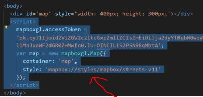
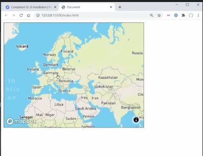
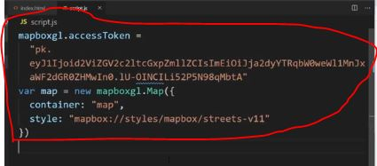
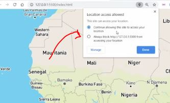
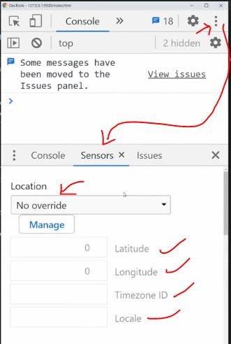
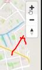
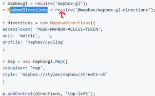
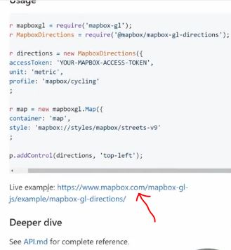
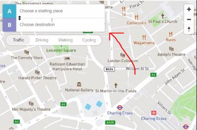

# google map clone

    - we'll use mapbox library
    
    - to use mapbox , login in https://www.mapbox.com

## complete code 

```html
<!DOCTYPE html>
<html lang="en">
<head>
  <meta charset="UTF-8">
  <meta name="viewport" content="width=device-width, initial-scale=1.0">
  <meta http-equiv="X-UA-Compatible" content="ie=edge">
  <script src='https://api.mapbox.com/mapbox-gl-js/v1.12.0/mapbox-gl.js'></script>
  <link href='https://api.mapbox.com/mapbox-gl-js/v1.12.0/mapbox-gl.css' rel='stylesheet' />
  <script src="https://api.mapbox.com/mapbox-gl-js/plugins/mapbox-gl-directions/v4.1.0/mapbox-gl-directions.js"></script>
  <link
    rel="stylesheet"
    href="https://api.mapbox.com/mapbox-gl-js/plugins/mapbox-gl-directions/v4.1.0/mapbox-gl-directions.css"
    type="text/css"
  />
  <title>Document</title>
  <style>
    body {
      margin: 0;
    }

    #map {
      height: 100vh;
      width: 100vw;
    }
  </style>
  <script src="script.js" defer></script>
</head>
<body>
  <div id='map'></div>
</body>
</html>
```
js code 
```js
const MAPBOX_ACCESS_TOKEN =
  "pk.eyJ1Ijoid2ViZGV2c2ltcGxpZmllZCIsImEiOiJja2dyYTRqbW0weWl1MnJxaWF2dGR0ZHMwIn0.lU-OINCILi52P5N98qMbtA"

navigator.geolocation.getCurrentPosition(successLocation, errorLocation, {
  enableHighAccuracy: true
})

function setupMap(centerPosition) {
  const map = new mapboxgl.Map({
    accessToken: MAPBOX_ACCESS_TOKEN,
    container: "map",
    style: "mapbox://styles/mapbox/streets-v11",
    center: centerPosition,
    zoom: 15
  })

  const navigationControls = new mapboxgl.NavigationControl()
  map.addControl(navigationControls)

  const directionControls = new MapboxDirections({
    accessToken: MAPBOX_ACCESS_TOKEN
  })
  map.addControl(directionControls, "top-left")
}

function successLocation(position) {
  setupMap([position.coords.longitude, position.coords.latitude])
}

function errorLocation() {
  setupMap([-2.24, 53.48])
}
```

## explanation of code ✅

    STEP 1 
        - first after login on mapbox.com then scroll down there are two things we'll use 
        - map loads for web & direction API 

        - second scroll up & just click on -> web
            then two option will come so -> choose the mapbox CDN 

    STEP 2 : 

        - then copy those CDN link inside html i.e 
            <script src='https://api.mapbox.com/mapbox-gl-js/v1.12.0/mapbox-gl.js'></script>
            <link href='https://api.mapbox.com/mapbox-gl-js/v1.12.0/mapbox-gl.css' rel='stylesheet' />

        - then click on next

    STEP 3 : 

        - then we'll see mapbox access token
            & this access token is unique for every user like this 
            pk.eyJ1Ijoid2ViZGV2c2ltcGxpZmllZCIsImEiOiJja2dyYTRqbW0weWl1MnJxaWF2dGR0ZHMwIn0.lU-OINCILi52P5N98qMbtA

        - so copy all the code & then put inside the body element  
            i.e 


        - here these JS code are hard coded 
            so we'll move that JS code inside separate JS file 
            once when we start

        - then click to next
        
        // output : 


    STEP 4 :

        - remove the inline style from div element 
            & write inside <style></style> element  

        like this 

        <head>
            <title>Document</title>
            <meta charset="UTF-8">
            <meta name="viewport" content="width=device-width, initial-scale=1.0">
            <meta http-equiv="X-UA-Compatible" content="ie=edge">
            <script src='https://api.mapbox.com/mapbox-gl-js/v1.12.0/mapbox-gl.js'></script>
            <link href='https://api.mapbox.com/mapbox-gl-js/v1.12.0/mapbox-gl.css' rel='stylesheet' />
            <link 
                rel="stylesheet"
                href="https://api.mapbox.com/mapbox-gl-js/plugins/mapbox-gl-directions/v4.1.0/mapbox-gl-directions.css"
                type="text/css"
            />
            <style>
                body {
                margin: 0;
                }

                #map {
                height: 100vh;
                width: 100vw;
                }
            </style>
            <script src="script.js" defer></script>
        </head>
        <body>
            <div id='map'></div>
        </body>

    STEP 5 : make separate JS file

        - put all the code inside that JS file like this  


    STEP 5 : make a global variable to store that access token ✅

        const MAPBOX_ACCESS_TOKEN = 
            "pk.eyJ1Ijoid2ViZGV2c2ltcGxpZmllZCIsImEiOiJja2dyYTRqbW0weWl1MnJxaWF2dGR0ZHMwIn0.lU-OINCILi52P5N98qMbtA"

        & put this variable inside Map() method of mapboxgl class like this 

        let map = new mapboxgl.Map({
            accessToken : MAPBOX_ACCESS_TOKEN , 
            container : "map" , 
            style : "mapbox://styles/mapbox/street-v11"
        }) 

        - first we loaded the mapbox through those two i.e script & link
        - & then that custom script we added after those two i.e script & link

        - here this means -> style : "mapbox://styles/mapbox/street-v11"
            which type of map we want so here is street map based application

        - now we need to track which location we're in right now 
            so we need to use geolocation

        - geolocation is built in our browser 💡💡💡

    STEP 6 : setting up geolocation ✅

        navigator.geolocation.getCurrentPosition()

        NOTE : about getCurrentPosition() method of geolocation 

            - it takes 3 arguments 
                first - callback function like here is successLocation
                second - callback function like here is errorLocation
                third - curly braces means object & that object takes key value pairs 
                        like enableHighAccuracy : true  

            enableHighAccuracy -> means we want to see our current location
                                accurately as much as possible

        const MAPBOX_ACCESS_TOKEN = 
            "pk.eyJ1Ijoid2ViZGV2c2ltcGxpZmllZCIsImEiOiJja2dyYTRqbW0weWl1MnJxaWF2dGR0ZHMwIn0.lU-OINCILi52P5N98qMbtA"

        let map = new mapboxgl.Map({
            accessToken : MAPBOX_ACCESS_TOKEN , 
            container : "map" , 
            style : "mapbox://styles/mapbox/street-v11"
        }) 
        
        navigator.geolocation.getCurrentPosition(successLocation , 
            errorLocation , {
                enableHighAccuracy : true
            })

        - but we'll get error because we didn't define the successLocation & errorLocation

    STEP 6.1 : setting up successLocation & errorLocation ✅

        const MAPBOX_ACCESS_TOKEN = 
            "pk.eyJ1Ijoid2ViZGV2c2ltcGxpZmllZCIsImEiOiJja2dyYTRqbW0weWl1MnJxaWF2dGR0ZHMwIn0.lU-OINCILi52P5N98qMbtA"

        let map = new mapboxgl.Map({
            accessToken : MAPBOX_ACCESS_TOKEN , 
            container : "map" , 
            style : "mapbox://styles/mapbox/street-v11"
        }) 
        
        navigator.geolocation.getCurrentPosition(successLocation , 
            errorLocation , {
                enableHighAccuracy : true
            })

        function successLocation() {
            
        }

        function errorLocation() {
            console.log("error")
        }

        // output : we'll see a pop , so allow that thing to access the current location


        - & we if we don't allow then 
            error -> message will be printed out 
        - because we blocked it to access from the our current location ✔✔

        - now click to triple dots of devtools
            & go to more tools & choose the sensors 💡💡

        - inside sensors section
            if choose location i.e unavailable location
            then again we'll get that error -> message 

        - but if we choose like london
            & if we put console.log(position) inside successLocation() function
        - then we'll get GeolocationPosition object which is related to london location 💡💡


        - & inside that GeolocationPosition object
            we'll see the latitude & longitude property 
            which is related to london location 💡💡💡

        - so we want to zoom to our map when we got the location ✔✔

    STEP 7 : setting up zoom when we got the location ✅

        const MAPBOX_ACCESS_TOKEN = 
            "pk.eyJ1Ijoid2ViZGV2c2ltcGxpZmllZCIsImEiOiJja2dyYTRqbW0weWl1MnJxaWF2dGR0ZHMwIn0.lU-OINCILi52P5N98qMbtA"
        
        navigator.geolocation.getCurrentPosition(successLocation , errorLocation , {
            enableHighAccuracy : true
        })

        function setupMap(centerPosition) {
            const map = new mapboxgl.Map({
                accessToken : MAPBOX_ACCESS_TOKEN , 
                container : "map" , 
                style : "mapbox://styles/mapbox/street-v11" , 
                center : centerPosition , 
                zoom : 15
            })
        }

        function successLocation(position) {
            setupMap([position.coords.longitude , position.coords.latitude])
        }

        function errorLocation() {
            console.log("error")
        }

        - we made a setupMap() function
            & we called that setupMap() function 
        - & inside of it we define longitude first & then latitude because this is the way mapbox takes 
            & both should be inside of an array

        - & after that define two keys inside of that object i.e center & zoom key

    STEP 8 : setting up default location inside errorLocation() function 

        - instead of showing error we can show the default location
            by defining coordinates of that location like this 

        function errorLocation() {
            setupMap([-2.24 , 53.48])
        }

        - so these coordinates point towards manchester location
            by default if that user doesn't give location or open the app first time ✔✔✔

        - now let's create the directions inside the map

    STEP 9 : setting up directions inside the map ✅

        - so go to dashboard of mapbox website
        - then click to -> web
        - then click to hamburger menu
        - & click to documentation
        - then click to mapbox GL JS documentation

        - now inside that documentation we need to find navigation
            so search for navigation

        - after getting navigation setup it inside the code 

    STEP 9.1 : setting up navigation inside setupMap() function ✅

        function setupMap(centerPosition) {
            const map = new mapboxgl.Map({
                accessToken: MAPBOX_ACCESS_TOKEN,
                container: "map",
                style: "mapbox://styles/mapbox/streets-v11",
                center: centerPosition,
                zoom: 15
            })

            const navigationControls = new mapboxgl.NavigationControl()
            map.addControl(navigationControls)
        }

        // output : 

        
    STEP 9.2 : setting up direction inside setupMap() function ✅

        - search direction but if we didn't get 
        - then go ti plugins
            & then search -> direction
            & select the mapbox GL direction ✔✔

        - after that we came inside github page of it 


        - that's highlighted line is one way also to setup the direction 
            but we don't use it 

        - so easy way is click to this link 

        
        - then we'll get the live example 
        - then scroll little down 
        - & then there are two links i.e script & link tags i.e 
            <script src="https://api.mapbox.com/mapbox-gl-js/plugins/mapbox-gl-directions/v4.1.0/mapbox-gl-directions.js"></script>
            <link
                rel="stylesheet"
                href="https://api.mapbox.com/mapbox-gl-js/plugins/mapbox-gl-directions/v4.1.0/mapbox-gl-directions.css"
                type="text/css"
            />
        - & copy & paste after those scrip & link tags like this 

        <head>
            <meta charset="UTF-8">
            <meta name="viewport" content="width=device-width, initial-scale=1.0">
            <meta http-equiv="X-UA-Compatible" content="ie=edge">
            <script src='https://api.mapbox.com/mapbox-gl-js/v1.12.0/mapbox-gl.js'></script>
            <link href='https://api.mapbox.com/mapbox-gl-js/v1.12.0/mapbox-gl.css' rel='stylesheet' />
            <script src="https://api.mapbox.com/mapbox-gl-js/plugins/mapbox-gl-directions/v4.1.0/mapbox-gl-directions.js"></script>
            <link
                rel="stylesheet"
                href="https://api.mapbox.com/mapbox-gl-js/plugins/mapbox-gl-directions/v4.1.0/mapbox-gl-directions.css"
                type="text/css"
            />
            <title>Document</title>
            <style>
                body {
                margin: 0;
                }

                #map {
                height: 100vh;
                width: 100vw;
                }
            </style>
            <script src="script.js" defer></script>
        </head>

        - & then again scroll little bit then we'll see this code 
            new MapboxDirections({
                accessToken: mapbox.accessToken
            })
        - copy these are past inside setupMap() function 

    STEP 9.3 : setting up directions ✅

        function setupMap(centerPosition) {
            const map = new mapboxgl.Map({
                accessToken: MAPBOX_ACCESS_TOKEN,
                container: "map",
                style: "mapbox://styles/mapbox/streets-v11",
                center: centerPosition,
                zoom: 15
            })

            const navigationControls = new mapboxgl.NavigationControl()
            map.addControl(navigationControls)

            const directionControls = new MapboxDirections({
                accessToken: MAPBOX_ACCESS_TOKEN
            })

            map.addControl(directionControls, "top-left") // now here we put the control
        }

        // output : 

            
## said by kyle 🔥

    - in next section of the course 
        we'll talk about modules + bundlers
    - & how they are so useful for making code so much cleaner

    - & also we'll use external libraries using NPM
        instead of using CDN links
