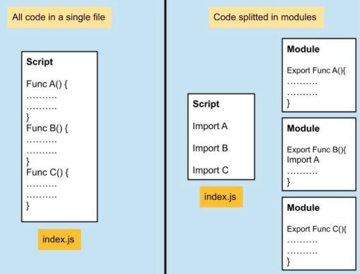
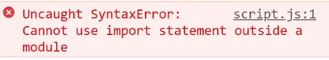
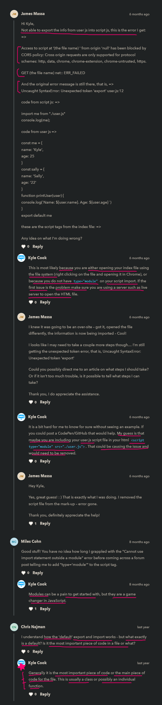

# ES6 modules in JS 

    - most most important 🔥🔥

    - highly used to make our code cleaner
        because this is also used in reactjs a lot 💡💡💡

    - this is most useful + amazing features added in JS 

    - used allows to take code from on file inside use another file
        so that we can the code of that other file inside an another file 

    - ES6 modules also known as browser modules which is for JS 
        but when we're working with nodejs
        then in nodejs , the modules called as node modules or common modules 
    - so browser modules & node modules both are different each other in terms of work 💡💡💡 

    - to use modules we need a server 
        because without a server modules won't work & we'll get error 
        that's why we're using live server ✔️

    - ES6 modules doesn't work in terminal , it works on browser
        & node modules doesn't work on the browser , it works in terminal 

## why we need to use ES6 modules 🔥

    - like whatever we code wrote inside a JS file
        it's about 40 or 100 or 150 lines of code

    - but when we make actual big projects in inside a js file  
        so when we wrote many lines of code for that big project 
    - so here we can't write all the code inside one JS file 
        so we make different JS files & each JS files contains 
        different sections lines of code of that project
        & all the different codes of each JS file 
        we can use inside that single main js file by using modules 
    - now due to this mananging JS file becomes easier 💡💡💡

## example - why we need to use ES6 modules ✅

    - using tranditional way to link multiple script files inside head tag

    - js folder 📁
        - user.js 
        - script.js  

    - according to project we can create different files 
        & we can give useful name to those JS files 
    - but give only useful name to each js files because of best practices
        instead of random name  
    - so that we can understand by seeing on the files 
        that user.js file contain code related to user & so on... 💡💡💡 

    -> code inside user.js file 📄

        const friend1 = {
            name : "Horse" , 
            age : 12
        }

        const friend2 = {
            name : "Mukul" , 
            age : 22
        }

    -> code inside script.js file 📄

        function printUser(user) {
            console.log(`Name : ${friend1.name} Age : ${friend1.age}`)
        }

        printUser(friend1)

    - so now we need to link these two js files inside head tag 
        but each js files should be link in a order wise or sequence 
        in the way we define the code otherwise we'll get an error 
        like this 
        <head>
            
            
        </head>
    - so here user.js file contain all the object & 
        inside script.js file we're accessing each keys of friend1 object 💡💡💡 

    NOTE : 
        - if we link script.js first & then we link user.js
            then we'll get error 
        - because inside script.js file we're accessing each keys of friend1 object
            but they didn't present so we'll get an error 💡💡💡
        - so always link that js file first which contains variables , etc 
            so that we can use those variables , etc inside other js files later on 

    // output : now we'll still get output

    Problem : ✅
        - but here is a problem that what if we have 10 different js files for that project
            so we can't link each js files inside head tag
        - because if we link each 10 js files inside head tag
            then our html code becomes messed up & not maintainable + not readable also 
        - like inside script.js we're accessing friend1 object 
            but we don't know from where friend1 object is coming 
        - due to this , readability decreased 💡💡💡
        - & all the code are of that file can be accessed inside any other js file 
            that's also we don't want 

    - that's why we use ES6 modules of js ✔
        so by using modules we just need to link only that main JS file
        which will contain all the js codes from different js module files 💡💡💡

    - so we can export all the code from first js file 
        & import inside another js file 💡💡💡 

    - & we can also import that module file inside another module file 💡💡💡 

## benefits of using ES6 modules ✅

    - Maintainability
    - Reusability
    - Shareability

## Note - about errors while using import & export -> keywords ✅ 

    - why we need to define -> type="module" 
        inside that main js file before using modules 💡💡💡

    eg 1 : exporting friend1 from user.js file by using export -> keyword 

        html code 
        ---------
        <head>
            
        </head>

        -> code of user.js file 📄

            const friend1 = {
                name : "Horse" , 
                age : 12
            }

            const friend2 = {
                name : "Mukul" , 
                age : 22
            }

            export friend1 

        -> code of app.js file 📄

        - if we use import & export keywords directly inside js files 
            then we'll get this error 

        - this error means our browser don't have any idea what is import & export keywords means
            so that's why we need to tell our browser that we're using modules 💡💡💡
            by defining type="module" -> on that main js file 
            like this 
            

        NOTE : why not use defer -> attribute when we use type="module" inside main js file ✅

            - type="module" tells that we're using ES6 modules 
                so that browser can handle code in the form modules 💡💡💡 

            - & we don't need to define defer -> attribute inside that main js file 
                because bydefault type="module" give that defer attribute 
                behind the scene 💡💡💡

        - after defining type="module" inside our main js file 
            then still we'll get an error 

## using modules through import & export -> keywords 🔥

    -> code of user.js file 📄

        let message = "hello"

        export const friend1 = {
            name : "Horse" , 
            age : 12
        }

        function printStuff() {
            console.log("hello modules");
        }

    - why we need to use export -> keyword 
        - now inside this user.js file we need to tell 
            which part of code we want to export 
            so that any other js file can import/use that part of code of user.js 
        - so no other js files can't use any part of code of user.js 
            until that user.js file don't give permission 💡💡💡

    - so we give permission to use the part of code of user.js or any other js file 
        to another js file by using export -> keyword 💡💡💡
    - eg : we want to use that "message" variable of user.js file
        inside any other js file then we need to use export -> keyword 

    - two ways to export & import files by using export -> keyword 💡💡💡
        - for export 
            - general way to export things by using only export -> keyword ✔️
            - default way to export things by using export & default -> keywords ✔️
        - for import 
            - general way to import things by using only import -> keyword ✔️
            - default way to import things by using import & default -> keywords 
            
        NOTE : ✔
            - we don't use default -> keyword while importing 
                because this doesn't make any sense 
            - means we already using default keyword while exporting 
                & when we're using import -> keyword
                then again we're using default keyword that's why 

## general way to export & import things by using only export & import -> keywords 

    -> example of general way importing & exporting only single code part 🔥

        eg : of exporting only single part of code by using export -> keyword ✅

            -> code of user.js file 📄

                export let message = "hello" -------------------------+       
                                                                      |
                const friend1 = {                                     |
                    name : "Horse" ,                                  |
                    age : 12                                          |
                }                                                     | ---- first way to use          
                                                                      |        export -> keyword
                const message1 = "hello world"                        |  
                                                                      |  
                function printStuff() {                               |          
                    console.log("hello modules");                     |
                }  ---------------------------------------------------+
                // OR
                let message = "hello" --------------------------------+
                                                                      |  
                const friend1 = {                                     |  
                    name : "Horse" ,                                  |  
                    age : 12                                          |
                }                                                     |  
                                                                      | --- another way to export  
                const message1 = "hello world"                        |     by using export -> keyword
                                                                      |  
                function printStuff() {                               |  
                    console.log("hello modules");                     |  
                }                                                     |  
                                                                      |   
                export message  --------------------------------------+

            - so to use export -> keyword , we need to define it 
                before that let or const or function or class keywords 
                or we can use export -> keyword after writing all the code 💡💡💡

            NOTE : ✅
                - any function when we're exporting & importing inside other file
                    then don't call that function by using parentheses 💡💡💡

            - here if we want to use that "message" variable 
                or want to export only single part of the code
                then just write export -> keyword & then just give only name of that variable 
                    or function or class or object , etc 💡💡💡
            - now we can use "message" variable inside any other js file 
            - but we can't use "friend1" object , printStuff() function 
                of user.js inside other js file 💡💡💡
                because we didn't gave a permission by using export -> keyword
                to use them inside other js file 
            - & same with "message1" variable because we don't want to give permission
                to other js file to use "message1" variable of user.js file 💡💡💡

            - now to use that "message" variable & printStuff() function of user.js file
                inside any other js file like script.js file 
            - then we need to use import -> keyword inside script.js file 

        eg : of importing only single part of code by using import -> keyword✅

            - now inside script.js file we're importing those part of code from user.js 
                which have export keyword on them 
            - but we can't import/use those part of code of user.js
                which doesn't have export -> keyword on them 💡💡💡 

            -> code of script.js file 📄

                import message from './user.js' ---------> first way to import single code part
                // OR 
                import { message } from './user.js' -----> second way to import single code part

                console.log(message)

                // output : hello

                - here to import that single part of code
                    we just need to define it's name 
                - & then from -> keyword is used to tell from which path
                    we want to import that code 
                - & then we define path inside double/single quotes 💡💡💡

            NOTE : ✅
                - whenever we're importing only single part of code 
                    then don't use curly braces 
                - because curly braces used to import multiple code parts at the same time 

            NOTE : about import -> keyword ✔

                - while importing then we have to give the extension with file name of that file 
                    while defining path
                - but in sass we don't do define file extension , only file name used 
                    when we import
             
    -> example of general way to import & export multiple code parts 🔥
    
        eg : of exporting multiple code parts by using export -> keyword ✅

            -> code of user.js file 📄

                export let message = "hello" -------------------------+       
                                                                      |
                const friend1 = {                                     |
                    name : "Horse" ,                                  |
                    age : 12                                          |
                }                                                     | ---- first way to use          
                                                                      |       export -> keyword
                export const message1 = "hello world"                 |       to export multiple 
                                                                      |       code parts 
                export function printStuff() {                        |          
                    console.log("hello modules");                     |
                }  ---------------------------------------------------+
                // OR
                let message = "hello" --------------------------------+
                                                                      |  
                const friend1 = {                                     |  
                    name : "Horse" ,                                  |  
                    age : 12                                          |
                }                                                     |  
                                                                      | --- another way to export  
                const message1 = "hello world"                        |     by using export -> keyword
                                                                      |     to export multiple code parts
                function printStuff() {                               |  
                    console.log("hello modules");                     |  
                }                                                     |  
                                                                      |   
                export { message , message1 , printStuff }  ----------+ 

            - to export & import multiple code parts 
                then we use curly braces & each code parts 
                will be separated by comma 💡💡💡

        eg : of importing multiple code parts by using import -> keyword ✅

            - now we're importing multiple code parts which has export -> keyword
                inside user.js file 

            -> code of script.js file 📄

                import { message , message1 , printStuff } from './user.js'

                console.log(message)
                console.log(message1)
                printStuff()

                // output : hello
                            hello world
                            hello modules

    -> example of giving custom name to single or multiple code parts while exporting & importing 🔥

        - to give custom name or rename either exporting or importing or both
            with multiple or single part of code then we use as -> keyword 💡💡💡

        eg : of giving custom name to single code part by using as -> keyword while exporting only ✅
                
            -> code of user.js file 📄

                let message = "hello" --------------------------------+
                                                                      |  
                const friend1 = {                                     |  
                    name : "Horse" ,                                  |  
                    age : 12                                          |
                }                                                     |  
                                                                      | --- rename or giving custom name
                const message1 = "hello world"                        |     to single code part while
                                                                      |     only exporting
                function printStuff() {                               |  
                    console.log("hello modules");                     |  
                }                                                     |  
                                                                      |   
                export { message as mg }  ----------------------------+ 

            - now we can only import "message" variable by using "mg" variable name
                if we try to import "message" variable name instead of "mg" variable name 
                then we'll get an error 💡💡

            -> code of script.js file 📄

                import mg from './user.js'

                console.log(mg)

                // output : hello

        eg : of giving custom name to single code part by using as -> keyword while importing only ✅

            -> code of user.js file 📄

                export let message = "hello" 
                                                                        
                const friend1 = {                                       
                    name : "Horse" ,                                    
                    age : 12                                          
                }                                                       
                                                                      
                const message1 = "hello world"              

                function printStuff() {                                 
                    console.log("hello modules");                       
                }                                                       

            - while importing that "message" variable inside script.js file 
                we'll give rename it 

            -> code of script.js file 📄

                import {message as messg} from './user.js'

                console.log(messg)

                // output : messg

                NOTE : ✅
                    - if we try to use "message" variable name 
                        instead of messg then we'll get an error  
                    - because we rename "message" variable name into messg

        NOTE : best practices ✅

            - & we can giving custom name to multiple code parts by using as -> keyword 
                while exporting only or importing only
            - but most of the time we give custom name while importing only 💡💡💡
                not while exporting

        NOTE : why we need as -> keyword to rename or giving custom name ✅

            - most imp note 🔥

            - let's say we have same function name in two different files 
                & we're importing inside both function from tow different files
                inside that main js file 
            - then inside that main js file , after importing 
                we can't use same function name otherwise they conflict each other 💡💡💡

            eg : having same function name inside two different files 

                -> code of user.js file 📄

                    export let name = "Teen" 

                    export function printStuff() {
                        console.log(`user name is ${name}`)
                    } 

                -> code of account.js file 📄

                    export let accountHolderName = "Necola Tesla" 

                    export function printStuff() {
                        console.log(`account holder name is ${accountHolderName}`)
                    } 

                -> code of main.js file 📄

                    import printStuff from "./user.js"
                    import printStuff from "./account.js"

                    printStuff() 

                    - here we called the printStuff() function
                        now tell us which printStuff() function called 

                    // output : we'll get error 
                            because we're importing same code two times
                            & things become difficult to understand too 

                    - that's why we need as -> keyword to rename or give custom name 
                        to that code part which we're importing 
                        when both code part of different files have same name 💡💡💡
                        like this 

                -> code of main.js file (after renaming) 📄

                    import { printStuff as printUser } from "./user.js"
                    import { printStuff as accountUser } from "./account.js"

                    printUser() 
                    accountUser()

                    // output : now we'll get our output
                    
                - so we use as -> keyword for renaming or giving custom name
                    while importing them when we have same name 
                    like it can be variable name or function name , etc
                    inside of two or multiple different files
                - & so that we can avoid conflict & errors  💡💡💡

    -> example of importing multiple code parts 🔥

        - to import multiple code parts from that file inside another file 
            we use * (asterisk) sign

        - most of the time we use * (asterisk) sign when we're importing 
            not while exporting 💡💡💡

        NOTE : why we need to use * (asterisk sign) ✅

            - important note 🔥
            
            - let's say we define export -> keyword on 50 functions or variables
                & now we need to import them inside another js file 

            - then here we can't use curly braces to import those 50 functions or variables 
                so here comes * (asterisk) sign

            - whenever we want to import multiple code parts 
                from one file (which have export -> keyword on them)
                inside another file then we use * (asterisk) sign 💡💡💡      

        eg : of importing multiple code parts by using * (asterisk) sign ✅

            -> code of user.js file 📄

                export let name = "Teen" 

                export function printStuff() {
                    console.log("hello modules")
                }

                const stuff = () => {
                    console.log("this is stuff function")
                }

            -> code of main.js file 📄

                - if we use * (asterisk) sign directly then we'll get an error 
                    so we need to give custom name by using as -> keyword after that sign 💡💡💡 
                - & then whatever we want access code of user.js file 
                    then that custom name we'll work as object 💡💡💡

                import * as user from "./user.js"

                - here user -> is a custom name of that user.js file 💡💡💡

                - now let's use printStuff() function 
                    so we can't directly use this function
                - so that's why we need to use that custom name as a object
                    the that printStuff() function 💡💡💡
                    like this 

                user.printStuff()

                - here this line of code -> user.printStuff()
                    means we're calling printStuff() function 
                    of that user (which is a custom name of that file) 💡💡💡

                // output : hello modules

## default way to export & import things by using default -> keyword

    - default -> keyword used with export & import -> keywords 💡💡💡 

    - most of the time we use default -> keyword while exporting 
        not while importing 💡💡💡
    - & even exporting code as default by using default -> keyword we use less
        we use export with default -> keyword based on situation

    - & 100% times we use named export means general export 💡💡💡 
        & 10% we use default -> keyword 

    NOTE : when & when not to use default -> keyword while exporting ✅

        - we use default -> keyword while exporting when that code is main code of that file 
        - that code could be the main function which handle crucial part 
            or it could be a class 
        - so always use default -> keyword while exporting
            when that code part is important & main thing 

        - if any code which is not important & main thing
            then don't use default -> keyword after export -> keyword
            only use named export means general way of using export -> keyword 

    NOTE : best practices of default -> keyword ✅

        - & we can use default -> keyword after export -> keyword many times
            but for best practices 
        - always use default -> keyword only one time after export -> keyword on that code part 💡💡💡  

    -> example of only default -> keyword while only exporting 🔥

        -> code of user.js file 📄

            let name = "Teen" 

            function printStuff() {
                console.log("hello modules")
            }

            const stuff = () => {
                console.log("this is stuff function")
            }

            export default printStuff

        - here we're exporting printStuff() function as default 

        -> code of main.js file 📄

            import printStuff from "./user.js"

            printStuff()
            
            // output : hello modules 

    -> example of both default export & general exporting 🔥

        - here we'll export with default -> keyword & general exporting also

        -> code of user.js file 📄

            export let name = "Teen" 

            export function printStuff() {
                console.log("hello modules")
            }

            const stuff = () => {
                console.log("this is stuff function")
            }

            export default stuff

            - always use default -> keyword after export -> keyword 💡💡💡 

        -> code of main.js file 📄

            import stuff , { name , printStuff } from "./user.js"
                    |      |                   |
                    V      +-------------------+
                  means             |
              default export      means named/general export 

            stuff()
            console.log(name)

        - so for best practices when we have both a default export & general export 
            then always use default export outside the curly braces 
        - & then separate that default export by comma from general export 
            (which are defined inside curly braces) 💡💡💡

    -> example of default -> keyword while both exporting & importing ✅

        - so why do we need to import that code which has default -> keyword
            because let's say we don't want to see which code part is default in that file 
            & don't want to write the name while importing 
        - then we use default -> keyword with as -> keyword 💡💡💡

        eg : 
            -> code of user.js file 📄

                export default function printStuff() {
                    console.log("default way importing")
                }

            -> code of main.js file 📄

                import {default as printS} from './user.js'

                printS()

        - most of the time we don't use default -> keyword when we're importing 
            but 10% of time we only use default -> keyword when we're exporting only 💡💡💡

## Note - for only exporting default by using default -> keyword ✅

    - important note 🔥

    - when we have these two keywords like const , let keywords with that code  
        & when we're exporting that code default way  
        then always define export & default -> keywords
        in the separate line like this 
    - but if we want to export that code which is define by const or let keywords
        then either we can define before const or let keyword 
        or in separate line also 💡💡💡

    - when we have these two keywords like function or class keywords with the code 
        & when we're exporting that code default way 
        then either we can use export & default -> keywords before function or class keywords
        or in separate line also 💡💡💡

    eg 1 : writing export & default keywords in separate line ✅

        -> code of user.js file 📄
             
            export let name = "Teen" 

            export function printStuff() {
                console.log("hello modules")
            }

            const stuff = () => {
                console.log("this is stuff function")
            }

            export default stuff

        - here we'll not get any error 
        - but if we define default keyword for exporting that code as default
            before those two keywords like const , let
            then we'll get error like this 💡💡💡

    eg 2 : writing export & default -> keywords before const or let -> keywords ✅

        -> code of user.js file 📄
             
            export default let name = "Teen"  ----> ❌
            // OR
            export default const stuff = () => { ----> ❌
                console.log("this is stuff function")
            }

            export function printStuff() {
                console.log("hello modules")
            }

        - now here we'll get an error 
            because we can't define export & default -> keywords before const or let -> keywords
        - so whenever we want export that code default way 
            then define export & default -> keywords in separate line 
            not before that const or let -> keywords 💡💡💡

        - but we can define only export -> keyword before that const or let keywords 💡💡💡

    eg 3 : using export & default -> keywords before function or class keywords ✅

        -> code of user.js file 📄

            export default function printStuff() {
                console.log("hello modules");
            } 

        - here we'll not get any error 
            even if we use with export & default keywords before that function or class keywords 

## example - grouping of exporting & importing ✅

    - if we want to import only one time from that file
        which also exporting code from another file

    eg : 
        
        files + folder structure of this example 
        ----------------------------------------
            modules 📁
                - shapes 📁
                    - circle.js
                    - square.js
                    - triangle.js
                - shape.js
            - app.js
            - index.js

        -> code of circle.js file 📄

            export function circle() {
                console.log("circle function called...")
            }

        -> code of triangle.js file 📄

            export function triangle() {
                console.log("triangle function called...")
            }

        -> code of square.js file 📄

            export function square() {
                console.log("square function called...")
            }

        - here we're exporting code from three different js files

        - now think that we export 10 things from these different js files 
            & we import those 10 things inside main.js file
        - & inside main.js file we wrote import line of code 10 times 
            which create messed up code  

        - so due to this we can make shape.js file as module file 
            means we can import all the code of those different files   
            instead of doing in main.js file like this 

        -> code of shape.js file 📄
            
            export circle from "./shapes/circle.js"
            export triangle from "./shapes/triangle.js"
            export square from "./shapes/square.js"

            - so here we need to use export -> keyword instead of import -> keyword 
                because we want to send to another file 💡💡💡
        
        -> code of main.js file 📄

            import {circle , triangle , square } from "./modules/shape.js"

            circle()
            triangle()
            square()

        - so here we can see inside main.js file 
            that we import all those three different files 
            in single import 💡💡💡

        - here shape.js file is working like a bridge 
            means like a container 💡💡💡

## said by kyle 🔥

    - 93% times browser support module  
    
    - how to make module supportable on that browser 
        which doesn't support modules
        by defining nomodule -> attribute on that script tag

    - but if that browser support module 
        then even if we define nomodule -> attribute on that script tag
        then that browser don't see on that script tah which has nomodule -> attribute 

    - generally most of the time people don't use 
        nomodule -> attribute inside that script tag
        for that browser which doesn't support modules 💡💡💡 
    - because people handle modules by using bundlers like webpack , parcel , rollup.js , etc
    - & we never use nomodule -> attribute inside the script tag 💡💡💡
        because that bundler take care about this problem 

## -------------------- extra stuff of ES6 modules --------------------

## check videos 
  - https://www.youtube.com/watch?v=UEHAC3VJG-g&ab_channel=TechGun 👍
  - https://www.youtube.com/watch?v=FDZIt1MDuBI&ab_channel=YahooBaba 👍
  - https://www.youtube.com/watch?v=YEA8ekByboM&ab_channel=GeekyShows
  - https://www.youtube.com/watch?v=7P5JUMc1cI4&ab_channel=CoderDost

## check blogs for best practices 
  - https://dmitripavlutin.com/javascript-modules-best-practices/
  - https://www.freecodecamp.org/news/how-to-use-es6-modules-and-why-theyre-important-a9b20b480773/
  - https://dev.to/ndesmic/best-practice-tips-for-writing-your-js-modules-40o5
  - https://exploringjs.com/impatient-js/ch_modules.html
  - https://dev.to/thecoollearner/getting-started-with-javascript-modules-2mkg
  - https://dev.to/michalpzarzycki/es6-modules-101-1-405a
  - https://developer.mozilla.org/en-US/docs/Web/JavaScript/Guide/Modules
  - https://www.tutorialspoint.com/es6/es6_modules.htm
  - https://medium.com/backticks-tildes/introduction-to-es6-modules-49956f580da

## Extra stuff on it 

- https://flaviocopes.com/javascript-dynamic-import/

## Cheatsheet 

  - https://www.instagram.com/p/CbPv4ivB-By/
    - conclusion 
        - `first` : export statement
        - `second` : import statement
        - `third` : use of as operator in import statement
        - `fourth` : use of `*` star operator in import statement
        - `fifth` : default exports

## example - of import & export ✅

    -> code of user.js file 📄

        export function message() {
            console.log("this is a message function")
        }
    
        function callDefault() {
            console.log("i am a default function")
        }

        export default callDefault

    -> code of script.js file 📄

        import {message} from "./user.js"
        import Default from "./user.js"
        // OR 
        import Default , {message} from "./user.js"

        message()
        Default()

    NOTE : important note 🔥

        - if we define code part inside curly braces then means they're not default
            & if we define outside the curly braces then means i.e default 💡💡💡
        - so we need to understand for which & when to use curly braces & when note  

        - so whatever we're exporting default way 
            then while importing it we don't need to use curly braces 
            because automatically that default will be imported 💡💡💡

        - & when we use curly braces then we need to tell 
            what we want to import from that file 💡💡💡

## dicussion page 

