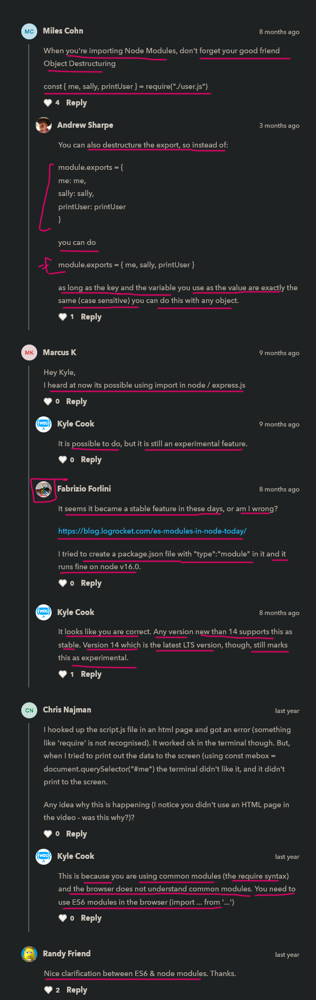

# Node modules

    - node modules & ES6/browser modules are both different than each other slightly 💡💡💡
        & both work different each other

    - node modules called as common modules 

    - browser doesn't not understand the common/node modules
        it only understand ES6 modules 
    - that's why we can't run the node modules code 
        on the browser except only terminal 💡💡💡 

## about node node modules 

    - node modules are not quite easy to work with 
        & due to this , popularity of ES6 modules 

    - Nodejs is started supporting ES6 modules inside of Node
    - but ES6 modules are not fully supported inside Node ✔️      
        so still we need to use old Node way of using Node modules

## using Node modules 🔥

    -> code of user.js file 📄

        const me = {
            name : "Teen" , 
            age : 12
        }

        const friend = {
            name : "Gen" , 
            age : 22
        }

        function printUser(user) {
            console.log(`Name : ${user.name} Age : ${user.age}`)
        } 

    - now we want to export all the code parts of user.js file inside script.js file ✔✔
        so we can't use export & default -> keywords before the const , function keywords 
        because we're using Node modules of Node.js not ES6 modules 💡💡💡
    
    - so we need to use -> module.exports

    -> module.exports inside Node modules ✅
        - module -> is a object in nodejs
            & exports -> is a property which takes value in the form object 
                        if we want export multiple code parts  
                        & inside that object value we define key value pair 
                        to export that code parts that we want to export 💡💡💡

        - used to export multiple those code parts that we want to export 💡💡💡

    eg : of exporting & importing through node modules ✅

        -> code of user.js file 📄 

            const me = {
                name : "Teen" , 
                age : 12
            }

            const friend = {
                name : "Gen" , 
                age : 22
            }

            function printUser(user) {
                console.log(`Name : ${user.name} Age : ${user.age}`)
            } 

            module.exports = {
                myName : me ,
                friendName : friend ,
                printDetails : printUser
            }

        - inside node modules , we don't have any default way to export
            if we want to export only one code part then we define like this 
            module.exports = me 💡💡💡

        - now in Node modules , to import all those code parts of user.js file inside script.js file 
            we need to use -> require() function 

        - module.exports -> is not defined inside the JS & in the browser also 
            - but it's used in nodejs 

    -> require() function inside Node modules ✅

        - it takes only one argument i.e path of that file that we want to import
            & then it return a variable i.e whatever we export on that file 💡💡💡

        -> code of script.js file 📄 

            const userExport = require("./user.js")

            - here "user" variable contain a value 
                i.e whatever we define in object value of module.exports property 💡💡💡 

            console.log(userExport)

            // output : {
                            myName : { name : "Teen" , age : 12 }
                            friendName : { name : "Gen" , age : 22 }
                            printDetails : [Function : [printUser]]
                        }

        -> code of script.js file (getting individual data) 📄

            const userExport = require("./user.js")
            const myName = userExport.myName
            const friendName = userExport.friendName
            const printDetails = userExport.printDetails

            printDetails(Ben)
            printDetails(Gray)
            // OR
            userExport.printDetails(userExport.myName)

## said by kyle 

    - node modules is not great because we can't export default way

## ---------------------- extra stuff of Node modules ----------------------

### check videos 
      
  - use shagun bhaiya JS lecture i.e using third party libraries 👍
  - https://www.youtube.com/watch?v=eSh1FZDJEWU&ab_channel=CodeWithHarry 👍
  - https://www.youtube.com/watch?v=49ZV-veYRyk&ab_channel=CodeStepByStep
  - https://www.youtube.com/watch?v=j4oMZ8JJGoM&ab_channel=CodeSplitter

### check blogs 

  - https://dev.to/cglikpo/getting-started-with-node-js-modules-5gfd
  - https://dev.to/drsimplegraffiti/raw-node-49ij

## discussion page 

