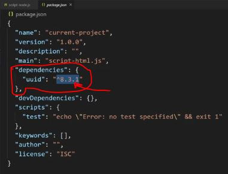
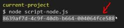

# npm

    - there are many package manager out there like yarn & one of them is NPM 

    - NPM - Node package manager

## about npm 

    - used to deal with all of the libraries & packages 

    - now we know how to export & import 
        by using ES6 modules of JS & node modules of nodejs + difference b/w them
    - so we'll see how to download libraries using NPM 
        & import them into own existing code ✔️

    👨🏻‍💻 command :- npm -v
        - used to check the version of npm 

    👨🏻‍💻 command :- node -v
        - used to check the version of nodejs
        
    - https://www.npmjs.com/ -> contains all the packages whatever we want 

    - UUID -> is a package & used to generate/create a unique identifier or id number ✔️
    - so in advance todo list , we wanted to create a unique id number 
        & to generate the unique id number in millisecond so we used Date() class 
    - but by using UUID , then we'll get always be unique id number

    NOTE : ✅

        - always see about that package is
            - how much download it has 
              - if there are many downloads then means it has documentation , etc also 
            - updated & maintainable or not 
            before downloading it    

    - after scrolling down of UUID package of that npm.js website
        we'll see the "quickstat" section
    - inside that section , we'll see how to use UUID library
        by using either through ES6/browser modules syntax or commonjs syntax / nodejs module syntax 

## installing uuid package through npm ✅

    👨🏻‍💻 command :- how to install a package through npm at a time  

                npm install nameofpackage
                // OR
                npm i nameofpackage
        
            eg : npm i uuid

    👨🏻‍💻 command :- how to install multiple packages through npm at a time

            npm i packagename anotherpackagename anotherpackagename  

            - we can download multiple packages through npm 
                by defining a space b/w each of them 💡💡💡

    - after install that uuid package 
        then two things created in our project 
            first - node_modules folder        
            second - package-lock.json 💡💡💡
    
    NOTE : why we need to create package.json file (best practices) ✅

        - we have to create a package.json file before downloading any package/library
            & that package.json file contains all of our different dependencies

        - this package.json will track all of our package/library that we installed 

    👨🏻‍💻 command :- how to make package.json file 

            npm init -y

    - now after creating package.json file 
        we need to reinstall uuid because before installing any library 
        we need to create create package.json file to track all the our libraries
        that we're going to install 💡💡💡

    - after installing that uuid package 
        we'll see extra come came inside package.json file i.e 💡💡💡
   

    - there is a version of uuid inside object value of dependencies -> key 

    NOTE : about package.json file 🔥

        - it store all the information about different packages/dependencies/libraries
            & when we push our code to github
        - then we don't need to push/upload entire file with that "node-modules" -> folder
            because "node-modules" -> folder contains tons & tons of code
            of each packages that we installed & due to this , size of this folder increased
        - & that's why we don't upload "node-modules" folder with other files on github
        - & we only upload package.json & package-lock.json file with other files on github

        - & when we want install all the packages that are used inside that project
            then with the help of package.json file , we can install 
            all the packages easily 💡💡💡
        - because package.json file contain all the information about all the packages
            that we were installed for that project 💡💡💡

        eg : important of package.json file ✅
            
            STEP 1 - let's delete that node-modules folder but don't delete the package.json file 
            
                - now how can access & what dependencies we installed we don't know so 
                    just run this command

            STEP 2 - npm i 

                - this command will download all the dependencies 
                    from that package.json file 💡💡💡

                - now we can see that node-modules folder came back 
                    which those dependencies with same version that we installed before

    NOTE : importance of package-lock.json file ✅

        - package-lock.json file also important 
            because it tells the exact version of each package 
            that we have installed including all sub-dependencies
        - This file is important since when we deploy our project 
            we want to ensure we use the same exact versions to prevent any errors
        - The lock file ensures that when we install packages 
            that are defined in the lock files that they are always the same version.
        - we need this file and it should be something we should never really touch 
            since it is automatically updated for you 💡💡💡

    - we installed that uuid package , 
        we can see that inside node-modules folder there is bin folder & uuid folder
        & there are many packages inside uuid folder
    - means that uuid package dependent on many packages 
        & those many packages are also dependent on other packages & so on.... ✔✔✔

## using node modules to use uuid package ✅

    -> code of script-node.js file 📄

        STEP 1  : const uuid = require('')

            - when we're dealing working with libraries 
                then we only give that library name as a path that we want to use 
                inside require("") function 💡💡💡

        STEP 2 : defining library name as a path inside require("") function 

            const uuid = require("uuid")

            - now this "uuid" variable has a object value (that's begin exported)

        STEP 3 : using v4() method

            -> v4() method of uuid object
                - used to generate UUIDS
                - & 4 -> means fourth version that we want to use

        STEP 4 : 

            const uuid = require("uuid")

            console.log(uuid.v4())

        STEP 5 : command to run the code of any js file inside terminal  

            node filename.extension

            eg : node script-node.js

            // output :
    

            - we got a string which is a random unique identifier
                & every time we run that script.js file inside terminal 
                then we'll get unique id string 
            - & uuid is guaranteed to be unique even in milliseconds also 

    NOTE : best practices ✅
        - whenever we're deploying a project to production
            then that project should have same version of packages inside package-lock.json file 
            as package.json have
        - as we're using inside our local environment 
            that's not important at that time

        - in production , we don't generally put/push that node_modules folder on netlify
        - but when we're putting that project then we can create .gitignore file 
            so that we shouldn't push that node_modules 

## example - of using uuid ✅

    folder + file structure 
    -----------------------
        project folder 📁
            - index.html
            - script.js 

    STEP 1 : create package.json file

            command : npm init 

            - after that a option come for yes or not , so type -> y 

    STEP 2 : install that package

            npm i uuid

    STEP 3 : inside script.js file 

            - we'll use ES6 modules not node modules 💡💡

            -> code of script.js file 

                import uuid from "./node_modules/uuid/dist/esm-browser/index.js"

                - here when we use node modules then we don't need to define complete path
                    by using defining only package name we can use code of uuid package
                
                - but if we use ES6 modules with npm libraries 
                    then we need to define complete path 
                - because ES6 modules are browser based 
                    & browser doesn't understand the node modules 💡💡💡 

                // output : we'll get error because inside index.js file of uuid 
                                we're exporting uuid as v4
                            so we need to import v4 not uuid

            -> code of script.js file 

                import v4 from "./node_modules/uuid/dist/esm-browser/index.js"

                console.log(v4())

                // output : we'll get unique number every single time

    NOTE : best practices ✅

        - we never push the node_modules folder with that project on github
            we only push the package-lock.json & package.json files 💡💡💡 
        - & these files also are package
            which track all the libraries/packages/dependencies that we going to install 💡💡💡

## said by kyle

    - using node_modules with ES6 modules 
        become difficult because need to give a long complete path 
        to use that package

    - but when we use node_modules with nodejs modules syntax 
        then we don't need to define a long complete path
        & we just need to define only name of the package
        inside double/single quotes inside require() function 

    - what if we want to use node_modules with es6 modules 
        without defining a long complete path 
        & by just defining only that package name while importing 💡💡💡
        like this -> import { v4 } from "uuid' 
    - so that's why here comes bundlers 
        which will do take care about that long complete path for us & more ... 💡💡💡

## ------------------- Extra notes on NPM -------------------

### check videos 

  - https://www.youtube.com/watch?v=4D0BB-DlZbI&ab_channel=ShakilKhanProgrammer 👍
  - https://www.youtube.com/watch?v=xD3V3Uf9HPI&ab_channel=GeekyShows 👍
  - https://www.youtube.com/watch?v=_Fgel8rrbIY&ab_channel=THMJ 👍
  - https://www.youtube.com/watch?v=49ZV-veYRyk&ab_channel=CodeStepByStep
  - https://www.youtube.com/watch?v=J4b_T-qH3BY&ab_channel=WebDevSimplified
  - https://www.youtube.com/watch?v=9xaKQi9-VTI&ab_channel=codedamn
  - https://www.youtube.com/watch?v=RYeRAME4nzE&ab_channel=Codevolution
  - https://www.youtube.com/watch?v=-SaZiADGLHs&ab_channel=SteveGriffith-Prof3ssorSt3v3
  - https://medium.com/learnwithrahul/understanding-npm-dependency-resolution-84a24180901b

## check blogs 

  - https://dev.to/search?q=npm
  
## Yarn Vs NPM
  - https://www.youtube.com/watch?v=OCW3Jz6F8Ek&ab_channel=LearnCode.academy  
  - https://www.youtube.com/watch?v=0DGClZD5LEM&ab_channel=CleverProgrammer
