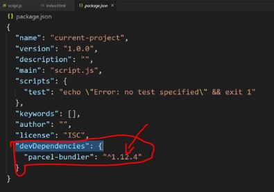
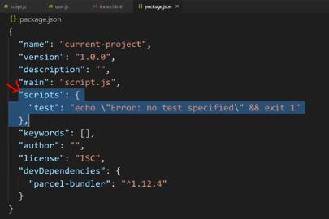
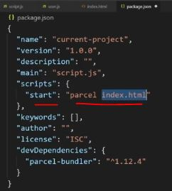
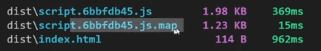
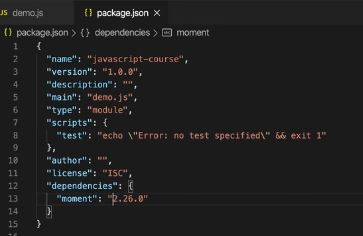
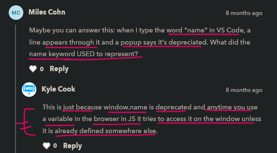

# Parcel

    - is a bundler just like Vite , rollup , esbuild , snowpack , webpack ✔️

    - bundler makes work easier when we work with modules in general
        like es6 modules or nodejs modules 
    - because bundler takes care of all the bundling of our modules for us 💡💡 

## why not use rollup & webpack like bundler ✅

    - rollup & webpack these are really powerful 
        but they're really complex to use 

    - not recommendable to use them raw or in normal form
        means where we just have to write out own webpack or rollup config files 
        because that's just really difficult
    - & something that no on should have to do 

    - only use rollup or webpack bundler
        if it's already taken care of & configured for us 
        in something like creating React app
    - so in our case we're not dealing with react
        so we'll use parcel

    - parcel bundler is easy to use + does everything that we need 

## what Parcel bundler do ✅

    - go to website -> https://parceljs.org/

    -> features of parcel 

        - blazing fast bundle times 
            means it will bundle the files very quickly
        
        - bundle all our assets 
            whether it's css , html , js , etc
            so it bundle all together

        - best part is - automatic transforms 
            - means automatically transforms all of our code , event node modules syntax 
                into the correct format so that the browsers can understand ✔✔

        - automatic replacement
            - means if we made changes in our code 
                & it's automatically refresh for us like live server

    - when we scroll down then 
        we'll see examples that all html , css , js , etc files 
        compiled into one single final minified version ✔✔

## using parcel ✅

    folder + files structure 
    ------------------------
        project folder 📁
            index.html 
            script.js 

    -> code of index.html file 📄

        <!DOCTYPE html>
        <html lang="en">
        <head>
            
        </head>
        <body>

        </body>
        </html>

    - now first create a package.json file 

    👨🏽‍💻 command :- npm init -y

    - now let's install parcel

    NOTE : ✅
        - when we're developing something 
            then we only install parcel inside dev dependencies 💡💡💡 

    -> two types of different types of dependencies ✅
        1 - normal dependencies 
            - means our entire program depends on to run 
        2 - dev dependencies 
            - means dependencies that we need when we're 
                actually developing that website/application  
            - but when we run that website/application in production on a server
                then we don't actually need these dependencies at all 💡💡💡  

    - we don't need to run that website manually , 
        we just need parcel to develop that site & to build our project
        that we can run our project through localhost
        like live server -> do

    STEP 1 : installing the parcel ✅

         👨🏽‍💻 command :- npm i parcel-bundler

    - after running this command 
        then by default parcel will be installed as a normal dependency 
        but we want to install parcel in dev/development dependency 💡💡💡

    STEP 1.1 : installing the parcel in dev/development dependency ✅

         👨🏽‍💻 command :- npm i parcel-bundler --save-dev

    -> Reason why we're installing parcel as dev dependency ✅

        - because if someone else try to use our application
            then parcel itself is going to install as dev dependency for them  

        - when they run -> npm i or npm install 
            then from that package.json file , 
            automatically parcel will be installed as dev dependency 
        - & they will able to use parcel with that project 💡💡💡

    - after installing parcel as dev dependency 
        then it'll will be save inside dev dependency like this 

    - & parcel depends on a lot of other node modules 
        that's why it took times to install

    folder + files structure 
    ------------------------
        project folder 📁
            node_modules
            index.html 
            package-lock.json
            package.json
            script.js 
            user.js 

    - now let's write code 

    -> code of user.js file 📄

        export const friend1 = {
            name : "Teen"
        }

        export const friend2 = {
            name : "Gen"
        }

        export default function printUserName(user) {
            console.log(user.name)
        }

    -> code of script.js file 📄

        import printUserName , {friend1 , friend2} from "user.js"

        printUserName(friend1)
        printUserName(friend2)

    - now disable the live server extension
    - then now hook/put script.js with parcel 💡💡💡

    - now open that package.json & we'll see "scripts" object like this 

    - inside "scripts" object we can give file which can run through npm 💡💡💡

    STEP 2 : running index.js file through parcel without using live server ✅

        - inside that "scripts" object write this 
            {
                "start" : "parcel index.html"
            }
        - like this 

        - so that means run that index.html file through parcel
            so parcel will take that index.html file & bundle everything 💡💡💡

    NOTE : ✅

        - when we're bundling so we don't need type="module" in that script tag
            so remove it & put only defer -> attribute 💡💡💡

    -> code of index.html file 📄

        <!DOCTYPE html>
        <html lang="en">
        <head>
            
        </head>
        <body>

        </body>
        </html>

    STEP 3 : now run this command 

            npm start

        NOTE : ✅
            - so here start -> is a key that we gave inside that "scripts" object
                means start -> key contain that command i.e parcel index.html 💡💡💡
            - so start -> key is a special thing 

    - so after running npm start -> command
        then we'll see that our server with that localhost URl gets started ✔✔✔

    - now we can see that we didn't define type="module" inside that script tag
        but we're still able to use ES6 modules of JS inside that script.js & user.js files 
    - & we still got the output inside our browser 💡💡💡

    NOTE : how exactly is that happening ? ✅

        - reason is because after running this command ie. npm start
            then there is two folder created i.e 
                - cache
                - dist 💡💡💡

        - said by kyle 
            - that "cache"📁 folder  is the internal cache of parcels 
                for all of those different builds
            - so if we have a weird error with parcel 
                then just delete that cache & dist folders 📁 
            - & again run the same command

        - & inside of "dist" folder , we have 3 files
                - index.html
                - & two script.js files
            - so that first script.js file 📄
                all the code is doing that combining all of our code into one thing 
                instead of using modules 
            - & these code also take care of all of that hot reloading & cache stuff
                & we don't need to understand these stuff ✔✔
            - but "dist" folder takes care of hot reloading stuff 💡💡
                like when we do changes inside any file & those changes reflect on a browser
                just like live server
    
    -> disadvantage of parcel 

        - one thing that parcel does which is not useful
            that when you're already using modules & bundling on our own 
        - it also allows us to build a site & it's going to take all our files 
            & convert them into a way that works with all the browsers 
            even if they don't support modules  

        - so to do build a site through parcel

        STEP 1 : inside package.json file 

            "scripts" : {
                "start" : "parcel index.html" ,
                "build" : "parcel build index.html"
            }

            - so here we add another file 
                here start & build -> are two different scripts files

            - in order to run the build -> script file 

        STEP 2 : running the build -> script file

                npm run build 

            NOTE : ✅
                - here start -> key is a special key 
                    that we don't need that run -> keyword 
                    to execute the start -> script 💡💡💡

                - but build -> key is not a special key 
                    so we need that run -> keyword to execute that build -> script 💡💡💡

            - so after that these files created 

          
            - .map file extension convert that minify file into normal file 
                which is easy to understand 💡💡

## installing uuid package

    STEP 1 : 
        npm i uuid

    - now inside package.json file add that normal dependencies for uuid

    STEP 2 : importing uuid by using ES6 modules 

        -> code of script.js file 📄

            import { v4 } from "uuid"

            console.log(v4())

        // output : we'll get the unique number

    - so we can see that when we were using ES6 modules of JS to import that uuid path
        without any bundler , then we need to define a long complete directories path of UUID 

    - but when we're using bundler , 
        then we don't need to define that long path of UUID while importing (by using ES6 modules) 💡💡💡

    -> so biggest benefits of these bundlers ✅

        - they work with node modules syntax & ES6 modules syntax also 
            & bundler convert them so that browser can understand 

        - they allow us to use build -> version script like we define 
            inside scripts object of package.json file 
            in order to build a production ready version of our site
            which eventually converted into minified
        - & takes all our different modules & combines them together into one 
            so we don't have to worry about the different modules , etc

        - parcel remove dead code  
            means parcel look into our code 
            & there will be some code that we're not using 
            so those will be out of our all the code which are dead or not in use
            so that's will be remove automatically  ✔✔✔  

## ---------------------- extra notes of parcel ---------------------------

## check videos 
  - lecture 12.3 - of codesikho course 👍
  - https://www.youtube.com/watch?v=TfvpXmgGL6k&ab_channel=ShakilKhanProgrammer 👍
  - https://www.youtube.com/watch?v=D3EZ9dvjuHI&ab_channel=SwashbucklingwithCode

## check blogs 
  - https://medium.com/codingthesmartway-com-blog/getting-started-with-parcel-197eb85a2c8c
  - https://dev.to/craigaholliday/building-a-basic-website-with-parcel-1e4g
  - https://dev.to/underscorecode/javascript-bundlers-an-in-depth-comparative-is-webpack-still-the-best-bundler-in-2021-59jk 👍

## notes

    -> about caret symbol on libraries ✅

        - after installing a library like moment.js 
            then inside package.json file 
        - that library will be added inside "dependencies" object like this 

        - & version of that library -> will be like this "^2.26.0"
            so here ^ -> this caret symbol means whenever we run this command i.e -> npm update
            then those libraries (which installed) will be updated 💡💡💡

        - but if we remove that ^ -> caret symbol from version of that installed library 
            then after running that -> npm update
            then those libraries (which installed) will be not be updated 💡💡💡 

    -> two types of different dependencies ✅⭐

        first - normal dependencies 
        second - devdependencies

        - devdependencies
            - means used when we want to use libraries/packages when we're in development 
            - but when we're hosting in production then we don't need this devdependencies 
            - means whatever libraries we installed inside devdependencies  
                we used to development time only 💡💡💡 

        - but when we go for production then those libraries will be installed 
            which are inside "dependencies" object 💡💡💡

## discussion page 

