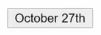
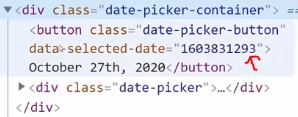
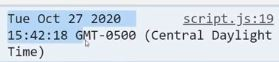
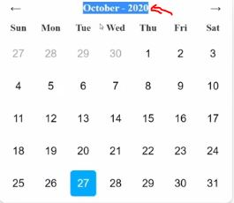
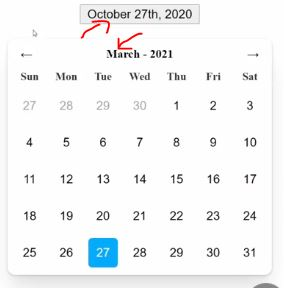
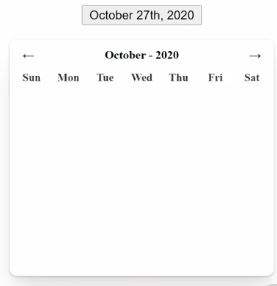
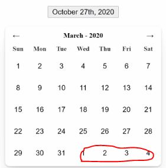
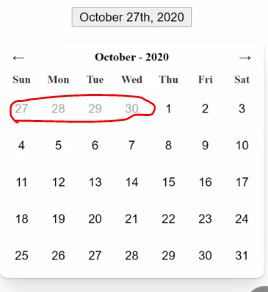
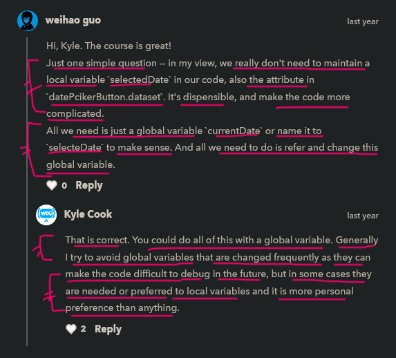

# date picker

    - here we'll put all the knowledge 
        about modules , bundlers + every concept of js that we need 

## starter code 

html code 
```html
<!DOCTYPE html>
<html lang="en">
<head>
  <title>Date Picker</title>
  <link rel="stylesheet" href="styles.css">
  <style>
    .date-picker.show {
      display: block;
    }

    .date.selected {
      background-color: hsl(200, 100%, 50%);
      color: white;
    }
  </style>
</head>
<body>
  <div class="date-picker-container">
    <button class="date-picker-button">October 26th, 2020</button>
    <div class="date-picker show">
      <div class="date-picker-header">
        <button class="prev-month-button month-button">&larr;</button>
        <div class="current-month">October - 2020</div>
        <button class="next-month-button month-button">&rarr;</button>
      </div>
      <div class="date-picker-grid-header date-picker-grid">
        <div>Sun</div>
        <div>Mon</div>
        <div>Tue</div>
        <div>Wed</div>
        <div>Thu</div>
        <div>Fri</div>
        <div>Sat</div>
      </div>
      <div class="date-picker-grid-dates date-picker-grid">
        <button class="date date-picker-other-month-date">27</button>
        <button class="date date-picker-other-month-date">28</button>
        <button class="date date-picker-other-month-date">29</button>
        <button class="date date-picker-other-month-date">30</button>
        <button class="date">1</button>
        <button class="date">2</button>
        <button class="date">3</button>
        <button class="date">4</button>
        <button class="date">5</button>
        <button class="date">6</button>
        <button class="date">7</button>
        <button class="date">8</button>
        <button class="date">9</button>
        <button class="date">10</button>
        <button class="date">11</button>
        <button class="date">12</button>
        <button class="date">13</button>
        <button class="date">14</button>
        <button class="date">15</button>
        <button class="date">16</button>
        <button class="date">17</button>
        <button class="date">18</button>
        <button class="date">19</button>
        <button class="date">20</button>
        <button class="date">21</button>
        <button class="date">22</button>
        <button class="date">23</button>
        <button class="date">24</button>
        <button class="date">25</button>
        <button class="date selected">26</button>
        <button class="date">27</button>
        <button class="date">28</button>
        <button class="date">29</button>
        <button class="date">30</button>
        <button class="date">31</button>
      </div>
    </div>
  </div>
</body>
</html>
```
css code 
```css
body {
  margin: 0;
  margin-top: 1rem;
  display: flex;
  justify-content: center;
}

.date-picker-container {
  position: relative;
  display: inline-block;
}

.date-picker-button {
  cursor: pointer;
}

.date-picker {
  display: none;
  position: absolute;
  margin-top: 1rem;
  top: 100%;
  transform: translateX(-50%);
  left: 50%;
  padding: .5rem;
  border-radius: .5rem;
  box-shadow: 0 1px 2px 0 rgba(0, 0, 0, 0.05), 0 1px 3px 0 rgba(0, 0, 0, 0.1), 0 1px 2px 0 rgba(0, 0, 0, 0.06), 0 20px 25px -5px rgba(0, 0, 0, 0.1), 0 10px 10px -5px rgba(0, 0, 0, 0.04);
  background-color: white;
}

.date-picker-header {
  display: flex;
  justify-content: space-between;
  font-weight: bold;
  font-size: .8rem;
  align-items: center;
}

.date-picker-grid {
  display: grid;
  gap: .5rem;
  grid-template-columns: repeat(7, 2rem);
  grid-auto-rows: 2rem;
}

.date-picker-grid > * {
  display: flex;
  justify-content: center;
  align-items: center;
  width: 100%;
  height: 100%;
}

.date-picker-grid-header {
  font-weight: bold;
  font-size: .75rem;
  color: #333;
}

.date-picker-grid-dates {
  color: #555;
}

.date-picker-other-month-date {
  color: #AAA;
}

.date-picker-grid-dates > .date {
  cursor: pointer;
  border-radius: .25rem;
  border: none;
  background: none;
}

.date-picker-grid-dates > *:hover {
  background-color: hsl(200, 100%, 80%);
  color: black;
}

.month-button {
  background: none;
  border: none;
  cursor: pointer;
}

.month-button:hover {
  box-shadow: 0 1px 3px 0 rgba(0, 0, 0, 0.1), 0 1px 2px 0 rgba(0, 0, 0, 0.06);
  border-radius: .5rem;
}
```

    // output : 


## complete code 

```js 
import {
  format,
  getUnixTime,
  fromUnixTime,
  addMonths,
  subMonths,
  startOfWeek,
  startOfMonth,
  endOfWeek,
  endOfMonth,
  eachDayOfInterval,
  isSameMonth,
  isSameDay
} from "date-fns"

const datePickerButton = document.querySelector(".date-picker-button")
const datePicker = document.querySelector(".date-picker")
const datePickerHeaderText = document.querySelector(".current-month")
const previousMonthButton = document.querySelector(".prev-month-button")
const nextMonthButton = document.querySelector(".next-month-button")
const dateGrid = document.querySelector(".date-picker-grid-dates")
let currentDate = new Date()

datePickerButton.addEventListener("click", () => {
  datePicker.classList.toggle("show")
  const selectedDate = fromUnixTime(datePickerButton.dataset.selectedDate)
  currentDate = selectedDate
  setupDatePicker(selectedDate)
})

function setDate(date) {
  datePickerButton.innerText = format(date, "MMMM do, yyyy")
  datePickerButton.dataset.selectedDate = getUnixTime(date)
}

function setupDatePicker(selectedDate) {
  datePickerHeaderText.innerText = format(currentDate, "MMMM - yyyy")
  setupDates(selectedDate)
}

function setupDates(selectedDate) {
  const firstWeekStart = startOfWeek(startOfMonth(currentDate))
  const lastWeekEnd = endOfWeek(endOfMonth(currentDate))
  const dates = eachDayOfInterval({ start: firstWeekStart, end: lastWeekEnd })
  dateGrid.innerHTML = ""

  dates.forEach(date => {
    const dateElement = document.createElement("button")
    dateElement.classList.add("date")
    dateElement.innerText = date.getDate()
    if (!isSameMonth(date, currentDate)) {
      dateElement.classList.add("date-picker-other-month-date")
    }
    if (isSameDay(date, selectedDate)) {
      dateElement.classList.add("selected")
    }
    console.log(selectedDate)
    dateElement.addEventListener("click", () => {
      setDate(date)
      datePicker.classList.remove("show")
    })

    dateGrid.appendChild(dateElement)
  })
}

nextMonthButton.addEventListener("click", () => {
  const selectedDate = fromUnixTime(datePickerButton.dataset.selectedDate)
  currentDate = addMonths(currentDate, 1)
  setupDatePicker(selectedDate)
})

previousMonthButton.addEventListener("click", () => {
  const selectedDate = fromUnixTime(datePickerButton.dataset.selectedDate)
  currentDate = subMonths(currentDate, 1)
  setupDatePicker(selectedDate)
})

setDate(new Date())
```

```json
// package.json file 
{
  "name": "current-project",
  "version": "1.0.0",
  "description": "",
  "main": "index.js",
  "scripts": {
    "start": "parcel index.html",
    "build": "parcel build index.html"
  },
  "keywords": [],
  "author": "",
  "license": "ISC",
  "dependencies": {
    "date-fns": "^2.16.1"
  },
  "devDependencies": {
    "parcel-bundler": "^1.12.4"
  }
}
```
    - when we push the project on github 
        then these files will be pushed with html , css & js i.e 
        package-lock.json & package.json files 💡💡💡
        not node_modules folder 

## what we need to do

    1 - when we toggle the button by click then we want to show & hide the calender
    2 - when we click to left arrow then we want to move to previous month
        & same with right arrow 
    3 - & when we select any date of a month of a year
        then we want to update the button text also 

    NOTE : 
        - inside index.html each code is hard coded 
            so first time when we build any application
            then we write hard coded html so that when we write js 
            then slowly step by step we remove the hard coded information 
            through js code dynamically ✔✔✔

## explanation of code 

    STEP 1 : create a package.json file 

        npm init -y

    STEP 2 : install date-fns library

        npm i date-fns

        - we install date-fns library in normal dependencies 
            because we also want to use this library in production also

    STEP 3 : installing parcel bundler in devdependencies 

        npm i --save-dev parcel-bundler
        // OR 
        npm i parcel-bundler --save-dev

    STEP 4 : adding start & build scripts inside "scripts" object of package.json file 

        "scripts" : {
            "start" : "parcel index.html" , 
            "build" : "parcel build index.html"  
        } 

        - save file 

    STEP 5 : start the parcel 

        npm start

        - now before start writing any code first create .gitignore file 

    STEP 6 : creating .gitignore file 

        - this file used when we don't want to push those things with the project
            which we don't want 
        
        -> inside .gitignore file 📄

            node_modules
            dist
            .cache

    STEP 7 :  

        - first easy task is open & close the datepicker when we click on button  
        
        - create a script.js file 

    STEP 8 : selecting that date-picker-button & date-picker

        const datePickerButton = document.querySelector(".date-picker-button")
        const datePicker = document.querySelector(".date-picker")

    STEP 8.1 : adding event listener on date-picker-button

        datePickerButton.addEventListener('click' , () => {
          datePicker.classList.toggle("show")
        })

        - & then remove the show -> class on date-picker from html file 

    STEP 9 : 

        - now next simple thing to work on that
          display the current date even if we open this application in future also 
          instead of showing the hard coded date
        - so implement date dynamically   

    STEP 10 : implementing current date inside the button 

        first - go to this link https://date-fns.org/docs/Getting-Started
        second - search for -> format & click on it 
        third - first we need month name
                so there we'll see , we need to use 4times MMMM

    STEP 10.1 : importing format function of date-fns & applying month name

        import { format } from 'date-fns'  

        const datePickerButton = document.querySelector(".date-picker-button")
        const datePicker = document.querySelector(".date-picker")

        datePickerButton.addEventListener('click' , () => {
          datePicker.classList.toggle("show")
        })

        function setDate(date) {
          datePickerButton.innerText = format(date , 'MMMM')
        }

        setDate(new Date())

        // output : only "October" month name will come inside datePickerButton

        - now let's find day & "nd"
          so go to documentation of "format"
          there we'll see that we need "do" for day & "nd"
    
    STEP 10.1.1 : applying current date number 

        function setDate(date) {
          datePickerButton.innerText = format(date , 'MMMM do')
        }

        // output : 


    STEP 10.1.2 : applying current year 

        function setDate(date) {
          datePickerButton.innerText = format(date , 'MMMM do, yyyy')
        } 

        - here we put comma sign then getting current year
        - now remove the hard coded date from that datePickerButton inside html file  

    STEP 11 : 

        - let's focus on month & year , so select current-month div

        const datePickerHeaderText = document.querySelector(".current-month")

        - now we need to setup a date picker 
          so call a new function inside 'click' event of datePickerButton

        datePickerButton.addEventListener('click' , () => {
          datePicker.classList.toggle("show")
          setupDatePicker(date)
        })

        - now how we can get the exact date , 
          because we don't have reference & even we can't pass -> new Date()
          inside setupDatePicker() function while calling 
          because if we pass that -> new Date()
        - then when we select any date from date picker , 
          then that date could be current date or previous date
        
        - so we can create a global variable like this 
            const datePickerButton = document.querySelector(".date-picker-button")
            const datePicker = document.querySelector(".date-picker")
            const datePickerHeaderText = document.querySelector(".current-month")
            let currentDate 
                  |
                  V
        - but this idea of having this hard coded global date
        - so we can setup a date on datePickerButton itself like this 💡💡💡

        function setDate(date) {
          datePickerButton.innerText = format(date , "MMM do, yyyy")
          datePickerButton.dataset.selectedDate = date
        }

        - here we can't directly set the date inside data attribute of datePickerButton 
          because we need to set a date that we can parse or unparse from a string 
          later on 
        - so to that we need to go to documentation & search for unix time
        - we'll get fromUnixTime & getUnixTime

    STEP 11.1 : using getUnixTime() function of date-fns

        - but to use getUnixTime() first we need to import

        import {format , getUnixTime } from "date-fns"

        function setDate(date) {
          datePickerButton.innerText = format(date , "MMM do, yyyy")
          datePickerButton.dataset.selectedDate = getUnixTime(date)
        }

    STEP 12 : using fromUnixTime() function of date-fns

        - using fromUnixTime() function to get the date
          which we get the date through getUnixTime()

        import {format , getUnixTime , fromUnixTime } from "date-fns"

        datePickerButton.addEventListener('click' , () => {
          datePicker.classList.toggle("show")
          const selectedDate = fromUnixTime(datePickerButton.dataset.selectedDate)
          setupDatePicker(new Date())
        })

        function setDate(date) {
          datePickerButton.innerText = format(date , "MMM do, yyyy")
          datePickerButton.dataset.selectedDate = getUnixTime(date)
        }
        
        setDate(new Date())


        - there we can see that number is a Unix timestamp format
          that we're currently in

        - now pass that "selectedDate" variable inside setupDatePicker()
        
        datePickerButton.addEventListener('click' , () => {
          datePicker.classList.toggle("show")
          const selectedDate = fromUnixTime(datePickerButton.dataset.selectedDate)
          setupDatePicker(selectedDate)
        })

    STEP 13 : 

        function setupDatePicker(selectedDate) {
          console.log(selectedDate)
        }

        // output : after clicking on button 


        - now we're getting the current date
        - & when we select the different date
          then we just need to call that setDate() function
        - & this setDate() function will update the button text
          as well as update the unixTime on our button itself

        - so we converted that unixTime through fromUnixTime() function 
          & that fromUnixTime() function will give the current selected date
        - means we're storing date on the button itself which is great
          because we don't have to worry about some weird global variable

    STEP 13.1 : writing code inside setupDatePicker() function

        function setupDatePicker(selectedDate) {
          datePickerHeaderText.innerText = format(selectedDate , "MMMM - yyyy")
        }

        - now remove the hard coded month & year from current-month div inside html file 

        // output : we can see that we're getting correct month & year 
                    according to which date we selected of which month & year
                    so that month & year will change when we select different date ✔✔✔


    STEP 14 : 

        - next thing is hook up that left & right arrow 
          as well as hook up our actual date to show the current date selected
          when we click on any date

    STEP 14.1 : working on left & right arrow to navigator to previous & next month 

        function setupDatePicker(selectedDate) {
          datePickerHeaderText.innerText = format(selectedDate , "MMMM - yyyy")
          setupMonthButtons(selectedDate)
        }

        function setupMonthButtons(selectedDate) {

        }

      - but first we need reference of left & right arrows 

    STEP 14.2 : selecting left & right arrows 

        const previousMonthButton = document.querySelector(".prev-month-button")
        const nextMonthButton = document.querySelector(".next-month-button")

    STEP 14.3 : adding 'click' event listener on nextMonthButton 

        function setupDatePicker(selectedDate) {
          datePickerHeaderText.innerText = format(selectedDate , "MMMM - yyyy")
          setupMonthButtons(selectedDate)
        }

        function setupMonthButtons(selectedDate) {
          nextMonthButton.addEventListener('click' , () => {

          })
        }

        - now again we need to setup date picker again but with a new date not old date ✔✔✔

    STEP 14.3.1 : setting up the date picker again with a new date 

        function setupMonthButtons(selectedDate) {
          nextMonthButton.addEventListener('click' , () => {
            setupDatePicker(selectedDate + 1 month)
          })
        }

        - now to add month search addmonth on that documentation

    STEP 14.3.2 : import that addMonths

        import { format, getUnixTime, fromUnixTime, addMonths } from "date-fns"

        function setupMonthButtons(selectedDate) {
          nextMonthButton.addEventListener('click' , () => {
            setupDatePicker(addMonths(date , 1))
          })
        }

        - now we just want to fire that nextMonthButton only one time
          because if we don't make it 
        - then nextMonthButton will fire over & over again

        - so give -> { once : true } -> as a third argument inside callback function 
          of addEventListener() of nextMonthButton 💡💡💡
          like this 

    STEP 14.3.3 : making nextMonthButton should only first one time ✅

        function setupMonthButtons(selectedDate) {
          nextMonthButton.addEventListener('click' , () => {
            setupDatePicker(addMonths(date , 1))
          } , { once : true })
        }

        // output - when we click on next button 
                    then text will change i,e month & year

        - let's do same thing with previous arrow 

    STEP 14.4 using subMonths() function to subtract the month by 1 for previous arrow 

        import { format, getUnixTime, fromUnixTime, addMonths, subMonths } from "date-fns"

        function setupMonthButtons(selectedDate) {
          nextMonthButton.addEventListener('click' , () => {
            setupDatePicker(addMonths(date , 1))
          } , { once : true })

          previousMonthButton.addEventListener('click' , () => {
            setupDatePicker(subMonths(date , 1))
          } , { once : true })
        }

        - but here we have a bug 
          that when we click on next arrow button then that 'click' event fire only one time 
          but previous arrow button executing multiple times over & over again 

        - so we need a current date by default globally

    STEP 15 : setting a global default current date ✅

        let currentDate = new Date() // this is will be default current date

        - now we don't need setupMonthButtons() function
          so

          nextMonthButton.addEventListener('click' , () => {
            setupDatePicker(addMonths(currentDate , 1))
            setupDatePicker()
          } , { once : true })

          previousMonthButton.addEventListener('click' , () => {
            currentDate = subMonths(currentDate , 1))
            setupDatePicker()
          } , { once : true })

        - so here we're just re updating the value of "currentDate" variable
          & then setting up the date picker 

        // output : now either if we click on next arrow or previous arrow button
                    both 'click' event listener will fire only one time 
                    no matter how many we clicked on any of them 

    STEP 16 : a problem 

        - when we close the date picker & reopen it then 
          text of button is not same as month & year 


        - this feature is not good 
        - so we want that whenever we open the date picker
          then month & year should be same as date of button ✔✔✔
          so 

        datePickerButton.addEventListener("click", () => {
          datePicker.classList.toggle("show")
          const selectedDate = fromUnixTime(datePickerButton.dataset.selectedDate)
          currentDate = selectedDate
          setupDatePicker(selectedDate)
        })

        - now when we reopen the date picker then 
          month & year will be same as date of button

    STEP 17 : 

        - now let's work on to navigate when we click on any date of date picker

        - so pass that selectedDate as a parameter in setupDatePicker() function

        function setupDatepicker(selectedDate) {
          datePickerHeaderText.innerText = format(currentDate , "MMMM - yyyy")
          setupDates(selectedDate)
        }

        - so we want to highlight selected date on date picker
          that's we pass "selectedDate" parameter inside setupDates() function
        - now let's create that function

        function setupDates(selectedDate) {

        }

        - so we need starting month , starting week , end of the month & end of the week 
          so let's import them 

    STEP 17.1 : importing starting month , starting week , end of the month & end of the week

        import {
          format,
          getUnixTime,
          fromUnixTime,
          addMonths,
          subMonths,
          startOfWeek,
          startOfMonth,
          endOfWeek,
          endOfMonth
        } from "date-fns"
       
        function setupDates(selectedDate) {
          const firstWeekStart = startOfWeek(startOfMonth(currentDate))
          const lastWeekEnd = endOfWeek(endOfMonth(currentDate))
        }

        - now we don't want to use selectedDate 
          we want to use current date picker

        - now let's get each date which are of that first week & last end week
          so use eachDayOfInterval() function 

    STEP 17.2 : importing eachDayOfInterval & using it 

        import {
          format,
          getUnixTime,
          fromUnixTime,
          addMonths,
          subMonths,
          startOfWeek,
          startOfMonth,
          endOfWeek,
          endOfMonth,
          eachDayOfInterval
        } from "date-fns"
       
        - here eachDayOfInterval() function takes a object & that object takes start & end keys ✔

        function setupDates(selectedDate) {
          const firstWeekStart = startOfWeek(startOfMonth(currentDate))
          const lastWeekEnd = endOfWeek(endOfMonth(currentDate))
          const dates = eachDayOfInterval({ start : firstWeekStart , end : lastWeekEnd})
          dates.forEach(date => {
            console.log(date)
          })
        }

        // output : inside console tab , we'll get all the date

        - now we need to show each date in date picker grid 
        - so inside index.html , there is a date-picker-grid-dates div , 
          so select it 
    
    STEP 18 : 
        
        const dateGrid = document.querySelector(".date-picker-grid-dates")

        - now inside setupDates() function
        function setupDates(selectedDate) {
          const firstWeekStart = startOfWeek(startOfMonth(currentDate))
          const lastWeekEnd = endOfWeek(endOfMonth(currentDate))
          const dates = eachDayOfInterval({ start : firstWeekStart , end : lastWeekEnd})
          dateGrid.innerHTML = ""
          dates.forEach(date => {
            console.log(date)
          })
        }
        
        // output : when we click on that button then there is no date inside date grid 

        - now create new date element
          like this 

        function setupDates(selectedDate) {
          const firstWeekStart = startOfWeek(startOfMonth(currentDate))
          const lastWeekEnd = endOfWeek(endOfMonth(currentDate))
          const dates = eachDayOfInterval({ start : firstWeekStart , end : lastWeekEnd})
          dateGrid.innerHTML = ""
          dates.forEach(date => {
            // those buttons selected which has "date" class   
            const dateElement = document.createElement("button")
            dateElement.classList.add('date')
            dateGrid.appendChild(dateElement) 
          })
        }

        // output : we'll get all the items except text


        - now give the text to that dateGrid

        function setupDates(selectedDate) {
          const firstWeekStart = startOfWeek(startOfMonth(currentDate))
          const lastWeekEnd = endOfWeek(endOfMonth(currentDate))
          const dates = eachDayOfInterval({ start : firstWeekStart , end : lastWeekEnd})
          dateGrid.innerHTML = ""
          dates.forEach(date => {
            // those buttons selected which has "date" class   
            const dateElement = document.createElement("button")
            dateElement.classList.add('date')
            dateElement.innerText = date.getDate()
            dateGrid.appendChild(dateElement) 
          })
        }

        - now when we click on previous arrow button or next arrow button
          then date will also change 

        - now we want to show the different color on those date of that month
          which are not part of the current month that we're in 


        - so we need to check if those date are in same day & month or not 
          - go to documentation & search samemonth & same day

    STEP 19 : checking whether those day & month are a part of current month or not 

        import {
          format,
          getUnixTime,
          fromUnixTime,
          addMonths,
          subMonths,
          startOfWeek,
          startOfMonth,
          endOfWeek,
          endOfMonth,
          eachDayOfInterval,
          isSameMonth,
          isSameDay
        } from "date-fns"

        function setupDates(selectedDate) {
          const firstWeekStart = startOfWeek(startOfMonth(currentDate))
          const lastWeekEnd = endOfWeek(endOfMonth(currentDate))
          const dates = eachDayOfInterval({ start : firstWeekStart , end : lastWeekEnd})
          dateGrid.innerHTML = ""
          dates.forEach(date => {
            // those buttons selected which has "date" class   
            const dateElement = document.createElement("button")
            dateElement.classList.add('date')
            dateElement.innerText = date.getDate()

            if (!isSameMonth(date, currentDate)) {
              dateElement.classList.add("date-picker-other-month-date")
            }
            dateGrid.appendChild(dateElement) 
          })
        }

        // output : 


        - so where we can see that those date which are not part of current month
            their color changed into gray 

        - no we need to check that is same day are same or not 
          by checking is date is same as that date which is selected ✔✔

        function setupDates(selectedDate) {
          const firstWeekStart = startOfWeek(startOfMonth(currentDate))
          const lastWeekEnd = endOfWeek(endOfMonth(currentDate))
          const dates = eachDayOfInterval({ start : firstWeekStart , end : lastWeekEnd})
          dateGrid.innerHTML = ""
          dates.forEach(date => {
            // those buttons selected which has "date" class   
            const dateElement = document.createElement("button")
            dateElement.classList.add('date')
            dateElement.innerText = date.getDate()

            if (!isSameMonth(date, currentDate)) {
              dateElement.classList.add("date-picker-other-month-date")
            }

            if (!isSameDay(date, currentDate)) {
              dateElement.classList.add("selected")
            }

            dateGrid.appendChild(dateElement) 
          })
        }
        
        - now want to show the selected date that we're selected
          so 
        function setupDates(selectedDate) {
          const firstWeekStart = startOfWeek(startOfMonth(currentDate))
          const lastWeekEnd = endOfWeek(endOfMonth(currentDate))
          const dates = eachDayOfInterval({ start : firstWeekStart , end : lastWeekEnd})
          dateGrid.innerHTML = ""
          dates.forEach(date => {
            // those buttons selected which has "date" class   
            const dateElement = document.createElement("button")
            dateElement.classList.add('date')
            dateElement.innerText = date.getDate()

            if (!isSameMonth(date, currentDate)) {
              dateElement.classList.add("date-picker-other-month-date")
            }

            if (!isSameDay(date, currentDate)) {
              dateElement.classList.add("selected")
            }
            console.log(selectedDate)
            dateElement.addEventListener('click', () => {
              setDate(date)
              datePicker.classList.remove("show')
            })

            dateGrid.appendChild(dateElement) 
          })
        }

        - so here we is bug that date which we selected is not showing selected
          when we close the date picker & reopen it 

        - means first time we selected the date 
          & close & reopen that date picker 
          then select the date like -> 1 
        
        - & again close & reopen that date picker
          & move to previous or next arrow button
          now that -> 1 date is not selected 
          & we're getting undefined ✔✔

        - because whenever we calling that setupDates() function
            then we're not clearly parsing our selectedDate through it 
        - so we can see that inside nextMonthButton & previousMonthButton
          we're calling setupDatePicker() function but we're not passing inside or it 
          so 

    STEP 20 : passing selected date inside setupDatePicker() function 

        nextMonthButton.addEventListener("click", () => {
          const selectedDate = fromUnixTime(datePickerButton.dataset.selectedDate)
          currentDate = addMonths(currentDate, 1)
          setupDatePicker(selectedDate)
        })

        previousMonthButton.addEventListener("click", () => {
          const selectedDate = fromUnixTime(datePickerButton.dataset.selectedDate)
          currentDate = subMonths(currentDate, 1)
          setupDatePicker(selectedDate)
        })

        - now we passed the selectedDate inside setupDatePicker() function while calling 

        // output : when we select any date like 25 of october month  
                    then either we move backward or forward
                    then still that 25 date will be selected but month will change  

## discussion page 



