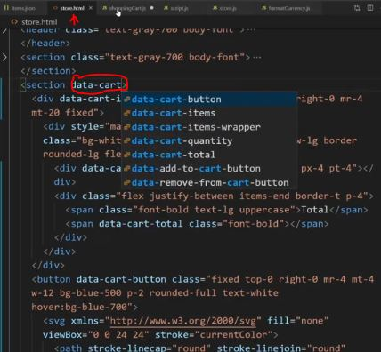

# shopping cart 

    - most most important project 🔥🔥🔥

    - it's a larger project
        which is multi page application
        that has a shopping cart that spans accross all those different pages ✔️

    - it's real world project ✔️

## starter code 

    -> starter code files
        - index.html
        - store.html
        - team.html
        - items.json

index.html code 
```html
<!DOCTYPE html>
<html lang="en">
<head>
  <meta charset="UTF-8">
  <meta name="viewport" content="width=device-width, initial-scale=1.0">
  <meta http-equiv="X-UA-Compatible" content="ie=edge">
  <link href="https://unpkg.com/tailwindcss@^1.0/dist/tailwind.min.css" rel="stylesheet">
  <title>Home</title>
</head>
<body>
  <header class="text-gray-700 body-font">
    <div class="container mx-auto flex flex-wrap p-5 flex-col md:flex-row items-center justify-center">
      <nav class="flex flex-wrap items-center text-base justify-center">
        <a class="mr-5 border-b-2 border-blue-500 hover:text-gray-900" href="index.html">Home</a>
        <a class="mr-5 hover:text-gray-900" href="store.html">Store</a>
        <a class="mr-5 hover:text-gray-900" href="team.html">Team</a>
      </nav>
    </div>
  </header>
  <section class="text-gray-700 body-font">
    <div class="container px-5 py-24 mx-auto flex flex-wrap">
      <div class="flex w-full mb-20 flex-wrap">
        <h1 class="sm:text-3xl text-2xl font-medium title-font text-gray-900 lg:w-1/3 lg:mb-0 mb-4">Some Of Our Amazing Products</h1>
        <p class="lg:pl-6 lg:w-2/3 mx-auto leading-relaxed text-base">Lorem ipsum, dolor sit amet consectetur adipisicing elit. Reprehenderit tempore nisi dolores ipsum veritatis, rerum excepturi numquam vitae perferendis recusandae possimus deserunt quas aut perspiciatis, qui architecto fuga molestias! Dolorem veritatis quasi cum quod deserunt sit recusandae blanditiis debitis voluptatum.</p>
      </div>
      <div class="flex flex-wrap md:-m-2 -m-1">
        <div class="flex flex-wrap w-1/2">
          <div class="md:p-2 p-1 w-1/2">
            
          </div>
          <div class="md:p-2 p-1 w-1/2">
            
          </div>
          <div class="md:p-2 p-1 w-full">
            
          </div>
        </div>
        <div class="flex flex-wrap w-1/2">
          <div class="md:p-2 p-1 w-full">
            
          </div>
          <div class="md:p-2 p-1 w-1/2">
            
          </div>
          <div class="md:p-2 p-1 w-1/2">
            
          </div>
        </div>
      </div>
    </div>
  </section>
  <section>
    <div class="mb-4 top-0 right-0 mr-4 mt-20 fixed">
      <div style="max-height: calc(100vh - 6rem);" class="bg-white text-gray-700 body-font shadow-lg border rounded-lg flex flex-col">
        <div class="overflow-y-auto px-4 pt-4">
          <div class="mb-6">
            <div class="block relative h-24 rounded overflow-hidden">
              
              <button data-remove-from-cart-button class="absolute top-0 right-0 bg-black rounded-tr text-white w-6 h-6 text-lg flex justify-center items-center">&times;</button>
            </div>
            <div class="mt-2 flex justify-between">
              <div class="flex items-center title-font">
                <h2 class="text-gray-900 text-lg font-medium">
                  Red
                </h2>
                <span class="text-gray-600 text-sm font-bold ml-1">x2</span>
              </div>
              <div>$32.00</div>
            </div>
          </div>
          <div class="mb-6">
            <div class="block relative h-24 rounded overflow-hidden">
              
              <button data-remove-from-cart-button class="absolute top-0 right-0 bg-black rounded-tr text-white w-6 h-6 text-lg flex justify-center items-center">&times;</button>
            </div>
            <div class="mt-2 flex justify-between">
              <div class="flex items-center title-font">
                <h2 class="text-gray-900 text-lg font-medium">
                  Blue
                </h2>
              </div>
              <div>$12.00</div>
            </div>
          </div>
        </div>
        <div class="flex justify-between items-end border-t p-4">
          <span class="font-bold text-lg uppercase">Total</span>
          <span class="font-bold">$44.00</span>
        </div>
      </div>
    </div>
    <button class="fixed top-0 right-0 mr-4 mt-4 w-12 bg-blue-500 p-2 rounded-full text-white hover:bg-blue-700">
      <svg xmlns="http://www.w3.org/2000/svg" fill="none" viewBox="0 0 24 24" stroke="currentColor">
        <path stroke-linecap="round" stroke-linejoin="round" stroke-width="2" d="M3 3h2l.4 2M7 13h10l4-8H5.4M7 13L5.4 5M7 13l-2.293 2.293c-.63.63-.184 1.707.707 1.707H17m0 0a2 2 0 100 4 2 2 0 000-4zm-8 2a2 2 0 11-4 0 2 2 0 014 0z" />
      </svg>
      <div class="bg-red-500 rounded-full text-xs absolute w-6 h-6 flex justify-center items-center right-0 bottom-0 transform translate-x-2 translate-y-2">2</div>
    </button>
  </section>
</body>
</html>
```
items.json code
```json
[
  {
    "id": 1,
    "name": "Red",
    "category": "Primary Color",
    "priceCents": 1600,
    "imageColor": "F00"
  },
  {
    "id": 2,
    "name": "Yellow",
    "category": "Primary Color",
    "priceCents": 2100,
    "imageColor": "FF0"
  },
  {
    "id": 3,
    "name": "Blue",
    "category": "Primary Color",
    "priceCents": 1200,
    "imageColor": "00F"
  },
  {
    "id": 4,
    "name": "Orange",
    "category": "Secondary Color",
    "priceCents": 1800,
    "imageColor": "F60"
  },
  {
    "id": 5,
    "name": "Green",
    "category": "Secondary Color",
    "priceCents": 1600,
    "imageColor": "0F0"
  },
  {
    "id": 6,
    "name": "Purple",
    "category": "Secondary Color",
    "priceCents": 2100,
    "imageColor": "60F"
  },
  {
    "id": 7,
    "name": "Light Gray",
    "category": "Grayscale",
    "priceCents": 1200,
    "imageColor": "AAA"
  },
  {
    "id": 8,
    "name": "Dark Gray",
    "category": "Grayscale",
    "priceCents": 1600,
    "imageColor": "333"
  }
]
```
store.html code
```html
<!DOCTYPE html>
<html lang="en">
<head>
  <meta charset="UTF-8">
  <meta name="viewport" content="width=device-width, initial-scale=1.0">
  <meta http-equiv="X-UA-Compatible" content="ie=edge">
  <link href="https://unpkg.com/tailwindcss@^1.0/dist/tailwind.min.css" rel="stylesheet">
  <title>Store</title>
</head>
<body>
  <header class="text-gray-700 body-font">
    <div class="container mx-auto flex flex-wrap p-5 flex-col md:flex-row items-center justify-center">
      <nav class="flex flex-wrap items-center text-base justify-center">
        <a class="mr-5 hover:text-gray-900" href="/index.html">Home</a>
        <a class="mr-5 border-b-2 border-blue-500 hover:text-gray-900" href="/store.html">Store</a>
        <a class="mr-5 hover:text-gray-900" href="/team.html">Team</a>
      </nav>
    </div>
  </header>
  <section class="text-gray-700 body-font">
    <div class="container px-5 py-24 mx-auto">
      <div class="flex flex-wrap -m-4">
        <div class="lg:w-1/4 md:w-1/2 p-4 w-full">
          <div class="block relative h-48 rounded overflow-hidden">
            
          </div>
          <div class="mt-4 flex items-end justify-between">
            <div>
              <h3 class="text-gray-500 text-xs tracking-widest title-font uppercase mb-1">Primary Color</h3>
              <h2 class="text-gray-900 title-font text-lg font-medium">Red</h2>
              <p class="mt-1">$16.00</p>
            </div>
            <button class="text-white py-2 px-4 text-xl bg-blue-500 rounded hover:bg-blue-700">Add To Cart</button>
          </div>
        </div>
        <div class="lg:w-1/4 md:w-1/2 p-4 w-full">
          <div class="block relative h-48 rounded overflow-hidden">
            
          </div>
          <div class="mt-4 flex items-end justify-between">
            <div>
              <h3 class="text-gray-500 text-xs tracking-widest title-font uppercase mb-1">Primary Color</h3>
              <h2 class="text-gray-900 title-font text-lg font-medium">Yellow</h2>
              <p class="mt-1">$21.00</p>
            </div>
            <button class="text-white py-2 px-4 text-xl bg-blue-500 rounded hover:bg-blue-700">Add To Cart</button>
          </div>
        </div>
        <div class="lg:w-1/4 md:w-1/2 p-4 w-full">
          <div class="block relative h-48 rounded overflow-hidden">
            
          </div>
          <div class="mt-4 flex items-end justify-between">
            <div>
              <h3 class="text-gray-500 text-xs tracking-widest title-font uppercase mb-1">Primary Color</h3>
              <h2 class="text-gray-900 title-font text-lg font-medium">Blue</h2>
              <p class="mt-1">$12.00</p>
            </div>
            <button class="text-white py-2 px-4 text-xl bg-blue-500 rounded hover:bg-blue-700">Add To Cart</button>
          </div>
        </div>
        <div class="lg:w-1/4 md:w-1/2 p-4 w-full">
          <div class="block relative h-48 rounded overflow-hidden">
            
          </div>
          <div class="mt-4 flex items-end justify-between">
            <div>
              <h3 class="text-gray-500 text-xs tracking-widest title-font uppercase mb-1">Secondary Color</h3>
              <h2 class="text-gray-900 title-font text-lg font-medium">Orange</h2>
              <p class="mt-1">$18.00</p>
            </div>
            <button class="text-white py-2 px-4 text-xl bg-blue-500 rounded hover:bg-blue-700">Add To Cart</button>
          </div>
        </div>
        <div class="lg:w-1/4 md:w-1/2 p-4 w-full">
          <div class="block relative h-48 rounded overflow-hidden">
            
          </div>
          <div class="mt-4 flex items-end justify-between">
            <div>
              <h3 class="text-gray-500 text-xs tracking-widest title-font uppercase mb-1">Secondary Color</h3>
              <h2 class="text-gray-900 title-font text-lg font-medium">Green</h2>
              <p class="mt-1">$16.00</p>
            </div>
            <button class="text-white py-2 px-4 text-xl bg-blue-500 rounded hover:bg-blue-700">Add To Cart</button>
          </div>
        </div>
        <div class="lg:w-1/4 md:w-1/2 p-4 w-full">
          <div class="block relative h-48 rounded overflow-hidden">
            
          </div>
          <div class="mt-4 flex items-end justify-between">
            <div>
              <h3 class="text-gray-500 text-xs tracking-widest title-font uppercase mb-1">Secondary Color</h3>
              <h2 class="text-gray-900 title-font text-lg font-medium">Purple</h2>
              <p class="mt-1">$21.00</p>
            </div>
            <button class="text-white py-2 px-4 text-xl bg-blue-500 rounded hover:bg-blue-700">Add To Cart</button>
          </div>
        </div>
        <div class="lg:w-1/4 md:w-1/2 p-4 w-full">
          <div class="block relative h-48 rounded overflow-hidden">
            
          </div>
          <div class="mt-4 flex items-end justify-between">
            <div>
              <h3 class="text-gray-500 text-xs tracking-widest title-font uppercase mb-1">Grayscale</h3>
              <h2 class="text-gray-900 title-font text-lg font-medium">Light Gray</h2>
              <p class="mt-1">$12.00</p>
            </div>
            <button class="text-white py-2 px-4 text-xl bg-blue-500 rounded hover:bg-blue-700">Add To Cart</button>
          </div>
        </div>
        <div class="lg:w-1/4 md:w-1/2 p-4 w-full">
          <div class="block relative h-48 rounded overflow-hidden">
            
          </div>
          <div class="mt-4 flex items-end justify-between">
            <div>
              <h3 class="text-gray-500 text-xs tracking-widest title-font uppercase mb-1">Grayscale</h3>
              <h2 class="text-gray-900 title-font text-lg font-medium">Dark Gray</h2>
              <p class="mt-1">$18.00</p>
            </div>
            <button class="text-white py-2 px-4 text-xl bg-blue-500 rounded hover:bg-blue-700">Add To Cart</button>
          </div>
        </div>
      </div>
    </div>
  </section>
  <section>
    <div class="mb-4 top-0 right-0 mr-4 mt-20 fixed">
      <div style="max-height: calc(100vh - 6rem);" class="bg-white text-gray-700 body-font shadow-lg border rounded-lg flex flex-col">
        <div class="overflow-y-auto px-4 pt-4">
          <div class="mb-6">
            <div class="block relative h-24 rounded overflow-hidden">
              
              <button data-remove-from-cart-button class="absolute top-0 right-0 bg-black rounded-tr text-white w-6 h-6 text-lg flex justify-center items-center">&times;</button>
            </div>
            <div class="mt-2 flex justify-between">
              <div class="flex items-center title-font">
                <h2 class="text-gray-900 text-lg font-medium">
                  Red
                </h2>
                <span class="text-gray-600 text-sm font-bold ml-1">x2</span>
              </div>
              <div>$32.00</div>
            </div>
          </div>
          <div class="mb-6">
            <div class="block relative h-24 rounded overflow-hidden">
              
              <button data-remove-from-cart-button class="absolute top-0 right-0 bg-black rounded-tr text-white w-6 h-6 text-lg flex justify-center items-center">&times;</button>
            </div>
            <div class="mt-2 flex justify-between">
              <div class="flex items-center title-font">
                <h2 class="text-gray-900 text-lg font-medium">
                  Blue
                </h2>
              </div>
              <div>$12.00</div>
            </div>
          </div>
        </div>
        <div class="flex justify-between items-end border-t p-4">
          <span class="font-bold text-lg uppercase">Total</span>
          <span class="font-bold">$44.00</span>
        </div>
      </div>
    </div>
    <button class="fixed top-0 right-0 mr-4 mt-4 w-12 bg-blue-500 p-2 rounded-full text-white hover:bg-blue-700">
      <svg xmlns="http://www.w3.org/2000/svg" fill="none" viewBox="0 0 24 24" stroke="currentColor">
        <path stroke-linecap="round" stroke-linejoin="round" stroke-width="2" d="M3 3h2l.4 2M7 13h10l4-8H5.4M7 13L5.4 5M7 13l-2.293 2.293c-.63.63-.184 1.707.707 1.707H17m0 0a2 2 0 100 4 2 2 0 000-4zm-8 2a2 2 0 11-4 0 2 2 0 014 0z" />
      </svg>
      <div class="bg-red-500 rounded-full text-xs absolute w-6 h-6 flex justify-center items-center right-0 bottom-0 transform translate-x-2 translate-y-2">2</div>
    </button>
  </section>
</body>
</html>
```
team.html code
```html
<!DOCTYPE html>
<html lang="en">
<head>
  <meta charset="UTF-8">
  <meta name="viewport" content="width=device-width, initial-scale=1.0">
  <meta http-equiv="X-UA-Compatible" content="ie=edge">
  <link href="https://unpkg.com/tailwindcss@^1.0/dist/tailwind.min.css" rel="stylesheet">
  <title>About</title>
</head>
<body>
  <header class="text-gray-700 body-font">
    <div class="container mx-auto flex flex-wrap p-5 flex-col md:flex-row items-center justify-center">
      <nav class="flex flex-wrap items-center text-base justify-center">
        <a class="mr-5 hover:text-gray-900" href="index.html">Home</a>
        <a class="mr-5 hover:text-gray-900" href="store.html">Store</a>
        <a class="mr-5 border-b-2 border-blue-500 hover:text-gray-900" href="team.html">Team</a>
      </nav>
    </div>
  </header>
  <section class="text-gray-700 body-font">
    <div class="container px-5 py-24 pt-12 mx-auto">
      <div class="flex flex-col text-center w-full mb-20">
        <h1 class="sm:text-3xl text-2xl font-medium title-font mb-4 text-gray-900">Our Team</h1>
        <p class="lg:w-2/3 mx-auto leading-relaxed text-base">Whatever cardigan tote bag tumblr hexagon brooklyn asymmetrical gentrify, subway tile poke farm-to-table. Franzen you probably haven't heard of them.</p>
      </div>
      <div class="flex flex-wrap -m-2">
        <div class="p-2 lg:w-1/3 md:w-1/2 w-full">
          <div class="h-full flex items-center border-gray-200 border p-4 rounded-lg">
            
            <div class="flex-grow">
              <h2 class="text-gray-900 title-font font-medium">Holden Caulfield</h2>
              <p class="text-gray-500">UI Designer</p>
            </div>
          </div>
        </div>
        <div class="p-2 lg:w-1/3 md:w-1/2 w-full">
          <div class="h-full flex items-center border-gray-200 border p-4 rounded-lg">
            
            <div class="flex-grow">
              <h2 class="text-gray-900 title-font font-medium">Henry Letham</h2>
              <p class="text-gray-500">CTO</p>
            </div>
          </div>
        </div>
        <div class="p-2 lg:w-1/3 md:w-1/2 w-full">
          <div class="h-full flex items-center border-gray-200 border p-4 rounded-lg">
            
            <div class="flex-grow">
              <h2 class="text-gray-900 title-font font-medium">Oskar Blinde</h2>
              <p class="text-gray-500">Founder</p>
            </div>
          </div>
        </div>
        <div class="p-2 lg:w-1/3 md:w-1/2 w-full">
          <div class="h-full flex items-center border-gray-200 border p-4 rounded-lg">
            
            <div class="flex-grow">
              <h2 class="text-gray-900 title-font font-medium">John Doe</h2>
              <p class="text-gray-500">DevOps</p>
            </div>
          </div>
        </div>
        <div class="p-2 lg:w-1/3 md:w-1/2 w-full">
          <div class="h-full flex items-center border-gray-200 border p-4 rounded-lg">
            
            <div class="flex-grow">
              <h2 class="text-gray-900 title-font font-medium">Martin Eden</h2>
              <p class="text-gray-500">Software Engineer</p>
            </div>
          </div>
        </div>
        <div class="p-2 lg:w-1/3 md:w-1/2 w-full">
          <div class="h-full flex items-center border-gray-200 border p-4 rounded-lg">
            
            <div class="flex-grow">
              <h2 class="text-gray-900 title-font font-medium">Boris Kitua</h2>
              <p class="text-gray-500">UX Researcher</p>
            </div>
          </div>
        </div>
        <div class="p-2 lg:w-1/3 md:w-1/2 w-full">
          <div class="h-full flex items-center border-gray-200 border p-4 rounded-lg">
            
            <div class="flex-grow">
              <h2 class="text-gray-900 title-font font-medium">Atticus Finch</h2>
              <p class="text-gray-500">QA Engineer</p>
            </div>
          </div>
        </div>
        <div class="p-2 lg:w-1/3 md:w-1/2 w-full">
          <div class="h-full flex items-center border-gray-200 border p-4 rounded-lg">
            
            <div class="flex-grow">
              <h2 class="text-gray-900 title-font font-medium">Alper Kamu</h2>
              <p class="text-gray-500">System</p>
            </div>
          </div>
        </div>
        <div class="p-2 lg:w-1/3 md:w-1/2 w-full">
          <div class="h-full flex items-center border-gray-200 border p-4 rounded-lg">
            
            <div class="flex-grow">
              <h2 class="text-gray-900 title-font font-medium">Rodrigo Monchi</h2>
              <p class="text-gray-500">Product Manager</p>
            </div>
          </div>
        </div>
      </div>
    </div>
  </section>
  <section>
    <div class="mb-4 top-0 right-0 mr-4 mt-20 fixed">
      <div style="max-height: calc(100vh - 6rem);" class="bg-white text-gray-700 body-font shadow-lg border rounded-lg flex flex-col">
        <div class="overflow-y-auto px-4 pt-4">
          <div class="mb-6">
            <div class="block relative h-24 rounded overflow-hidden">
              
              <button data-remove-from-cart-button class="absolute top-0 right-0 bg-black rounded-tr text-white w-6 h-6 text-lg flex justify-center items-center">&times;</button>
            </div>
            <div class="mt-2 flex justify-between">
              <div class="flex items-center title-font">
                <h2 class="text-gray-900 text-lg font-medium">
                  Red
                </h2>
                <span class="text-gray-600 text-sm font-bold ml-1">x2</span>
              </div>
              <div>$32.00</div>
            </div>
          </div>
          <div class="mb-6">
            <div class="block relative h-24 rounded overflow-hidden">
              
              <button data-remove-from-cart-button class="absolute top-0 right-0 bg-black rounded-tr text-white w-6 h-6 text-lg flex justify-center items-center">&times;</button>
            </div>
            <div class="mt-2 flex justify-between">
              <div class="flex items-center title-font">
                <h2 class="text-gray-900 text-lg font-medium">
                  Blue
                </h2>
              </div>
              <div>$12.00</div>
            </div>
          </div>
        </div>
        <div class="flex justify-between items-end border-t p-4">
          <span class="font-bold text-lg uppercase">Total</span>
          <span class="font-bold">$44.00</span>
        </div>
      </div>
    </div>
    <button class="fixed top-0 right-0 mr-4 mt-4 w-12 bg-blue-500 p-2 rounded-full text-white hover:bg-blue-700">
      <svg xmlns="http://www.w3.org/2000/svg" fill="none" viewBox="0 0 24 24" stroke="currentColor">
        <path stroke-linecap="round" stroke-linejoin="round" stroke-width="2" d="M3 3h2l.4 2M7 13h10l4-8H5.4M7 13L5.4 5M7 13l-2.293 2.293c-.63.63-.184 1.707.707 1.707H17m0 0a2 2 0 100 4 2 2 0 000-4zm-8 2a2 2 0 11-4 0 2 2 0 014 0z" />
      </svg>
      <div class="bg-red-500 rounded-full text-xs absolute w-6 h-6 flex justify-center items-center right-0 bottom-0 transform translate-x-2 translate-y-2">2</div>
    </button>
  </section>
</body>
</html>
```

## complete code 

    -> files + folder structure of complete code 
        - util folder 📁 
          - addGlobalEventListener.js
          - formatCurrency.js
        - .gitignore
        - index.html
        - items.json
        - package-lock.json
        - package.json
        - script.js
        - shoppingCart.js
        - store.html
        - store.js
        - team.html

index.html code 
```html
<!DOCTYPE html>
<html lang="en">
<head>
  <meta charset="UTF-8">
  <meta name="viewport" content="width=device-width, initial-scale=1.0">
  <meta http-equiv="X-UA-Compatible" content="ie=edge">
  <link href="https://unpkg.com/tailwindcss@^1.0/dist/tailwind.min.css" rel="stylesheet">
  <title>Home</title>
  <script src="script.js" defer></script>
</head>
<body>
  <header class="text-gray-700 body-font">
    <div class="container mx-auto flex flex-wrap p-5 flex-col md:flex-row items-center justify-center">
      <nav class="flex flex-wrap items-center text-base justify-center">
        <a class="mr-5 border-b-2 border-blue-500 hover:text-gray-900" href="index.html">Home</a>
        <a class="mr-5 hover:text-gray-900" href="store.html">Store</a>
        <a class="mr-5 hover:text-gray-900" href="team.html">Team</a>
      </nav>
    </div>
  </header>
  <section class="text-gray-700 body-font">
    <div class="container px-5 py-24 mx-auto flex flex-wrap">
      <div class="flex w-full mb-20 flex-wrap">
        <h1 class="sm:text-3xl text-2xl font-medium title-font text-gray-900 lg:w-1/3 lg:mb-0 mb-4">Some Of Our Amazing Products</h1>
        <p class="lg:pl-6 lg:w-2/3 mx-auto leading-relaxed text-base">Lorem ipsum, dolor sit amet consectetur adipisicing elit. Reprehenderit tempore nisi dolores ipsum veritatis, rerum excepturi numquam vitae perferendis recusandae possimus deserunt quas aut perspiciatis, qui architecto fuga molestias! Dolorem veritatis quasi cum quod deserunt sit recusandae blanditiis debitis voluptatum.</p>
      </div>
      <div class="flex flex-wrap md:-m-2 -m-1">
        <div class="flex flex-wrap w-1/2">
          <div class="md:p-2 p-1 w-1/2">
            
          </div>
          <div class="md:p-2 p-1 w-1/2">
            
          </div>
          <div class="md:p-2 p-1 w-full">
            
          </div>
        </div>
        <div class="flex flex-wrap w-1/2">
          <div class="md:p-2 p-1 w-full">
            
          </div>
          <div class="md:p-2 p-1 w-1/2">
            
          </div>
          <div class="md:p-2 p-1 w-1/2">
            
          </div>
        </div>
      </div>
    </div>
  </section>
  <section data-cart class="invisible">
    <div data-cart-items-wrapper class="invisible mb-4 top-0 right-0 mr-4 mt-20 fixed">
      <div style="max-height: calc(100vh - 6rem);" class="bg-white text-gray-700 body-font shadow-lg border rounded-lg flex flex-col">
        <div data-cart-items class="overflow-y-auto px-4 pt-4"></div>
        <div class="flex justify-between items-end border-t p-4">
          <span class="font-bold text-lg uppercase">Total</span>
          <span data-cart-total class="font-bold"></span>
        </div>
      </div>
    </div>
    <button data-cart-button class="fixed top-0 right-0 mr-4 mt-4 w-12 bg-blue-500 p-2 rounded-full text-white hover:bg-blue-700">
      <svg xmlns="http://www.w3.org/2000/svg" fill="none" viewBox="0 0 24 24" stroke="currentColor">
        <path stroke-linecap="round" stroke-linejoin="round" stroke-width="2" d="M3 3h2l.4 2M7 13h10l4-8H5.4M7 13L5.4 5M7 13l-2.293 2.293c-.63.63-.184 1.707.707 1.707H17m0 0a2 2 0 100 4 2 2 0 000-4zm-8 2a2 2 0 11-4 0 2 2 0 014 0z" />
      </svg>
      <div data-cart-quantity class="bg-red-500 rounded-full text-xs absolute w-6 h-6 flex justify-center items-center right-0 bottom-0 transform translate-x-2 translate-y-2"></div>
    </button>
  </section>
  <template id="cart-item-template">
    <div data-item class="mb-6">
      <div class="block relative h-24 rounded overflow-hidden">
        
        <button data-remove-from-cart-button class="absolute top-0 right-0 bg-black rounded-tr text-white w-6 h-6 text-lg flex justify-center items-center">&times;</button>
      </div>
      <div class="mt-2 flex justify-between">
        <div class="flex items-center title-font">
          <h2 data-name class="text-gray-900 text-lg font-medium"></h2>
          <span data-quantity class="text-gray-600 text-sm font-bold ml-1"></span>
        </div>
        <div data-price></div>
      </div>
    </div>
  </template>
</body>
</html>
```
package.json code 
```json
{
  "name": "current-project",
  "version": "1.0.0",
  "description": "",
  "main": "index.js",
  "scripts": {
    "start": "parcel index.html team.html store.html",
    "build": "parcel build index.html team.html store.html"
  },
  "keywords": [],
  "author": "",
  "license": "ISC",
  "devDependencies": {
    "parcel-bundler": "^1.12.4"
  }
}
```
script.js code
```js
import { setupStore } from "./store.js"
import { setupShoppingCart } from "./shoppingCart.js"

setupStore()
setupShoppingCart()
```
shoppingCart.js
```js
import items from "./items.json"
import formatCurrency from "./util/formatCurrency.js"
import addGlobalEventListener from "./util/addGlobalEventListener.js"

const cartButton = document.querySelector("[data-cart-button]")
const cartItemsWrapper = document.querySelector("[data-cart-items-wrapper]")
let shoppingCart = []
const IMAGE_URL = "https://dummyimage.com/210x130"
const cartItemTemplate = document.querySelector("#cart-item-template")
const cartItemContainer = document.querySelector("[data-cart-items]")
const cartQuantity = document.querySelector("[data-cart-quantity]")
const cartTotal = document.querySelector("[data-cart-total]")
const cart = document.querySelector("[data-cart]")
const SESSION_STORAGE_KEY = "SHOPPING_CART-cart"

export function setupShoppingCart() {
  addGlobalEventListener("click", "[data-remove-from-cart-button]", e => {
    const id = parseInt(e.target.closest("[data-item]").dataset.itemId)
    removeFromCart(id)
  })

  shoppingCart = loadCart()
  renderCart()

  cartButton.addEventListener("click", () => [
    cartItemsWrapper.classList.toggle("invisible")
  ])
}

function saveCart() {
  sessionStorage.setItem(SESSION_STORAGE_KEY, JSON.stringify(shoppingCart))
}

function loadCart() {
  const cart = sessionStorage.getItem(SESSION_STORAGE_KEY)
  return JSON.parse(cart) || []
}

export function addToCart(id) {
  const existingItem = shoppingCart.find(entry => entry.id === id)
  if (existingItem) {
    existingItem.quantity++
  } else {
    shoppingCart.push({ id: id, quantity: 1 })
  }
  renderCart()
  saveCart()
}

function removeFromCart(id) {
  const existingItem = shoppingCart.find(entry => entry.id === id)
  if (existingItem == null) return
  shoppingCart = shoppingCart.filter(entry => entry.id !== id)
  renderCart()
  saveCart()
}

function renderCart() {
  if (shoppingCart.length === 0) {
    hideCart()
  } else {
    showCart()
    renderCartItems()
  }
}

function hideCart() {
  cart.classList.add("invisible")
  cartItemsWrapper.classList.add("invisible")
}

function showCart() {
  cart.classList.remove("invisible")
}

function renderCartItems() {
  cartQuantity.innerText = shoppingCart.length

  const totalCents = shoppingCart.reduce((sum, entry) => {
    const item = items.find(i => entry.id === i.id)
    return sum + item.priceCents * entry.quantity
  }, 0)

  cartTotal.innerText = formatCurrency(totalCents / 100)

  cartItemContainer.innerHTML = ""
  shoppingCart.forEach(entry => {
    const item = items.find(i => entry.id === i.id)
    const cartItem = cartItemTemplate.content.cloneNode(true)

    const container = cartItem.querySelector("[data-item]")
    container.dataset.itemId = item.id

    const name = cartItem.querySelector("[data-name]")
    name.innerText = item.name

    const image = cartItem.querySelector("[data-image]")
    image.src = `${IMAGE_URL}/${item.imageColor}/${item.imageColor}`

    if (entry.quantity > 1) {
      const quantity = cartItem.querySelector("[data-quantity]")
      quantity.innerText = `x${entry.quantity}`
    }

    const price = cartItem.querySelector("[data-price]")
    price.innerText = formatCurrency((item.priceCents * entry.quantity) / 100)

    cartItemContainer.appendChild(cartItem)
  })
}
```
store.html code
```html
<!DOCTYPE html>
<html lang="en">
<head>
  <meta charset="UTF-8">
  <meta name="viewport" content="width=device-width, initial-scale=1.0">
  <meta http-equiv="X-UA-Compatible" content="ie=edge">
  <link href="https://unpkg.com/tailwindcss@^1.0/dist/tailwind.min.css" rel="stylesheet">
  <title>Store</title>
  <script src="script.js" defer></script>
</head>
<body>
  <header class="text-gray-700 body-font">
    <div class="container mx-auto flex flex-wrap p-5 flex-col md:flex-row items-center justify-center">
      <nav class="flex flex-wrap items-center text-base justify-center">
        <a class="mr-5 hover:text-gray-900" href="/index.html">Home</a>
        <a class="mr-5 border-b-2 border-blue-500 hover:text-gray-900" href="/store.html">Store</a>
        <a class="mr-5 hover:text-gray-900" href="/team.html">Team</a>
      </nav>
    </div>
  </header>
  <section class="text-gray-700 body-font">
    <div class="container px-5 py-24 mx-auto">
      <div data-store-container class="flex flex-wrap -m-4"></div>
    </div>
  </section>
  <section data-cart class="invisible">
    <div data-cart-items-wrapper class="invisible mb-4 top-0 right-0 mr-4 mt-20 fixed">
      <div style="max-height: calc(100vh - 6rem);" class="bg-white text-gray-700 body-font shadow-lg border rounded-lg flex flex-col">
        <div data-cart-items class="overflow-y-auto px-4 pt-4"></div>
        <div class="flex justify-between items-end border-t p-4">
          <span class="font-bold text-lg uppercase">Total</span>
          <span data-cart-total class="font-bold"></span>
        </div>
      </div>
    </div>
    <button data-cart-button class="fixed top-0 right-0 mr-4 mt-4 w-12 bg-blue-500 p-2 rounded-full text-white hover:bg-blue-700">
      <svg xmlns="http://www.w3.org/2000/svg" fill="none" viewBox="0 0 24 24" stroke="currentColor">
        <path stroke-linecap="round" stroke-linejoin="round" stroke-width="2" d="M3 3h2l.4 2M7 13h10l4-8H5.4M7 13L5.4 5M7 13l-2.293 2.293c-.63.63-.184 1.707.707 1.707H17m0 0a2 2 0 100 4 2 2 0 000-4zm-8 2a2 2 0 11-4 0 2 2 0 014 0z" />
      </svg>
      <div data-cart-quantity class="bg-red-500 rounded-full text-xs absolute w-6 h-6 flex justify-center items-center right-0 bottom-0 transform translate-x-2 translate-y-2"></div>
    </button>
  </section>
  <template id="cart-item-template">
    <div data-item class="mb-6">
      <div class="block relative h-24 rounded overflow-hidden">
        
        <button data-remove-from-cart-button class="absolute top-0 right-0 bg-black rounded-tr text-white w-6 h-6 text-lg flex justify-center items-center">&times;</button>
      </div>
      <div class="mt-2 flex justify-between">
        <div class="flex items-center title-font">
          <h2 data-name class="text-gray-900 text-lg font-medium"></h2>
          <span data-quantity class="text-gray-600 text-sm font-bold ml-1"></span>
        </div>
        <div data-price></div>
      </div>
    </div>
  </template>
  <template id="store-item-template">
    <div data-store-item class="lg:w-1/4 md:w-1/2 p-4 w-full">
      <div class="block relative h-48 rounded overflow-hidden">
        
      </div>
      <div class="mt-4 flex items-end justify-between">
        <div>
          <h3 data-category class="text-gray-500 text-xs tracking-widest title-font uppercase mb-1"></h3>
          <h2 data-name class="text-gray-900 title-font text-lg font-medium"></h2>
          <p data-price class="mt-1"></p>
        </div>
        <button data-add-to-cart-button class="text-white py-2 px-4 text-xl bg-blue-500 rounded hover:bg-blue-700">Add To Cart</button>
      </div>
    </div>
  </template>
</body>
</html>
```
store.js code
```js
import items from "./items.json"
import formatCurrency from "./util/formatCurrency.js"
import addGlobalEventListener from "./util/addGlobalEventListener.js"
import { addToCart } from "./shoppingCart.js"

const storeItemTemplate = document.querySelector("#store-item-template")
const storeItemContainer = document.querySelector("[data-store-container]")
const IMAGE_URL = "https://dummyimage.com/420x260"

export function setupStore() {
  if (storeItemContainer == null) return

  addGlobalEventListener("click", "[data-add-to-cart-button]", e => {
    const id = e.target.closest("[data-store-item]").dataset.itemId
    addToCart(parseInt(id))
  })

  items.forEach(renderStoreItem)
}

function renderStoreItem(item) {
  const storeItem = storeItemTemplate.content.cloneNode(true)

  const container = storeItem.querySelector("[data-store-item]")
  container.dataset.itemId = item.id

  const name = storeItem.querySelector("[data-name]")
  name.innerText = item.name

  const category = storeItem.querySelector("[data-category]")
  category.innerText = item.category

  const image = storeItem.querySelector("[data-image]")
  image.src = `${IMAGE_URL}/${item.imageColor}/${item.imageColor}`

  const price = storeItem.querySelector("[data-price]")
  price.innerText = formatCurrency(item.priceCents / 100)

  storeItemContainer.appendChild(storeItem)
}
```
team.html code 
```html
<!DOCTYPE html>
<html lang="en">
<head>
  <meta charset="UTF-8">
  <meta name="viewport" content="width=device-width, initial-scale=1.0">
  <meta http-equiv="X-UA-Compatible" content="ie=edge">
  <link href="https://unpkg.com/tailwindcss@^1.0/dist/tailwind.min.css" rel="stylesheet">
  <title>About</title>
  <script src="script.js" defer></script>
</head>
<body>
  <header class="text-gray-700 body-font">
    <div class="container mx-auto flex flex-wrap p-5 flex-col md:flex-row items-center justify-center">
      <nav class="flex flex-wrap items-center text-base justify-center">
        <a class="mr-5 hover:text-gray-900" href="/index.html">Home</a>
        <a class="mr-5 hover:text-gray-900" href="/store.html">Store</a>
        <a class="mr-5 border-b-2 border-blue-500 hover:text-gray-900" href="/team.html">Team</a>
      </nav>
    </div>
  </header>
  <section class="text-gray-700 body-font">
    <div class="container px-5 py-24 pt-12 mx-auto">
      <div class="flex flex-col text-center w-full mb-20">
        <h1 class="sm:text-3xl text-2xl font-medium title-font mb-4 text-gray-900">Our Team</h1>
        <p class="lg:w-2/3 mx-auto leading-relaxed text-base">Whatever cardigan tote bag tumblr hexagon brooklyn asymmetrical gentrify, subway tile poke farm-to-table. Franzen you probably haven't heard of them.</p>
      </div>
      <div class="flex flex-wrap -m-2">
        <div class="p-2 lg:w-1/3 md:w-1/2 w-full">
          <div class="h-full flex items-center border-gray-200 border p-4 rounded-lg">
            
            <div class="flex-grow">
              <h2 class="text-gray-900 title-font font-medium">Holden Caulfield</h2>
              <p class="text-gray-500">UI Designer</p>
            </div>
          </div>
        </div>
        <div class="p-2 lg:w-1/3 md:w-1/2 w-full">
          <div class="h-full flex items-center border-gray-200 border p-4 rounded-lg">
            
            <div class="flex-grow">
              <h2 class="text-gray-900 title-font font-medium">Henry Letham</h2>
              <p class="text-gray-500">CTO</p>
            </div>
          </div>
        </div>
        <div class="p-2 lg:w-1/3 md:w-1/2 w-full">
          <div class="h-full flex items-center border-gray-200 border p-4 rounded-lg">
            
            <div class="flex-grow">
              <h2 class="text-gray-900 title-font font-medium">Oskar Blinde</h2>
              <p class="text-gray-500">Founder</p>
            </div>
          </div>
        </div>
        <div class="p-2 lg:w-1/3 md:w-1/2 w-full">
          <div class="h-full flex items-center border-gray-200 border p-4 rounded-lg">
            
            <div class="flex-grow">
              <h2 class="text-gray-900 title-font font-medium">John Doe</h2>
              <p class="text-gray-500">DevOps</p>
            </div>
          </div>
        </div>
        <div class="p-2 lg:w-1/3 md:w-1/2 w-full">
          <div class="h-full flex items-center border-gray-200 border p-4 rounded-lg">
            
            <div class="flex-grow">
              <h2 class="text-gray-900 title-font font-medium">Martin Eden</h2>
              <p class="text-gray-500">Software Engineer</p>
            </div>
          </div>
        </div>
        <div class="p-2 lg:w-1/3 md:w-1/2 w-full">
          <div class="h-full flex items-center border-gray-200 border p-4 rounded-lg">
            
            <div class="flex-grow">
              <h2 class="text-gray-900 title-font font-medium">Boris Kitua</h2>
              <p class="text-gray-500">UX Researcher</p>
            </div>
          </div>
        </div>
        <div class="p-2 lg:w-1/3 md:w-1/2 w-full">
          <div class="h-full flex items-center border-gray-200 border p-4 rounded-lg">
            
            <div class="flex-grow">
              <h2 class="text-gray-900 title-font font-medium">Atticus Finch</h2>
              <p class="text-gray-500">QA Engineer</p>
            </div>
          </div>
        </div>
        <div class="p-2 lg:w-1/3 md:w-1/2 w-full">
          <div class="h-full flex items-center border-gray-200 border p-4 rounded-lg">
            
            <div class="flex-grow">
              <h2 class="text-gray-900 title-font font-medium">Alper Kamu</h2>
              <p class="text-gray-500">System</p>
            </div>
          </div>
        </div>
        <div class="p-2 lg:w-1/3 md:w-1/2 w-full">
          <div class="h-full flex items-center border-gray-200 border p-4 rounded-lg">
            
            <div class="flex-grow">
              <h2 class="text-gray-900 title-font font-medium">Rodrigo Monchi</h2>
              <p class="text-gray-500">Product Manager</p>
            </div>
          </div>
        </div>
      </div>
    </div>
  </section>
  <section data-cart class="invisible">
    <div data-cart-items-wrapper class="invisible mb-4 top-0 right-0 mr-4 mt-20 fixed">
      <div style="max-height: calc(100vh - 6rem);" class="bg-white text-gray-700 body-font shadow-lg border rounded-lg flex flex-col">
        <div data-cart-items class="overflow-y-auto px-4 pt-4"></div>
        <div class="flex justify-between items-end border-t p-4">
          <span class="font-bold text-lg uppercase">Total</span>
          <span data-cart-total class="font-bold"></span>
        </div>
      </div>
    </div>
    <button data-cart-button class="fixed top-0 right-0 mr-4 mt-4 w-12 bg-blue-500 p-2 rounded-full text-white hover:bg-blue-700">
      <svg xmlns="http://www.w3.org/2000/svg" fill="none" viewBox="0 0 24 24" stroke="currentColor">
        <path stroke-linecap="round" stroke-linejoin="round" stroke-width="2" d="M3 3h2l.4 2M7 13h10l4-8H5.4M7 13L5.4 5M7 13l-2.293 2.293c-.63.63-.184 1.707.707 1.707H17m0 0a2 2 0 100 4 2 2 0 000-4zm-8 2a2 2 0 11-4 0 2 2 0 014 0z" />
      </svg>
      <div data-cart-quantity class="bg-red-500 rounded-full text-xs absolute w-6 h-6 flex justify-center items-center right-0 bottom-0 transform translate-x-2 translate-y-2"></div>
    </button>
  </section>
  <template id="cart-item-template">
    <div data-item class="mb-6">
      <div class="block relative h-24 rounded overflow-hidden">
        
        <button data-remove-from-cart-button class="absolute top-0 right-0 bg-black rounded-tr text-white w-6 h-6 text-lg flex justify-center items-center">&times;</button>
      </div>
      <div class="mt-2 flex justify-between">
        <div class="flex items-center title-font">
          <h2 data-name class="text-gray-900 text-lg font-medium"></h2>
          <span data-quantity class="text-gray-600 text-sm font-bold ml-1"></span>
        </div>
        <div data-price></div>
      </div>
    </div>
  </template>
</body>
</html>
```

## output - of working version 

    // output : of index.html 


    // output : of store.html 


    // output : of team.html 


    - here home & team page doesn't matter 
      because we don't do any changes on these two pages
    - only store page is important ✔

    // output : when we go to store page & click on "add to cart" button of any item


    - we can see that our shopping cart pops up & it has indicator that how many
      items are add to shopping cart
    - & when we click on that shopping cart then 
      it will show all the items in that we added 
    - & after the all the items , total - price will be shown 


    - & when we click on that "x" button then that item will be removed with shopping cart

    - if we add multiple same items then number will increase + price also  


    - if we add same items 3 times + another different items then price also increase 
      after adding more & more items 


    - & when swap pages means when we go to another page
      then that shopping cart should be shown on that page also 
      unitl the shopping cart doesn't have any item then hide it 


    - & when we remove the items from shopping cart 
      when we were on the index.html
    - & then when we come back to store or any page
      then those previous item (which were removed) not be showned
      across the different pages   


    - & as soon as we remove all the items from shopping cart 
      then shopping cart also removed 

    - now all the code right now hard coded 
      so as soon as we write the JS then step by step we remove the hard coded stuff 💡

    - here we can assume that items.json file as database
      so instead of using actual database , we just simply used JSON file
    - so each items.json file contain all the items
      stored hard coded inside store.html file 
    - so we need to use that items.json file
      in order to get each items dynamically inside our store.html page through JS 

    - we need to make shopping cart icon to work 
      so to hide or unhide it , use "invisible" class  

## explanation of code 

    STEP 1 : create a package.json file 

          npm init -y

    STEP 2 : install parcel as dev dependencies

          npm i --save-dev parcel-bundler

          - we're using parcel bundler , so that we get features of nodejs modules 
            in ES6 modules , when we use ES6 modules 
          - & without using type="module" inside a main script tag  

    STEP 3 : step start & build scripts inside "scripts" object of package.json file 

          "scripts" : {
            "start" : "parcel index.html" 
          }

          - normally we do give only one html file 
            but right now we have mutliple html files i.e index.html , store.html & team.html 
            so we need to define all the html files also 

          "scripts" : {
            "start" : "parcel index.html store.html team.html" , 
            "build" : "parcel build index.html store.html team.html"  
          }
    
    STEP 4 : run -> npm start

          - now parcel will start

    STEP 5 : use when we're working with git

          👨🏽‍💻 command - git init

          - then create the new file i.e .gitignore file 

        -> code of .gitignore file 📄
            node_modules
            dist
            .cache

        - we're doing this because we don't want to upload/push these folder
          on this project repo on github 

    STEP 6 : 

        - now figure out what is the easiest way to start code 
        - so take a look at all the different requirements & features
          for this application

        - right now there is only two main features of this application ✔✔✔
            1 - store page which need to populate all of the items from that items.json file  
            2 - that shopping cart & inside of this shopping cart has smaller requirements
                but larger requirement of shopping cart is to make it work 

        - so best way to start with is that 
          populate each items inside store page from items.json file 

        TIP : ✅

          - whenever we're working in larger project then
            always start tackle with easiest task first & then move step by step
            to other task 
          - so always take a overall view of that project
            & then tackle the easiest task fist & then move forward

## feature 1 : populating all the items inside the store.html page ✅ 

    STEP 7 : 

        - create two JS files 
            store.js - is for store page
            script.js - inside of it , we'll import shopping cart + store.js code

        NOTE : 

          - always use one main js file inside html file 
            instead of importing different js files inside main js 
            unless it makes sense performance wise

    STEP 8 : 

        - inside of script.js file 
          we'll import something from store.js file 
          so 

        -> code of store.js file 📄

            export function setupStore() {

            }

        -> code of script.js file 📄

            import { setupStore } from "./store.js"

            setupStore

    STEP 9 : link the script.js file inside store.html ✅

          <head> 
              <script src="script.js" defer></script>
          </head>

    STEP 10 : getting date inside store.js file from items.json file ✅

          - now let's get the each item from items.json inside store.js file 

          - generally we use fetch() api to get the data
            but we're not using any external API or server
            so we don't use fetch() api

          - so here comer parcel that directly we can get the data from items.json file 
            inside store.js file 

          -> code of store.js file 📄

              import items from './items.json'

              console.log(items)

              export function setupStore() {}
            
            // output : 


            - here we got all the data in the form of an JSON data
              but we also got the error
            - but that error occured due to parcel 
              because parcel not able to handle that team.js file
              so don't worry about that error will be resolved itself

    STEP 11 : ✅

          - now we have the access of each items
            so make each html elements for each item
            & put each item inside html elements
          - so best way to do that is using <template></template> element 💡💡💡

          - so use the inspect tool 
            to see each item through inspect tool
            how they're created like this

            
          - so we can see that div contains our complete stuff related to a item
          - so we need to select that div & put inside <template></template> element
            instead of all div 

    STEP 11.1 : come inside store.html & put those div inside template element

          - create a template element after all the code of body & 
            put that item div html structure inside of that template element 💡💡

        -> code of store.html file 📄

          <body>
            code........ then 
            <template id="store-item-template">
              <div class="lg:w-1/4 md:w-1/2 p-4 w-full">
                <div class="block relative h-48 rounded overflow-hidden">
                  
                </div>
                <div class="mt-4 flex items-end justify-between">
                  <div>
                    <h3 class="text-gray-500 text-xs tracking-widest title-font uppercase mb-1">Primary Color</h3>
                    <h2 class="text-gray-900 title-font text-lg font-medium">Red</h2>
                    <p class="mt-1">$16.00</p>
                  </div>
                  <button class="text-white py-2 px-4 text-xl bg-blue-500 rounded hover:bg-blue-700">Add To Cart</button>
                </div>
              </div>
            </template>
          </body> 

        - now we need to take each section that we need to add information 
        - so inside items.json file , each item has id key , name key , category key , 
          priceCents , imageColor key 
        - so according to this key give data attribute 
        - so come inside of that template element 
          & put each different key to their related to html tag & remove the hard coded stuff 
          like this ✔

          <body>
              code........ then 
              <template id="store-item-template">
                // here we added the data attribute 
                <div data-store-item class="lg:w-1/4 md:w-1/2 p-4 w-full">
                  <div class="block relative h-48 rounded overflow-hidden">
                    // here we added the data attribute 
                    
                  </div>
                  <div class="mt-4 flex items-end justify-between">
                    <div>
                      // here we added the data attribute 
                      <h3 data-category class="text-gray-500 text-xs tracking-widest title-font uppercase mb-1"></h3>
                      // here we added the data attribute 
                      <h2 data-name class="text-gray-900 title-font text-lg font-medium"></h2>
                      // here we added the data attribute 
                      <p data-price class="mt-1"></p>
                    </div>
                    <button class="text-white py-2 px-4 text-xl bg-blue-500 rounded hover:bg-blue-700">Add To Cart</button>
                  </div>
                </div>
              </template>
          </body> 

          - now we added the data attribute to those html elements
            that we want to select

          - & we created the template element which contains the structure 
            of each item inside store.html file 💡💡
          - instead of writing that div code complete inside of store.js file  

    STEP 11.2 : getting that template element from store.html file ✅

        -> code of store.js file 📄

          import items from "./items.json"

          const storeItemTemplate = document.querySelector("#store-item-template")

          export function setupStore() {
            items.forEach(renderStoreItem)
          }

          function renderStoreItem(item) {
            const storeItem = storeItemTemplate.content.cloneNode(true)
          }

          - we don't export this renderStoreItem() function 
            because we only want to use this function inside store.js file only 

        - now select those individual elements related to item
          through those data attributes that we gave ✔

    STEP 11.3 : getting those elements through their data attributes inside renderStoreItem() function ✅

        -> code of store.js file 📄

          function renderStoreItem(item) {
            const storeItem = storeItemTemplate.content.cloneNode(true)

            const container = storeItem.querySelector("[data-store-item]")
            container.dataset.itemId = item.id

            const name = storeItem.querySelector("[data-name]")
            name.innerText = item.name

            const category = storeItem.querySelector("[data-category]")
            category.innerText = item.category
          }

        - why we're putting each key value of each items.json file 
          because we want to link the data b/w items.json file with store.html file 💡💡💡

        - now we need to append these data inside each div item so 
          we need to add the data attribute inside that div

    STEP 11.4 : adding data inside each div item which has data-store-container data attribute ✅

        -> code of store.html file 📄


            - so add this data attribute i.e data-store-container 
              inside that div which contain our all the items inside store.html file 

        -> code of store.js file 📄

          const storeItemTemplate = document.querySelector("#store-item-template")
          const storeItemContainer = document.querySelector("[data-store-container]") 

          - now we have a access of actual container which contains our all the items

    STEP 11.5 : adding all data about a item inside that div which contain our all the items ✅

          -> code of store.js file 📄

            function renderStoreItem(item) {
              const storeItem = storeItemTemplate.content.cloneNode(true)

              const container = storeItem.querySelector("[data-store-item]")
              container.dataset.itemId = item.id

              const name = storeItem.querySelector("[data-name]")
              name.innerText = item.name

              const category = storeItem.querySelector("[data-category]")
              category.innerText = item.category
            }

          // output : we'll get all the items in the page 
                      but without the image 

          - so let's add the image & other stuff to each items 

          - here each image has same url the only different is color ✔✔✔
    
    STEP 11.6 : creating a global variable for the image URL 

          const IMAGE_URL = "https://dummyimage.com/420x260"

          - so select those stuff to add in the item

          -> code of store.js file 📄

            function renderStoreItem(item) {
              const storeItem = storeItemTemplate.content.cloneNode(true)

              const container = storeItem.querySelector("[data-store-item]")
              container.dataset.itemId = item.id

              const name = storeItem.querySelector("[data-name]")
              name.innerText = item.name

              const category = storeItem.querySelector("[data-category]")
              category.innerText = item.category

              const image = storeItem.querySelector("[data-image]")
              image.src = `${IMAGE_URL}/${item.imageColor}/${item.imageColor}`

              const price = storeItem.querySelector("[data-price]")
              price.innerText = item.priceCents / 100

              storeItemContainer.appendChild(storeItem)
            }
          
          // output : we'll get each items with the image 
                      but the problem is each price of each items 
                      doesn't have the dollar symbol + decimal value also 

          - we can do this manually by ourself
            but we have Intl -> inside JS 
          
          -> about Intl in js ✅
              - Intl means internationalization
              - it's a object & a class 
              - "I" letter should be capital of Intl
              - have nice features related to currencies , list , 
                translating b/w different languages with dates & times , etc ..

          - so to bring that dollar sign + decimal point then use Intl like this 
            const formatter = new Intl.NumberFormat(undefined, { style: "currency", currency: "USD"})
          - here NumberFormat() is a method of Intl 
              - "N" & "F" letters should be capital 
              - NumberFormat() method takes two arguments 
                - in first argument we gave undefined 
                  means if we give undefined then we'll get 
                  the current local language of the person using his/her PC
                - second argument is object , where we give the details related to currency 
                  & currency key takes which type of currency we want to use  
      
    STEP 11.7 : applying dollar sign + decimal point on price to each item using -> Intl object ✅

          -> code of store.js file 📄

            function renderStoreItem(item) {
              const storeItem = storeItemTemplate.content.cloneNode(true)

              const container = storeItem.querySelector("[data-store-item]")
              container.dataset.itemId = item.id

              const name = storeItem.querySelector("[data-name]")
              name.innerText = item.name

              const category = storeItem.querySelector("[data-category]")
              category.innerText = item.category

              const image = storeItem.querySelector("[data-image]")
              image.src = `${IMAGE_URL}/${item.imageColor}/${item.imageColor}`

              const price = storeItem.querySelector("[data-price]")
              const formatter = new Intl.NumberFormat(undefined, { style: "currency", currency: "USD"})
              price.innerText = formatter.format(item.priceCents / 100)

              storeItemContainer.appendChild(storeItem)
            }

          // output : 


          - but we're not getting the dollar sign + decimal point on price
            that are adding inside the shopping cart ✔

          - so we need to do on both side i.e items which are store.html page 
            as well as which are inside shopping cart 💡💡

          - now the problem is again that we need to write the formatter 
            for that also 
          - so we can make utility function which will do this 
          
    STEP 11.8 : create a new file for matting the currency + decimal point price ✅

          - create a global util or utilities folder 📁

          - this util folder 📁 will contain the small code inside JS files
          - & each js files inside of util folder , will do specific task
            
          util folder 📁
          --------------
            - formatCurrency.js - will be use for currency formatter
            
          -> code inside formatCurrency.js file 📄

              const formatter = new Intl.NumberFormat(undefined, { 
                  style: "currency", 
                  currency: "USD"
              })

              export default function formatCurrency(amount) {
                return formatter.format(amout)
              }

          - & remove that code related for formatter from store.js file 
            
    STEP 11.9 : import that formatCurrency function from formatCurrency.js file inside store.js file 

        -> code of store.js file 📄

          import formatCurrency from "./util/formatCurrency.js"

          function renderStoreItem(item) {
            const storeItem = storeItemTemplate.content.cloneNode(true)

            const container = storeItem.querySelector("[data-store-item]")
            container.dataset.itemId = item.id

            const name = storeItem.querySelector("[data-name]")
            name.innerText = item.name

            const category = storeItem.querySelector("[data-category]")
            category.innerText = item.category

            const image = storeItem.querySelector("[data-image]")
            image.src = `${IMAGE_URL}/${item.imageColor}/${item.imageColor}`

            const price = storeItem.querySelector("[data-price]")
            price.innerText = formatterCurrency(item.priceCents / 100)

            storeItemContainer.appendChild(storeItem)
          }

        // output : now everything is working fine 

        - so here we can see that wrote the clean code which is so much readable 
          & we don't need to look that weird code of formatting the currency 
          by just watching the formatterCurrency() function we can understand ✔✔✔

        - now delete the hard coded from inside that main container 
          which contain all the items 


        - now let's add the next feature which is entire shopping cart
          which is much larger feature

## feature 2 : shopping cart feature ✅  

    STEP 12 : 

        - now think which is the best place to store 

        - so let's create a global js file i.e shoppingCart.js file ✔

        - now we'll work on setupStore() function which is inside the store.js file 
    
    STEP 13 : inside shoppingCart.js file ✅

        -> code of shoppingCart.js file 📄

            export function setupShoppingCart() {

            }
    
        - let's import this function inside the script.js file 

        -> code of script.js file 📄

          import { setupStore } from "./store.js"
          import { setupShoppingCart } from "./shoppingCart.js"

          setupStore()
          // here we called setupShoppingCart() function
          setupShoppingCart()

    STEP 14 : inside of shoppingCart.js file ✅

        - now let's think about different features 

        - first - is add items inside the shopping cart 
                  when we click on "add to cart" button of any item ✔✔✔
        - second - remove the items from cart
        - third - show/hide the cart when clicked
        - four - show the cart button when even if one items added inside of it 
                  hide the cart button when it has no items
        - fourth thing should be persistent across multiple pages
        
        - five - calculate an accurate total 
        - sixth - handle multiple of the same item in the cart

        - so these are the things what going to happen
        - now think about the best step to start 
          so best step would be start with -> third point

    STEP 15 : show/hide the cart when clicked

        - let's select the shopping cart button from store.html file  
          as well as information inside of the cart

        - so select the cart button & information/items inside of the cart 
          by just using inspect tool 

        - put this data attribute on the cart button i.e data-cart-button inside store.html file ✔


        - now select the actual shopping cart div which contain all the items 
          inside that shopping cart button 
        - & give that div this data attribute i.e data-cart-items-wrapper


    STEP 15.1 : selecting that shopping cart button & shopping cart wrapper inside shoppingCart.js file 

        -> code of shoppingCart.js file 📄 

          const cartButton = document.querySelector("[data-cart-button]")
          const cartItemsWrapper = document.querySelector("[data-cart-items-wrapper]")

          //show/hide the cart when clicked
          cartButton.addEventListener('click' , () => {
            cartItemsWrapper.classList.toggle("invisible")
          }) 

        - now think about next step which are easy to handle out from those steps ✔
    
    STEP 15.2 : thinking about next easy step is add items to cart 

        - next easy step is to add items to cart wrapper because 
          because lot of other steps won't work until if we don't add the item
          inside cart wrapper 💡💡💡
        - because even all the other steps will work when we added the items inside of it 
          so all the other steps are pointing to that adding items steps 💡💡💡

    STEP 15.3 : adding items inside cart wrapper ✅

        - adding items inside that cart wrapper
          also need other sub steps so

        // adding items to cart
          // handle click event for adding 
          // handle multiple of the same item in the cart
          // calculate an accurate total

        -> code of shoppingCart.js file 📄

            export function addToCart(item) {
              
            }

            - but here we don't want to use item parameter
              we want to use id key of any item of items.json file 
            - because if let's say price of that item change then
              we can show that change on UI also 
            - so that will be easy 💡💡💡

        -> code of shoppingCart.js file (passing as argument the value of id -> key)📄

            let shoppingCart = []

            export function addToCart(id) {
              shoppingCart.push({ id : id , quantity : 1 })
              console.log(shoppingCart)
            }

          - here we passed value 1 to the quantity -> key 
            because by default when we add any one different item first time
            then we want to give badge number as 1 to that shopping cart 

          - now let's call the addToCart() function inside store.js file 

          - but first thing is add this data attribute i.e data-add-to-cart-button
            on button which is present inside the <template></template> element
            inside store.html ✔✔


        -> code of store.js file file 📄

          - now let's add the global 'click' event listener on document
            for each button of items inside setupStore() function

          import { addToCart } from "./shoppingCart.js"

          export function setupStore() {
            document.addEventListener('click' , e => {
              if (e.taget.matches(["data-add-to-cart-button"])) {
                const id = e.target.closest('[data-store-item]').dataset.itemId
                addToCart(id)
              }
            })
          } 
          
          - here we didn't use guard clause because there is no button 
            which is different then buttons of each items 

        // output : after clicking on any button first item then we'll get this 
                    let's say we clicked on red item then 


        // output : when we click on blue card after clicking on red item 
                    then we'll get the id & how many quantity we added of that blue card 

          
        // problem : when we add taht same item again let's say red item 
                      then still quantity will be shown 1 again 
                    - we'll fix this later on 


        - now let's render those items inside shopping cart which are added 

        -> code of shoppingCart.js file 📄

          export function addToCart(id) {
            shoppingCart.push({id : id , quantity : 1})
            renderCart()
          }
          
          function renderCart() {

          } 

          - but first inspect the shopping cart item 
            so mb-6 div is a shopping cart item 

          
          - now make a <template></template> element for that mb-6 div 

        -> code of store.html file 📄

          <template id="cart-item-template">
            // data attribute added to select
            <div data-item class="mb-6">
              <div class="block relative h-24 rounded overflow-hidden">
                // data attribute added to select
                
                <button data-remove-from-cart-button class="absolute top-0 right-0 bg-black rounded-tr text-white w-6 h-6 text-lg flex justify-center items-center">&times;</button>
              </div>
              <div class="mt-2 flex justify-between">
                <div class="flex items-center title-font">
                  // data attribute added to select
                  <h2 data-name class="text-gray-900 text-lg font-medium"></h2>
                  // data attribute added to select
                  <span data-quantity class="text-gray-600 text-sm font-bold ml-1"></span>
                </div>
                // data attribute added to select
                <div data-price></div>
              </div>
            </div>
          </template>

          - now remove the card coded stuff inside of these <template></template> code 
            i.e src attribute of img tag  

          - now let's render the items which are added inside the shopping cart wrapper
            so whatever the code we wrote inside renderStoreItem() function inside store.js file 
            we also need that same code inside renderCart() function inside shoppingCart.js file 

        -> code of shoppingCart.js file 📄

          import items from "items.json"

          const IMAGE_URL = "https://dummyimage.com/210x130"
          const cartItemTemplate = document.querySelector("#cart-item-template") 

          - here we don't need category of each item when we add items inside shopping cart wrapper 
            so we need tp remove that 
          - here we need image size different so we put URL of the different dimension of image
          - here we need to show the quantity  
          
          function renderCart() {
            shoppingCart.forEach(entry => {
              const item = items.find(i => entry.id === i.id)

              const cardItem = cardItemTemplate.content.cloneNode(true)

              const container = cardItem.querySelector("[data-item]")
              container.dataset.itemId = item.id

              const name = cardItem.querySelector("[data-name]")
              name.innerText = item.name

              const image = cardItem.querySelector("[data-image]")
              image.src = `${IMAGE_URL}/${item.imageColor}/${item.imageColor}`

              const quantity = cartItem.querySelector("[data-quantity]")
              quantity.innerText = `x${entry.quantity}`
              
              const price = cardItem.querySelector("[data-price]")
              price.innerText = formatterCurrency(item.priceCents * entry.quantity / 100)

              cardItemContainer.appendChild(cardItem)
            })
          }

          - now when we click to 'add to cart' button of any of the item
            then we didn't see any item added inside the shopping cart wrapper 

          // output : error is -> id of items not found 

        - so put this console.log(entry , items) inside the forEach() method of shoppingCart
          to check then when we click on 'add to cart' button of a item
          then still we'll get the error + array


        - so we can see that value of id -> key is string type 
          so we need to convert value of id -> key from string type into number/integer type 

        - so instead of doing inside shoppingCart.js file like this 
          export function addToCart() {
            shoppingCart.push({ id : parseInt(id) , quantity : 1})
            renderCart()
          }
        - we'll do this inside store.js file 

        -> code of store.js file (converting value of id -> key from string to number type)📄

          export function setupStore() {
            document.addEventListener("click", "[data-add-to-cart-button]", e => {
              const id = e.target.closest("[data-store-item]").dataset.itemId
              addToCart(parseInt(id))
            })

            items.forEach(renderStoreItem)
          }

        - now when we click to 'add to cart' button of any of the item
          then we'll get different error i.e formatCurrency is not defined 
          so let's import it inside shoppingCart.js file ✔
          
        -> code of shoppingCart.js file 📄

          import formatCurrency from "./util/formatCurrency.js"

        - now let's click to "add to cart" button of a item
          then again we'll get an error i.e cartItemContainer is not defined 

        - so inspect that shopping cart wrapper & give this data attribute 
          i.e data-cart-items to that div which is inside the store.html file ✔

        -> code of shoppingCart.js file 📄

          const cartItemContainer = document.querySelector("[data-cart-items]")

          // output : now when we click to 'add to cart' button of any item
                      then that item will be added inside shopping cart wrapper 

        - but when we click twice or more to that same item 
          then that same item will add again 


        - so we need to delete those items that are currently inside the shopping cart item wrapper
          before adding all the new items ✔✔

        -> code of shoppingCart.js file 📄

          function renderCart() {
            cartItemContainer.innerHTML = ""

            shoppingCart.forEach(entry => {
              code.....
            }
          }

          - now those previous items will be removed from the shopping cart wrapper
            but when we add same items multiple times then same item
            added multiple item which we don't want like this 


    STEP 16 : handle the multiple same items ✅
        
          - so we need that multiple same items should collapse into one 
            & we also don't want that "x1" -> with different item 
            when there is only one item first item ✔✔✔

          -> code of shoppingCart.js file 📄

            function renderCart() {
              shoppingCart.forEach(entry => {
                const item = items.find(i => entry.id === i.id)

                const cardItem = cardItemTemplate.content.cloneNode(true)

                const container = cardItem.querySelector("[data-item]")
                container.dataset.itemId = item.id

                const name = cardItem.querySelector("[data-name]")
                name.innerText = item.name

                const image = cardItem.querySelector("[data-image]")
                image.src = `${IMAGE_URL}/${item.imageColor}/${item.imageColor}`

                if (entry.quantity > 1) {
                  const quantity = cartItem.querySelector("[data-quantity]")
                  quantity.innerText = `x${entry.quantity}`
                }

                const price = cardItem.querySelector("[data-price]")
                price.innerText = formatterCurrency(item.priceCents * entry.quantity / 100)

                cardItemContainer.appendChild(cardItem)
              })
            }

            // output : when we add different items first time
                        then that "x1" times won't come 
                      
          - but when we add same items multiples items then 
            that same items also come multiple times which we don't want 
          - we want that if same item added more than one time 
            then those same items should collapse into one & show the "x1" times

          - so we need to check do we have same item with that same id ✔✔

    STEP 16.1 : checking do we have same item with that same id or not ✅

          -> code of shoppingCart.js file 📄

            export function addToCart(id) {
              const existingItem = shoppingCart.find(entry => entry.id === id)

              if (existingItem) {
                existingItem.quantity++
                // OR
                existingItem.quantity = existingItem.quantity + 1
              } else {
                shoppingCart.push({ id: id , quantity: 1 })
              }

              renderCart() 
            }

            // output : when we add the red item & then blue item 
                        & then when add the same red item again 4 times then 
                        we'll get this "x4" times & price of that same item also calculated properly 


            - but when we refresh the page then by default we don't want to show the item
              & total price also should be 0 ✔

          -> code of store.html file 📄

            - remove the both mb-6 div & give the total price 0 
    

            // output : now when we refresh the page then no item will be shown 
                        & total price will be 0 by default

          - now we need to fix that badge number of shopping cart 
            which is showing how many items we added inside the shopping cart wrapper

    STEP 16.2 : working on shopping cart badge ✅

          -> code of store.html file 📄

            - remove the hard coded -> 2 number from that badge of shopping cart
              & give the data attribute i.e data-cart-quantity
    

          -> code of of shoppingCart.js file 📄

            const cartQuantity = document.querySelector("[data-cart-quantity]")

            function renderCart() {
              code....

              cartQuantity.innerText = shoppingCart.length

              code....
            } 

            // output : now there is no number shown because we don't have any items 
                        inside of that shopping cart wrapper 
    

            - when we add red item first time then inside of that badge
              number will be 1 
            - & when we add the yellow item first time then number of badge 
              will become 2
            - but then we add the same item again like red item 
              then badge number will remain same as 2

    STEP 16.3 : calculate the total items ✅

          -> code of store.html file 📄

            - so give data attribute to that span tag (which contain total price)
              i.e data-cart-total & remove the hard coded value like this 
    

          -> code of shoppingCart.js file 📄

            const cartTotal = document.querySelector("data-cart-total")

            function renderCart() {
              cartItemContainer.innerHTML = ""
              code...

              const totalCents = shoppingCart.reduce((sum , entry) => {
                const item = items.find(i => entry.id === i.id)

                return sum + items.priceCents * entry.quantity 
              } , 0 )

              cartTotal.innerText = formatCurrency(totalCents) 

              code...
            }

            // output : now total value will be calculated 

            - but we can see that the movement when we add the items 
              then shopping cart wrapper flicker because we're also looping through also

            - so put this line -> cartItemContainer.innerHTML = ""
              after this line -> cartTotal.innerText = formatCurrency(totalCents) 
              like this 

            function renderCart() {
              code...

              const totalCents = shoppingCart.reduce((sum , entry) => {
                const item = items.find(i => entry.id === i.id)

                return sum + items.priceCents * entry.quantity 
              } , 0 )

              cartTotal.innerText = formatCurrency(totalCents) 

              cartItemContainer.innerHTML = ""
              code...
            }

          - now when we add the items then flicking will become little bit less

          - now we successfully added the items 

          - now these things left i.e 
            1 - remove items from cart
            2 - show/hide the cart button when it has no items or when it goes from 0 to 1 item
            3 - persist across multiple pages
          - so let's start with 2nd one 

    STEP 17 : show the cart button when it has at least 1 item & hide it when there is no item ✅

        - first rename that renderCart() function into renderCartItems() function ✔

        -> code of shoppingCart.js file 📄  
          
          function renderCart() {
            renderCartItems()
          }

          function renderCartItems() {
            code....
          }

        - & we also want to show the renderCart() function 
          whenever we setup that shopping cart 

    STEP 17.1 : calling renderCart() function inside the setupShoppingCart() function 

        export function setupShoppingCart() {
          renderCart() 
        }            

        function renderCart() {
          if (shoppingCart.length === 0) {
            hideCart()
          } else {
            showCart()
            renderCartItems()
          }
        }

        function hideCart() {

        }

        - but first we need to select the cart so let's give the data-cart attribute 
          to that cart which is inside the store.html file like this 
   

    STEP 17.2 : selecting the cart

        const cart = document.querySelector("[data-cart]")

        export function setupShoppingCart() {
          renderCart() 
        }            

        function renderCart() {
          if (shoppingCart.length === 0) {
            hideCart()
          } else {
            showCart()
            renderCartItems()
          }
        }

        function hideCart() {
          cart.classList.add("invisible")
          cartItemsWrapper.classList.add("invisible")
        }

        function showCart() {
          cart.classList.remove("invisible")
        }

        - inside the hideCart() function , we just want to show the cart button
          not cart wrapper ✔

        - but default we don't want to show the cart + it's wrapper 
          so apply "invisible" class to cart & it's wrapper inside store.html file like this 
   

        - now 2nd point done , so now let's remove the items from cart

    STEP 18 : remove the items from cart

        -> code of shoppingCart.js file 📄

          function removeFromCart(id) {
            const existingItem = shoppingCart.find(entry => entry.id === id)
            if (existingItem == null) return
            shoppingCart = shoppingCart.filter(entry => entry.id !== id)
            renderCart()
            saveCart()
          }

          - now select that remove button of item i.e data-remove-from-cart-button 
            from that <template></template> element which is inside the store.html file  ✔ 

          - now we need to setup a global event listener
            but inside store.js file , there is a setupStore() function 
            which already contain global event listener but we don't want to use 
            same code again 💡💡💡
          - so make one more file i.e addGlobalEventListener.js file 💡💡💡
            inside util folder 📁

        -> code of addGlobalEventListener.js file 📄

          export default function addGlobalEventListener(type, selector, callback) {
            document.addEventListener(type, e => {
              if (e.target.matches(selector)) {
                callback(e)
              }
            })
          }

          - now let's import it inside store.js file 

        -> code of store.js file 📄

          import addGlobalEventListener from "./util/addGlobalEventListener.js"

          export function setupStore() {
            addGlobalEventListener("click", "[data-add-to-cart-button]", e => {
              const id = e.target.closest("[data-store-item]").dataset.itemId
              addToCart(parseInt(id))
            })

            items.forEach(renderStoreItem)
          }

          - now we can use that global event listener inside shoppingCart.js file 
            so our remove/close button of each item

        -> code of shoppingCart.js file 📄

          import addGlobalEventListener from "./util/addGlobalEventListener.js"

          export function setupShoppingCart() {
            addGlobalEventListener("click", "[data-remove-from-cart-button]", e => {
              const id = parseInt(e.target.closest("[data-item]").dataset.itemId)
              removeFromCart(id)
            })

            renderCart()
          }

          // output : now when we added the items then when we open that shopping cart
                      then the movement when we click on remove/close/cross button
                      then that item will be get removed 

        - so now we successfully removed the items from the cart

        - next this is persist the across multiple pages
          which means we need to save the data by using browser storage

    STEP 19 : persist the items of shopping cart across the multiple pages 

        - we'll use the session storage instead of local storage
          because we did some shopping & we add some items to our cart
          & then we leave & we come back a week later
        - so we don't want to have those same items in our cart 💡💡💡

        -> code of shoppingCart.js file 📄

          function saveCart() {

          }

          function loadCart() {

          }

          - now we need some kind of key to save the items
            so let's create a key for session storage

    STEP 19.1 : creating the key for session storage ✅

        -> code of shoppingCart.js file 📄

          const SESSION_STORAGE_KEY = "SHOPPING_CART-cart"

          NOTE : important 🔥

            - here we used the prefix i.e SHOPPING_CART
              because when we're developing on localhost
            - then everything is running on the same port in the same server
              which means we'll have the same local storage variables
              b/w all of our applications which generally runs into bugs
            - if we name the generic things such as 'active' or 'user' to session storage key 
              then error will come
            - so when we use prefix key with the name of our application
              then problem won't come when we're developing 
            - it don't matter when we're deploying but when we're developing 
              then giving prefix becomes easier 💡💡💡
        
        -> code of shoppingCart.js file 📄

          function saveCart() {
            sessionStorage.setItem(SESSION_STORAGE_KEY, JSON.stringify(shoppingCart))
          }

          - now when we remove the items from the cart
            then we want to update items inside addToCart() , removeToCart() functions

          export function addToCart(id) {
            const existingItem = shoppingCart.find(entry => entry.id === id)
            if (existingItem) {
              existingItem.quantity++
            } else {
              shoppingCart.push({ id: id, quantity: 1 })
            }
            renderCart()
            saveCart()
          }

          function removeFromCart(id) {
            const existingItem = shoppingCart.find(entry => entry.id === id)
            if (existingItem == null) return
            shoppingCart = shoppingCart.filter(entry => entry.id !== id)
            renderCart()
            saveCart()
          }
          
          // output : when we add the items then that items also added inside 
                      the shopping cart wrapper + inside the session storage 
                      & when we remove the items from shopping cart wrapper 
                      then that item also remove from session storage also 

        - now final thing is to load the data 

    STEP 19.2 : load the data

        -> code of shoppingCart.js file 📄

          let shoppingCart = loadCart()

          function loadCart() {
            const cart = sessionStorage.getItem(SESSION_STORAGE_KEY)
            return JSON.parse(cart) || []
          }

          // output : after adding the items & then when we refresh the page
                      then cart button + wrapper will be removed from UI 

          - but those items are inside the session storage

          - so when we do console.log(shoppingCart) then 
            we'll get the array with length 0

          - so means that loadCart() function not able to load the items 
            so let's do console.log(cart) inside loadCart() function
            after "cart" variable 
          - so we'll get the output -> null 
            but inside the session storage there are items 

          - even if we start parcel again then again we'll get the null output 

        -> code of shoppingCart.js file 📄

          - so instead of calling loadCart() function outside 
            call that loadCart() function inside of setupShoppingCart() function 
            like this 

          let shoppingCart = []

          export function setupShoppingCart() {
            addGlobalEventListener("click", "[data-remove-from-cart-button]", e => {
              const id = parseInt(e.target.closest("[data-item]").dataset.itemId)
              removeFromCart(id)
            })

            shoppingCart = loadCart()
            renderCart()

            cartButton.addEventListener("click", () => [
              cartItemsWrapper.classList.toggle("invisible")
            ])
          }

          function loadCart() {
            const cart = sessionStorage.getItem(SESSION_STORAGE_KEY)
            return JSON.parse(cart) || []
          }

          - so before rendering the items inside the cart wrapper 
            we load the cart during setup the shopping cart

          // output : now we can see that shopping cart with those items 
                      even if we refresh the page

          - no last step is persist the items across multiple pages 
            because when we go to home or team page then we'll get the default data

    STEP 20 : persist the data across different pages 

          - so copy these code from store.html file 
  

          -> code of team.html file 📄

            - remove the last section element code 
              & put that section & template elements code 

            // output : when we go to team.html file then
                        we'll not see the cart button 
                        because we need to link the script.js file 

          -> code of team.html file 📄

            <head>
              <script src="script.js" defer></script>
            </head>

            // output : again when we refresh the team.html file 
                          then still we'll not get the cart button  
                        - because error is coming i.e cannot read property
                          'content' of null

            - we're getting this error because we don't have store.js file inside 
              team.html file 

          -> code of store.js file 📄

            export function setupStore() {
              if (storeItemContainer == null) return

              addGlobalEventListener("click", "[data-add-to-cart-button]", e => {
                const id = e.target.closest("[data-store-item]").dataset.itemId
                addToCart(parseInt(id))
              })

              items.forEach(renderStoreItem)
            }

            // output : now when we refresh then we can see that cart button + items 
                        on team.html file 

          - so shopping cart is working on team.html + store.html file 
            except on home.html file 

    STEP 20.1 : persist the data on home.html file 

        - so copy that code from team.html file i.e 
  

        - & remove that last section element code & paste the code inside index.html file 

        - now when we refresh the home.html page then we can't see the cart button  
          because we need to link script.js file inside home.html file 

        -> code of home.html file 📄

          <head>
            <script src="script.js" defer></script>
          </head>

          // output : now we can see the cart button + items 
                      on home.html page

        - now that cart button + with items persist on different pages 

## discussion page 


