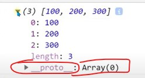
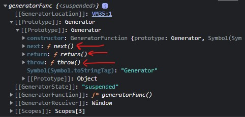
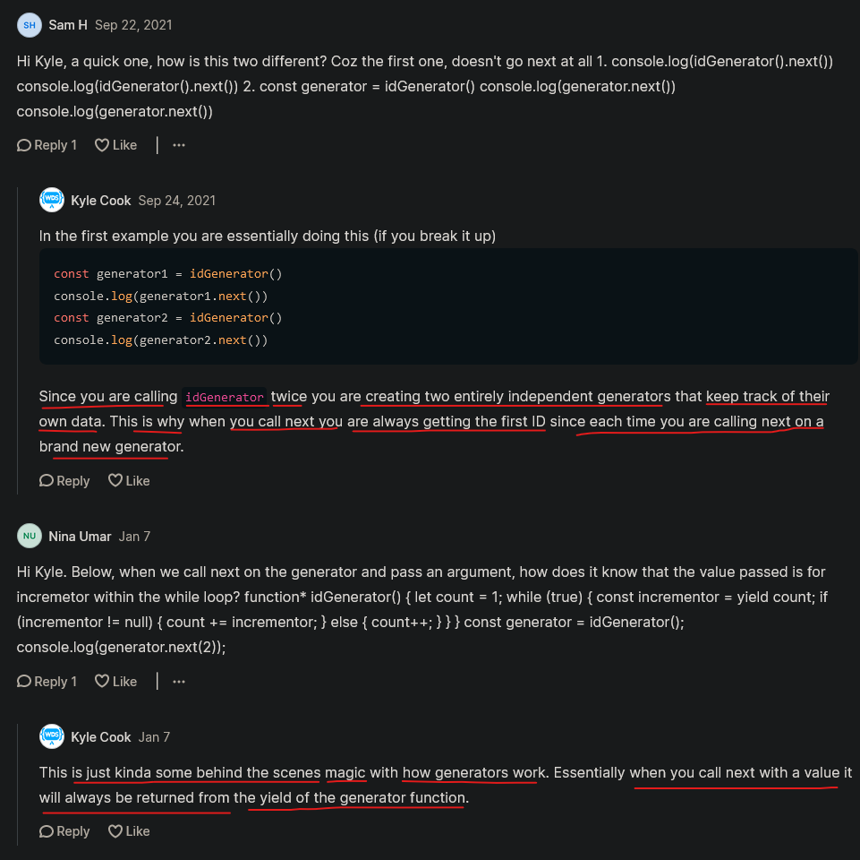

# Generators & iterators

- really important topic 🔥🔥 & we don't use really that often
- but when situation comes where we need them then they're incredibly useful ✔️
    - means generators & iterators are only useful for specific usecases 
    - but generators & iterators are more useful than `Symbol()` 💡💡💡
  
- `Iterators` are used with generators & `iterators` are much more commonly used than generators 💡💡💡

- `Prerequisite` : must know about → loop , function  , array & object , symbols 

```
- Note
    - kyle didn't tell about the Iterators except Generators becuz iterators are used with Generators that's why
    - so we're making notes from yahoo baba YT videos 
```

## -------- Extra notes on generators & iterators --------

- videos
    - https://www.youtube.com/watch?v=VnR_5eE36yM&ab_channel=YahooBaba 👍
    - https://www.youtube.com/watch?v=Qkcwveti-lE&ab_channel=YahooBaba 👍
- blogs
    - https://dev.to/lydiahallie/javascript-visualized-generators-and-iterators-e36
    - https://blog.logrocket.com/javascript-iterators-and-generators-a-complete-guide
    - https://developer.mozilla.org/en-US/docs/Web/JavaScript/Guide/Iterators_and_Generators

# notes from YahooBaba

## why iterators is made 🔥

- Eg : of traversing inside an array
    ```js
    let arr = ["Apple" , "Orange" , "Grapes"]
    ```
    - now to traverse through this `arr` we have many types of loops like 
        |  loops category | 
        |-----------------------------------------------------------------------------------------|
        | `while()` , `do..while()` , `for()` , `for..of()` , `for..in()` , `forEach()` , `map()` |   

    ```js
    let arr = ["Apple" , "Orange" , "Grapes"]

    // traversing inside an array by using for loop
    for (let i = 0 ; i < arr.length ; i++) {
        console.log(x[i]) ; 
    }

    // traversing inside an array by using for loop
    for (let item of arr) {
        console.log(item)
    }
    ```

- so all these loops used for traversing inside an array
- & inside of this loop category , we have `iterators` also 💡💡💡
    - means by using `Iterators` , we can traverse inside an array also & we can read each value of an array
    
- `why Iterators is made if we have those loops & difference b/w Iterators & tradition loops 🔥` : 
    - because inside those other loops , we don't have control on that loop
    - means if we use for loop or any tradition loop category <br>
        then if we run the loop , then all the items of an array will be printed 💡💡💡 
    - & what if we want that we want to print all the items of array except leaving first or any item 💡💡💡
    - so this work we can do inside of those traditional loop <br>
        but for this , we need to us `if` condition to get proper output that we want 
    - `Reason`
        - inside `Iterators` we have the traversing control
        - means we can print any value/items of an array 
        - let's say we printed first item of an array 
          - & then there is a 3 or 4 lines of code & then we want to print 2nd or 3rd item of an array 
          - so for this we have a control 💡💡💡

## what is Iterators 

- `Iterators` means do iteration/looping
- we can use Iterators with array , object , string 💡💡💡

- we use `iterator` as a property of `Symbol` , but it's datatype is `function`
    - `i` letter of `iterator` should be small 💡💡💡

- Eg : printing items of an array
    ```js
    let arr = [1, 2, 3];
    console.log(arr);
    ```

    - output : 
    

    - when we open `__proto__` , then we'll see many methods of array
    - & at the bottom , we'll see `Symbol(Symbol.iterator)` which is a function

- so main use of Iterators that we can iterator/traverse/loop inside an array with a control 💡💡💡
    - means we can print any items of an array or string or object 💡💡💡 

## how to use iterator ✅

- there are two ways to use iterator    
    - `using inbuild iterator of js`
    - `creating our own custom iterator` 

- `using inbuild iterator of JS`
    - Eg 1 : `checking datatype of iterator`
        ```js
        let arr = [100, 200, 300]
        
        console.log(typeof arr[Symbol.iterator])
        // output : function
        ```

    - Eg 2 : `without calling iterator function`
        ```js
        let arr = [100, 200, 300]

        console.log(arr[Symbol.iterator])
        // output : function values()
        ```
        ```js
        let arr = [100, 200, 300]

        console.log(arr[Symbol.iterator]())
        // output : Array iterator {}
        ```

    - we use `Symbol.iterator` inside an square bracket notation & then we call it from outside the square bracket 💡💡💡

    - Eg 3 : `calling iterator function`
        ```js
        let arr = [100, 200, 300]

        let items = arr[Symbol.iterator]()
        console.log(items)
        // output : Array iterator {}
        ```

        - when we open this output → `Array Iterator {}` <br>
        
        
        - `next()` method is used to read the values of that array
        - so we'll use next() method on `items` array 

        - using next() method on that iterator/object
        ```js
        let arr = [100, 200, 300]

        let items = arr[Symbol.iterator]()
        console.log(items.next())
        // output : {value : 100 , done : false}
        ```

        - `about next() method ✅` : 
            - `next()` method will give one value of an array at a time 
            - to get all the values of an array , then we need to call/define `next()` method each time <br>
                on that iterator (which is a object) 💡💡💡
            - `next()` method always return a object as a output <br>
                & that object always contain these two keys i.e `value` & `done` 💡💡💡

        - calling next() method on that iterator/object for each item of an array
        ```js
        let arr = [100, 200, 300]

        let items = arr[Symbol.iterator]()
        console.log(items.next())
        console.log(items.next())
        console.log(items.next())

        /* output : {value : 100 , done : false}
                    {value : 200 , done : false}
                    {value : 300 , done : false}
        */
        ```

        - now again if we call that next() method again like this  
        ```js
        let arr = [100, 200, 300]

        let items = arr[Symbol.iterator]()
        console.log(items.next())
        console.log(items.next())
        console.log(items.next())

        /* output : {value : 100 , done : false}
                    {value : 200 , done : false}
                    {value : 300 , done : false}
                    {value : undefined , done : true}
        */
        ```
        - here in last output we got undefined & value of `done` key is true
            - means when we called next() method first three times then that array has total 3 values
            - but inside that array there is no fourth value that's why we got undefined & value of `done` key is true
            - means we'll get `true` value of `done` key when no values left inside that array 💡💡💡
            - & we'll get `false` value of `done` key till if there is another next value inside that array 💡💡💡  

        - as we know that when we use `iterator` then we have a control to print those values & to skip other values
            - let's say we don't want to print first value of that array like this 
            ```js
            let arr = [100, 200, 300]

            let items = arr[Symbol.iterators]()
            items.next()
            console.log(items.next())  
            console.log(items.next())  
            console.log(items.next())  
            /* output : 
                      {value : 200 , done : false}
                      {value : 300 , done : false}
                      {value : undefined , done : true}
            */
            ```
            - so here we can see that all the values of array gets printed except first one 
            - now let's say we don't want to print/skip first & second value of that array then do this 
            ```js
            let arr = [100, 200, 300]

            let items = arr[Symbol.iterators]()
            items.next()
            items.next()
            console.log(items.next())  
            /* output : {value : 300 , done : false} */
            ```
            - here only last value of that array gets printed out & we skipped the first & second value 
            - so here `items.next()` means first value came i.e `100` inside `items.next()` but we didn't printed out 
            - & same with second value of that array

            - so here we can see that we have a control that which value we want to print/read <br>
                & which we value we want to skip/don't want to print ✔️

        - printing value of `value` & `done` key directly , then do this
        ```js
        let arr = [100, 200, 300]

        let items = arr[Symbol.iterators]()

        items.next()
        // using → value property on next() method
        console.log(items.next().value) // output : 200   
        // using → done property on next() method 
        console.log(items.next().done) // output : false
        ```
        - here `false` value of `done` key printed of third value of an array 
        
        - `usecase of done property` : we can use when we're using condition  
            - means if we're making our own loop by using `iterator` then we can check the value of `done` property
            - so we can loop through inside an array till if the value of `done` property is false
            - & the movement value of `done` property gets true then stop the loop 💡💡💡
            
            - Eg : let's assume we have 30 values inside an array then we have to make a loop , so better option will be `while()` loop
                ```js
                let arr = [100 , 200 , 300 , 400 , 500]

                let iteratorVal = arr[Symbol.iterator]()
                let result = iteratorVal.next()

                while(!result.done) { // this loop run until the value of `done` property didn't become false 
                    console.log(result.value)
                    result = iteratorVal.next()
                }
                /* output : 100
                            200
                            300
                            400
                            500
                */
                ```

            - Eg : using iterator with string 
                ```js
                let str = "Steve Jobs"
                let iteratorVal = str[Symbol.iterator]()

                let result = iteratorVal.next()
                while(!result.done) {  
                    console.log(result.value)
                    result = iteratorVal.next()
                }
                /* output : S
                            t
                            e
                            v
                            e
                                --> this is a space
                            J
                            o
                            b
                            s
                */
                ```
                - so here each characters of that string gets printed out in a sequence

            - so doing this same stuff with iterator then we need to write bunch of lines of code 
                - that's why in this situation , `iterator` is not effective
                - so we can use `for..of()` or `for()` loop  

    ## conclusion
    
    - basically we use `iterator` to keep the control in our hand 
        - that which value of array or string or object we want to print & which we want to skip/don't want to print 💡💡💡
        - simply means only print those values which we want & skip rest values  

    - watch video for custom iterator because before Es6 we need to create custom iterator but after Es6 we only use inbuild iterator of js

## Generators 

- is a feature of Es6
- generators is same as iterators 
- `Prerequisite` : before learning about `generator` first see the `iterators` 

- we use generator with `functions` only
- `Note` : it works with only `normal & anonymous function` , doesn't work with arrow function 💡💡💡
    - mostly we use generator with normal function 

- Eg : normal function
    ```js
    function normalFunc() {
        console.log("First Message")
        console.log("second Message")
    }

    normalFunc()  
    /* output : First Message
                second Message
    */
    ```
    - so here we can see that all the lines of code which are inside of that function gets printed line by line 
        - & here we don't have control to print few lines & skipping one or other lines

- `how to convert a normal function into generator function ✅`
    - so put `*` asterisk sign either before that function name or after `function` keyword 💡💡💡   
    - `Note` : if we're putting `*` sign after function keyword , then don't put space b/w `*` sign & function keyword 
        - & vice versa if we're putting `*` sign before function name

    - & we only use `*` sign when we're creating a generator function , <br>
        when we're calling that generator function then we don't define `*` sign 💡💡💡

    - using `*` sign before function name
        ```js
        function *generatorFunc() { // generator function
            console.log("First")
            console.log("Second")
        }

        generatorFunc()
        ```
    - another way is to use `*` sign after function keyword
        ```js
        function* generatorFunc() { // generator function
            console.log("First")
            console.log("Second")
        }

        generatorFunc()
        ```
    - both way are fine , any one way we can use 
        - `best practice 🔥` : 
            - use `*` sign , before function name because of readability 
            - but most of the article mention the `*` sign after `function` keyword also ✔️

- Eg 1 : `using generator function`
    ```js
    function* generatorFunc() {
        console.log("First")
        console.log("Second")
    }

    generatorFunc()
    // output : no output will come
    ```
    - so no output will be printed because that function it's now generator function

    - let's store that generator function (while calling it) inside a variable 
    ```js
    function* generatorFunc() {
        console.log("First")
        console.log("Second")
    }

    let result = generatorFunc()

    console.log(result)
    ```
    - output : <br>
    
       
    - here we can see that we have methods like `next()` , `return()` , `throw()`
        - mostly `next()` method is used 💡💡💡

    - `next()` : is same as we used in `iterator` means it's used to read the value at a time
        - so in generator function , to read multiple lines of code we need to use `next()` method for those each lines of code 💡💡💡
        - `next()` method return a object which contain two keys i.e `value` & `done`

- Eg 2 : `using generator function with next() method to read lines of code of that generator function`
    ```js
    function* generatorFunc() {
        console.log("First")
        console.log("Second")
    }

    let result = generatorFunc()

    console.log(result.next())
    /* output : First 
                Second
                {value : undefined , done : true }
    */
    ```
    - here still we can see that we don't have any control on the lines of code of that generator function
        - so to get the control we use `yield` keyword 💡💡💡

    - `yield` keyword → means pause or stop 💡💡💡

    - using `yield` keyword to get the control on the lines of code of that generator function
        ```js
        function* generatorFunc() {
            console.log("First")
            yield "Yield No. 1"
            console.log("Second")
            yield "Yield No. 2"
        }

        let result = generatorFunc()

        console.log(result.next())
        /* output : First 
                    {value : "Yield No. 1" , done : false }
        */
        ```
    - means here after that first `yield` , further lines of code (which are inside the generator function) will not run
    - `Note about → yield keyword ✅` :
        - `yield` means pause
        - we always define value of `yield` keyword inside double quotes 💡💡💡
        - & best thing is next time we run the generator function, it remembered where it previously paused, and runs from there on 💡💡💡

    - value of `yield` & `return` keyword will be returned by next() method
        - & we always define all the `yield` keyword statements before `return` keyword statement 
        - because whatever we write after `return` keyword statement , then nothing will get printed 💡💡💡

    - why second line of code is not running 
        ```js
        function* generatorFunc() {
            console.log("First")
            yield "Yield No. 1"
            console.log("Second")
            yield "Yield No. 2"
        }

        let result = generatorFunc()

        console.log(result.next())
        /* output : First 
                    {value : "Yield No. 1" , done : false }
        */
        ```
        - because we put the pause i.e `yield` keyword
        - so to remove the pause we need to call the `next()` method again 💡💡💡
        ```js
        function* generatorFunc() {
            console.log("First")
            yield "Yield No. 1"
            console.log("Second")
            yield "Yield No. 2"
        }

        let result = generatorFunc()

        console.log(result.next())
        console.log(result.next())
        console.log(result.next())
        /* output : First 
                    {value : "Yield No. 1" , done : false }
                    Second
                    {value : "Yield No. 2" , done : false }
                    {value : undefined , done : true }
        */
        ```
        - here we called `next()` method third time & we got `undefined` value because there is no other lines of code 

    - if there is no value inside `yield` keyword then we'll get this  `{value : undefined , done : true }` 💡💡💡
        ```js
        function* generatorFunc() {
            yield 
        }

        let result = generatorFunc()

        console.log(result.next())
        /* output : {value : undefined , done : true } */
        ```
        - so here there is no value of `yield` keyword , so we got `undefined` value inside `value` key

    - defining a value of `yield` keyword
        ```js
        function* generatorFunc() {
            yield "First"
        }

        let result = generatorFunc()

        console.log(result.next())
        /* output : {value : "First" , done : false } */
        ```

- Eg 3 : `only using → yield keywords without any lines of code inside the generator function`
    ```js
    function* generatorFunc() {
        yield "First yield"
        yield "second yield"
        yield "third yield"
    }

    let result = generatorFunc()

    console.log(result.next())
    console.log(result.next())
    console.log(result.next())
    console.log(result.next())
    /* output : {value : "First yield" , done : false }
                {value : "second yield" , done : false }
                {value : "third yield" , done : false }
                {value : undefined , done : true }
    */
    ```

    - now let's say we don't want to print value of second `yield` keyword
        ```js
        function* generatorFunc() {
            yield "First yield"
            yield "second yield"
            yield "third yield"
        }

        let result = generatorFunc()

        console.log(result.next().value)
        result.next()
        console.log(result.next().value)
        /* output : First yield
                    third yield
        */
        ```

- Eg 4 : using `for..of() loop` to print all the values of `yield` keyword which are inside the generator function
    ```js
    function* generatorFunc() {
        yield "First yield"
        yield "second yield"
        yield "third yield"
    }

    let result = generatorFunc()
    for (let item of result) {
        console.log(item)
    }
    /* output : First yield
                second yield
                third yield
    */
    ```
    - using `for..of()` loop would be great when we want to print all the values of `yield` keywords (which are inside the generator function)
    
- Eg 5 : let's say we want increment number the movement we call next() method again & again ✅
    ```js
    function* generatorFunc() {
        let nextNum = 300 
        while (true) {
            yield(nextNum++)
        }
    }

    let result = generatorFunc()
    console.log(result.next().value)
    console.log(result.next().value)
    console.log(result.next().value)
    console.log(result.next().value)
    /* output : 300 
                301
                302
                303
    */
    ```
    - `Note` : we can use `yield` keyword as a function also 💡💡💡
    - so here we called next() method 4 times so we got increment values 4 times 
        - here we just defined the `yield` only one time & the movement we call the next() method again & again
        - then we'll get the increment value
    - we can also use `for..of()` loop but we need to define condition like this  
        ```js
        function* generatorFunc() {
            let nextNum = 300 
            while (true) {
                yield(nextNum++)
            }
        }

        let result = generatorFunc()
        for (let value of result) {
            if (value > 305) break 
            console.log(value)
        }
        /* output : 300 
                    301
                    302
                    303
                    304
                    305
        */
        ```

- Eg 6 : defining value of `yield` keyword inside `next()` method as a argument of the generator function ✅
    ```js
    function* generatorFunc() {
        let result = yield
        console.log(`Result : ${result}`)
    }

    let gFunc = generatorFunc()
    gFunc.next()
    gFunc.next(500)
    // output : Result : 500
    ```
    - here `gFunc.next()` means got to next `yield` 
        - we don't need to define parameter inside that generator function because  
        - that value inside next() method is of that `yield` , not for the generator function ✔️✔️✔️

    - Eg 6.1 : let's say we want to do arithmetic calculation with the value of `yield` 
        ```js
        function* generatorFunc() {
            let result = (yield) * 10
            console.log(`Result : ${result}`)
        }

        let gFunc = generatorFunc()
        gFunc.next()
        gFunc.next(500)
        // output : Result : 5000
        ```
        - `Note` : we need to keep `yield` inside parentheses like this `(yield) * 10` , otherwise we'll get undefined ✔️ 

    - Eg 6.2 : defining multiple values for only one `yield` keyword
        ```js
        function* generatorFunc() {
            let result = (yield) * 10
            console.log(`Result : ${result}`)
        }

        let gFunc = generatorFunc()
        gFunc.next()
        gFunc.next(500)
        gFunc.next(600)
        gFunc.next(700)
        // output : Result : 5000
        ```
        - here we just got only one value i.e 5000
            - because inside that generator function , there is only one `yield` keyword
            - & calling multiple `next()` method means go to next yield
            - so to get the all the values of `yield` keyword , we need to make an array of `yield` keyword 
        ```js
        function* generatorFunc() {
            let yArr = [yield ,yield ,yield]
            console.log(`Result : ${yArr}`) // printing all the values of `yield`
            console.log(`Result : ${yArr[2]}`) // printing only specific value of `yield`
        }

        let gFunc = generatorFunc()
        gFunc.next()
        gFunc.next(500)
        gFunc.next(600)
        gFunc.next(700)
        gFunc.next(800) // this value won't come because inside generator function we have only 3 `yield`
        // output : Result : 500 , 600 , 700
        ```
        - so first value will be set inside first `yield` & so on with other `yield`

- Eg 7 : putting different types of value inside multiple `yield` keyword ✅
    ```js
    function* generatorFunc() {
        yield 55
        yield "here we go"
        yield ["JS" , "Reactjs" , "Nextjs"]
    }

    let gFunc = generatorFunc()
    console.log(gFunc.next())
    console.log(gFunc.next())
    console.log(gFunc.next())
    /* output : {value : 55 , done : false}
                {value : "here we go" , done : false}
                {value : Array(3) , done : false}
    */
    ```

    - if we want to print the array value of `yield` individually , then we need to put `*` after `yield` keyword like this 
        ```js
        function* generatorFunc() {
            yield 55
            yield "here we go"
            yield* ["JS" , "Reactjs" , "Nextjs"]
        }

        let gFunc = generatorFunc()
        console.log(gFunc.next())
        console.log(gFunc.next())
        console.log(gFunc.next())
        console.log(gFunc.next())
        console.log(gFunc.next()) 
        /* output : {value : 55 , done : false}
                    {value : "JS" , done : false}
                    {value : "Reactjs" , done : false}
                    {value : "Nextjs" , done : false}
                    {value : undefined , done : true}
        */
        ```
        - `yield* ["JS" , "Reactjs" , "Nextjs"]` means print the array value individually <br>
            the movement we call the next() method  

- Eg 8 : printing values of remaining `yield` keywords in the form of an array by using spread operator
    ```js
    function* generatorFunc() {
        yield "JS"
        yield "Reactjs"
        yield "Nextjs"
        yield "tailwindcss"
    }

    let gResult = generatorFunc()
    console.log(gResult.next().value) // printing only first yield as it is
    console.log([...g]) 
    /* output : JS 
                (3) ["Reactjs", "Nextjs", "tailwindcss"]
    */
    ```
    - so here remaining values of yield are putted inside an array

- Eg 9 : using `return()` method of generator function ✅
    - `return()` method use on when we're calling generator function 💡💡💡
    - `return` keyword use inside the generator function 💡💡💡

    - value of `yield` & `return` keywords will be read by  

    - `return` or `return()` would be useful when we want to stop/end after few lines of code of generator function 💡💡💡

    - using `return()` method without defining a argument
        ```js
        function* generatorFunc() {
            yield "JS"
            yield "Reactjs"
            yield "Nextjs"
            yield "tailwindcss"
        }

        let gResult = generatorFunc()
        console.log(gResult.next()) 
        console.log(gResult.return()) // calling return() method without a argument  
        /* output : {value: "JS", done: false}
                    {value: undefined, done: true}
        */
        ```
        - here we got undefined because there is no value inside `return()` method

    - using `return()` method with a argument 
        ```js
        function* generatorFunc() {
            yield "JS"
            yield "Reactjs"
            yield "Nextjs"
            yield "tailwindcss"
        }

        let gResult = generatorFunc()
        console.log(gResult.next()) 
        console.log(gResult.return("Ends")) // calling return() method with a argument
        /* output : {value: "JS", done: false}
                    {value: "Ends", done: true}
        */
        ```

    - `return` is like we use in normal functions & whatever we defined after `return` keyword then nothing will get printed
        - so same with the case of generator function

    - using `return` keyword 
        - without a value  
        ```js
        function* generatorFunc() {
            yield "JS"
            yield "Reactjs"
            return
            yield "Nextjs"
            yield "tailwindcss"
        }

        let gResult = generatorFunc()
        console.log(gResult.next()) 
        console.log(gResult.next())
        console.log(gResult.next())
        /* output : {value: "JS", done: false}
                    {value: "Reactjs', done: false}
                    {value: undefined, done: true}
        */
        ```

        - with a value  
        ```js
        function* generatorFunc() {
            yield "JS"
            yield "Reactjs"
            return "Ends"
            yield "Nextjs"
        }

        let gResult = generatorFunc()
        console.log(gResult.next()) 
        console.log(gResult.next())
        console.log(gResult.next())
        /* output : {value: "JS", done: false}
                    {value: "Reactjs', done: false}
                    {value: "Ends", done: true}
        */
        ```
        - here after `return` keyword , further lines of code will not execute

# notes from Kyle lectures

- here we'll use only generators with iterators 
    - because iterators are used with generators that's why iterators are not covered in the lecture

- inside generator , 
    - we use `yield` keyword which is like async await 💡💡💡

- Eg 1 : of generator
    ```js
    function* generatorFunc() {
        yield 1 
        yield 2 
        yield 3 
    }
    ```
    - now the way the generator function works that
        - let's say we run the first line of code i.e `yield 1` by using `next()` method
        - & then that `1` value will be returned
        - & then generator function will waits & just waits & waits 
            - until we finally say give the next value
            - & then second line i.e `yield 2` will run & return `2`
            - & then generator function will waits & waits until we say that we need third line of code & so on..

    ```js
    function* generatorFunc() {
        yield 1 
        yield 2 
        yield 3 
    }

    const gResult = generatorFunc() 
    console.log(gResult) 
    ```
    - output : <br>
    

    - right now generator is waiting 
    - so we need to start the generator by using next() method like this 
    ```js
    function* generatorFunc() {
        yield 1 
        yield 2 
        yield 3 
    }

    const gResult = generatorFunc() 
    console.log(gResult.next()) // starting the generator by using next() method 
    console.log(gResult.next())
    console.log(gResult.next())
    console.log(gResult.next()) // ending of the generator because no values is there of yield keyword inside that generator function
    ```

    - so a generator function creates a iterator of us which has a next() method on that iterator i.e `gResult` 
        - & when we call the next() method on that iterator i.e `gResult` then we'll get next value in the form of an object
        - & the movement we call the next() method again & again on that iterator i.e `gResult` to get all the value of each `yield` keywords
        - & if we call the `next()` method on that iterator after printing all the values of `yield` keywords <br>
            then we'll get this object as a output like this → `{value : undefined , done : true}`

- `Note about generator function ✅` :
    ```js
    function* generatorFunc() {
        yield 1 
        yield 2 
        yield 3 
    }
    
    const gResult = generatorFunc()
    ```
    - if we just call the generator function then we'll not get any output 💡💡💡
        - to start the generator we need to use `next()` function on that iterator i.e `gResult` 

- Eg : of `creating + using the generator function` ✅
    ```js
    function* generatorFunc() {
        console.log("Before 1")
        yield 1 
        console.log("After 1")
        console.log("Before 2")
        yield 2 
        console.log("After 2")
        console.log("Before 3")
        yield 3 
        console.log("After 3")
    }
    
    const gResult = generatorFunc()
    gResult.next()
    console.log(gResult.next())
    /* output : Before 1
                After 1 
                {value: 2, done: false}
    */
    ```
    - `Note about normal lines of code & yield keywords lines of code inside a generator function ✅` :
        - when we use `next()` method on that iterator i.e `gResult` without inside console.log() <br>
            then normal lines of code will be executed except `yield` keywords statement
        - but if we use `next()` method on that iterator i.e `gResult` with inside console.log() <br>
            then normal lines of code + that `yield` statement also gets executed 💡💡💡

## usecase of creating generator function 🔥

- there are few specific usecases of creating + using generator function
    - first : `we want to do something & then wait a little bit before doing the next thing` 💡💡💡 <br>
        so this great usecase of it 
    - second : `we want to create some kind of infinite loop` 💡💡💡
        - that we want to progress through without freezing up the computer memory eg : creating fibonacci sequence

- Eg : of creating a Fibonacci generator function ✅
    
    - `fibonacci sequence` means takes a number & adds with previous two numbers in the sequence to get the next number & so on..
    
    ```js
    function* fibonacciGeneratorFunc() {
        let prevOne = 0 ;
        let prevTwo = 1 ;

        yield 0 
        yield 1 

        while(true) {
            const result = prevOne + prevTwo
            yield result
            prevOne = prevTwo
            prevTwo = result
        }
    }

    const gResult = fibonacciGeneratorFunc()
    console.log(gResult.next())
    console.log(gResult.next())
    console.log(gResult.next())
    console.log(gResult.next())
    /* output : {value: 0 , done: false} 
                {value: 1 , done: false}
                {value: 2 , done: false}
                {value: 3 , done: false}
                {value: 5 , done: false}
    */
    ```
    - now we're gonna have a fibonacci sequence which loops forever & ever & ever <br>
        but it only executes the code every single time when we call next() method the iterator 💡💡💡

    - here `yield 0` & `yield 1` are bases cases of a fibonacci sequence 💡💡💡
    - and here while() loop is infinite loop but because we're using a generator <br>
        we can just continually get the next one when we want & we don't have to worry about looping forever

- another usecase of using generator function that we can create a unique ID every single time <br>
    & it'll loop through & give us a new ID every single time by incrementing each time 💡💡💡

## Challenge Time ✅

- `ques` : create a function which has name as idGenerator
    ```js    
    function idGenerator() {

    }
    ```
    
    - `what we need to` :
        - & inside that function yield a brand new ID every single time that's just one greater than the previous ID  

- `Ans`
    ```js    
    function* idGenerator() {
        let count = 1 // bydefault we'll start 1

        while(true) {
            yield count++
        }
    }
    // OR
    function* idGenerator() {
        let count = 1 // bydefault we'll start 1

        while(true) {
            count = count + 1
            yield count
        }
    }

    const gResult = idGenerator() 
    console.log(gResult.next())
    console.log(gResult.next())

    const gResult2 = idGenerator() // restart the generator function again 
    console.log(gResult.next()) // output : {value : 1 , done : false }
    ```
    - so we created a infinite loop that constantly gives a new unique ID every single time
    - `Note` : 
        - if we want to restart that generator function then call it again like this `const gResult = idGenerator()` as a second time

- `said by kyle` : 
    - that's about 99% we need to know about generators 💡💡💡
    - but there are a few unique usecases to generate that we should probably understand 💡💡💡 <br>
        that we can pass a value inside next() method as a argument & that argument will be the value of `yield` keyword 💡💡💡 
    
    - Eg 1 : passing a argument inside the next() method for the value of `yield` keyword ✅
        ```js
        function* idGenerator() {
            let count = 1 

            while(true) {
                const incrementor = yield count++
                console.log("incrementor" , incrementor)
            }
        }

        const gResult = idGenerator()
        console.log(generator.next())
        console.log(generator.next(2))
        console.log(generator.next())
        /* output : {value: 1 , done: false} 
                    incrementor 2
                    {value: 2 , done: false}
                    incrementor undefined
                    {value: 3 , done: false}
        */
        ```
        - here we can see that in first next() method , value of incrementor didn't printed out
            - because we didn't gave a argument inside next() method that's why 
        - but inside second next() method we define an argument , that's why the value of incrementor gets printed out ✔️

    - Eg 2 : we're incrementing the value of `yield` keyword by 2 not by 1 ✅
        ```js
        function* idGenerator() {
            let count = 1 

            while(true) {
                const incrementor = yield count
                if (incrementor != null) {
                    count += incrementor
                } else {
                    count++
                }
            }
        }

        const gResult = idGenerator()
        console.log(generator.next())
        console.log(generator.next(2))
        console.log(generator.next())
        /* output : {value: 1 , done: false} 
                    {value: 3 , done: false}
                    {value: 4 , done: false}
        */
        ```
        - here we're incrementing by `2` this time that's why we got `3`
        - & when we pass nothing as a argument inside third next() method , then it's increment by `1` ✔️✔️✔️

    - this is niche usecases but it could be useful in certain scenarios like this above one

    - another thing is exiting out from a generator function prematurely by using `return()` method 💡💡💡 
        - right now we're in infinite loop which will never actually exit 
        - but by calling `return()` method on that generator i.e `gResult` <br>
            by using this , we'll exit our from that generator function & further `yield` keywords won't be executed 💡💡💡
    
    - Eg 3 : using return() method on the generator function to exit out from infinite loop
        ```js
        function* idGenerator() {
            let count = 1 

            while(true) {
                const incrementor = yield count
                if (incrementor != null) {
                    count += incrementor
                } else {
                    count++
                }
            }
        }

        const gResult = idGenerator()
        console.log(generator.next())
        console.log(generator.return(2))
        console.log(generator.next())
        /* output : {value: 1 , done: false} 
                    {value: undefined , done: true}
                    {value: undefined , done: true}
        */  
        ``` 
        - here we called next() method for second time but we still get the value of `value` key as undefined
            - because after `return()` method , further `next()` method won't be executed

    - so to exit out from the generator function immediately then use that `return()` method

## conclusion : said by kyle

- generator are pretty niche & it has very specific usecases where they're useful <br>
    & iterators are something that we're gonna use all the time when we use generators

- just to know that `next()` method is called on that iterator 
    - & next() method will always return an object which has two keys i.e `value` & `done`

## discussion page


